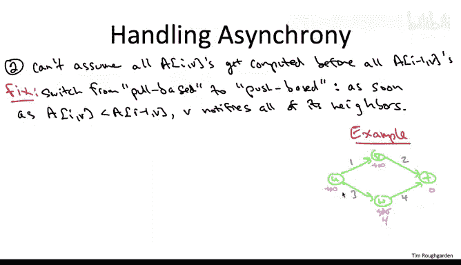

# 斯坦福大学《算法（分治／排序／搜索／随机算法、图搜索／最短路径／数据结构、贪心算法／最小生成树／动态规划、最短路径／NP）｜Algorithms》中英字幕 - P135：07_01_10_互联网路由一（可选）.zh_en - GPT中英字幕课程资源 - BV1Rx4y1U7sZ

At the beginning of the course we mentioned that if the Belmon Ford algorithmri provides the foundation for modern day internet routing protocols。

 this video is going to supply a few of the details。So for starters。

 when you look at the code of the Belman Ford algorithm， I hope on an intuitive level。

 it seems like a sort of distributed algorithm in some sense of the word， right。

 think about what you need to compute a given subproble， A of I comma V。

 Well the vertex V just needs to know from each of the possible previous hops。

 So from each of the vertices that can talk directly to V what their subproblem solution was on the previous round。

 So in each round， each vertex in some sense only communicates with immediate neighbors vertices to which it has direct connection。

Now， as you can imagine， there's a fairly long list of engineering challenges that have to be tackled to move from the basic Belman Ford algorithm to a routing protocol that you could conceivably use in practice。

So what I'll do here is highlight some of the main issues and what's the high level solution to those issues。

 and with those fixes to the basic Belmon Ford algorithm。

 we'll actually have something that's surprisingly close to how modern day internet protocols protocols really work。

That said， the discussion here will be necessarily brief and somewhat deliberately naive。

 So for those of you who want to understand this material at a really nitty gritty level。

 I encourage you to buy a networking book， take a networking class or read more about the topic on the web。

So I want to talk about three modifications to the basic Belman Ford algorithm。

 I'll discuss them in order from the most trivial to the least trivial。

The first and simplest modification to the algorithm is motivated by the fact that routing in the Internet is destination driven。

 given a piece of data floating around in the Internet。

 you really don't care that much where where it came from。

 what you really care about is where it needs to go。 right。

 It's exactly the same thing as with snail mail， the way it gets routed around the globe。

 If I'm on vacation and say Croatia。 and I put a postcard in the mail。

 I don't even need to put a return address。 I just say the address of my friend who might be back in the States。

 And then just based on its destination， This postcard gets routed appropriately。 First。

 through local hops within Croatia。 then on a plane over the Atlantic Ocean。 and then again。

 locally within the US network。 Sam thing in the Internet。

 based on the destination I P address of a packet。 That's how you know which intermediate sequence of routers it has to go through to get to its eventual destination。

All you have to do to accommodate destination drivenri routing is reverse all of the directions in the Belman Ford algorithm。

 so instead of having a source vertex S out of which you compute all shortest paths。

 you're going have a destination vertex T into which you compute shortest paths from all possible origins each vertex rather than storing a predecessor pointer。

 the final hop on a shortest path from S to that vertex。

 it's going to store the first hop on a shortest path to the destination T。Now of course。

 if you're a router in the internet， you don't want to be optimized purely for a single destination T you have to be ready to accommodate data bound for anywhere in the internet。

 so as a result eachVtex stores the shortest path distance in the first hop。

 not just to a single destination T but to every relevant destination T so that it's prepared for any data that it might acquire。

So this should sound pretty intense。 There's a lot of potential destinations T。

 There's a lot of IP addresses out there in the world。 So a couple comments， So first of all。

 for most computers in the internet， they're not really responsible for knowing how to get to a lot of the destinations T in the Internet This because of the hierarchical structure of the Internet right So if it's just some computer inside the Stanford network。

 it really only needs to know how to get to other computers inside the Stanford network of which there aren't that many and it also has to know how to get to the Stanford Gateway router and if it's data down for somewhere outside the Stanford network。

 you just sort of defer the responsibility to the Stanford Gateway router and you let it handle it。

 you just get that far and then it'll take it from there。On the other hand。

 for the routers embedded in the core of the Internet。

 they really are responsible for knowing how to get to all kinds of different places。

 Basically the entire internet and their routing tables。 guess what， They're really quite big。

 So the number of entries might be， say， in the hundreds of thousands。So as you can imagine。

 routing table implementation is something that people who work in networking have thought about a ton。

 there's interesting hardware optimizations， software optimizations。

 and then people also worry about how can you just make sure routing table size doesn't get too big so for example you want to avoid the fragmentation of IP addresses to make sure that you don't need that many distinct entries in the routing tables hundredundreds of thousands is plenty Thank you very much。

You will sometimes hear Belman Ford based shortest path protocols like this one called distance vector protocols。

 the distance vector that this term refers to is at a given vertex。

 you have a vector indexed by possible destinations T and you're keeping track of the shortest path distance in the first hop for all of those destinations。

So the second issue we need to address is a little more serious。

 but it's still not too bad this issue is asynchrony。

And what I mean is if you look back at our basic Belman Ford algorithm。

 it was synchronous in the following sense， we were careful to structure the outer iteration of the for loop so that all of the sub problemsblem corresponding to value I -1 get solved before any of the subpro with index I Now when you're talking about the Internet and you have different routers。

 different computers running at different speeds。 You have different physical connections with different bandwidth。

 There's no way you're going to keep people in sync。

 There's no way you can implement synchronized rounds at the Internet scale。

But what's cool is that the Belman Ford algorithm is surprisingly robust to the order in which you solve its sub problems。

 really if you solve them in any kind of reasonable order。

 you're still going to be computing correct shortest pass at the end of the day。

So to explain what I mean， let's change the Belman Ford algorithm to be push based rather than pull based。

So the basic be and4 algorithm is pull based in the following sense for each outer iteration I and each vertex V in this iteration。

 the vertex V in effect asks its neighbors for their most recent information so for their subproblem solution values from the last iteration of the outer for loop。

 we're going to change it to be pushbased which is rather than asking your neighbors for the latest information。

 whenever you have something new to say whenever your subproblem value changes。

 you're just going to go ahead and tell all of your neighbors you're going push that information onto your neighbors whether they want it or not。

So I'm not going to define this especially formally， it's easy to do。

 let me just show you a very quick example， which hopefully gives you the gist of the idea。

So consider this green network and suppose you're trying to compute shortest paths from everywhere to T。

 Remember， we've switched from source driven to destination driven routing。 So initially。

 T knows how to get to itself with link 0 and everyone else only has plus infinity。So to get started。

 the destination T is going to inform all of its neighbors that it can get to itself with a path of length zero。

 so who does it notifies V and W because U is not directly connected to T。

 U does not learn this information yet。So because the internet is asynchronous。

 even though T probably sends out messages at exactly the same time to V and W telling it about its cool zero path from it to itself。

 who knows which of V or W gets that information first so maybe the line speed is faster to W and W finds out first that T can get to itself with a path of link0。

At that point， W says well， cool， I didn't have any path at all previously。

 but I can get to T with cost only four。 and once I'm a T un'mdone， T can get to itself with cost 0。

 So W updates its shortest path estimate to the destination T from plus infinity down to4。So now。

 remember， we're doing this push based implementation。 So W has new information。

 It has a better shortest path to T。 So it needs to tell all of its neighbors。 So in particular。

 it's going to tell the neighbor U that it has a path of length 4 to T。 And now， remember。

 still floating out on the Internet is this message from T to V advertising T's empty path from itself of length 0。

 But again， who knows what happens first， Maybe， in fact。

 W's message to U arrives before T's message to V arrives。 So then U is going to say， oh， cool。 Well。

 if from W to T has cost only 4。 I can get to W with cost only 3。

 So that gives me a path of length 7 all the way to T。

Now in this graph there are no incoming arcs to you so you doesn't have anybody to notify and now at some point in the future。

 the message from T actually arrives at the node V and so at that point V says oh okay cool so I can get direct I can get to T on an edge of cost2 from T I only have to pay zero to get the rest of the way to t so I'm going to update my estimate of my distance to t from plus infinity down to2。

V， now that it has a revised estimate， It's responsible for notifying all of its neighbors。

 So it tells you， it says， hey， you， I can get to T on a path of length only2。 And then you says。

 well， hey， great， That's actually an improvement。 My old path had length 7。

 I can get to the node V with cost only one。 And V tells you can get the rest of the way with cost only 2。

 So that gives me a path of length 3 all the way to T。So in this particular example。

 this asynchronous push based implementation of Belman  Ford did correctly compute short as past。

 and that is in fact true in general in any network。And of course， when I state this fact。

 I'm assuming that there's no negative cycles in the context of internet routing。

 actually negative cycles aren't a big deal， usually you think of all of the edges as having non- negative length in internet routing applications。

Why does the algorithm converge eventually， well， essentially it's because every single update strictly decreases somebody's estimate of their shortest path distance to the destination T。

 and there's only a finite number of these configurations you can go through until you finally must be at the correct shortest path distances。

So this very crude convergence argument only provides an exponential upper bound on the number of updates that you might need before you correctly compute shortest paths。

 And， in fact， at least in the worst case， theoretically。

 this asynchronous version of Beling Ford can require an exponential number of updates before it successfully finds all of the shortest paths。

 That's a non trivialvial problem you might want to think about。

So if you have the luxury of implementing the Belman Ford algorithm in a synchronous or centralized setting。

 you do want to use the synchronous version that we discussed in the basic version。

 if you're in an asynchronous setting you don't really have a choice other than to implement it asynchronously and then of course you're hoping you're going to in your particular network have convergence time much better than the worst case。

 exponential bound。So the original Belman Ford A from the 1950s and with the modifications we've discussed to this point were' up to routing protocols that were deployed as late as the 1970s。

 so if you want to read more you can look at the RIP and RIP2 internet routing protocols。

And if you really want to be nerdy about it， you can check out the request for comments related to these protocols。

 RF number 1058。So what is an RFC， what's a request for comments。

 well this is the mechanism by which the community around the internet sort of vets proposed modifications。

 proposed protocols， so if you really want to see nitty gritty details， that's a good place to look。

