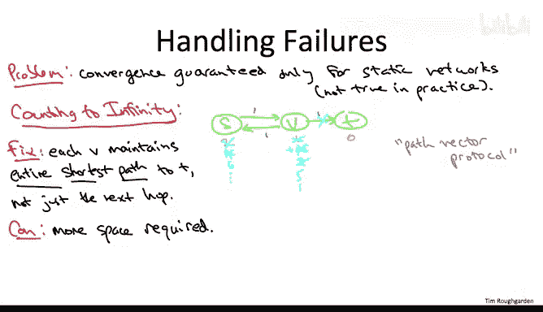

# 斯坦福大学《算法（分治／排序／搜索／随机算法、图搜索／最短路径／数据结构、贪心算法／最小生成树／动态规划、最短路径／NP）｜Algorithms》中英字幕 - P136：08_01_11_互联网路由二（可选）.zh_en - GPT中英字幕课程资源 - BV1Rx4y1U7sZ

So now let's talk about the final and most serious problem， which is that stuff in the internet。

 nodes， links， etc cetera， is failing all the time。

And while it's true that we just argue that the asynchronous Belman Ford shortest Pa routing protocol is guaranteed to converge to correct shortest pass。

 that was assuming that the network was static， that no links were coming up and down。

So one particularly simple problem in the presence of failure is what's known as the counting to infinity problem。

So I'm going to show you a particularly contrived version of this problem just to kind of illustrate the point in the simplest way。

 but it's quite easy to come up with more realistic examples and this problem is not just some kind of theoretical flaw in the distributed Belumman Ford algorithm。

 this problem really was observed in practice with those routing protocols from the 1970s。

So imagine we just have a super simple network， vertices SV and T。

 bidirected arcs from S toV and an arc from V to T。

 everything has unit cost and we're doing routing to the destination T。You might。

 if you want a more realistic example， think about the arcs between S and V as standing in for longer paths that have multiple hops。

 In any case， let's imagine that we successfully compute shortest paths on this basic network。

 So the distance from t to itself is 0， from v to T is 1 and from S to T is 2。Now， again。

 the issue is that links are failing all the time in the Internet。 So at some point。

 this link from Vta T might go down。So at some point。

 V is going to notice that its linked to T has failed and it's going to have to reset its shortest path estimate to T to be plus infinity。

And in an effort to recover connectivity to T， it makes sense for V to ask its neighbors do they have paths to T and if so how long are they So in particular。

 V will pull S and this will say， oh yeah， I have a path to T of distance only2 And V says。

 oh well that's great Currently my estimate to t is plus infinity I can get to S with length 1 S says it can get back to T with length 2 so that gives me a path of length 3 to T。

Now， of course， the flaw in this reasoning is that S was depending on V to get to T。

 and now all of a sudden V circularly is going to use S in its mind to get all the way back to T。

So this already illustrates the dangers of naively implementing the asynchronous Belman Ford algorithm in the presence of link failures。

 where is an in counting to infinity come from Well you can imagine that for some implementations of this protocol S would then say。

 oh boy okay V just revised its shortest path estimate to T to be 3 my next top was to V so if V takes too longer to get to T then I'm going take too longer to get to T as well So at that point S updates its shortest path distance to be4。

And now this keeps going on at this point V says， oh， well。

 if S is going to take too longer to get to T I was depending on S。

 so I have to go up by  two and then S goes up by2 and V goes up by 2 and so on forevermore。

So failures cause problems for the convergence of distributed shortest path routing protocols。

 not just accounting to infinity problem there are others as well， and this is a tough issue。

 much blood and ink has been spilled over the relative merits of different possible solutions for dealing with failures back in the 1980s people were largely proposing sort of hacks to the basic protocol I rather to give them credit they had some pretty ridiculous and fun names for their hacks like split horizon with poison reverse but what eventually people converged on is moving from these so-called distance vector protocols to what are called path vector protocols。

And what happens in a path vector protocol is each vertex maintains not just the next top to every possible destination。

 but they actually keep locally the entire path which is going to get used from V to each destination T。

So there's definitely some irony here because this is essentially the solution to reconstructing optimal solutions and dynamic programming that we've been studiously avoiding this whole time。

 you might recall when we first started discussing reconstruction algorithms。

 This was back independent sets of path graphs。 We first said。

 well you know you could in the forward pass through the array。

 store not just the optimal solution value， but the optimal solution itself。 But we argued。

 well that's not really the best idea waste time it wastes space much smarter is to just restruct an optimal solution by a backward pass through the filled in table。

 but what's happening here is this optimized version of the reconstruction algorithm that doesn't use extra time or space is just not robust enough to withstand the vagaries of internet routing。

 So we are going to the cruder solution where we literally just store optimal solutions。

 not just the solution value itself。So that explains why this is called a path vector protocol。

 right distance vector protocol you stored a distance for each possible destination here we're actually storing a path for each possible destination。

So the drawback is exactly what we've been saying all along。

 if you store the optimal solutions and not just the optimal solution value。

 it's going to take quite a bit more space and indeed doing this blows up the routing tables in routers。

 that's just a fact。There are two quite important benefits。

 The first we've already discussed your more robust failures。

 I'm not going to discuss the details about how you use this extra path information to handle failures better。

 but certainly in our contrived motivating example。

 you can see how if S& V actually knew the entire pass， they were sting to T。

 they could make sure that they didn't get into this counting to infinity problem。

But moving to a path vector protocol doesn't just add robustness， it also enables new functionality。

So in particular， passing around entire paths allows vertices to express more complicated preferences over routes than merely what their links are。

 Imagine for example， you're a small Internet service provider and you have a much more favorable contract with AT&T than you do with sprint so it costs you much less money to send traffic through AT&T as an intermediary than it does through sprint Well now imagine you're running this distributed shortest path protocol and two of your neighbors offer you two path to get to some destination T the first path goes through AT&T。

 the second path goes through sprint and of course the only reason you know this information is because it's a path vector protocol and you're passing around the actual path and you can see what the intermediate stops are Well then you're free to say。

 oh well I'm going to use as my path to T and this is what I'm going to advertise to other people I'm gonna advertise and store the path that goes through AT&T I'm going ignore the one that goes through sprint。

So that is more or less how the border Gateway protocol， AkaA， the BGP protocol works。

 and that is the protocol which governs how traffic gets routed through the core of the internet。

 so that wraps up our discussion of how shortest path algorithms dating back to the 1950s has played a fundamental role in how shortest path routing has evolved in the internet over the past half century。

