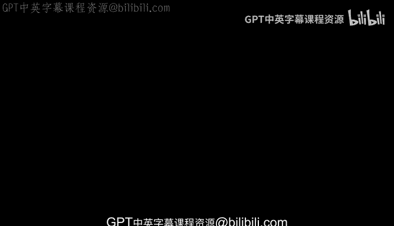
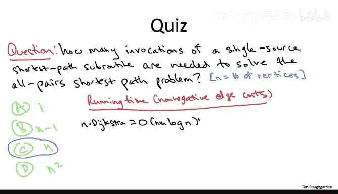

# 算法：09_01_01：问题定义 🎯

在本节课中，我们将要学习**全对最短路径**问题的定义。我们将探讨为什么需要计算图中所有顶点对之间的最短路径，并分析如何利用已有的单源最短路径算法来解决此问题，同时评估不同情况下的算法效率。

---

## 为什么需要全对最短路径？

上一节我们介绍了单源最短路径问题。本节中我们来看看，为什么我们不应该满足于仅计算从一个源点到所有其他顶点的最短路径？如果我们想知道从**每一个顶点**到**每一个其他顶点**的最短路径距离，该怎么办？

## 问题正式定义

全对最短路径问题的正式定义如下：

我们通常被给定一个有向图 **G**，其边具有长度 **Ce**。你可以考虑所有边长度均为非负的特殊情况，但我们同样对边长度可能为负的情况感兴趣。

与单源最短路径问题不同，这里没有指定的源顶点。问题的目标是计算**对于每一对顶点 U 和 V**，从 **U** 开始到 **V** 结束的最短路径长度。

与问题的单源版本一样，这并非全部情况。如果输入图 **G** 包含负权环，那么根据你如何定义“最短路径”，问题要么没有意义，要么在计算上是棘手的。因此，如果存在负权环，我们就不必计算最短路径距离，但我们需要正确报告图中包含负权环，这是我们不计算正确最短路径长度的理由。

## 能否用现有工具解决？

如果你看到这个问题时想：“我们不是已经有足够丰富的工具箱来解决全对最短路径问题了吗？” 这是一个很好的想法。从许多意义上说，答案是肯定的。

让我们来探索这个想法，使其更精确。在下面的思考中，我将问你：假设我给你一个能正确且快速解决单源最短路径问题的子程序（黑盒）。你需要调用这个黑盒子多少次，才能正确解决全对最短路径问题？

以下是调用次数的可能选项：
*   A. 1次
*   B. m次（m是边数）
*   C. n次（n是顶点数）
*   D. n²次

正确答案是 **C**。你需要调用单源最短路径子程序 **n** 次，其中 **n** 是输入图中的顶点数。

为什么？如果你指定任意一个顶点作为源点 **S**，然后运行提供的子程序，它将为你计算从该 **S** 到所有目的地的**最短路径距离**。这样，你就计算出了 **n** 个最短路径距离（对应所有以 **S** 为起点的路径）。而你需要负责计算所有顶点对（共 **n²** 对）的距离。可能的起点有 **n** 个不同的选择，因此你只需遍历所有这些选择，对每个起点调用一次提供的算法，就能得到所有 **n²** 个最短路径距离。

## 我们应该满足于这个方案吗？

我们应该满足于这个简单地运行 **n** 次单源最短路径算法的方案吗？还是我们期望做得更好？

答案将取决于两个因素：
1.  输入图的边权是否**全为非负**，还是更一般地也允许**负边权**。
2.  图是**稀疏的**（边数 **m** 接近 **n**）还是**稠密的**（边数 **m** 接近 **n²**）。

### 情况一：所有边权非负

边权是否全为非负很重要，因为它决定了我们可以使用哪个单源最短路径子程序。在边权全为非负的“快乐”情况下，我们可以使用 **Dijkstra 算法** 作为主力。

记住，Dijkstra 算法速度极快，我们基于堆的实现运行时间为 **O(m log n)**。如果你运行它 **n** 次，总运行时间自然是 **O(n * m * log n)**。

*   在**稀疏图**情况下（m ≈ n），这将是 **O(n² log n)**。
*   在**稠密图**情况下（m ≈ n²），这将是 **O(n³ log n)**。

对于稀疏图，这个结果相当不错。你不太可能比针对每个源点运行一次 Dijkstra 算法做得更好。原因是我们需要输出 **n²** 个值（每对顶点 U、V 的最短路径距离）。而这里的运行时间仅仅是 **n²** 乘以一个额外的对数因子。

然而，对于稠密图，情况则模糊得多。**是否存在从根本上快于立方时间（O(n³)）的算法来解决稠密图的全对最短路径问题，至今仍是一个开放性问题。**

如果你想说服某人可能无法做得比立方时间更好，你可能会这样论证：需要计算的最短路径距离数量是平方级的（n²）。而对于给定的一对 U 和 V，最短路径可能包含线性数量的边。因此，你肯定无法在线性时间内计算出一对顶点之间的最短路径，所以要做平方级次计算，就必然是立方时间。

但需要明确的是，**这并非证明**，只是一个模糊的论证。为什么不是证明？因为我们有可能做一些工作，这些工作同时与许多最短路径问题相关，你实际上不必为每个问题平均花费线性时间。

作为一个启发，让我提醒你关于**矩阵乘法**。如果你写下两个矩阵相乘的定义，看定义会觉得这显然是一个立方级问题。似乎根据定义，你必须做立方级的工作量。然而，这种直觉是完全错误的。从 Strassen 算法开始，以及后来的许多算法，我们现在知道存在从根本上优于朴素立方时间算法的矩阵乘法算法。如果你有一个非平凡的问题分解方法，你可以消除一些冗余工作，做得比直接解法更好。那么，对于全对最短路径问题，是否存在类似 Strassen 的改进？**目前无人知晓。**

### 情况二：允许负边权的一般情况

在这种情况下，我们不能使用 Dijkstra 算法作为我们的单源最短路径子程序，我们必须转而使用 **Bellman-Ford 算法**，因为这是两者中唯一能处理负权边的算法。

记住，Bellman-Ford 算法比 Dijkstra 算法慢。我们证明的运行时间上界是 **O(m * n)**。如果我们运行它 **n** 次，我们得到的总运行时间是 **O(m * n²)**。

**O(n² * m)** 的运行时间有多好？
*   如果图是**稀疏的**（m ≈ n），那么这是 **O(n³)**。
*   如果图是**稠密的**（m ≈ n²），那么我们得到了本课程中第一个**四次方运行时间 O(n⁴)**。

我希望你对稀疏图情况的立方运行时间上界并不特别满意。而现在，当我们谈论四次方运行时间时，这真的显得过于高昂了。因此，希望你正在思考：对于稠密图情况，一定有比仅仅运行 **n** 次 Bellman-Ford 算法更好的方法。

**确实存在更好的方法，那就是 Floyd-Warshall 算法。我们将在下一个视频中开始讨论它。**

---

本节课中我们一起学习了全对最短路径问题的定义，分析了通过多次调用单源最短路径算法（Dijkstra 或 Bellman-Ford）来解决该问题的思路，并评估了在不同图结构（稀疏/稠密）和边权（非负/含负）情况下的算法效率。我们认识到对于稠密图或含负权图，简单的多次调用方法效率低下，从而引出了对更优算法（如 Floyd-Warshall）的需求。