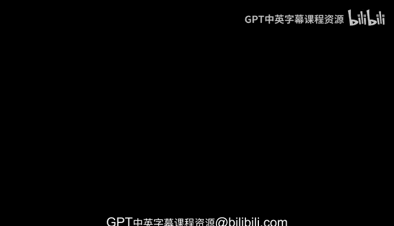
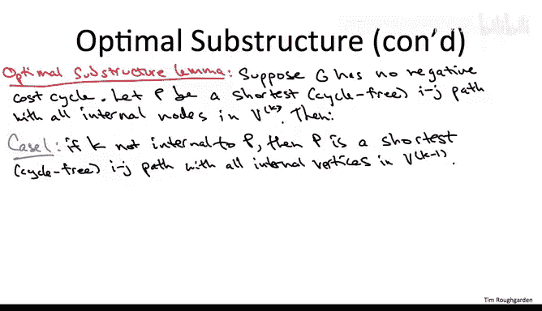

# 算法：10：最优子结构



## 概述
在本节课中，我们将学习所有点对最短路径问题的最优子结构性质。我们将从零开始推导一个算法，而不是依赖于将其归约为单源最短路径问题。本节将重点阐述最优子结构引理，为下一节推导著名的弗洛伊德-沃舍尔动态规划算法奠定基础。

---

## 算法背景与比较

上一节我们讨论了通过多次运行单源最短路径子程序来解决所有点对最短路径问题的性能。弗洛伊德-沃舍尔算法在许多情况下是更好的解决方案。

首先，对于允许边权为负的一般图，弗洛伊德-沃舍尔算法表现良好。之前的解决方案是运行贝尔曼-福特算法 n 次，无法使用迪杰斯特拉算法，因为它在负边权情况下通常不正确。运行贝尔曼-福特算法 n 次的时间复杂度是 O(n²m)。即使在稀疏图的最佳情况下，弗洛伊德-沃舍尔算法的 O(n³) 时间复杂度与之相当，并且在稠密图中表现更好（n 次贝尔曼-福特是 O(n⁴)，而弗洛伊德-沃舍尔是 O(n³)）。

其次，对于边权非负的图，归约为单源问题实际上是一个很好的解决方案，因为迪杰斯特拉算法非常快。运行迪杰斯特拉算法 n 次的时间复杂度是 O(n m log n)。对于稀疏图，您会希望使用 n 次迪杰斯特拉而不是弗洛伊德-沃舍尔，因为您将获得大约 O(n²) 的运行时间，而不是这里的 O(n³)。对于稠密图，运行 n 次迪杰斯特拉的时间复杂度大约也是 O(n³)，与弗洛伊德-沃舍尔算法大致相同，两者在实践中性能相近。

弗洛伊德-沃舍尔算法的一个常见应用是计算二元关系的传递闭包。在图论语言中，您可以将其视为计算所有点对的可达性。这是所有点对最短路径问题的一个特例，您只想知道每对顶点之间的最短路径距离是有限的还是无限的。如果您只关心传递闭包问题，可以在弗洛伊德-沃舍尔算法中进行一些优化以加快常数因子。

虽然 O(n³) 的运行时间可能并不十分出色，但这是目前已知的最优算法之一。是否存在显著优于 O(n³) 的算法来解决所有点对最短路径问题，至今仍是一个开放性问题。

---

## 定义子问题

现在，让我们形式化所有点对最短路径问题的最优子结构，弗洛伊德-沃舍尔算法正是利用了这一点。

首先需要说明的是，将动态规划应用于图问题可能具有挑战性，因为输入没有明确的顺序。一个巧妙的解决方案是引入一个额外的参数来定义子问题的大小顺序。

在贝尔曼-福特算法中，我们引入了参数 `i` 作为路径中允许使用的边数（或顶点数）的预算。这自然地在子问题之间诱导了一个顺序：边预算越大，子问题越大。

在弗洛伊德-沃舍尔算法的解决方案中，我们将采取类似但更严格的方法。我们不仅会限制在给定起点和终点之间的路径中允许使用的顶点数量，还会限制允许使用的顶点的具体身份。

具体做法是，我们对顶点集 V 施加一个任意的顺序。我们将顶点命名为 1, 2, 3, ..., n。然后，使用符号 **V^K** 表示前 K 个顶点的前缀，即顶点 1 到 K。

---

## 最优子结构引理

与贝尔曼-福特的情况不同，我首先为没有负环的输入图证明最优子结构引理。我们将在算法完成后处理负环的情况。目前假设图中没有负环。

那么子问题是什么呢？它与贝尔曼-福特非常相似。在贝尔曼-福特中，我们解决单源最短路径问题，需要为每个目的地计算一些东西，这给了我们线性数量的子问题。然后，对于给定的目的地，我们有参数 `i` 控制边预算，这又是另一个线性因子，所以我们有二次数量的子问题。

在这里情况相同，只是我们还需要遍历所有起点。因此，我们将得到三次数量的子问题。具体来说，子问题由以下选择定义：
*   一个起点 `i`（从 1 到 n 的某个顶点）。
*   一个终点 `j`（从 1 到 n 的另一个顶点）。
*   一个界限 `k`，它规定了在路径内部允许使用哪些顶点（只能是顶点 1 到 k）。

约束仅适用于路径内部的顶点（中间节点），不适用于起点 `i` 和终点 `j` 本身。

现在，我们专注于这个子问题的一个最优解。在所有从顶点 `i` 开始、在顶点 `j` 结束，并且严格在 `i` 和 `j` 之间仅包含顶点 1 到 `k` 作为内部节点的路径中，我们寻找长度最短的那一条。由于我们考虑的是没有负环的情况，我们可以假设这条路径是无环的。

---

## 子问题示例

为了确保您理解这些子问题，让我们看一个例子。

假设起点 `i` 是我们任意标记为 17 的顶点。终点 `j` 是我们标记为 10 的顶点。假设当前的 `k` 是 5。

考虑下图（想象这是某个更大图的一小部分）：
```
(图中显示顶点17和10之间有一条直接长度为-20的路径，经过顶点7；以及另一条经过顶点4和5、长度为3的路径)
```
从 17 到 10 的最短路径显然是底部那条 2 跳的路径，总长度为 -20。然而，对于我们正在处理的子问题，`k = 5`。这意味着我们对路径中间可以使用的顶点有额外的约束：只能使用前 5 个顶点（1 到 5）作为中间节点。

这个约束不适用于起点和终点。任何从 `i` 到 `j` 的路径都必须包含顶点 `i` 和 `j`。约束仅适用于路径中间的顶点。

不幸的是，底部那条 2 跳的路径使用了节点 7。节点 7 大于 5，因此该路径不满足约束，不允许使用。因此，从 17 到 10 且仅使用前 5 个标记顶点作为中间节点的最短路径，将是顶部的 3 跳路径，其长度为 3。

---

## 最优子结构陈述

现在，让我们进入最优子结构引理的完整陈述。这实际上是我们最近见过的最简单的引理之一，它只涉及两种情况。

**情况一：最短路径不使用顶点 k**
如果从 `i` 到 `j` 且仅使用顶点 1 到 `k` 作为中间节点的最短路径 `P`，根本没有使用顶点 `k`，那么它必然也是从 `i` 到 `j` 且仅使用顶点 1 到 `k-1` 作为内部节点的最短路径。



**情况二：最短路径使用顶点 k**
假设路径 `P` 确实在中间使用了顶点 `k`。那么我们可以将路径 `P` 视为由两个子路径组成：
*   第一个子路径 `P1`，从 `i` 开始，到达顶点 `k`。
*   第二个子路径 `P2`，从 `k` 开始，到达终点 `j`。

以下是关键点：在路径 `P` 上，`i` 和 `j` 之间的内部节点都在 1 到 `k` 之间。此外，路径 `P` 是无环的，因此顶点 `k` 恰好出现一次。所以，如果我们将路径 `P` 分成 `P1` 和 `P2` 两部分：
*   在 `P1` 中，严格在 `i` 和 `k` 之间，只有顶点 1 到 `k-1`。
*   在 `P2` 中，严格在 `k` 和 `j` 之间，只有顶点 1 到 `k-1`。

因此，这两条路径 `P1` 和 `P2` 都可以被视为更小子问题的可行解，这些子问题对允许的内部节点有更严格的预算 `k-1`。而且，它们不仅仅是更小子问题的可行解，它们本身就是这些子问题的最优解。

这个性质非常巧妙：具有最大索引的内部节点 `k` 只是将最短路径分割成了两个更小子问题的最短路径。

---

## 总结
本节课中，我们一起学习了所有点对最短路径问题的最优子结构性质。我们定义了基于顶点前缀的子问题，并分析了两种情况：最短路径是否使用允许集合中的最大索引顶点 `k`。这种结构化的分析方式，为下一节推导出高效的弗洛伊德-沃舍尔动态规划算法提供了清晰的理论基础。该引理的证明思路与贝尔曼-福特算法相似，鼓励您将其作为练习来完成。