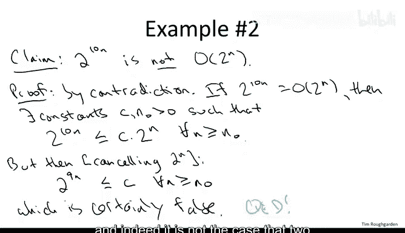
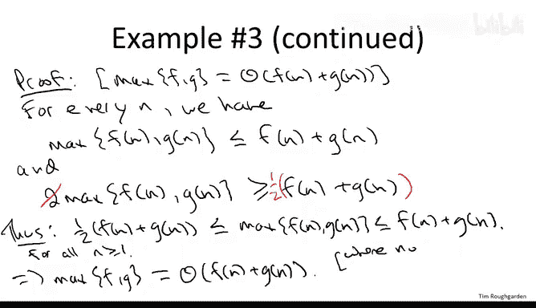

# 算法分析：13：补充示例与复习（可选）📚

在本节课中，我们将通过三个额外的示例来练习渐近符号的使用。我们将学习如何形式化地证明一个函数是另一个函数的大O，如何证明一个函数不是另一个函数的大O，以及如何使用Θ符号来证明两个函数的渐近等价性。

---

## 证明函数的大O关系 🔍

上一节我们介绍了渐近符号的基本概念，本节中我们来看看如何形式化地证明一个函数是另一个函数的大O。

我们考虑函数 **f(n) = 2^(n+10)**。我们的目标是证明 **f(n) 是 O(2^n)**。

根据大O符号的定义，我们需要找到两个常数 **C** 和 **n₀**，使得对于所有足够大的 **n**（即 **n ≥ n₀**），都有：
**2^(n+10) ≤ C * 2^n**

以下是证明步骤：

1.  我们从左边开始：**2^(n+10)**
2.  利用指数运算法则，我们可以将其重写为：**2^(n+10) = 2^n * 2^10**
3.  计算 **2^10** 得到 **1024**。因此，**2^(n+10) = 1024 * 2^n**
4.  现在，我们可以选择常数 **C = 1024** 和 **n₀ = 1**。对于所有 **n ≥ 1**，不等式 **2^(n+10) ≤ 1024 * 2^n** 显然成立。

因此，我们证明了 **2^(n+10) 是 O(2^n)**。证明的关键在于找到一个合适的常数 **C**，使得不等式对所有足够大的 **n** 都成立。

---

## 证明函数不是大O关系 ❌

接下来，我们看一个反例，证明一个函数不是另一个函数的大O。

我们考虑函数 **g(n) = 2^(10n)**。我们声称 **g(n) 不是 O(2^n)**。

我们采用反证法。假设 **2^(10n) 是 O(2^n)**。根据定义，存在常数 **C** 和 **n₀**，使得对于所有 **n ≥ n₀**，有：
**2^(10n) ≤ C * 2^n**

以下是推导矛盾的过程：

1.  将不等式两边同时除以 **2^n**（因为 **n** 为正数，所以 **2^n > 0**），得到：
    **2^(10n) / 2^n ≤ C**
2.  根据指数运算法则，**2^(10n) / 2^n = 2^(10n - n) = 2^(9n)**。因此，不等式变为：
    **2^(9n) ≤ C**
3.  这个不等式意味着，对于所有足够大的 **n**，函数 **2^(9n)** 被一个固定常数 **C** 所上界。
4.  然而，当 **n** 趋于无穷大时，**2^(9n)** 会趋于无穷大，不可能被一个固定常数永远上界。这产生了矛盾。

因此，我们的假设是错误的，**2^(10n) 不是 O(2^n)**。这个例子说明，指数上的常数因子（如乘以10）会彻底改变函数的渐近增长率。

---

## 使用Θ符号证明渐近等价性 ⚖️

最后，我们来看一个更复杂的例子，练习使用Θ符号。Θ符号表示两个函数在渐近意义下“相等”。

**声明**：对于任意两个定义在正整数上的正函数 **f(n)** 和 **g(n)**，它们的逐点最大值 **max(f(n), g(n))** 与它们的和 **f(n) + g(n)** 是Θ关系。即：
**max(f(n), g(n)) 是 Θ(f(n) + g(n))**

根据Θ符号的定义，我们需要找到常数 **C₁**, **C₂** 和 **n₀**，使得对于所有 **n ≥ n₀**，有：
**C₁ * (f(n) + g(n)) ≤ max(f(n), g(n)) ≤ C₂ * (f(n) + g(n))**

以下是证明过程。我们首先观察两个基本不等式：

1.  **上界证明**：对于任意 **n**，最大值显然不会超过两者之和。
    **max(f(n), g(n)) ≤ f(n) + g(n)**
    这直接给出了上界，我们可以选择 **C₂ = 1**。

2.  **下界证明**：我们需要证明最大值至少是两者之和的一部分。
    考虑 **2 * max(f(n), g(n))**。它等于 **max(f(n), g(n)) + max(f(n), g(n))**。
    由于 **max(f(n), g(n))** 至少等于 **f(n)** 和 **g(n)** 中的每一个，因此：
    **2 * max(f(n), g(n)) ≥ f(n) + g(n)**
    将两边同时除以2，得到：
    **max(f(n), g(n)) ≥ (1/2) * (f(n) + g(n))**
    这给出了下界，我们可以选择 **C₁ = 1/2**。

综合以上两点，我们证明了对于所有 **n ≥ 1**（这里 **n₀ = 1**），有：
**(1/2) * (f(n) + g(n)) ≤ max(f(n), g(n)) ≤ 1 * (f(n) + g(n))**

这恰好满足了Θ定义的要求。因此，**max(f(n), g(n)) 是 Θ(f(n) + g(n))**。这个结论非常有用，它表明在渐近分析中，取两个函数的最大值（即考虑最坏情况）与考虑它们的总和，其增长率是相同的（相差常数倍）。

---

## 总结 📝

本节课中我们一起学习了三个关于渐近符号的补充示例：
1.  我们通过选择常数 **C = 1024**，形式化地证明了 **2^(n+10) 是 O(2^n)**。
2.  我们使用反证法，通过推导出矛盾（**2^(9n) ≤ C** 对无穷大的 **n** 不成立），证明了 **2^(10n) 不是 O(2^n)**。
3.  我们利用不等式推导，证明了对于任意正函数 **f** 和 **g**，**max(f, g) 是 Θ(f + g)**，其中常数 **C₁ = 1/2**, **C₂ = 1**。

这些练习帮助我们更深入地理解了如何运用大O和Θ符号的定义来分析和证明函数的渐近关系。