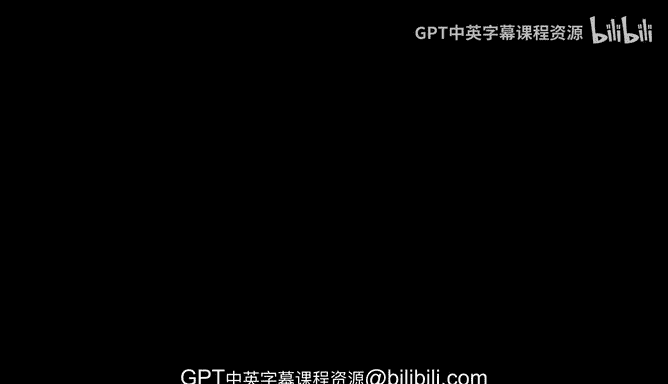
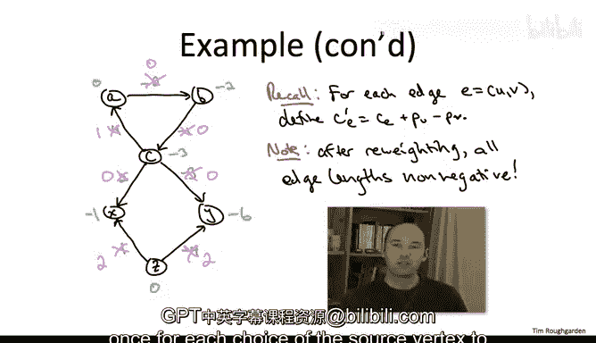

# 斯坦福大学《算法》课程：13：约翰逊算法详解

## 概述

在本节课中，我们将要学习约翰逊算法。该算法巧妙地运用了“重赋权”技术，将可能包含负权边的全源最短路径问题，转化为一次贝尔曼-福特算法加上N次迪杰斯特拉算法的组合，从而提升计算效率。

上一节我们介绍了重赋权技术的基本原理，本节中我们来看看如何利用该技术构建约翰逊算法。

## 算法核心思想

约翰逊算法的核心思想是：通过添加一个虚拟源点并计算其到所有原图中顶点的最短路径距离，将这些距离作为每个顶点的“权重”。然后，利用这些权重对原图的所有边进行重赋权，使得所有边权变为非负值。最后，在重赋权后的新图上，对每个顶点运行一次迪杰斯特拉算法，即可高效地计算出原图的全源最短路径。

## 算法步骤详解

### 步骤一：添加虚拟源点

首先，我们面临一个问题：为了计算顶点权重，我们需要一个能到达图中所有顶点的源点。但在原图中，任意选定的源点可能无法到达所有其他顶点。

以下是解决此问题的方法：
*   我们在原图G中添加一个新的顶点，记为`s`。
*   从`s`向原图G中的每一个顶点`v`添加一条有向边，其边权为`0`。

这样，从`s`到任意顶点`v`都至少存在一条直接路径（长度为0），从而保证了最短路径距离是有限的。同时，添加`s`不会改变原图中任意两个顶点之间的最短路径，也不会影响原图是否存在负权环。

### 步骤二：计算顶点权重

接下来，我们以新添加的顶点`s`为源点，计算它到原图G中所有其他顶点的最短路径距离。

由于原图可能包含负权边，我们需要使用能够处理负权边的贝尔曼-福特算法来完成此计算。

我们将计算得到的最短路径距离，定义为每个顶点`v`的权重`p(v)`。公式如下：
`p(v) = δ(s, v)`，其中`δ(s, v)`表示从`s`到`v`的最短路径距离。

### 步骤三：边重赋权

获得所有顶点权重`p(v)`后，我们对原图G中的每一条边`e = (u, v)`进行重赋权，得到新的边权`c'(e)`。

重赋权的公式为：
`c'(e) = c(e) + p(u) - p(v)`

其中，`c(e)`是边`e`的原始长度，`p(u)`是边尾顶点`u`的权重，`p(v)`是边头顶点`v`的权重。

**关键性质**：经过此变换，新图中所有边的长度`c'(e)`都将变为非负值。同时，对于原图中任意两个顶点`s`和`t`，任意一条`s->t`路径的长度变化量是恒定的（等于`p(s) - p(t)`），因此最短路径得以保留。

### 步骤四：计算全源最短路径

现在，我们得到了一个所有边权均为非负的新图。在这个新图上，我们可以放心地使用更高效的迪杰斯特拉算法。

以下是最终的计算步骤：
*   对于原图G中的每一个顶点`u`，将其作为源点。
*   在新图（使用边权`c'`）上运行迪杰斯特拉算法，计算从`u`到所有其他顶点`v`的最短路径距离`δ'(u, v)`。
*   为了得到原图G中真实的距离`δ(u, v)`，我们需要进行逆变换。公式为：
    `δ(u, v) = δ'(u, v) - p(u) + p(v)`

## 总结

本节课中我们一起学习了约翰逊算法。该算法通过“添加虚拟源点 -> 贝尔曼-福特算法计算顶点权重 -> 重赋权得到非负权图 -> N次迪杰斯特拉算法计算新图最短路径 -> 逆变换还原原图距离”这一系列步骤，巧妙地解决了包含负权边（但无负权环）的全源最短路径问题。其时间复杂度主要取决于N次迪杰斯特拉算法的开销，在采用合适的优先队列时，可以比直接使用N次贝尔曼-福特算法或弗洛伊德-沃舍尔算法更加高效。