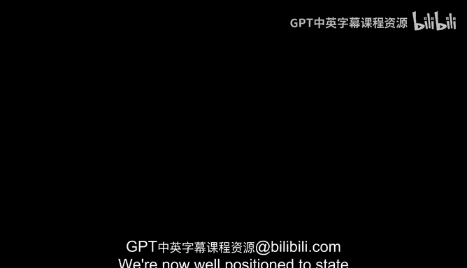
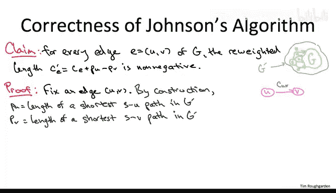

# 斯坦福大学《算法（分治／排序／搜索／随机算法、图搜索／最短路径／数据结构、贪心算法／最小生成树／动态规划、最短路径／NP）｜Algorithms》中英字幕 - P142：14_01_06_约翰逊算法二.zh_en - GPT中英字幕课程资源 - BV1Rx4y1U7sZ

We're now well positioned to state Johnson's algorithm in its full generality。 The input， as usual。

 is a directed graph G。 Each edge has an edge length C sub B could be positive or negative。

 The input graph G may or may not have a negative cost cycle。 As usual。

 when we talk about solving a shortest path problem， we mean that if there is no negative cost cycle。

 then we have no excuse。 So we better correctly compute all of the desired shortest paths。

 In this case between all pairs of vertices。 If there is a negative cost cycle。 We're off the hook。

 We don't have to compute shortest paths。 but we need to correctly report that the graph does indeed have a negative cost cycle。

Step1 is the same hack that we used in the example。

 we want to make sure that there's a vertex from which we can reach everybody else。

 so let's just add a new one that by construction has that property。

 so we had one new vertex a little S。 we had n new edges。

 one from S to each of the original vertices and each of those new n edges has length zero。

We're going to call this new bigger graph G prime。The second step， just like in the example。

 is to run a shortest path computation using this new vertex S as the source。

 since the graph G in general has negative edge costs。

 we have to resort to the Belman Ford algorithm to execute this shortest path computation。

Recall that the Belman Ford algorithm will do one of two things。

 Either it will correctly compute the shortest path distances that we're after from the source vertex S to everybody else。

 or it will correctly report that the graph that was fed namely G prime contains a negative cost cycle。

 Now， if G prime contains a negative cost cycle。 that cycle has to be in the original graph G the new vertex S that we added has no incoming arcs at all。

 So it certainly can't be on any cycle。 So any negative cycle is the responsibility of the original graph G。

 Therefore， if Belman Ford finds us a negative cost cycle were free to just halt and correctly report that same result。

So from here on out， we can safely assume that G and G prime have no negative cost cycle and therefore that the Belman Ford algorithm did indeed correctly compute shortest path distances from S to everybody else As in the example。

 we are going to use these shortest path distances。

 all of which are finite by construction as our vertex weights， are piece of V's。

 we then form the new edge lengths， the C primes in the usual way C prime of an edge E going from U to V is the original length C plus the weight of the tail piece of U minus the weight of the head piece of V。

In the example， we saw that the new edge length C prime were all non negative。

 We will shortly prove that that property holds in general。

 if you define your vertex weights in terms of shortest path distances from the new vertex S to everybody else in this augmented graph G prime。

 it is always the case that your new edge length will be non negative。 Asing that for now。

 it makes sense to use dixtras algorithm N times once for each choice of the source vertex to compute all pairs shortest paths in the graph G with the new edge length C prime。

In a particular iteration of this for loop， say when we're using the vertex U as the source vertex。

 we're going to be computing n of the shortest path distances we care about from U to the various n possible destinations。

 and let's call those shortest paths computed by Dykstra in this iteration， D prime of U comma V。

So perhaps you're thinking that at this point we're done we transformed the edge lengths using reweighting to make them non negative。

 and as we know， once things are not negative and diterss and are' good to go。

 but there's one final piece of bookkeeping that we have to keep track of。

 So the shortest path distances that we compute and step 4。

 these D primes these are the shortest path distances with respect to the modified costs。

 the C primes and what we're responsible for outputting is the shortest path distances with respect to the original lengths。

 the Cs。 But fortunately， there's a very easy way to extract the true shortest path distances from the D primes from the shortest path distances relative to the modified costs。

 we know the D primes are wrong， they're computed with respect to the wrong costs。

 but we know exactly what they're off by So the D primes are off by exactly piece of U minus piece of V amount。

 So to go from the D primes back to the shortest path distances that we really care about。

 we just need to subtract that term back off and that's step5。

That completes the description of Johnson's algorithm， which in effect。

 is a reduction from the all par shortest path problem with general edge lengths to n plus1 instances of the single source version of the problem。

 only one of which has general edge lengths， n of which have only non negative edge lengths。

Analyzing the running time of Johnson's algorithm is straightforward。

 Let's just look at the work done in each of the five steps。In step 1。

 we just add one new vertex and n new edges。 So that takes O of N time to accomplish。In step 2。

 we run the Belman Ford algorithm。 So we know that takes O of M times n time。In step 3。

 we have to compute the modified costs。 But given the shortest path distance is computed by Belllman Ford。

 that's constant time per edge or O of M time overall。In step four。

 we run Dykester's algorithm n times and the running time of one in is M times login。In step5。

 we do constant work for each choice of U and V， so of n squared work overall。

So you can see that step 4 dominates and the running time is equivalent to n Ins of Dywa's algorithm M times n times login。

As usual， when discussing graph algorithms， I am thinking about the graph as at least being weak connected。

 I'm thinking of the number of edges M as being big omega of。

So why is this running time so cool about two reasons。 The first reason is that for sparse graphs。

 this solution blows away the previous algorithms that we had that could handle negative edge links。

 There are two previous solutions that we knew that you could use with graphs with negative edge links or either run Belman Ford n times or use the Fd Warsshll algorithm。

 And in sparse graphs where M is big O of n， Both of those solutions run in cubic time。

 O of n cubed time。 This solution for sparse graphs when M is big O of n is O of n squared times a log n factor。

 So it's way better than either using Belman Ford n times or using Fyd Warshaw。😊。

The second reason this running time is so cool is that it matches the running time we were getting already in the special case when edge links were non negative。

 So this is very different than how we were conditioned to think about the world when we talked about single source shortest path problems。

 Remember， in those problems， we have diyster's algorithm。

 which only handles non negative edge links， but runs a near linear time。

 and there's no algorithm known for single source shortest paths。

 That's near linear that can handle negative edge links。

 The Belman Ford algorithm certainly is not near linear running time。 That's big O of M times N。😊。

Johnson's algorithm shows that while negative edge links are indeed an issue。

 they can be handled in one shot using just one invocation of Belmond Ford。

 While the Belmond Ford algorithm is indeed quite a bit slower than Dyster's algorithm。

 It's only roughly a factor of n slower。 So one invocation of Belmand Ford doesn't change the overall running time when we already have to do n ins of Dyster's algorithm。

 Even in the special case of the problem where all of the E links are non negative。

So that is why for all pairs shortest paths， we see a convergenence in the performance of algorithms that solve the problem in general and algorithms that only solve the problem in the special case of non negative edge length。

The missing piece to the correctness argument is understanding why in general。

 the modified edge links， the C prime Es are guaranteed to be non negative。

 We saw that they were non negative in a specific example， but we have not yet proved it in general。

 will do that on the next slide。 As for the moment that that is true that the modified edge links are indeed nonneg。

 and therefore， when we invoke diykestro will correctly compute shortest paths。

 we're pretty much done。 in particular， recall that we had a quiz in the previous video where we analyze the ramifications of reweighting。

 And we saw that if you reweight using particular vertex weights， some piece of vs。

 Then for a given choice of an origin U and a given choice of a destination V。

 every single Uv path has its length changed by exactly the same amount by a common amount， namely。

 the difference between U' vertex weight piece of U and the destination V's vertex weight piece of V。

 So that means when we invoke Dkester's algorithm in step 4， indeed gets the shortest paths correct。

 The shortest path distances are incorrect。 But we know exactly how much they're off。

They're off by P minus P of V。 and that is corrected for in step 5。

 So that's why assuming correctness of Dkester's algorithm。

 which in turn relies on non negativity of the modified edge links。

 the end result of Johnson's algorithm is indeed the correct shortest path distances。

To finish the analysis of Johnson's algorithm， all that remains is to prove the following claim。

 which is that for every single edge of the graph， its length after we do reweighting is non negative。

So the proof in fact is not hard， it follows quite easily from properties as short as path distances。

 so fix your favorite edge E， let's say going from U to V。

The vertex weights are by construction just short as past distances from the vertex little S。

 where remember S is the extra source vertex that we added to the original input graph G。

So by the way we constructed the graph G prime， there is at least one path from this auxiliary source vertex S to every other vertex。

 so there is some shortest path from S to U， let's call it capital P。By definition。

 the length of capital P has to be little piece of U。

It's a simple matter to obtain from this path capital P， which goes from S to U。

 a path which goes from S all the way to V， namely just concatenate the edge UV as a final hop。

The length of this path， which goes from S to V， is， of course。

 just the length incurred going from S to U， which is just P sub U， plus the length of the final hop。

 which is just the length of this edge C sub U V。Now this is just some old path from S to V。

 the shortest path from S to V can of course only be shorter， and remember P of V。

 the vertex weighted V is by definition the length of a shortest path from S to V。

And now we're good to go because the modified length of this edge C that is C prime sub B is just the difference between the right hand side of this inequality and the left hand side。

 So that's why the difference is guaranteed to be non negative。

 since this was an arbitrary edge it holds for all of the edges that completes the proof and the analysis of Johnson's algorithm。

