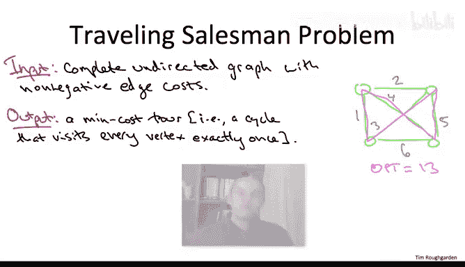

# 算法：15：多项式时间可解问题与P类

在本节课中，我们将开始学习本课程的最后一个主题。首先，我们将探讨什么是NP完全问题或计算上难解的问题。其次，我们将讨论从算法角度应对这些问题的有效策略。

让我们首先通过多项式时间可解性来正式定义计算易处理性，即定义复杂度类P。

## 计算易处理性的定义

正如你们通过过去几周的辛勤工作所知，本算法设计与分析课程的重点是学习针对基础计算问题的实用算法及相关支撑理论。到目前为止，我们已经掌握了大量此类问题，例如排序、搜索、最短路径、最小生成树、序列比对等等。

然而，一个令人遗憾的事实是，迄今为止我向你们展示的计算问题样本存在相当大的偏见。对于许多重要的计算问题，包括你们在自己的项目中很可能遇到的问题，目前并没有已知的高效算法，更不用说极其快速的算法了。

尽管本课程的重点是算法能做什么，而非不能做什么，但如果不讨论困扰专业算法设计师和严肃程序员的“难解性”这一幽灵，我认为教授算法知识是不完整的。

正如你的程序员工具箱应包含多种设计范式（如动态规划、贪心算法、分治法）和多种数据结构（如哈希表、平衡搜索树等），这个工具箱也应包含对计算上难解（即NP完全）问题的认识，甚至可能包括如何证明问题是NP完全的。这是因为这些问题很可能出现在你自己的项目中。在斯坦福大学，经常有研究生来到我的办公室，就他们项目中出现的算法问题寻求建议。通常，他们在我的白板上描述问题几分钟后，就很容易看出这实际上是一个NP完全问题。他们不应该寻求一个高效且完全正确的算法，而应转而采用我们稍后将讨论的应对NP完全问题的策略之一。

因此，在接下来的系列视频中，我的目标是通过定义NP完全性来形式化计算难解性的概念，并给出几个例子。我将要给出的关于NP完全性的相对简短的讨论，并不能替代对该主题的正式学习。我鼓励你们寻找教科书或网络上的其他免费课程来了解更多。事实上，我认为NP完全性是一个值得从多个不同角度至少学习两次的主题。对于那些已经学习过的同学，我希望我的讲解能与你之前见过的处理方法形成互补。确实，NP完全性是计算机科学向更广泛科学界输出的最著名、最重要和最具影响力的成果之一。

随着如此多不同的学科变得越来越计算化（我想到的包括数学科学、自然科学，甚至社会科学），这些领域确实别无选择，只能面对并学习NP完全性，因为它真正地决定了什么可以计算完成，什么不能。

我在这里的观点将毫不掩饰地站在算法设计师的立场。特别是在我们讨论了NP完全性之后，本课程的其余部分将重点讨论针对这些问题的算法方法：如果你面对一个NP完全问题，你应该怎么做？

因此，与其一开始就形式化计算难解性，不如从定义计算易处理性开始，这样更简单一些。

## 多项式时间可解性的定义

这引出了极其重要的多项式时间可解性定义。这个定义有点拗口，但它基本上就是你所想的那样。

**定义**：一个问题被称为**多项式时间可解**，当且仅当存在一个多项式时间算法可以解决它。也就是说，存在一个算法和一个常数K，使得如果你向该算法输入一个长度为N的输入，它将在`O(N^K)`的时间内正确地解决问题（无论是正确回答是/否，还是正确输出一个最优解等）。

在我们讨论过的大多数问题中，输入长度是显而易见的，例如顶点数加边数，或者需要排序的数字数量等。对于一个抽象问题，非正式地，我鼓励你将输入长度N视为在计算机上描述该给定实例所需的击键次数。

是的，严格来说，要成为多项式时间可解，你只需要对于某个常数K，运行时间是`O(N^K)`。即使K等于10000，也足以满足这个定义的要求。当然，对于具体问题，你会看到较小的K值。在本课程中，K通常是1、2或3。

对于那些想知道随机算法的人，我们当然在第一部分看到过一些很酷的随机算法例子。为了简化讨论，当我们讨论计算难解性时，让我们只考虑确定性算法。但同时，请放心，我们即将得出的所有定性结论，普遍认为同样适用于随机算法。具体来说，我们不认为存在这样的问题：确定性算法需要指数时间，而随机化却能神奇地让你获得多项式时间。甚至有数学证据表明情况确实如此。

## 复杂度类P

这就引出了复杂度类**P**的定义。**P**被定义为所有多项式时间可解问题的集合，即所有允许用多项式时间算法解决的问题的集合。对于那些听说过P与NP问题的人，这里的P就是同一个P。

在本课程中，我们已经展示了许多P类问题的例子，这实际上就是本课程的整个重点：序列比对、最小割、排序、最小生成树、最短路径等等。

但有两个例外。一个是我们当时明确讨论过的，即当我们讨论具有负边成本的图中的最短路径时。我们指出，如果你有负成本环，并且你想要的是简单的（不包含任何环的）最短路径，那么这被证明是一个NP完全问题（对于那些了解归约的人来说，这是从哈密顿路径问题的一个简单归约）。因此，我们没有给出该版本最短路径问题的多项式时间算法，我们只是避开了它。

第二个例子非常微妙。信不信由你，我们实际上并没有为背包问题给出一个多项式时间算法。

这需要解释一下，因为当时在我们的动态规划算法中，我敢打赌你觉得它就是一个多项式时间算法。让我们回顾一下它的运行时间。在背包问题中，输入是n个具有价值和尺寸的物品，以及一个背包容量（一个正整数W）。我们的二维数组表有`Θ(n * W)`个子问题，我们花费常数时间填充每个条目。因此，我们动态规划算法的运行时间是`Θ(n * W)`。

另一方面，一个背包问题实例的长度是多少？正如我们刚才所说，背包问题的输入是2n+1个数字：n个尺寸、n个价值和背包容量。自然地，要写下这些数字中的任何一个，你只需要`log(数字的大小)`。如果你有一个整数K，你想用二进制写下来，那就是`log₂(K)`位；如果你想用十进制数字写下来，那就是`log₁₀(K)`位，这相差一个常数因子。关键是，输入长度将与n成正比，并与数字大小的对数（特别是`log(W)`）成正比。

这是理解为什么动态规划算法在输入长度意义下是指数级的另一种方式。让我用一个类比。假设你正在解决某个图的割问题。记住，一个图中的割的数量相对于顶点数是指数级的，对于n个顶点大约是`2^n`。这意味着如果你在进行暴力搜索，我只要在图中多添加一个顶点，你的算法运行时间就会翻倍。这是指数增长。

但实际上，在背包问题的动态规划算法中，同样的事情正在发生。假设我们用十进制写下所有内容。我只需在背包容量后面多加一个0（即乘以10）。那么，你必须解决的子问题数量就会增加10倍。同样，我只是在输入中增加了一个数字（一次击键），而你的运行时间却被乘以了一个常数因子。因此，这同样是相对于输入编码长度的指数增长。

我们未能为背包问题获得多项式时间算法并非偶然，因为它实际上是一个NP完全问题。同样，我们稍后会解释NP完全的含义。

## 对P类的解读

以上就是复杂度类P的数学定义。但比数学更重要的是其解读：你应该如何看待P类？如何看待多项式时间可解性？对于实践中的算法设计师和程序员来说，属于P类（多项式时间可解）可以被视为计算易处理性的一个粗略试金石。

现在，将运行时间为`O(N^K)`（对于某个常数K）的算法与实际中计算高效的算法等同起来是不完美的。当然，有些算法在原则上是多项式时间的，但在实践中太慢而无用。相反，有些算法不是多项式时间的，但在实践中却很有用。你在编写背包问题的动态规划解决方案时已经编写了一个，在未来的讲座中我们还会看到更多例子。

更一般地说，任何有勇气写下像复杂度类P这样精确数学定义的人，都需要准备好接受一个必然性：这个定义将容纳一些你希望它没有的边缘情况，并且会排除一些你希望它没有的边缘情况。这是数学性质的二元性与现实的模糊性之间不可避免的摩擦。

这些边缘情况绝不是忽视或否定此类数学定义的借口。恰恰相反，这种摩擦使得你能写下如此简洁的数学定义（每个计算问题要么满足，要么不满足），并且它能如此有效地指导将问题分类为“实践中易处理的”和“实践中难处理的”，这更加令人惊讶。我们现在有40年的经验表明，这个定义在那种分类中异常有效。

一般来说，P类中的计算问题可以使用现成的解决方案很好地解决，正如我们在本课程许多例子中看到的那样。而普遍认为不属于P类的问题，在实践中通常需要大量的计算资源、人力资源和领域专业知识来解决。

## 一个著名的例子：旅行商问题

我们已经顺便提到了几个被认为不是多项式时间可解的问题。但让我在这里暂停一下，告诉你们一个更著名的问题：**旅行商问题**。

旅行商问题听起来与最小生成树问题并没有太大不同，而后者我们现在知道有一系列贪心算法可以在近线性时间内运行。TSP的输入是一个无向图。我们假设它是一个完全图，即每对顶点之间都有一条边。每条边都有一个成本，并且这个问题是非平凡的，即使每条边的成本只是1或2。

让我用绿色画一个有四个顶点的例子。

TSP问题的算法职责是输出一个**环游**，即一个访问每个顶点恰好一次的环。在所有环游（你可以将其视为顶点的一个排列，即访问它们的顺序）中，你想要的是最小化边成本总和的那个。

例如，在我画的绿色图中，最小成本环游的总成本是13。

TSP问题陈述起来足够简单，显然你可以通过暴力搜索在大约`n!`的时间内解决它，只需尝试所有顶点的排列。但你们知道，在本课程中我们已经看到许多例子，你可以做得比暴力搜索更好。而TSP问题，人们至少从20世纪50年代就开始从计算角度认真研究，包括像乔治·丹齐格这样的优化领域的大人物。

尽管研究了60多年，但迄今为止，还没有已知的多项式时间算法可以解决旅行商问题。事实上，早在1965年，杰克·埃德蒙兹在一篇名为《路径、树和花》的杰出论文中，就猜想旅行商问题不存在多项式时间算法。

近50年后的今天，这个猜想仍未解决。正如我们将看到的，这等价于猜想**P ≠ NP**。

那么，你将如何形式化地证明这个猜想？在没有证明的情况下，你将如何积累证据支持这个猜想成立？这些将是接下来视频的主题。

## 总结

本节课中，我们一起学习了计算易处理性的正式定义，即通过**多项式时间可解性**来定义复杂度类**P**。我们明确了P类问题在实践中通常被认为是“易处理的”，并理解了其数学定义与直观解读之间的微妙关系。我们还回顾了背包问题的动态规划算法，认识到它在输入长度意义下实际上是指数级的，并由此引出了对NP完全问题的初步认识。最后，我们介绍了一个著名的、被认为不属于P类的问题——旅行商问题，为后续深入探讨NP完全性和计算难解性奠定了基础。