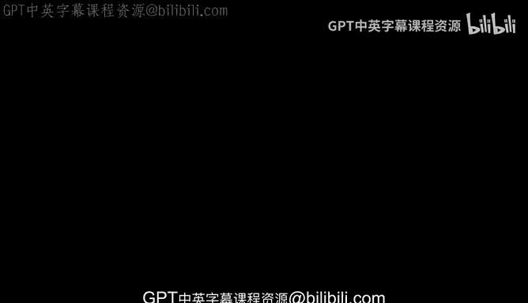
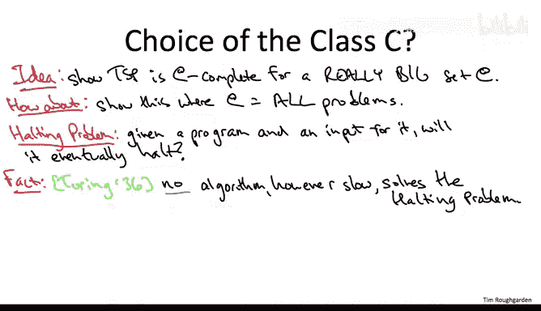

# 算法：16：归约与完全性

## 📖 概述
在本节课中，我们将学习如何证明像旅行商问题这类问题的计算困难性。核心思想是通过“完全性”这一形式化概念，而它又依赖于两个问题之间的“归约”关系。

---

## 🔗 归约：定义与直观理解
上一节我们介绍了计算困难性的概念。本节中，我们来看看如何通过“归约”来形式化地比较两个问题的难度。

我们说一个计算问题 **π₁** 可以归约到另一个问题 **π₂**，其含义是：**如果你拥有一个能高效解决 π₂ 的算法，那么你就能利用它来高效地解决 π₁**。换句话说，如果有人给你一个解决 π₂ 的多项式时间算法，你就可以把它当作一个子程序，构建出一个解决 π₁ 的多项式时间算法。

以下是归约的一些具体例子：

*   **计算中位数归约到排序**：要计算一个数组的中位数，一个完全正确的方法是先对数组进行排序（例如使用归并排序），然后返回中间的元素。
*   **检测环归约到深度优先搜索**：要检查一个图是否包含环，你可以直接在该图上运行深度优先搜索。如果存在环，你会在探索过程中遇到一条指向仍在探索中的顶点的回边。
*   **所有点对最短路径归约到单源最短路径**：要解决所有点对最短路径问题，一个解决方案是多次调用单源最短路径算法（如 Dijkstra 算法），每次选择不同的源点。

经验丰富的算法设计者总是在寻找使用归约的机会。面对一个新问题时，首先应该思考：**这个问题是否只是我已知问题的变体？** 这种“归约”的正面应用，扩展了我们可以用算法高效解决问题的范围。

---

## ⚖️ 归约的“阴暗面”：证明困难性
上一节我们看到了归约如何扩展可解问题的边界。本节中，我们来看看如何利用归约的“反面”来证明问题的困难性。

假设问题 **π₁** 可以归约到问题 **π₂**。作为算法设计者，我们通常考虑的是乐观情况：我们已经有解决 π₂ 的高效算法，从而也能解决 π₁。

但让我们思考一下这个命题的逆否命题。如果我们**不相信** π₁ 能在多项式时间内解决，而 π₁ 又可以归约到 π₂，那么我们同样**不能相信** π₂ 能在多项式时间内解决。

用公式表示这个逻辑：
> 如果 **π₁** 可归约到 **π₂**，且 **π₁** 无法在多项式时间内解决，那么 **π₂** 也无法在多项式时间内解决。

这就是归约的“阴暗面”应用。它不再是将可解性从 π₂ 扩展到 π₁，而是将**不可解性**从 π₁ 传播到 π₂。因此，当我们说“π₁ 可归约到 π₂”时，也意味着 **π₂ 至少和 π₁ 一样困难**。

---

## 🏆 完全性：成为“最难”的问题
上一节我们定义了如何比较两个问题的难度。本节中，我们来看看如何定义一个问题是“一整类”问题中最难的，这就是“完全性”的概念。

考虑一个计算问题的集合 **C**。我们称一个问题 **π** 是 **C-完全** 的，如果满足以下两个条件：
1.  **π 属于集合 C**。
2.  **集合 C 中的每一个问题都可以归约到 π**。

这意味着 π 不仅是 C 中的一员，而且是 C 中“最难”的问题——它至少和 C 中的其他所有问题一样困难。

这个形式化概念正好符合我们的战略计划：通过证明旅行商问题（TSP）和“一大堆”其他问题一样难，来积累其难解的证据。那么，这个“一大堆”问题——集合 C——应该如何选择呢？

为了提供最强有力的证据，我们希望 C 尽可能大。最雄心勃勃的想法是证明 TSP 是**所有**计算问题中最难的。但这过于雄心勃勃了。例如，著名的“停机问题”就比 TSP 更难。艾伦·图灵在1936年证明，**不存在任何算法（无论多慢）能保证永远正确地解决停机问题**。而 TSP 虽然困难，但通过暴力搜索（尝试所有 n! 种排列）总能在有限时间内解决。

因此，我们需要调整思路。我们或许可以证明：**在所有能够通过（某种形式的）暴力搜索解决的问题中，TSP 是最难的一个**。这引出了对“可通过暴力搜索解决”问题的精确定义，也就是下一节将要讨论的核心概念：**复杂度类 NP**。

---

## 📝 总结
本节课中我们一起学习了：
1.  **归约**：通过将一个问题转化为另一个问题，来比较它们的难度。拥有解决后者的算法，就能解决前者。
2.  **归约的双重用途**：既可以用来扩展可高效解决问题的范围（光明面），也可以用来证明一个问题的困难性，即如果 A 可归约到 B 且 A 很难，则 B 也很难（阴暗面）。
3.  **完全性**：如果一个问题是某个问题类别 C 中的一员，并且 C 中所有其他问题都能归约到它，那么它就是 C-完全的，即该类中最难的问题。
4.  **战略方向**：为了证明 TSP 的难解性，我们的目标是证明它是某个“足够大”的问题类别（特别是那些理论上可通过暴力搜索验证解的问题类别，即 NP 类）中的完全问题。这为理解 P 与 NP 问题奠定了基础。