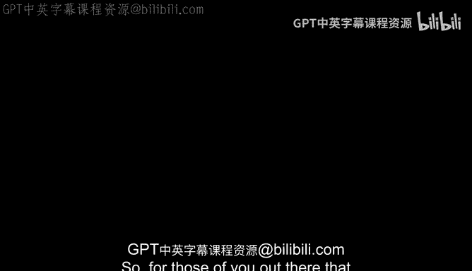
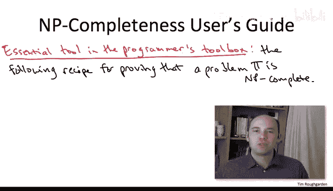

# 算法：18：NP完全性定义与解释二

在本节课中，我们将深入探讨NP完全性的定义，并理解为什么这个概念在计算机科学及其他领域如此重要。我们将看到，NP完全性不仅是一个理论概念，它还为我们提供了一种强有力的工具，用以判断一个计算问题是否本质上是难以高效解决的。

---

对于自认为是计算机科学家的各位，希望你们在看到这个定义时能感到自豪。我们的学科提出了“NP完全问题”这样一个伟大的概念，这确实很酷。这个概念意味着存在一个通用问题，它能同时编码所有那些你能高效验证其解决方案的计算问题。

然而，这里仍然存在一个棘手的问题。通常，当你面对一个数学定义时，比如我刚才给出的NP完全性定义，你应该要求两件事。

第一件事，你应该要求解释为什么需要关心这个定义。也就是说，如果满足这个定义，会带来什么有趣的结果？我认为，对于NP完全性的定义，我已经给出了一个非常令人满意的答案。我论证过，如果一个问题是NP完全的，那么这就是计算难解性的有力证据。因为，如果假设存在一个针对这个NP完全问题的多项式时间算法，那么它将自动高效地解决成千上万个基本的计算问题，即所有你能高效验证解决方案的问题。

但你应该向提出数学定义的人要求的第二件事是：例子。我关心的事情真的符合这个定义，并且是NP完全的吗？我还没有展示任何例子。确实，当你看到这个解释——一个能同时编码所有具有高效可验证解的问题——你可能会想，这样的对象真的存在吗？

NP完全性理论之所以如此强大，并且在过去40年里从计算机科学扩展到其他众多学科，正是因为这个问题也有一个极其令人满意的答案。事实证明，有大量问题不仅仅是NP问题（即不仅仅具有高效可验证的解），成千上万的问题实际上是NP完全的，其难度与NP中的任何其他问题一样高。

因此，NP完全性的定义，以及令人惊讶地存在NP完全问题这一事实，都要归功于史蒂夫·库克和列昂尼德·莱文各自独立的工作。库克和莱文各自独立地提出了基本相似的理论。库克当时（至今仍是）在多伦多大学，而莱文当时在“铁幕”之后，在苏联工作，因此他的成果在西方被知晓花费了一些时间。如今，莱文是波士顿大学的教授。

库克和莱文不仅证明了基本的存在性结果，还给出了一些暗示，表明人们真正关心的问题也可能是NP完全的，例如一些约束满足问题，如3SAT。但NP完全性的广阔范围，即最终被证明是NP完全的问题的广度，首次在理查德·卡普1972年的一篇论文中变得清晰。在那篇论文中，他展示了21个不同问题是NP完全的，包括旅行商问题以及许多不同领域数十年来一直停滞不前的各种问题。现在，NP完全性成为阻碍许多不同领域高效算法进展的根本障碍。

NP完全性另一个令人惊叹之处，也是它能够成功地从理论计算机科学扩展到更广泛的计算机科学领域，进而扩展到工程学和其他科学领域的一个重要原因，在于我们可以相当容易地站在这些巨人的肩膀上，证明新的、你所关心的问题也是NP完全的。

想象一下，有一个你非常关心的计算问题π，它对你正在进行的项目至关重要，但你被卡住了。你已经尝试了数周来解决它，用尽了你工具箱里的所有方法：贪心算法、分治法、动态规划、随机化，你尝试了书中所有的数据结构——哈希表、堆、搜索树——但都不起作用，你无法想出一个高效的算法。

😡 此时，你应该考虑一种可能性：问题可能不在于你缺乏聪明才智或创造力，也不在于你的编程工具箱中工具太少，而可能在于你试图解决的计算问题本质上是难解的。

当你达到这种沮丧的境地时，是时候考虑应用以下两步法来证明问题π是NP完全的。当然，仅仅因为你证明了它是NP完全的，问题并不会消失，但你应该采用不同的算法策略来应对它。在本课程剩余部分，我们将讨论一些处理NP完全问题最流行的策略。

让我在非常高的层次上陈述这个两步法。

第一步，你需要选定一个合适的NP完全问题π‘。
第二步，你需要证明π‘可以归约到你关心的问题π。这表明你的问题至少和这个NP完全问题一样难，因为NP完全问题可以归约到你的问题，因此，假设你的问题在NP中，那么它也是NP完全的。

显然，成功执行这个两步法的关键在于细节。你可能想知道：我到底怎么知道应该使用哪个NP完全问题π‘？其次，我该如何构思从这个NP完全问题π‘到我自己的问题π的归约？

但不要被这两个步骤吓倒。只需一点练习，你实际上可以在这两个步骤上都做得很好，并在许多不同情况下成功执行这个方案。

让第一步不那么令人生畏的一点是，存在一些优秀的NP完全问题列表，特别是那些在构思你自己的归约时往往有用的简单问题。其中最经典的列表是加里和约翰逊合著的《计算机与难解性》一书。它出版于1979年，但极其有用。我想不出还有哪本超过30年的计算机科学书籍能像这本书一样有用。

当然，仍然存在一个问题：你实际上如何构思从一个已知的NP完全问题π‘到你真正关心的问题π的归约？但这一步也不要被吓倒。首先，作为一个算法研究者，无论如何你都应该一直在思考归约。这对你来说应该是一种非常自然的思维方式。例如，当我们第一次讨论所有点对最短路径时，我们很快观察到它可以归约到单源最短路径问题。因此，这种用一个问题解决另一个问题的思维方式，在设计NP完全性归约时同样有用。

此外，有很多资源可以帮助你掌握NP完全性归约。你可以查阅各种算法教科书，它们通常有很多例子。加里和约翰逊的书是一本很好的参考。还有一些在线课程更深入地研究NP完全性。这些资源会为你提供许多NP完全性归约的例子，提供一些如何自己构思归约的技巧，最重要的是，熟能生巧。

因此，我强烈建议你利用这些资源。我认为你会很高兴将NP完全性作为你工具箱的一部分。当然，如果你无意中花费数周或数月的时间试图证明P等于NP，那对任何人都没有好处。

---

本节课中，我们一起学习了NP完全性概念的重要性及其实际应用。我们了解到，NP完全性不仅是理论上的里程碑，更是实践中判断问题难解性的关键工具。通过库克、莱文和卡普等人的工作，我们认识到存在大量NP完全问题，它们构成了算法设计中的根本障碍。最后，我们介绍了一个实用的两步法，用于证明新问题是NP完全的，并鼓励通过练习和利用现有资源来掌握这一强大工具。