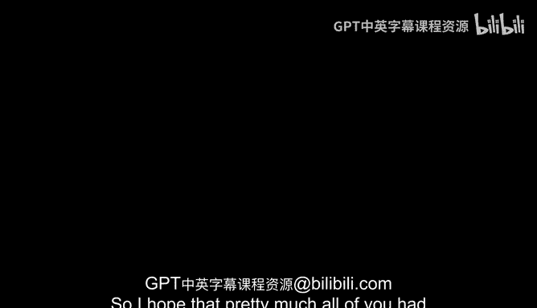
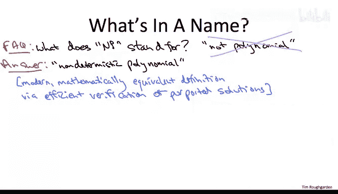

# 算法：19：P与NP问题 🧠

在本节课中，我们将学习计算机科学中一个核心且未解的问题：P与NP问题。我们将探讨P类与NP类问题的定义、它们之间的关系，以及为什么这个问题如此重要且难以解答。

---

## 概述 📋

P与NP问题是计算机科学和数学中最著名的开放问题之一。它探讨了“容易求解”的问题与“容易验证解”的问题之间的关系。本节课将解释P类和NP类的定义，讨论P是否等于NP的猜想，并探讨这一问题的深远意义。

---

## P类与NP类的定义 🔍

上一节我们概述了P与NP问题的背景，本节中我们来看看P类和NP类的具体定义。

P类问题指那些可以在多项式时间内解决的问题。用公式表示，若一个问题存在一个算法，其运行时间为**O(n^k)**，其中k为常数，则该问题属于P类。

NP类问题则具有以下性质：给定一个候选解，我们可以在多项式时间内验证该解是否正确。这意味着，虽然找到解可能很难，但验证解的正确性相对容易。

---

## P是否等于NP？ ❓

上一节我们介绍了P类和NP类的定义，本节中我们来看看关于P是否等于NP的猜想。

广泛认为P不等于NP。这意味着，能够高效验证解并不保证能够高效找到解。这一猜想最早由Edmonds在1965年提出，远早于NP和P这些术语的正式出现（1971年）。然而，我们必须强调，目前**没有证明**支持这一猜想。P与NP问题仍然是计算机科学中最重大的开放问题之一。

以下是支持P不等于NP的两个主要理由：

1.  **经验证据**：许多聪明的研究者长期致力于为NP完全问题寻找高效算法，但半个多世纪以来无人成功。
2.  **哲学思考**：P等于NP意味着“解决问题”和“验证解决方案”同样困难。这与我们的直觉相悖，例如，从头证明一个数学定理通常比审阅他人的证明要困难得多。

---

## 问题的难度与意义 🏆

上一节我们讨论了P不等于NP的猜想，本节中我们来看看这个问题的难度和重要性。

P与NP问题不仅是计算机科学的核心问题，也是整个数学领域的重大难题。2000年，克莱数学研究所将其列为七个“千禧年大奖难题”之一，解决任何一个问题可获得100万美元奖金。然而，这个问题的意义远超过奖金本身，它将深刻改变我们对计算本质的理解。

证明P不等于NP之所以极其困难，是因为多项式时间算法空间异常丰富且充满反直觉的可能性。例如，在矩阵乘法问题上，斯特拉森算法打破了“必须进行三次方运算”的直觉，展示了更高效的方法。这提醒我们，可能仍有未知的高效算法隐藏在P类问题的“生态系统”中。

---

## 术语“NP”的由来 📖

上一节我们探讨了问题的难度，本节中我们来看看术语“NP”本身的含义。

一个常见的误解是NP代表“非多项式”。实际上，NP代表“**非确定性多项式时间**”。这源于一个等价的、基于非确定性图灵机模型的NP定义。然而，对于算法设计者和程序员而言，从“高效验证解”的角度来理解NP更为直观和实用。

关于术语的选择，历史上曾有过有趣的讨论。在Cook和Karp的开创性工作后，学界意识到需要统一术语。Donald Knuth在1974年进行了一次投票，“NP完全性”最终获胜并被采用。一个未被采纳的有趣提议是“PET”问题，其含义可根据P与NP问题的最终答案而灵活变化（例如，“可能指数时间问题”或“先前指数时间问题”），但这已成为一个有趣的历史注脚。

---

## 总结 ✨

本节课中，我们一起学习了P与NP问题的核心内容。我们定义了P类（多项式时间可解）和NP类（多项式时间可验证）问题，讨论了P不等于NP的普遍猜想及其依据，并理解了这个问题在理论和实践上的极端重要性与难度。最后，我们还了解了“NP”这一术语的历史由来。掌握这些概念是理解计算复杂性理论的基础。