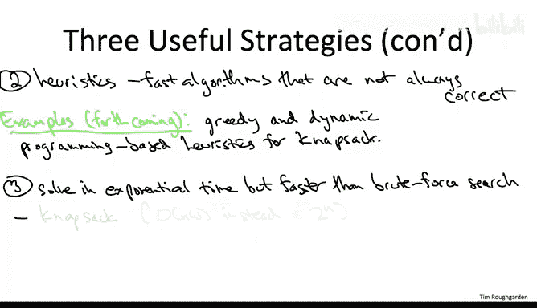

# 算法：20：NP完全问题的算法方法 🎯

在本节课中，我们将探讨面对NP完全问题时，如何运用不同的算法策略来应对。尽管NP完全问题在计算上被认为是困难的，但这并不意味着我们束手无策。我们将介绍三种核心策略，帮助你理解和处理这类问题。

---

## 从坏消息到好消息的过渡

上一节我们讨论了NP完全性这个“坏消息”，即世界上存在计算上难以处理的问题，而且它们相当普遍，你很可能在自己的项目中遇到。

好消息是，NP完全性绝非死刑判决。事实上，我们的算法工具箱已经足够丰富，可以提供多种不同的策略来应对NP完全问题。

假设你发现了一个计算问题，你的新创业公司的成功就取决于它。也许你已经花了几个星期尝试了所有方法：所有算法设计范式、所有数据结构、所有基本原语，但都没有成功。最终，你决定尝试证明这个问题是NP完全的，并且成功了。现在，你明白了为什么你几周的努力没有结果。但这并没有改变这个事实：这个问题决定了你项目的成功。你应该怎么办？

好消息是，NP完全性当然不是死刑判决。总有人在解决，或者至少近似解决NP完全问题。然而，知道你的问题是NP完全的，确实告诉了你应该设定怎样的期望。你不应该期望像处理其他计算问题（如排序或单源最短路径）那样，找到一个通用的、超快的算法。

除非你处理的是异常小或结构良好的输入，否则你将不得不付出相当大的努力来解决这个问题，并且可能做出一些妥协。

本课程的其余部分将致力于解决或近似解决NP完全问题的策略。在本视频的其余部分，我将为你介绍这些策略是什么，以及你可以期待什么。

---

## 策略一：关注可计算的特殊情况

与往常一样，我将专注于跨多个应用领域的通用策略。这些通用原则应该只是一个起点，你应该结合你在需要解决的具体问题中所拥有的领域专业知识来运用和扩展它们。

第一种策略是专注于与NP完全问题相关的、在计算上易于处理的特殊情况。你需要思考你的领域或你正在处理的数据集有什么特别之处，并尝试理解是否存在可以在你的算法中利用的特殊结构。

以下是几个我们已经在本课程中看到的例子：

*   **加权独立集问题**：在一般图中，加权独立集问题是NP完全的。但在图是路径的特殊情况下，我们看到了一个线性时间的动态规划算法可以精确解决该问题。事实上，可处理性的边界可以远远超出路径图。例如，对于树形图，你仍然可以高效地进行动态规划来计算加权独立集。你甚至可以为更广泛的图类（称为有界树宽图）获得计算高效的算法。
*   **背包问题**：我们的动态规划背包算法的运行时间是物品数量乘以背包容量`W`。由于指定容量`W`只需要`log W`位，我们不称之为多项式时间算法。但是，如果你只需要解决背包容量不太大的实例（例如，容量`W`是`O(n)`），那么我们的动态规划算法运行时间就是`O(n²)`，这确实是一个针对小容量背包特殊情况的多项式时间算法。

接下来，让我提几个我们将在后续视频中看到的例子：

*   **2-SAT问题**：2-SAT是一种约束满足问题。`2`表示每个约束只涉及一对变量的联合取值。一个典型的2-SAT约束会为两个变量指定三种允许的联合赋值和一种禁止的赋值。例如，对于变量`x3`和`x7`，允许同时为真、同时为假、`x3`为真`x7`为假，但禁止`x3`为假`x7`为真。3-SAT问题类似，但约束涉及三个变量的联合取值，并禁止八种可能性中的一种。3-SAT问题是经典的NP完全问题。但如果每个约束的大小只有两个（即2-SAT），那么问题就变成了多项式时间可解的。我们将讨论一种局部搜索算法来检查是否存在一个变量赋值能同时满足所有给定的约束。
*   **顶点覆盖问题**：这是一个图问题。顶点覆盖是独立集的补集。在独立集中，你不能从同一条边取两个顶点；而在顶点覆盖问题中，你必须从每条边中至少取一个顶点。你想要的是最小化顶点权重之和的顶点覆盖。同样，这在一般情况下是NP完全问题。但我们将专注于最优解很小的特殊情况，即存在一个小的顶点集合，使得每条边至少有一个端点在这个小集合中。我们将看到，对于这种特殊情况，使用一种智能的穷举搜索，我们实际上可以在多项式时间内解决问题。

让我重申，这些可处理的特殊情况主要是作为构建块，你可以在处理NP完全问题时，基于它们构建可能更复杂的方法。

为了让这一点更具体，让我设想一个场景。假设你的项目面对的不是2-SAT，而是一个3-SAT实例。你可能会感到沮丧，因为3-SAT是NP完全的。也许你有1000个变量，你当然不能对`2¹⁰⁰⁰`种可能的赋值方式进行暴力搜索。

但好消息是，由于你拥有领域专业知识，你理解这个问题的实例。你知道虽然有1000个变量，但真正关键的可能只有20个。你感觉所有的核心问题都归结于这20个核心变量如何赋值。

现在，也许你可以将一些暴力搜索与这些可处理的特殊情况结合起来。例如，你可以枚举这20个核心变量的所有`2²⁰`种赋值方式（大约一百万种，这并不算太糟）。然后，对于这一百万种情况中的每一种，你检查是否有可能将这20个变量的赋值扩展到其他980个变量，使得所有约束都得到满足。原始问题可解，当且仅当存在一种对这20个变量的赋值方式，可以成功扩展到其他980个变量。

因为这些都是关键变量，是所有问题的核心。也许一旦你为它们全部赋了0或1，剩余的SAT实例就变得易于处理了。例如，它可能就变成了一个简单的2-SAT实例，然后你就可以在多项式时间内解决它。这就给了你一种混合方法：顶层进行暴力搜索，对20个变量的每种赋值猜测使用可处理的特殊情况。这样你就有了一个可行的方案。

我希望这很清楚，这只是你可能将我们正在开发的各种构建块组合成更复杂方法来处理NP完全问题的一种可能方式。通常，处理NP完全问题需要相当复杂的方法，毕竟它们是NP完全的，你必须尊重这一点。

---

## 策略二：采用启发式算法

完成上述讨论后，让我提一下我们将在接下来的讲座中探讨的另外两种策略。

第二种策略在实践中非常常见，即求助于**启发式算法**，也就是不保证正确的算法。

到目前为止，我们在课程中还没有真正看到启发式算法的例子。那些参加过第一部分课程的同学，也许我们可以将Karger的随机最小割算法归类为启发式算法，因为它确实有一个很小的失败概率，可能找不到最小割。但在接下来的讲座中，我将重点介绍一些例子。

我将使用背包问题作为案例研究。我们将看到，我们的工具箱（包含各种算法设计范式）不仅对设计正确的算法有用，对设计启发式算法也有用。具体来说，我们将使用贪心算法设计范式为背包问题得到一个相当好的算法，并使用动态规划算法设计范式为背包问题得到一个优秀的启发式算法。

---

## 策略三：设计比暴力搜索更聪明的精确算法

最后的策略适用于你不愿意放松正确性要求，或者不愿意考虑启发式算法的情况。当然，对于一个NP完全问题，如果你总是要求正确，你就不期望它在多项式时间内运行。但仍然有机会拥有一些算法，虽然在最坏情况下是指数时间，但比朴素的暴力搜索更聪明。

事实上，我们已经看到了一个可以被解释为实现此策略的例子，那就是背包问题。在背包问题中，朴素的暴力搜索会遍历所有可能的物品子集，检查一个子集是否适合背包，如果适合，则记录其价值，然后返回具有最大价值的可行解。其时间与`2ⁿ`成正比，其中`n`是物品数量。

我们的动态规划算法的运行时间是`n × W`。当然，如果背包容量`W`非常大（例如它本身是`2ⁿ`），这并不比`2ⁿ`好。但正如我们所论证的，如果`W`较小，这个算法会更快。而且，正如你在第三次编程作业中学到的，有时即使`W`很大，动态规划也会大大优于暴力搜索。

我将再展示几个例子：
*   **旅行商问题**：朴素的暴力搜索大约需要`n!`的时间，其中`n`是顶点数。我们将给出一种基于动态规划的替代解决方案，其运行时间仅为`2ⁿ`，这比`n!`好得多。
*   **顶点覆盖问题**：我们将在后续视频中详细讨论这个例子。考虑问题的这个版本：检查是否可能有一个只使用`k`个顶点的顶点覆盖。朴素的暴力搜索运行时间为`nᵏ`，即使`k`很小，这也变得荒谬。但我们将展示一个更聪明的算法，虽然仍然是`k`的指数时间，但其运行时间仅为`2ᵏ`乘以图的大小。

---

## 总结

在本节课中，我们一起学习了应对NP完全问题的三种主要算法策略：
1.  **关注可计算的特殊情况**：识别并利用问题实例中的特殊结构，将其转化为已知的可解子问题。
2.  **采用启发式算法**：在可接受近似解或概率性正确的情况下，使用高效但不保证绝对正确的算法。
3.  **设计更聪明的精确算法**：即使问题是指数级的，也通过动态规划等技巧设计比朴素暴力搜索更高效的精确算法。

理解这些策略将帮助你在面对计算难题时，能够系统地思考并找到可行的解决方案。记住，NP完全性是一个分类，而不是一个障碍；它指导我们调整期望并选择合适的方法。