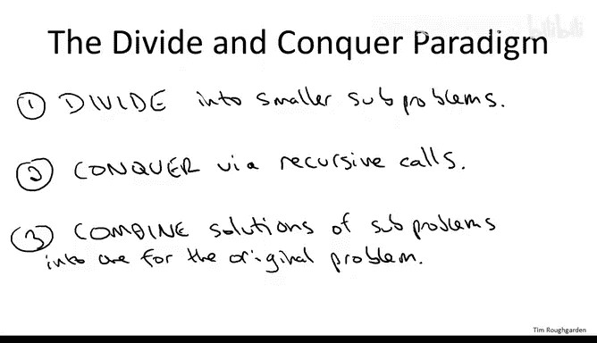
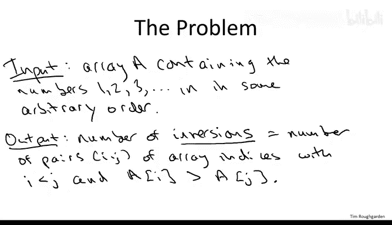
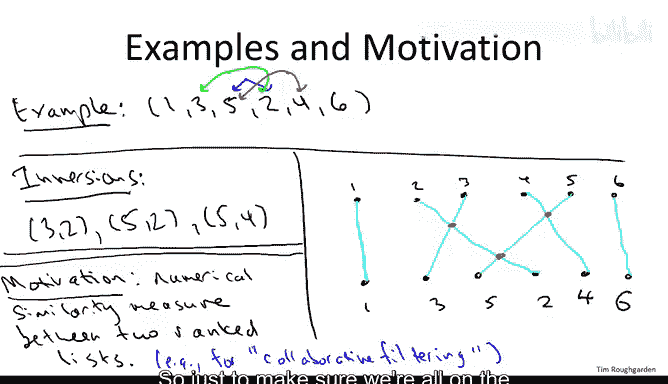
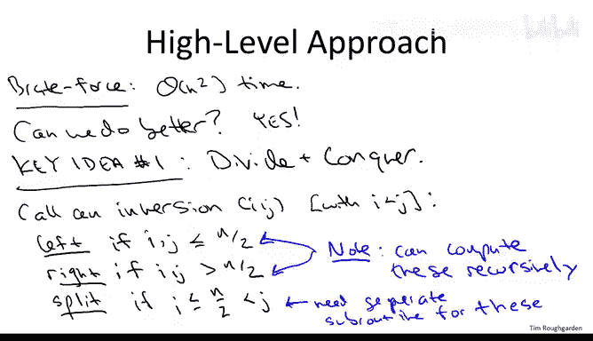
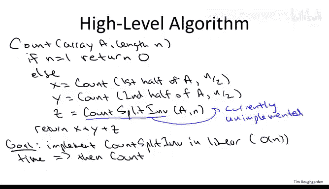

# 算法课程：14：计数逆序对的O(n log n)算法 I

## 概述

在本节课中，我们将学习如何应用分治算法设计范式来解决一个具体问题：计算数组中逆序对的数量。我们将从回顾分治范式的一般步骤开始，然后定义逆序对问题，并探讨其应用场景。最后，我们将构思一个基于分治的高效算法框架，其目标时间复杂度为 **O(n log n)**。

---

## 分治范式回顾


上一节我们介绍了分治算法的基本思想。现在，我们来具体回顾其三个核心步骤。

分治范式包含以下三个概念性步骤：
1.  **分解**：将原问题划分为更小的子问题。有时这只是概念上的划分，有时则需要在代码中实际复制输入数据（例如创建新数组传递给递归调用）。
2.  **解决**：递归地解决子问题。例如，在归并排序中，我们将数组分成两半，然后递归地对每一半进行排序。
3.  **合并**：将子问题的解组合成原问题的解。这通常是算法中最需要巧思的部分。例如，在归并排序中，递归调用后，我们需要将两个已排序的半边数组合并成一个完整的有序数组。

---

## 逆序对问题定义



在深入算法细节之前，我们首先需要明确要解决的问题是什么。

我们被给定一个长度为 **n** 的数组 **A** 作为输入。为简化问题，我们假设数组包含数字 **1** 到 **n** 的某种排列。问题的目标是计算该数组的**逆序对**数量。

一个**逆序对**由一对数组索引 **(i, j)** 定义，其中 **i < j**，但数组元素满足 **A[i] > A[j]**。也就是说，位置靠前的元素反而比位置靠后的元素大。

*   如果数组是已排序的（即 **1, 2, 3, ..., n**），则逆序对数量为 **0**。
*   反之，任何其他排列都会产生非零数量的逆序对。



### 示例

考虑一个包含6个元素的数组：**A = [1, 3, 5, 2, 4, 6]**。

以下是该数组中的所有逆序对：
*   **(3, 2)**：对应索引 (1, 3)，因为 A[1]=3 > A[3]=2。
*   **(5, 2)**：对应索引 (2, 3)，因为 A[2]=5 > A[3]=2。
*   **(5, 4)**：对应索引 (2, 4)，因为 A[2]=5 > A[4]=4。

因此，该数组共有 **3** 个逆序对。

---

## 问题应用与最大逆序对数量

了解为什么需要解决这个问题以及逆序对数量的边界，有助于我们理解算法的设计目标。

### 应用场景：衡量列表相似度

逆序对计数的一个主要应用是量化两个排序列表之间的相似度（或不相似度）。例如，比较两个人对10部电影的排名。
1.  根据你的喜好对电影排序（从最喜欢到最不喜欢）。
2.  对于你列表中的每一部电影，记录你朋友给它的排名。
3.  将这些排名值组成一个数组。
4.  计算该数组的逆序对数量。

如果你们的排名完全一致，逆序对数为 **0**。逆序对越多，表明你们的偏好差异越大。这种技术在**协同过滤**（例如电商推荐系统）中非常有用，通过寻找偏好相似的用户来推荐商品。

### 最大逆序对数量

对于一个长度为 **n** 的数组，逆序对数量的最大值是多少？

答案是：当数组完全逆序时（即 **n, n-1, ..., 2, 1**），每一对 **(i, j)**（其中 i < j）都是逆序的。因此，最大逆序对数量等于所有可能的索引对数量，即组合数 **C(n, 2)**。

用公式表示为：
**最大逆序对数 = n * (n - 1) / 2**

对于 n=6，最大值为 **15**。



---

## 算法设计：从暴力法到分治法

明确了问题后，我们开始设计算法。首先看一个简单但低效的方法。

### 暴力算法

最直接的方法是使用双重循环检查每一对索引 **(i, j)**（其中 i < j），判断 **A[i] > A[j]** 是否成立。若是，则计数器加一。

```python
# 伪代码示例：暴力法
count = 0
for i from 0 to n-2:
    for j from i+1 to n-1:
        if A[i] > A[j]:
            count += 1
return count
```

该算法的时间复杂度为 **O(n²)**，因为需要检查 **C(n, 2)** 对元素。对于大规模数据，这显然不够高效。

### 分治算法框架

我们的目标是利用分治思想，设计一个 **O(n log n)** 的算法，灵感来源于归并排序。

首先，我们将数组的逆序对分为三类。假设数组长度为 **n**，中点为 **mid = n/2**：
1.  **左逆序对**：两个索引 **i** 和 **j** 都位于左半部分（即 **i, j ≤ mid**）。
2.  **右逆序对**：两个索引 **i** 和 **j** 都位于右半部分（即 **i, j > mid**）。
3.  **分裂逆序对**：较小的索引 **i** 在左半部分（**i ≤ mid**），而较大的索引 **j** 在右半部分（**j > mid**）。

分治算法的策略如下：
*   **递归解决**：通过递归调用，分别计算左半部分的左逆序对和右半部分的右逆序对。
*   **合并解决**：设计一个子程序，在线性时间 **O(n)** 内计算跨越左右两半的**分裂逆序对**。



如果这三个步骤都能正确完成，那么总的逆序对数就是这三部分之和。

算法的高层框架如下：
1.  **基准情况**：如果数组只有一个元素，逆序对数为 **0**。
2.  **分解与递归**：
    *   `leftCount = 递归计算左半部分的逆序对`
    *   `rightCount = 递归计算右半部分的逆序对`
3.  **合并**：
    *   `splitCount = 计算分裂逆序对（关键步骤）`
4.  **返回结果**：`return leftCount + rightCount + splitCount`

如果能实现一个运行时间为 **O(n)** 的`计算分裂逆序对`子程序，那么根据与归并排序相同的递归树分析（或主定理），整个算法的时间复杂度将为 **O(n log n)**。

---

## 挑战与下节预告

我们设定了一个颇具雄心的目标：在线性时间内计算出可能多达 **O(n²)** 个的分裂逆序对。这能做到吗？

答案是肯定的。关键在于，我们不能逐一检查所有可能的左右元素对（那样是 O(n²)）。我们需要一个更聪明的方法，在合并两个已排序子数组的过程中，“顺便”统计出分裂逆序对的数量。这正是我们下一节要详细讲解的核心内容。

---



## 总结

本节课我们一起学习了：
1.  **分治范式**的回顾：分解、解决、合并。
2.  **逆序对问题**的正式定义及其应用场景，如衡量排名列表的相似度。
3.  逆序对数量的**最大值**为 **n*(n-1)/2**。
4.  设计了基于分治的算法**高层框架**，通过递归计算左、右逆序对，并留下在线性时间内计算**分裂逆序对**的关键子任务待实现。
5.  确立了算法的**目标时间复杂度**为 **O(n log n)**。

在下一节中，我们将深入探讨如何高效实现“计算分裂逆序对”这一核心步骤，完成整个算法。