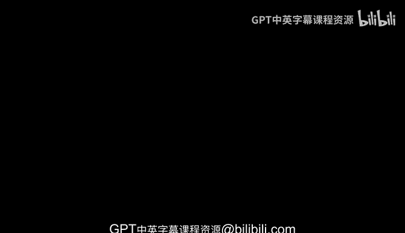
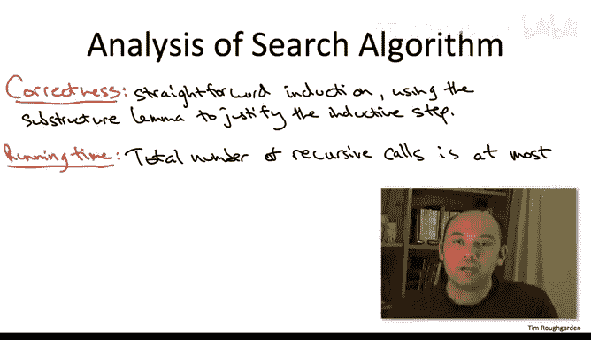

# 算法：23：顶点覆盖的智能搜索（二）🔍

在本节课中，我们将学习如何利用顶点覆盖问题的子结构性质，设计一个比朴素暴力搜索更高效的递归搜索算法。我们将详细解析算法的步骤、正确性证明以及时间复杂度分析。

---

上一节我们介绍了顶点覆盖问题的子结构引理，本节中我们来看看如何基于该引理自然地导出一个递归搜索算法。

该算法是递归的。我们无需详细说明基础情况，即当图最多只有一个顶点，或参数k等于0或1时的处理。我们假设图至少有两个顶点，且k至少为2。

这个算法可能会让你想起我们讨论过的某些动态规划算法的递归实现。同样地，那些算法在没有记忆化的情况下会呈现指数级运行时间。我们将在这里看到一个指数级的运行时间。对于我们所有的动态规划算法，我们能够巧妙地将子问题从小到大组织，从而避免重复解决相同的子问题，最终得到多项式时间复杂度的界限。而在这里，我们将受限于指数级的时间复杂度界限。考虑到这是一个NP完全问题，这并不奇怪。但如果你想深入理解，可以尝试对这个递归搜索算法进行改进，尝试构思一个多项式时间版本，尝试提出一个可以系统求解的、按从小到大顺序排列的小型子问题集合。这些尝试最终必然会受阻，但你会更好地理解这个递归解决方案的非平凡之处。

以下是算法的第一步：

1.  我们任意选择一条边 `(u, v)`。

为什么关注一条边是有用的？根据顶点覆盖的定义，它必须包含 `u` 或 `v`。这就是我们的初始线索。

我们将乐观地进行。我们正在寻找一个大小为 `k` 的顶点覆盖。因此，我们假设存在这样一个解。子结构引理告诉我们什么？它指出，如果存在这样的解，那么必然地，要么 `G\{u}`，要么 `G\{v}`，或者两者本身，拥有大小仅为 `k-1` 的小型顶点覆盖。此外，将这样的顶点覆盖扩展为 `G` 的小型覆盖很简单，只需添加缺失的顶点即可。

因此，我们首先采纳一个工作假设：`G\{u}` 拥有一个大小仅为 `k-1` 的小型顶点覆盖。让我们递归地尝试找到它。如果我们的递归搜索返回一个解，即 `G\{u}` 的一个大小为 `k-1` 的顶点覆盖，那么我们就成功了。我们只需将其与顶点 `u` 合并，就得到了原始图 `G` 的大小为 `k` 的顶点覆盖。

如果那个递归调用未能找到小型顶点覆盖，我们会说，好吧，那么 `v` 必定是获得小型顶点覆盖的关键。因此，我们做完全相同的事情：递归地在 `G\{v}` 中搜索大小为 `k-1` 的顶点覆盖。

如果第二个递归调用也未能找到大小仅为 `k-1` 的小型顶点覆盖，那么根据子结构引理的逆否命题，我们知道原始图 `G` 不可能拥有大小为 `k` 的顶点覆盖。如果它有，子结构引理告诉我们两个递归调用中必有一个会成功；既然两者都失败了，我们就能正确地得出结论：原始图没有小型顶点覆盖。

正确性分析是直截了当的。形式上，你可以通过归纳法进行。归纳假设将保证两个递归调用的正确性。因此，在较小的子问题 `G\{u}` 和 `G\{v}` 上，递归调用能正确检测是否存在大小为 `k-1` 的顶点覆盖。子结构引理保证我们能正确地将两个递归调用的结果编译成我们算法的输出。因此，如果两个递归调用中有一个成功，我们就成功了，只需按要求输出大小为 `k` 的顶点覆盖。这是关键部分：如果两个递归调用都失败，那么根据子结构引理，我们正确地报告失败。我们知道原始图 `G` 中不存在大小为 `k` 或更小的顶点覆盖。

---

接下来，让我们通过一个特设分析来评估运行时间。让我们考虑在整个算法执行过程中可能产生的递归调用数量，或者等价地，算法生成的递归树中的节点数量。然后，我们将得出在一个给定的递归调用中（不包括其递归子调用所做的工作）所做工作的上限。

现在，是精彩的部分，这确实是参数 `k` 值较小这一规则发挥作用的地方。我注意到，每次递归时，我们将要寻找的顶点覆盖的目标大小减1。记住，如果我们的输入参数是 `k`，那么我们的每个递归调用都涉及参数值 `k-1`。

这限制了递归深度，或者说该算法生成的递归树的深度，最多为 `k`。初始时，你从 `k` 开始；每次递归，你将其减1；当 `k` 大约为1或0时，你将到达基础情况。

将这两个观察结果结合起来：分支因子以2为界，递归深度以 `k` 为界。在整个算法生命周期内，递归调用的总数将不超过 `2^k`。

此外，如果你检查伪代码，你会发现除了递归子调用外，并没有太多其他操作。因此，即使是一个非常草率的实现，你需要从输入图 `G` 构造出 `G\{u}` 和 `G\{v}`，即使你粗糙地完成这项工作，你也会得到一个线性时间界限：每个递归调用（不包括后续递归子调用所做的工作）的工作量为 `O(m)`。

这意味着该算法所做总工作量的一个上限是：递归调用数量 `2^k` 乘以每次调用的工作量 `m`，即 `2^k * m`。

现在，你当然会注意到这个运行时间在 `k` 上仍然是指数级的。但除非我们打算证明 `P = NP`，否则它必须是指数级的。别忘了顶点覆盖问题是NP完全的。

那么我们完成了什么？之前我们有一个通过暴力搜索的平凡指数时间算法。为什么我们要经历这些步骤来提出第二个具有这种指数运行时间界限的算法呢？嗯，这是因为这个运行时间界限在性质上优于我们之前朴素的暴力搜索。

以下是两种理解为什么这个运行时间界限在性质上更优越的方式：

首先，让我们仅从数学角度审视这个运行时间，并问：在仍然拥有多项式时间算法的情况下，`k` 最大可以取多大？回想一下我们朴素的暴力搜索算法，你只需尝试每个包含 `k` 个顶点的子集，时间复杂度为 `θ(n^k)`。因此，如果 `k` 是常数，它是多项式时间；如果 `k` 大于常数，它就是超多项式时间。

对于这个运行时间界限 `2^k * m`，我们可以让 `k` 增长到与图大小的对数一样大，并且仍然拥有一个多项式时间算法。

现在，让我们从这些数学界限过渡到思考实际实现这些算法并在实际数据上运行它们。

对于朴素的暴力搜索，你有 `n^k` 的运行时间。即使对于一个相对较小的图，比如说 `n` 大约是50或100，除了 `k` 值极小（3、4，也许5，如果你幸运的话）的情况，你将无法运行这个朴素的暴力搜索算法。因此，朴素的暴力搜索适用范围非常有限。

相比之下，我们更智能的搜索算法可以容纳明显更大的 `k` 值范围。记住，这里的运行时间是 `2^k` 乘以图的大小。因此，即使对于 `k` 值高达20的情况，对于许多感兴趣的图网络，你也将能够在合理的时间内实现并运行这个算法。

---

本节课中，我们一起学习了如何基于子结构引理设计一个针对顶点覆盖问题的递归搜索算法。我们分析了算法的正确性，并推导出其时间复杂度为 `O(2^k * m)`。虽然这仍然是指数级的，但相比朴素的 `O(n^k)` 暴力搜索，它在 `k` 值较大时具有显著的实践优势，能够处理更大范围的参数 `k`。这体现了针对NP难问题设计参数化算法时，利用问题结构特性优化搜索策略的重要性。