# 算法：24：旅行商问题（TSP）的动态规划解法 🧳

在本节课中，我们将重新审视著名的旅行商问题（TSP）。我们之前讨论TSP时，是在NP完全性的背景下，结论是悲观的。然而，本节将带来好消息：我们可以设计出比朴素暴力搜索更高效的算法。这将是动态规划算法设计范式的又一个巧妙应用。

## 问题回顾与挑战

首先，让我们简要回顾一下旅行商问题。输入非常简单：一个**完全无向图**，其中每条边都有一个**非负成本**。算法的任务是找出访问每个顶点恰好一次的最小成本方式，即输出一个顶点排列（一个“环游”），使得对应n条边的成本总和最小。

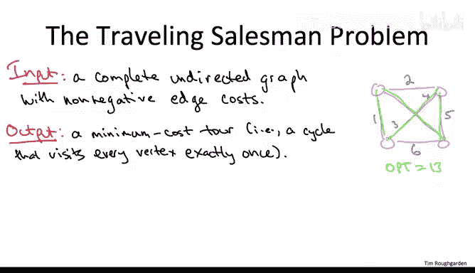

例如，在一个四顶点的网络中，最小成本环游的总成本可能是13。

当然，你可以使用暴力搜索解决这个问题。暴力搜索的运行时间大约是 **O(n!)**，这只能解决大约12到14个顶点的问题。

在本节及后续内容中，我们将开发一个解决TSP的动态规划算法。当然，TSP是NP完全问题，我们不期望有多项式时间算法。但这个动态规划算法将比暴力搜索快得多，其运行时间为 **O(n² * 2ⁿ)**。虽然2ⁿ是指数级的，但比n!要好得多。实际上，你可以用这个算法解决n大约为30的问题。

尽管与我们可以排序的数组大小或计算强连通分量/最短路径的图规模相比，这仍然很小，但对于NP完全问题来说，即使解决中等规模的问题也需要付出巨大努力。这个算法证明了，即使对于NP完全问题，也有机会改进暴力搜索。

## 寻找最优子结构

我们计划采用动态规划方法解决TSP。这意味着我们需要寻找**最优子结构**：一种方式，使得最优解必然由更小子问题的最优解以某种简单方式扩展而成。那么，对于TSP，这可能是什么样子呢？

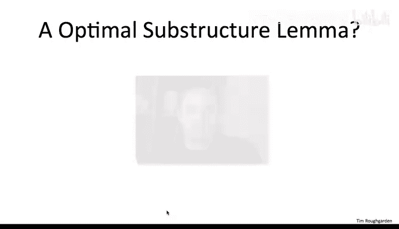

在我们使用动态规划解决的所有问题中，与TSP最相似的是**单源最短路径问题**。我们可以将环游视为一条从某个顶点（比如顶点1）出发，最终回到自身的路径，当然，约束条件是它必须在途中恰好访问每个其他顶点一次。我们希望最小化这条从1回到自身的路径的总成本。

这听起来很像我们希望最小化从某个源点到某个目的地的路径长度。你可能会想起，我们解决单源最短路径问题的动态规划算法是**贝尔曼-福特算法**。

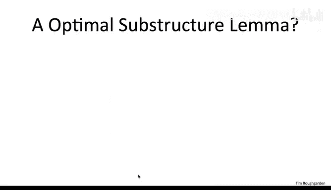

## 初步尝试：基于边预算的子问题

那么，贝尔曼-福特算法中的子问题是什么样子的呢？其巧妙之处在于使用**边预算**来衡量子问题规模。贝尔曼-福特中的一个典型子问题是：计算从给定源点到某个目的地顶点V、使用最多I条边的最短路径长度。

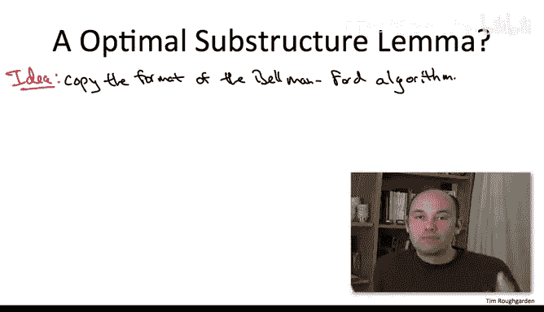

类比于此，我们可以考虑这样的子问题：我们希望找到从起始节点（顶点1）到某个其他顶点J、使用最多I条边的最短路径。

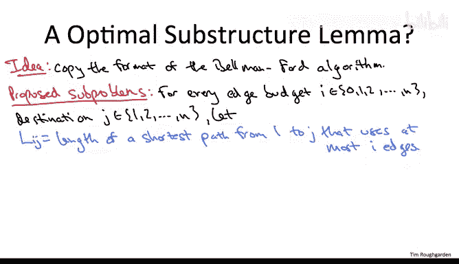

具体来说，让我们如下定义子问题：对于给定的选择I（代表允许使用的边数）和给定的目的地J（假设顶点编号为1到N），我们用 **L(I, J)** 表示从起始顶点1到目的地J、使用最多I条边的最短路径长度。

如果我们尝试使用这些子问题来建立动态规划算法，你认为我们能得到TSP的多项式时间算法吗？

**答案是否定的**。这个提议的子问题集合不会产生多项式时间算法。原因不是子问题数量太多（只有O(n²)个），也不是无法从较小的子问题正确计算较大子问题的值（这与贝尔曼-福特完全相同）。问题在于**语义不正确**：通过解决这些子问题，我们实际上无法得到原始旅行商问题实例的最优解。

我们希望的情况是，在解决了所有子问题之后，原始问题的答案就存在于最大的子问题中。这里最大的子问题对应于I = n，即允许在路径中使用最多n条边。但这些子问题只指定了允许使用的边数上限I，并没有强制你必须使用全部的I条边。这意味着当我们查看这些最大的子问题时，最短路径可能使用多达n条边，但通常不会。它们会使用远少于n条边，跳过许多顶点，而这并不是一个旅行商环游。旅行商必须恰好访问每个顶点一次，这些子问题没有强制执行这一点。

## 第二次尝试：强制使用恰好I条边

这个问题似乎不难修复。我们只需在每个子问题中坚持，最短路径必须使用恰好I条边，而不是最多I条边。

然而，这个子问题集合虽然不像前一个那样完全错误，但答案仍然是**否定的**。我们仍然无法得到多项式时间算法。子问题数量没有改变，仍然是二次的，并且你仍然可以基于较小子问题的解来高效求解较大的子问题。

问题在于**语义仍然不正确**。仅仅解决了所有这些子问题，并不意味着你能从中提取出最小成本旅行商环游的成本。

简要来说，问题在于我们没有强制执行**不能多次访问同一个顶点**的约束。我们希望的是，当我们查看最大的子问题（I = n，目的地J = 1）时，那条从1回到自身、恰好有n条边的最短路径就是一个环游，因此就是最小成本旅行商环游。但情况未必如此。仅仅因为这条路径有n条边，并且始于1终于1，并不意味着它是一个环游。例如，它可能两次访问顶点7和23，结果却从未访问顶点14或29。因此，当I = n且J = 1时，最大子问题计算出的数值可能远小于真正的最小成本旅行商环游的答案。

## 第三次尝试：禁止重复访问顶点

一个好的算法设计师必须具备韧性。让我们认识到上一个提议的缺陷：我们没有强制执行不能重复访问顶点的约束。让我们再次改变子问题的定义，明确禁止重复访问顶点。

具体来说，我们以与之前完全相同的方式索引子问题：每个预算I和每个目的地J对应一个子问题。对于给定的I和J，子问题的值现在定义为：从1开始、结束于J、使用恰好I条边、且**不允许重复访问顶点**的最短路径长度。唯一的例外是，如果J等于1，那么你当然可以在开头和结尾都有1，但对于最短路径中的内部顶点，我们不允许重复。

那么，你认为这个改进后的子问题集合能让我们得到旅行商问题的多项式时间算法吗？

这个问题的答案比前几个更微妙。正确答案从C切换到了B。子问题数量仍然是二次的，我们仍然不期望多项式时间算法，但现在，有了这个不同的子问题定义，它们确实**捕捉到了TSP的本质**。具体来说，看看最大的子问题：取I = n，J = 1。这个子问题的职责是计算从1到1、恰好有n条边且内部顶点不重复的最短路径。这正是我们最初的问题，正是TSP。

**问题在于，你无法基于较小子问题的解来高效求解较大的子问题**。较小的子问题对于解决较大的子问题并不是很有用，原因有些微妙。

## 递归关系的困境与启示

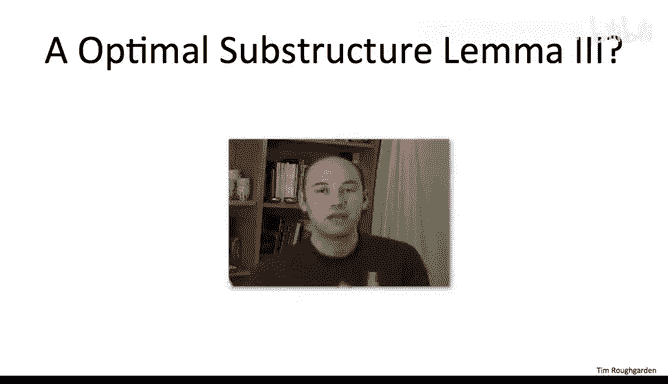

我们希望像之前所有的动态规划算法一样，可以制定一个递归关系，告诉你如何基于较小子问题的解来填充（求解）较大的子问题。对于这些子问题，甚至有一个自然的猜测，即递归关系可能是什么样。

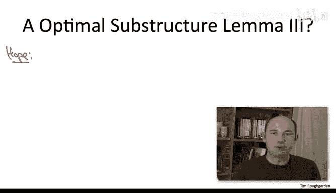

递归关系通常源于对最优解必须是什么样子的思考实验。因此，你会想专注于一个特定的子问题：一个给定的目的地J和一个给定的边预算I。你会说，让我们思考一个最优解。那是什么？那是一条路径。它始于1，终于J，恰好有I条边，没有重复顶点，并且在所有这样的路径中，它具有最小长度。

很自然地，我们可以类比贝尔曼-福特算法说：如果一个小小的边界条件能告诉我这条从1到J的最短路径上的倒数第二个顶点K是什么，那不是很酷吗？

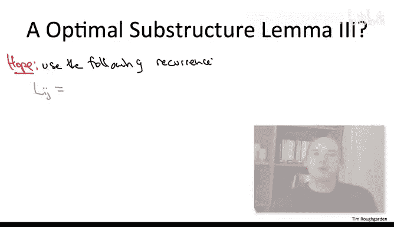

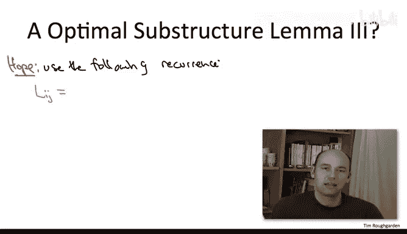

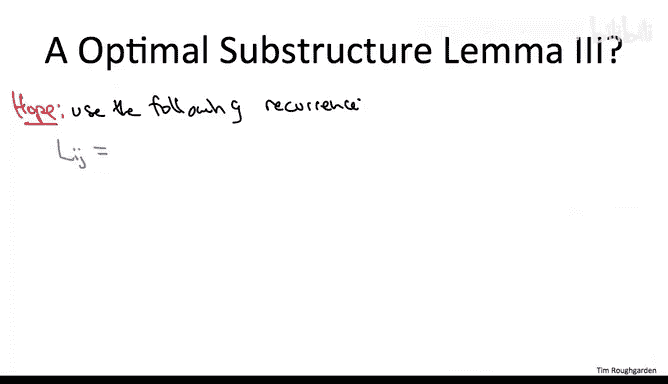

如果我知道最短路径上的倒数第二个顶点是K，那么这条路径的长度当然就是一条从1到K、使用恰好I-1条边且无重复顶点的最优路径的长度，再加上最后一段从K到J的跳跃。

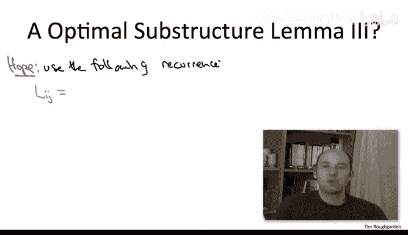

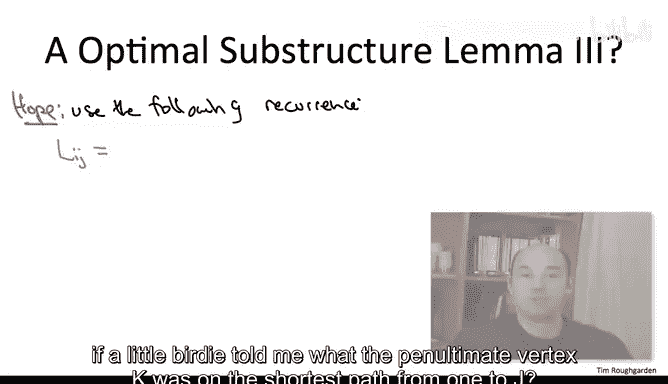

当然，你不知道倒数第二个顶点K是什么，但在动态规划中，这没什么大不了的，我们只需尝试所有的可能性。

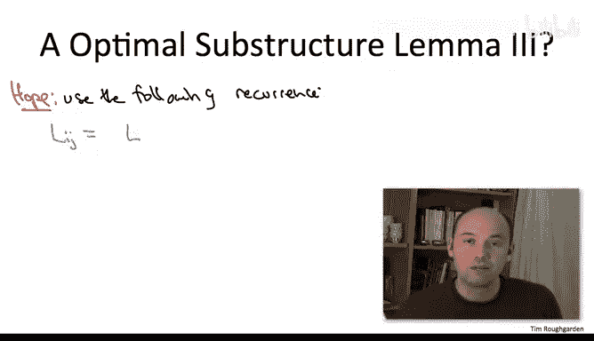

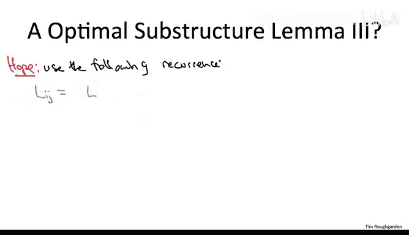

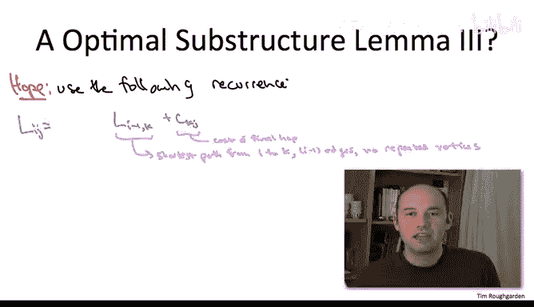

我们可以将这种暴力搜索编码为一个最小值计算，遍历所有合理的K选择。显然，K不应等于J，它应该是J之前的某个其他顶点。忽略一些基本情况，我们也排除K等于1（起始顶点）的情况。从图示上看，我们设想的是取一条从1到K的最短路径（这可以在某个较小的子问题中预先计算），然后将最后一段从K到J的跳跃拼接上去。

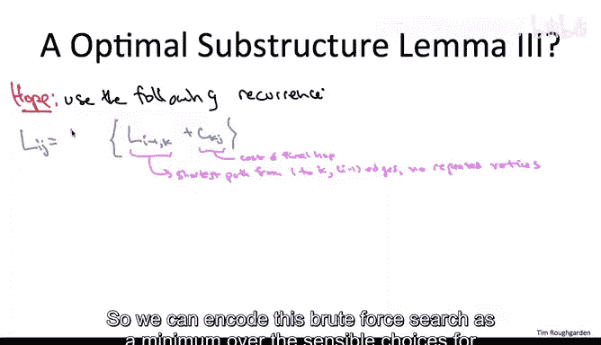

这听起来很不错，对吧？这听起来不就像是可能为TSP的多项式时间算法提供了关键要素吗？

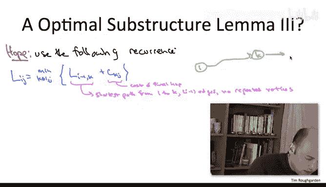

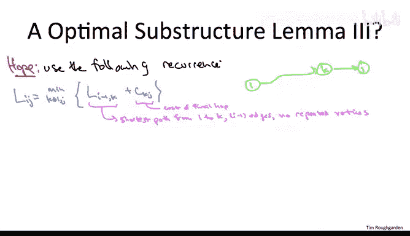

**问题在于**：我们已经定义了子问题，禁止重复访问顶点。因此，当我们计算一个子问题时，最好确保我们尊重“不允许重复访问”的约束。如果我们设想将一条从1到K、无重复的最短路径与最后一段K到J的跳跃拼接起来，这可能会导致重复访问J。特别是，我们无从得知那条从1到K、使用恰好I-1条边且无重复顶点的最短路径是否可能经过J。如果它经过了J，那么拼接最后一段KJ就会导致一个循环，即第二次访问J。

这个缺陷意味着提议的递归关系是不正确的。递归关系计算出的值，在一般情况下，小于实际的、尊重“无重复访问”约束的、从1到J使用恰好I条边的最短路径长度。实际长度可能比这个递归关系计算出的值大。

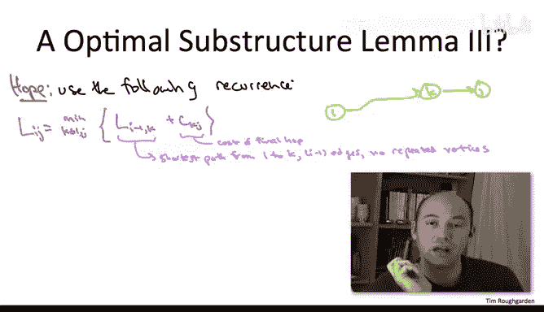

故事的寓意是：旅行商问题中“每个顶点恰好访问一次”的约束是一个相当棘手的约束，我们需要付出相当大的努力来确保它得到满足。

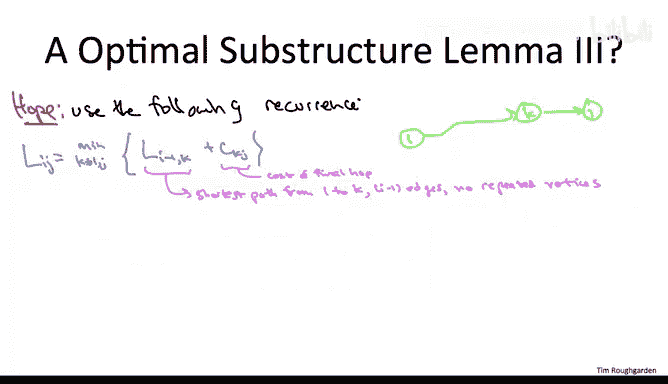

我们将要使用的解决方案，在某种意义上，是这里递归关系的逻辑下一步。我们需要能够知道关于子问题的更多信息，而不仅仅是它们在哪里结束。我们实际上需要知道用于从1旅行到K的路径上顶点的身份。我们需要知道顶点V是否在那条路径上。因此，我们将查看一个**大得多的子问题集合**，在那里我们不仅记住目的地，还记住所有中间站点。这个想法将转化为一个动态规划算法（当然不是多项式时间的）。具体细节即将揭晓。

## 总结

本节课中，我们一起学习了如何为NP完全的旅行商问题设计动态规划算法。我们首先回顾了问题定义与暴力搜索的局限性。接着，我们尝试通过类比单源最短路径问题来寻找最优子结构，经历了三次定义子问题的尝试：
1.  **基于边预算上限**：无法保证访问所有顶点。
2.  **强制使用恰好I条边**：仍无法避免顶点重复访问。
3.  **禁止重复访问顶点**：子问题语义正确，但无法建立有效的递归关系，因为拼接路径时可能引入重复顶点。

最终我们发现，关键障碍在于“每个顶点恰好访问一次”的约束难以在简单的递归中维护。这引导我们得出核心洞见：为了处理这个约束，子问题必须**记忆更多信息**——不仅仅是路径的终点和长度，还需要记住**已经访问过的顶点集合**。这为下一节中最终的高效（虽仍是指数级）动态规划算法奠定了基础。