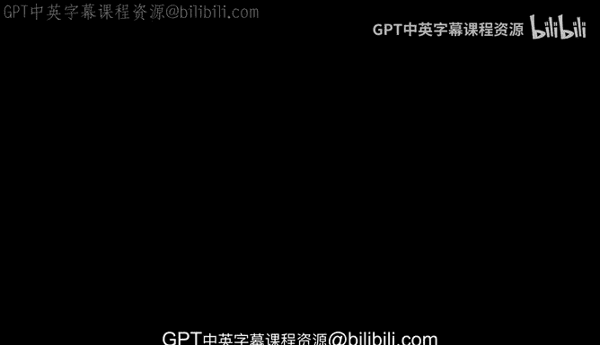
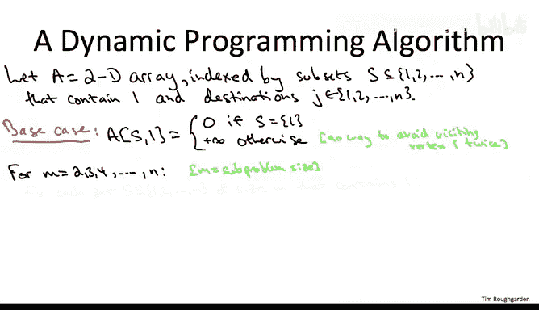

# 算法：25：TSP的动态规划算法 🧳



在本节课中，我们将学习如何为旅行商问题设计一个比暴力搜索更快的动态规划算法。上一节我们介绍了TSP问题的挑战性，本节中我们来看看如何运用动态规划的标准步骤来解决它。

## 概述

旅行商问题要求找到一条访问所有城市恰好一次并返回起点的最短路径。由于这是一个NP完全问题，直接的暴力搜索（时间复杂度为O(n!)）在n较大时不可行。我们将定义一个基于子集的动态规划状态，将时间复杂度降低到O(n² * 2ⁿ)。

## 子问题定义

在单源最短路径问题中，子问题通常只需知道路径的终点和长度。但对于TSP，我们必须确保路径不重复访问顶点。因此，子问题需要记住路径访问过的所有顶点。

我们定义子问题 **A[S, j]** 如下：
*   **S**：一个顶点集合，必须包含起点1和终点j。
*   **j**：路径的终点。
*   **A[S, j]** 的值：从顶点1出发，**恰好访问集合S中所有顶点一次**，最终到达顶点j的最短路径长度。

这个定义的关键在于，它记录了访问了哪些顶点，但**没有记录访问这些顶点的顺序**。如果记录顺序，子问题数量将是阶乘级(O(n!))。而只记录子集，则将其减少到指数级(O(2ⁿ))，这正是算法优于暴力搜索的来源。

## 最优子结构与递推关系

与贝尔曼-福特算法类似，我们通过关注路径的“最后一跳”来建立最优子结构。

对于一个给定的子问题A[S, j]，假设其最优路径P的最后一跳是从某个顶点k到j。那么，路径P的前半部分P‘一定是从1到k，并且恰好访问了集合 **S - {j}** 中所有顶点一次的最短路径。

根据最优子结构性质，A[S, j]可以通过检查所有可能的“倒数第二个顶点”k来递归求解。

以下是递推关系：

**A[S, j] = min { A[S - {j}, k] + C[k][j] }**
**其中 k ∈ S 且 k ≠ j**

**公式解释**：
*   `A[S - {j}, k]`：从1到k，访问除j外S中所有顶点的最短路径长度。
*   `C[k][j]`：从顶点k到顶点j的直接距离（成本）。
*   `min`：对所有可能的k取最小值。

这个递推关系确保，在求解规模为|S|的子问题时，我们只需要规模更小（|S|-1）的子问题的解。



## 算法伪代码

以下是动态规划算法的实现步骤：

首先，我们需要初始化基础情况。

**基础情况**：
当集合S只包含起点1，且终点j=1时，路径长度为0。其他包含额外顶点且j=1的情况不可行，设为无穷大。

```
// 初始化
for 所有包含顶点1的集合S:
    for 每个顶点j:
        if S == {1} 且 j == 1:
            A[S][j] = 0
        else:
            A[S][j] = INFINITY
```

接下来，我们系统地求解所有子问题。外层循环按照子问题规模（即集合S的大小）从小到大进行。

```
// 动态规划主循环
for m = 2 to n: // m是子问题规模（S的大小）
    for 每个大小为m且包含顶点1的集合S:
        for 每个属于S且不等于1的顶点j:
            // 应用递推关系
            A[S][j] = INFINITY
            for 每个属于S且不等于j的顶点k:
                candidate = A[S - {j}][k] + C[k][j]
                A[S][j] = min(A[S][j], candidate)
```

在求解完所有子问题后，我们还需要最后一步来得到完整的TSP环游解。最大的子问题A[V, j]给出了从1出发，访问所有顶点后到达j的最短路径。要形成环游，我们还需要从j返回起点1。

**计算最终答案**：
```
min_tour_cost = INFINITY
for j = 2 to n:
    candidate = A[V][j] + C[j][1] // V是所有顶点的集合
    min_tour_cost = min(min_tour_cost, candidate)
return min_tour_cost
```

## 算法分析

*   **正确性**：基于最优子结构引理和递推关系的正确性，通过归纳法可证明算法的正确性。
*   **时间复杂度**：
    *   子问题数量：约有 2ⁿ 个集合S，每个集合对应n个可能的终点j，故子问题总数约为 **n * 2ⁿ**。
    *   每个子问题的计算：需要遍历S中可能的顶点k（最多n个），故每个子问题计算时间为O(n)。
    *   总时间复杂度：**O(n² * 2ⁿ)**。
*   **空间复杂度**：需要存储所有子问题的解，为 **O(n * 2ⁿ)**。

## 总结

本节课中我们一起学习了如何为NP完全的旅行商问题设计动态规划算法。我们定义了基于顶点子集的子问题状态，建立了最优子结构并推导出递推关系，最终实现了时间复杂度为O(n² * 2ⁿ)的算法。虽然这仍然是指数时间，但相比O(n!)的暴力搜索已是巨大改进，展示了即使对于难解问题，通过巧妙的算法设计也能获得显著的性能提升。