# 斯坦福大学《算法（分治／排序／搜索／随机算法、图搜索／最短路径／数据结构、贪心算法／最小生成树／动态规划、最短路径／NP）｜Algorithms》中英字幕 - P154：26_03_02_贪心背包启发式算法.zh_en - GPT中英字幕课程资源 - BV1Rx4y1U7sZ

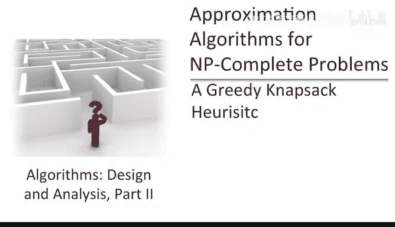

This sequence of videos is about the design and analysis of heuristics。

 algorithms which are generally guaranteed to be fast but not guaranteed to be 100% correct as a case study we're going to revisit the NApsack problem that we thought about earlier in the dynamic programming section。

Let's briefly review the three strategies for dealing with MP complete problems。

 all of these are relevant for the NApsSack problem。

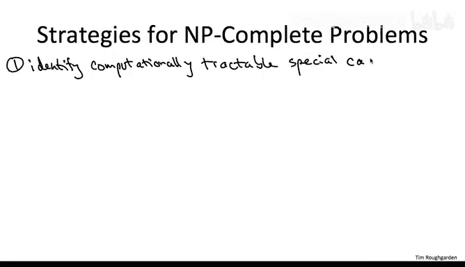

The first strategy is to identify computationally tractable special cases of the NP complete problem that you're grappling with if you're lucky the instances relevant for your application will fall squarely into one of these computationally tractable special cases。

 even otherwise it's useful to have these kinds of subroutines lying around。

 perhaps with a little bit of extra work， you can reduce your problem instances to one of these computationally tractable special cases。

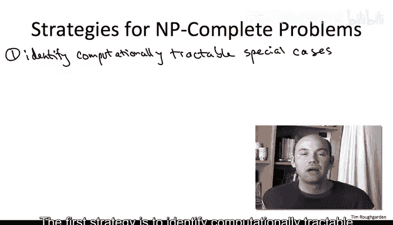

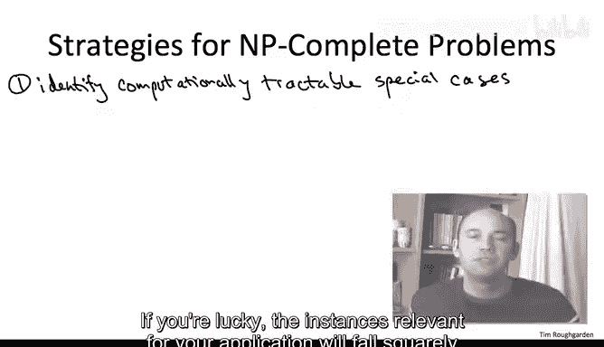

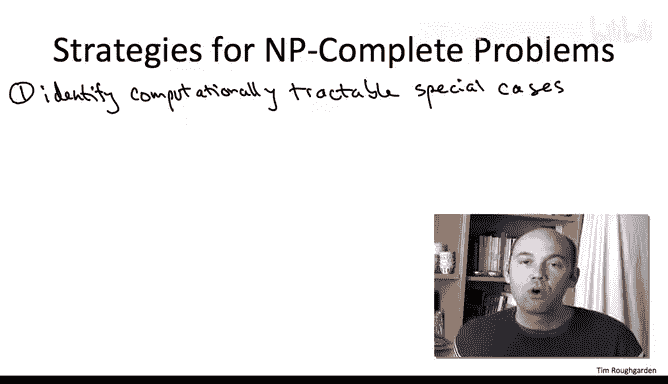

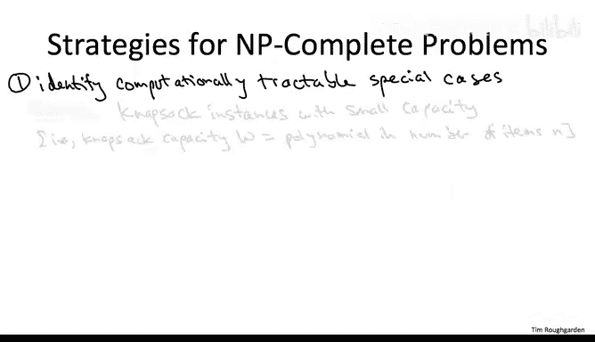

A dynamic programming solution for the Napsack problem identifies one such special case。

 namely Napsack instances where the Napsack capacity is small， for example。

 if it's comparable to the number of items。The second approach is the design and analysis ofturistics。

 algorithms which are not guaranteed to be 100% optimal。

 I'll have more to say about those in a second。

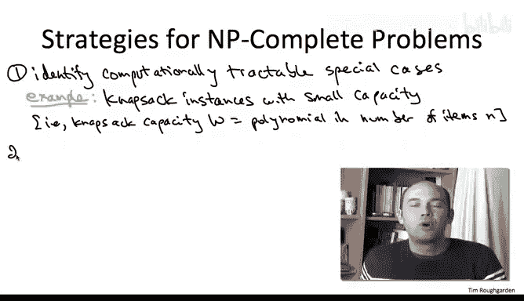

The third strategy is to insist on a correct algorithm and being an NP complete problem。

 you're then expecting to see exponential running time。

 but still they have running time qualitatively better than what you'd achieve with naive brute force search。

A dynamic programming solution to the NApsack problem can be viewed as a contribution in this direction。

 naive brutefor search enumerating over all possible subsets of items is going to take time proportional to 2 to the n where n is the number of items。

 the dynamic programming algorithm takes time proportional to n the number of items times capital W the NApsack capacity for most problems of interest。

 this dynamic programming solution， albeit exponential for reasons we've discussed in the past will be a significant improvement over naive brutefor search。

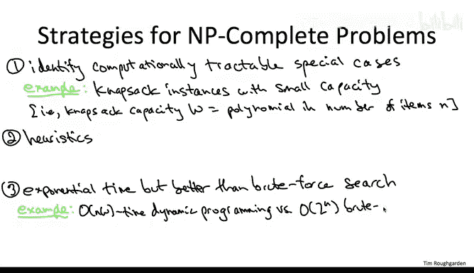

Let's now return to the subject of heuristics， the topic for today。Happily。

 despite being NP complete， the knapsack problem admits some quite useful heuristics。

 We're going to study two of them。 First， we'll use the greedy algorithm design paradigm to come up with a pretty good heuristic。

😊，Pleaasingly， this pretty good greedy heuristic is also blazingly fast。

We'll then pull out a different tool， namely dynamicna programming to develop yet another heuristic。

 it's going to be polynomial time not as fast as the greedy solution。

 but its accuracy will be excellent， it will get within a 1 minus epsilon factor of optimal or epsilon is a parameter that we can tune as we wish。

Now there's zillions and zillions of algorithms in the world， and anybody can write one of them down。

 So if someone proposes an algorithm to you， the onus is on them to convince you that it's a good idea。

 to convince you that it's in some sense， a good algorithm。Canonically， in these courses。

 I've been making that argument in two ways。 First of all。

 I provide you with an argument that the algorithm that I propose is correct。

 It always is guaranteed to solve the problem that we're interested in。 Secondly。

 I argued that it solves the problem using a reasonable amount of resources。

 So one great exhibit A would be， say Dytra's algorithm。

 We wanted to solve the shortest path problem with a single source and non negative edge lengths。

 I gave you a proof that Dytra's algorithm always successfully achieves that goal。

 And I showed you an implementation so that the running time was not much more than what it takes to just read the input。

Now， of course， this best case scenario is not going to be realized for NBcomplete problems and in particular for the NApsAC problem。

 so you have to give up either on the correctness or on the running time。

 you have to make a compromise。A tricky question then is how do you argue that the compromise you're making is not overly severe。

 how do you argue that your approach to an NP complete problem is a good one？

Heuristics relax correctness， and so one would like an argument that says correctness is not relaxed by too much in the best case scenario。

 when you propose a heuristic you should supply a performance guarantee which says that the solution is almost correct in some sense。

 on every single instance or failing that at least on many instances of interest。Now in practice。

 you do bump into problems that are so hard you wind up having to resort to heuristics where you really don't have a good understanding of how or when they work。

 where you really just cross your fingers， run the heuristic and hope for the best Local search is probably the preeminent example of this type of heuristic。

 something like the Ka means algorithm for clustering。

 but for the problem we're going to talk about today we're going to seek out heuristics that have worstcase performance guarantees and of course a broader theme of this discussion and the reason I'm using Napsack as an example is this will show us how our programmer toolbox。

 our algorithm toolbox is now rich enough to design not just lots of different exact algorithms。

 but also lots of useful heuristics for emptycomplete problems。

So let me briefly remind you what the Napsack problem is as input we are given two n plus1 numbers。

 there's n items， each one has a positive value and a positive weight。

 the final number is a NapsSack capacity capital W。

The goal is to pack the Napsack with the most valuable set of items。

 that is you're seeking out a subset S of items and it should have the property that the sum of the sizes of the items in your set S is bounded above by the Napsack capacity capital W。

 subject to that constraint， your subset of chosen items should maximize the sum of the values。

This is a fundamental problem that comes up all the time in particular as a subroutine。

 really whenever you have a constrained resource that you want to use in the best way possible。

 that's basically the NApsack problem。

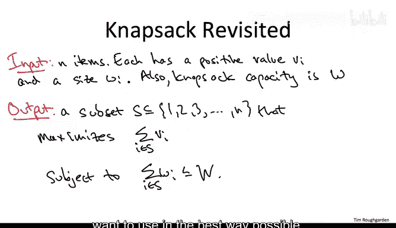

So let's turn to heuristics for the Napsack problem。

 so now that I've told you that we're happy with heuristics， we're willing to relax correctness。

 this all of a sudden resuscitates the greedy algorithm design paradigm as a feasible approach to the Napsack problem。

Because the NApsSAC problem is NP completele， we certainly are not expecting to find a exactly correct greedy algorithm。

 but maybe there's a greedy algorithm which is pretty good。

 and we're expecting most greedy algorithms are going to run extremely quickly。

So let's talk through a potential greedy approach to the NApsAC problem Probably the first idea you'd have would be to consider the items in some order and when you consider an item you make an irrevoical decision at that point whether to include it in your solution or not。

So the question then is， in what order should you look at the items？

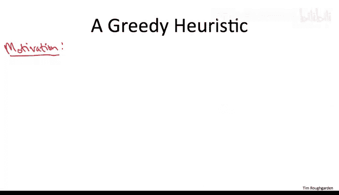

Well， what's our objective， our objective is to maximize the value of our set。

 so obviously high value items are important， so maybe the first idea would be to sort the items from highest value to lowest value。

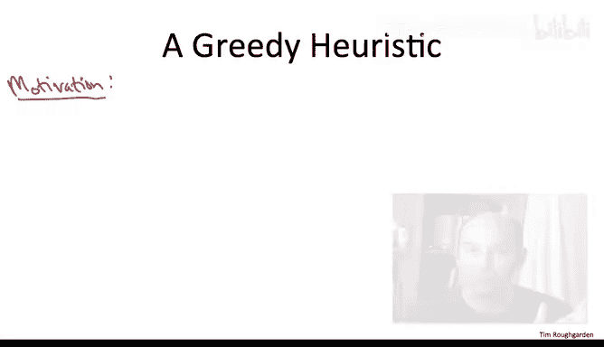

But if you think about that proposal for say 30 seconds。

 you quickly realize that this is a little naive， this is not the whole story。

 If you have a high value item that fills up the wholenapsack seems like that's not quite as useful if you had an almost as high value item that basically had size close to zero that didn't use of any of thenapsack at all。

Remember that each item has two properties， not just its value。

 but also its size and both of these are important， we want to prefer items that have a lot of value。

 but we also want to prefer items that are small。

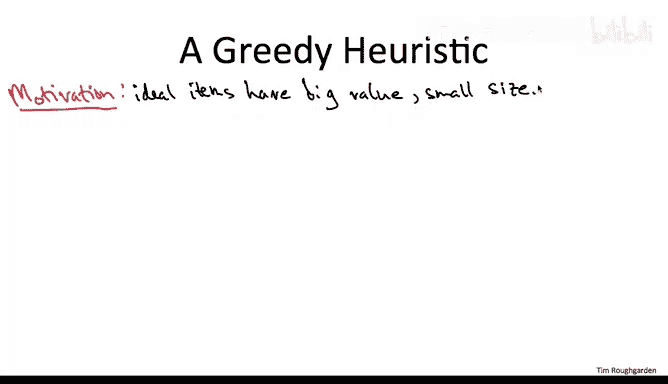

So I hope many of you are now sensing a strong parallel between the present discussion and the discussion we had with our first serious study of a greedy algorithm that was scheduling jobs on a single machine to minimize the sum of the weighted completion times。

In that old scheduling problem， just like in this one， each object had two parameters。 back then。

 it was a job length and a job weight or a job priority。

 and you had a preference for jobs that were higher weight。 You wanted them to be first。

 and you had a preference for shorter jobs。 You wanted them to be first Here again， we have items。

2 parameters， the value and the size， high values， good。

 low sizes good back in the scheduling problem。 The key idea was to look at jobs ratios and schedule in that order。

By analogy here in the Napsack problem， if we want to take the two parameters of each item。

 form a single parameter by which we can then sort the jobs。

 a natural first cut to look at is a ratio。

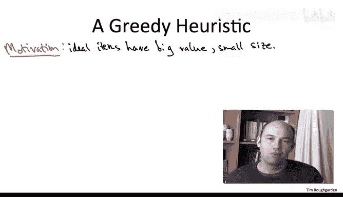

Since we prefer high values and we prefer low weights。

 the sensible thing to look at is the ratio of the value of an item divided by its size。

 and we're then going to consider items from the highest values of these ratios to the lowest values of these ratios。

One way to think of this is that we consider the items in order of nondereasing bang per buck。

 we're always trying to get the most value for our money where money is the amount of the NApsack capacity that we're spending。

So now that we have our greedy ordering， we just proceed through the items one at a time and we pack the items into the Napsack in this ordering Now what happens here and didn't actually trouble us in the scheduling problem is at some point we might no longer be able to pack items into the Napsack。

 the thing might get full so once that happens once we reach an item which doesn't fit in the Napsack。

 given the items that we've already packed into it， we just stop the greedy algorithm。

So if you think about it， the way I've written this algorithm。

 aborting as soon as you fail to pack one item is not really what you would do in practice。

 you'd do something a little bit smarter。 If you fail to pack some given item， say item K plus1。

 well， maybe item K plus 2， yeah has a worse ratio of it。 maybe it's much smaller。

 Maybe item K plus2 does fit in the knapsack。 and then there's no reason not to just take it。

 So in practice you'd go through the entire list of items。 and you would just pack whatever fits。

 skipping whatever doesn't fit。 For simplicity， I'm going to go ahead and analyze this slightly worse heuristic in the slides to follow。

So just a real quick example， let's consider the following three item instance。

So I've taken the liberty of sorting the items by ratio。

 The first item has value 2 and size1 per ratio of 2。 The second item has a ratio of four thirds。

 value 4 size 3， and the third item has a ratio of 1 value and weight equal to3。

 Let's say the Napsack capacity is 5。

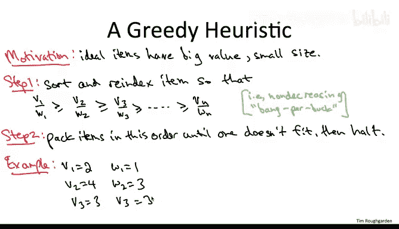

So what does the greedy solution do it first packs in item number one。

 then there's a residual NApssack capacity of four， so there's room for item number two。

 it packs that Now there's a residual NApsack capacity of only one so there isn't any room for item number three so it halts so the greedy algorithm is just going to output the set1 comma2。

In this particular example， you'll notice that this greedy solution of value 6 is in fact the optimal solution。

 you can't do better。But let's look at a second example with just two items。

 so in this particular instance， what is the value of the output of the greedy algorithm and what is the value of an optimal solution。

So the correct answer is A。Since the Napsack capacity is 1000 and some of the sizes of the jobs is 1001。

 there's no room for both of them， the greedy algorithm。

 unfortunately because the first tiny item has a smaller ratio will pack in item number one and that leaves no room for item number two so the value of the greedy algorithm solution is just two whereas the optimal solution is of course to just take the second item。

 yeah its's ratio is worse but on the other hand it fills up the whole Napsack and so overall your value is 100 which obviously blows away the greedy solution。

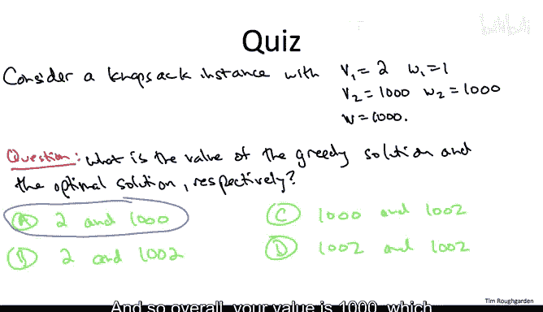

This quiz shows that at least for general instances。

 the greedynapsack heuristic we've devised thus far can be arbitrarily bad。

 it can be terrible with respect to an optimal solution。There is， however。

 a simple fix to address this issue， we're going to add a very simple step three to our greedy heuristic。

So the new step three is just going to compare two different candidate solutions in return which everyone is better。

 which everyone has a bigger total value， the first candidate is just what we were doing before it's just the output of step two of the algorithm。

 the second candidate is whichever item by itself has the maximum value。

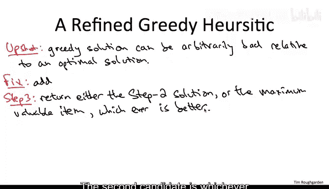

In other words， this new greedy algorithm just runs the old one。

 but then it does a final sanity check。 It looks at each item individually， and it says， well。

 if this item just by itself dominates the solution I computed thus far。

 I return this single item by itself instead。

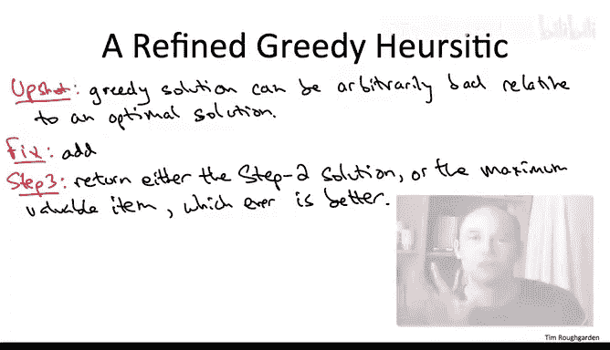

There's no question that adding this new step3 fixes the problem in the quiz quiz in the last slide。

 if you add this step 3， then we will choose that item that has value 1000 instead of the lousy solution of value 2 that we computed in step 2。

 but it may seem that this step three is just kind of a hack meant to address that specific instance。

 but remarkably just adding this step3 transforms this greedy heuristic into one that has a reasonably good worstcase performance guarantee。

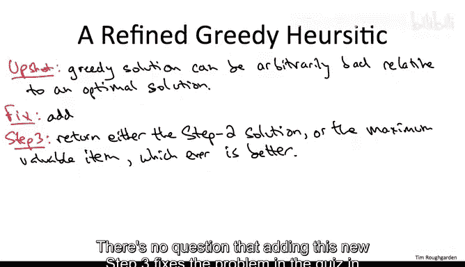

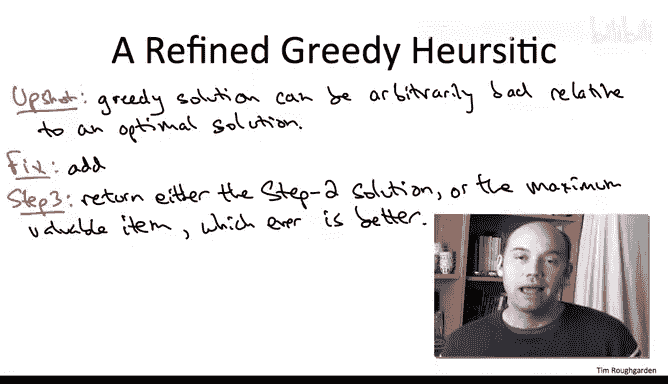

Precisely the value of the solution computed by this threestr greedy algorithm is always at least 50% of the value of an optimal solution。

 so the jargon for this kind of algorithm is a one half approximation algorithm。

 for every instance it's guaranteed to compute a solution with value at least one half that of an optimal solution。

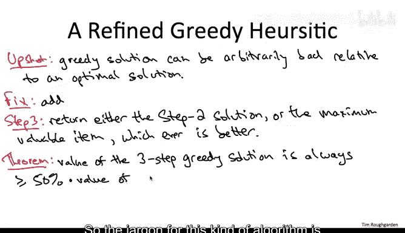

Also， as you would hope from a greedy heuristic， it runs extremely quickly。

 basically all we do is sort the items， so the running time is O of N log N。

In the next video we'll provide a proof of this theorem and as we'll see。

 under some additional assumptions about the type of instance。

 the performance guarantee will in fact be much， much better than 50%。

