# 算法：贪心算法：贪心背包启发式算法分析二

## 📖 概述
在本节中，我们将深入分析一个用于解决背包问题的三步贪心启发式算法。我们将证明该算法在最坏情况下也能保证获得至少50%的最优解价值。同时，我们也将探讨如何通过施加额外假设或设计更优的算法来获得更好的性能保证。

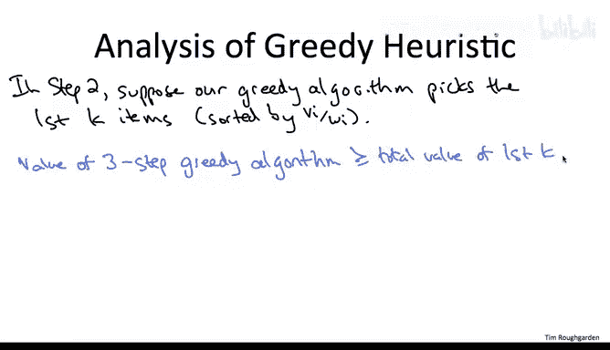

---

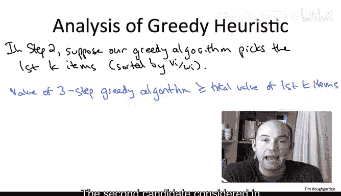

## 🔍 算法回顾与初步分析
上一节我们介绍了三步贪心算法的框架。本节中我们来看看如何分析其性能保证。

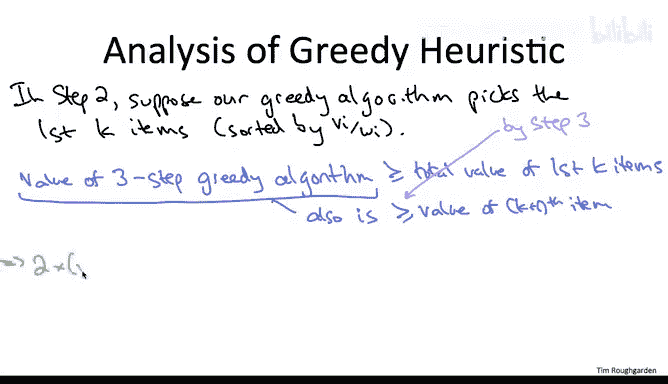

算法的第一步是将物品按单位尺寸价值（价值/尺寸）非递增排序。第二步是贪心地选取能放入背包的最大前缀物品，假设这个最大前缀包含前K个物品。第K+1个物品是第一个无法在已有选择下放入背包的物品。

算法的第三步是考虑两个候选解并选取较优者。第一个候选解是第二步的输出。因此，我们可以肯定地说，三步贪心算法的输出至少与第二步选取的前K个物品的总价值一样好。

第二个候选解是单独考虑价值最大的单个物品。在贪心算法第三步中，被考虑的单个物品就包括那个在第二步中“卡住”我们的第K+1个物品。因此，无论三步贪心算法的输出价值是多少，它都至少等于第K+1个物品的单独价值。

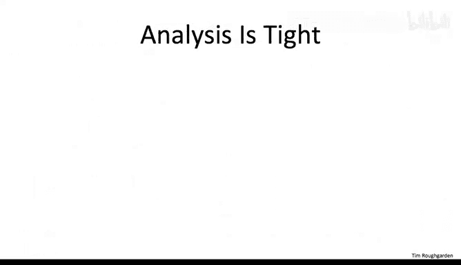

将这两个不等式相加，左边得到的是三步贪心算法输出价值的两倍。右边得到的是前K个物品加上第K+1个物品，即前K+1个物品的总价值。

## 📐 与分数贪心解建立联系
现在，我们可以将这个不等式与分数贪心解联系起来。分数贪心解会装入前K个物品，然后对于卡住的第K+1个物品，它会用该物品的一个合适分数填满背包剩余容量，其获得的价值也按装入的比例计算。

我们右边绿色部分（前K+1个物品的100%）甚至比分数贪心解更好。分数贪心解包含前K个物品的100%和第K+1个物品的一部分。因此，分数贪心解的价值比我们这里的右边部分更差。

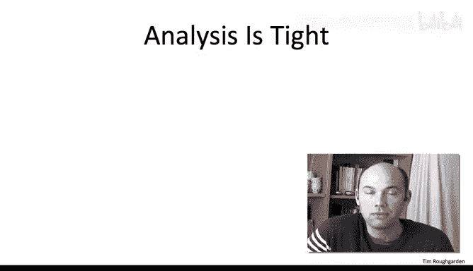

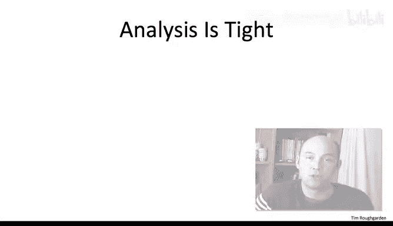

而我们整个思想实验的关键在于论证分数贪心解甚至优于最优解，其价值至少与任何可行背包解一样高。

将不等式两边同时除以二，我们就证明了定理：三步贪心算法的输出保证至少是最优解价值的50%。

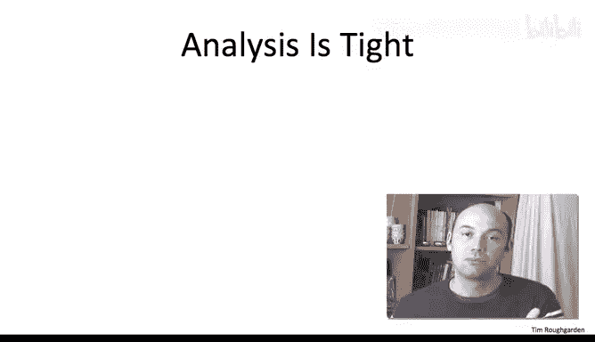

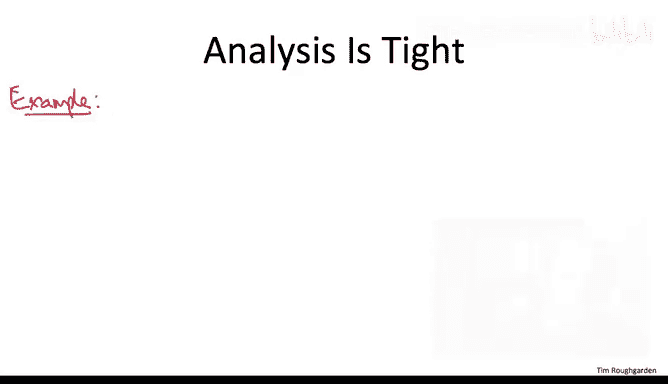

这是一个非平凡的、最坏情况下的性能保证，适用于我们简单且速度极快的三步贪心启发式算法。

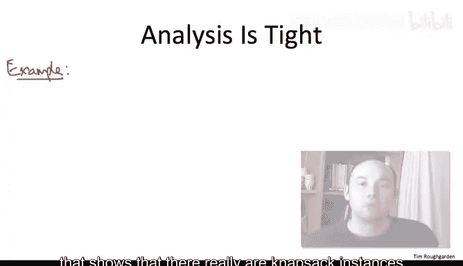

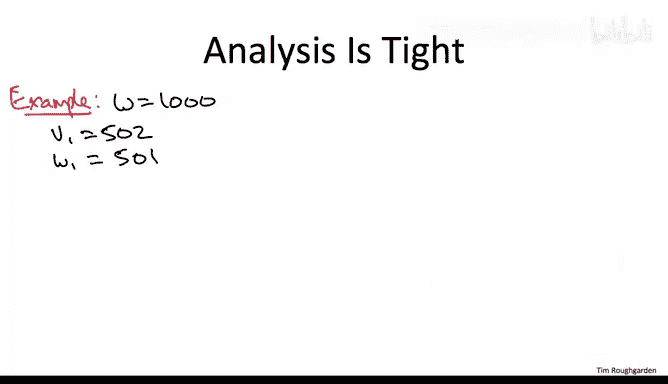

## 🤔 追求更好的性能保证
或许你希望获得比最优解的50%更好的性能。我们有以下几种途径可以尝试。

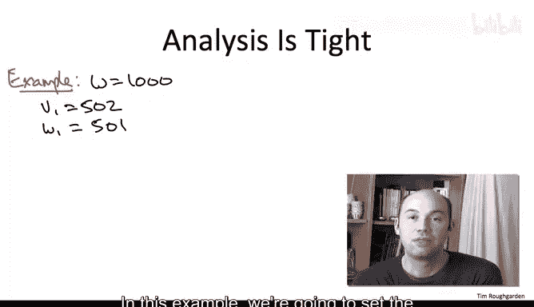

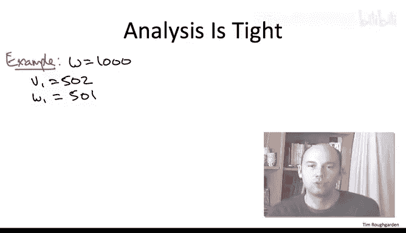

最佳情况是，我们能够仅仅通过改进对这个贪心启发式的分析来提升保证，而不改变算法或做任何新假设。其次，如果我们非常喜欢这个算法（例如因为它速度快），我们可以尝试识别出能让我们证明比这个适用于所有实例的50%保证更好的性能保证的额外实例假设。第三，我们可以尝试设计一个确实具有更好性能保证的更好算法。

然而，第一种最佳情况——仅仅改进对这个贪心算法的分析——是不可行的。分析无法被锐化，因为对于某些实例，50%的界限是可以达到的。因此，我们将处理另外两种方法，并确实在额外实例假设下或使用更复杂的算法获得更好的性能保证。

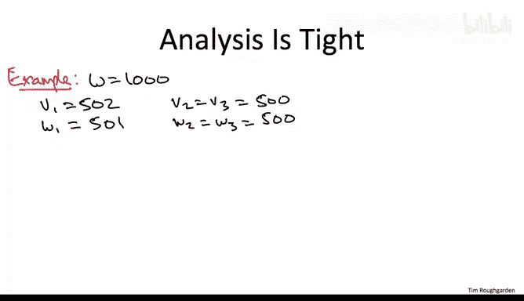

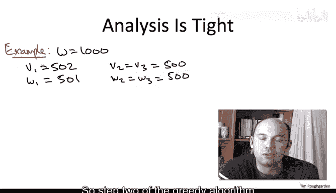

## 📉 证明50%界限是紧的
以下是一个例子，表明确实存在背包实例，使得这个三步贪心算法可能只获得接近最优解50%的价值。

在这个例子中，我们设背包容量 `W = 1000`。有三个物品：
*   物品1：价值 `502`，尺寸 `501`。
*   物品2和3：价值均为 `500`，尺寸均为 `500`。

贪心算法会如何操作？第一步，它按价值/尺寸比排序。物品1的比率略大于1，因此会先于物品2或3被考虑。第二步，算法将物品1装入背包，这仅留下499单位的剩余容量，不足以放入物品2或3。因此，第二步的输出就是物品1本身。第三步，算法考虑价值最大的单个物品，这又是物品1。因此，贪心算法将输出仅包含物品1的解，价值为502。

然而，存在一个更好的解：放弃物品1，选择物品2和3。它们都能放入背包并完全填满，总价值为1000，这几乎是贪心解价值的两倍。

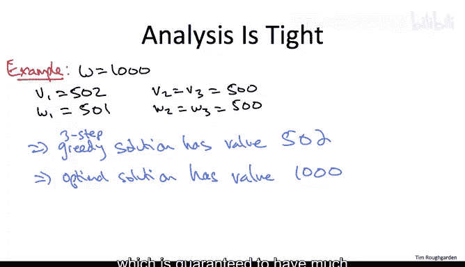

这个例子告诉我们，如果我们想要优于50%的性能保证，我们有两个选择。第一，如果我们真的想继续分析我们的三步贪心算法，我们将不得不对实例做出额外假设，以证明优于50%的性能保证。因为存在一些实例，其性能确实差到只有最优解的50%。第二，我们可以研究更好的算法，这些算法在最坏情况实例上可能具有更好的保证。

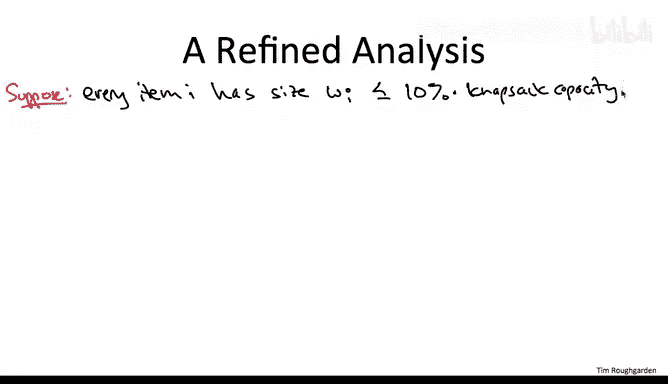

## 🚀 在额外假设下获得更好保证
我们可以对背包实例施加几种不同的假设，从而能够为贪心启发式证明更好的性能保证。这里展示一个既简单又在实践中出现的许多背包实例中都满足的条件。

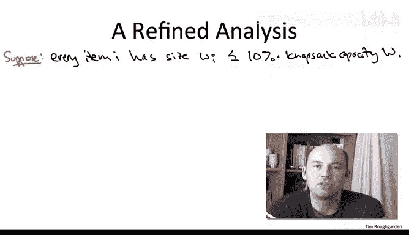

让我们关注那些没有任何物品尺寸特别大（相对于背包容量）的背包实例。具体来说，假设每个物品的尺寸最多是背包容量 `W` 的10%。

这个假设很有用。考虑我们贪心算法的第二步：我们按单位价值非递增排序并逐个装入物品。在某个时刻，我们会卡住，即存在某个第K+1个物品，如果我们试图放入，会溢出背包容量。根据假设，这个第K+1个物品的尺寸最多是原始背包容量的10%。因此，如果放入它会溢出，意味着当前背包可用容量小于10%，即背包目前已装入的物品已占满90%或更多。

这听起来很不错。我们的贪心准则确保了我们最终使用的背包容量部分是以最有价值的方式使用的，并且我们刚刚注意到，实例的这个假设意味着我们几乎用尽了整个背包。

为了使这个直觉精确化，我们将贪心算法（即使在第二步之后）的输出与我们最喜欢的假设基准——分数贪心解进行比较。这两个解的区别是什么？它们几乎相同。唯一的区别是分数贪心解能够用第K+1个物品的一个合适分数填满背包的最后一点（我们知道最多10%）。因此，在我们的解中缺失的价值最多是分数贪心解最后那10%部分的价值。

在分数贪心解中，物品是按单位价值递减顺序装入的。因此，这最后10%的分数贪心解也是最不重要的部分，它对容量的利用价值最低。所以，这最后最多10%的分数贪心解最多只能占其总价值的10%。因此，我们的贪心算法解中缺失的部分，最多是分数贪心解总价值的10%。也就是说，我们至少获得了分数贪心解价值的90%。

根据我们的思想实验，分数贪心解甚至优于最优解，至少与任何可行背包解一样好。因此，我们的贪心算法（即使不使用第三步）的输出也至少是最优解价值的90%。

这个推理同样适用于10%以外的其他数值。例如，如果你只知道每个物品尺寸最多是背包的20%，那么贪心解将至少是最优解的80%。另一方面，如果你知道每个物品尺寸最多是背包容量的1%，那么仅两步贪心算法就能让你获得至少99%的最优解价值。

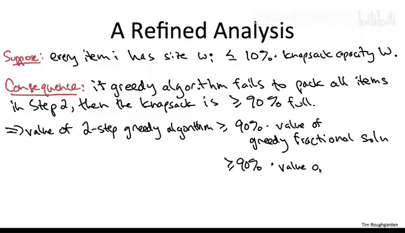

---

## 📝 总结
本节课中我们一起学习了如何分析三步贪心背包启发式算法的性能。我们证明了该算法在最坏情况下能保证获得至少50%的最优解价值，并通过构造实例表明这个50%的界限是紧的，无法通过单纯改进分析来突破。为了获得更好的性能保证，我们探讨了两种途径：一是对问题实例施加额外假设（如限制单个物品的最大尺寸比例），从而在相同算法下证明更优的近似比；二是设计更复杂的算法（如基于动态规划的启发式算法）。这为我们理解和改进近似算法的性能提供了清晰的思路。