# 算法：30：动态规划法再探背包问题 🎒

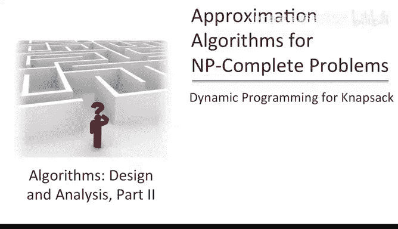

在本节课中，我们将学习背包问题的第二种动态规划解法。这种解法是构建多项式时间内任意接近最优解的启发式算法的关键组成部分。

上一节我们介绍了基于背包容量的动态规划解法。本节中，我们将转向一种基于物品价值的动态规划解法。

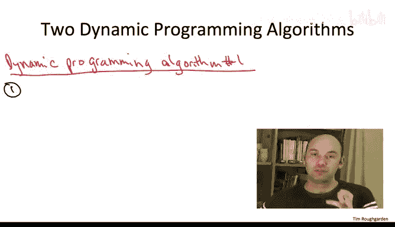

## 问题回顾

在背包问题中，输入包含 **n** 个物品。每个物品 **i** 有一个正的价值 **vᵢ** 和一个正的尺寸 **wᵢ**。此外，我们被给定一个背包容量 **W**。

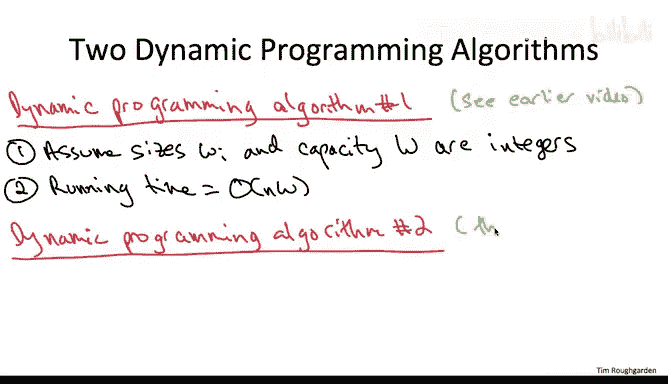

在本课程之前的动态规划部分，我们已经设计了一种算法。该算法假设物品尺寸和背包容量都是整数。其运行时间为 **O(n·W)**。这意味着当背包容量 **W** 不太大（即关于 **n** 是多项式级别）时，我们得到了一个多项式时间算法。

然而，对于构建在多项式时间内具有任意好近似比的启发式算法来说，基于容量小的特殊情况并不是最佳选择。相反，我们真正需要的是在**物品价值较小**的特殊情况下的多项式时间解法。这正是本视频要提供的解法。

## 新算法的核心思路

我们将假设所有物品的**价值 vᵢ 都是整数**（尺寸 **wᵢ** 和背包容量 **W** 可以是任意值）。我们将开发的动态规划解法的运行时间为 **O(n²·v_max)**，其中 **v_max** 表示任意物品的最大价值。

这两种算法的运行时间具有对称性：
*   第一种算法关注**尺寸**，运行时间与可能的最大总尺寸（即 **W**）成正比。
*   第二种算法关注**价值**，运行时间与可能的最大总价值（即 **n·v_max**）成正比。
*   在两种情况下，运行时间都是我们需要担心的最大数量乘以物品数量 **n**。

## 子问题定义

由于大家已经完成了动态规划的“训练营”，我们将直接切入正题，定义相关的子问题。

这里的子问题将是我们第一个背包动态规划算法的一个变体。相同之处在于，我们仍然有一个索引 **i**，它指定了在给定子问题中允许使用物品的前缀范围。

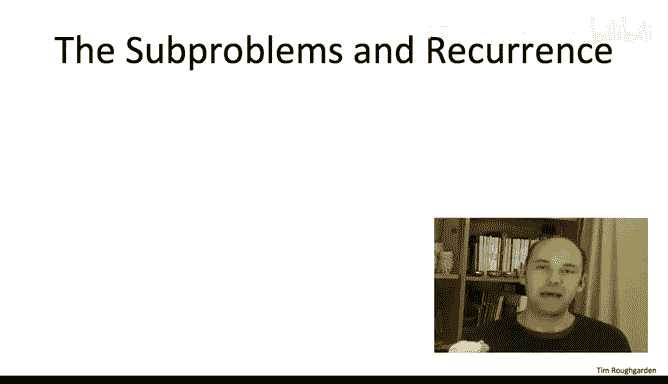

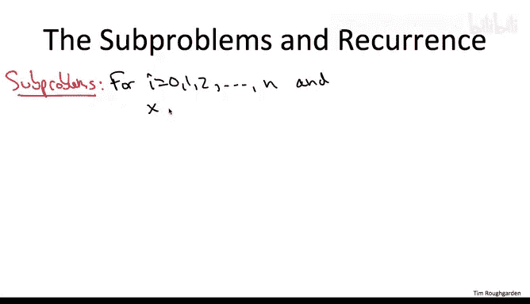


不同之处在于第二个参数。在第一个算法中，第二个参数 **x** 表示剩余的可用容量，我们在此约束下最大化价值。现在，我们将它反过来：第二个参数 **x** 表示我们**力求达到的价值目标**。我们希望在达到至少价值 **x** 的前提下，**最小化**所需使用的总尺寸。

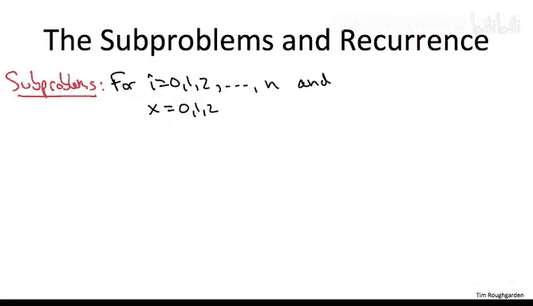

以下是子问题的形式化定义：

*   **索引 i**：范围从 0 到 n，对应我们可能感兴趣的所有物品前缀。
*   **参数 x**：范围是所有可能感兴趣的总价值目标。由于物品价值是整数，任何物品子集的总价值也是整数，因此我们只需考虑 **x** 的整数值。此外，我们永远不需要担心尝试实现大于 **n·v_max**（或所有 **vᵢ** 的总和）的总价值。
*   **子问题值 S(i, x)**：定义为仅使用前 **i** 个物品，达到总价值**至少为 x** 时，所需的**最小总尺寸**。如果使用前 **i** 个物品根本无法达到价值 **x**（例如，它们的总价值已经小于 **x**），则将其定义为 **+∞**。

用公式表示：
**S(i, x) = min{ total size of a subset of first i items with total value ≥ x }**
**S(i, x) = +∞**，如果这样的子集不存在。

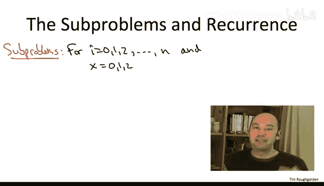

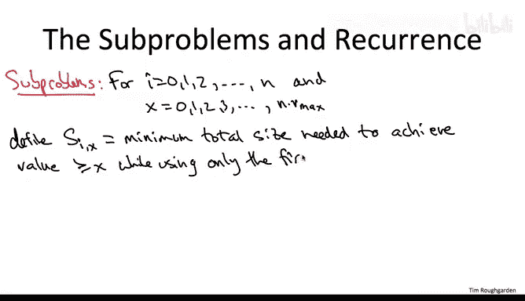

## 递推关系

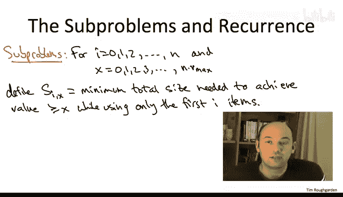

现在让我们写下自然的递推关系。假设 **i ≥ 1**。

其结构与第一个背包动态规划算法完全相同。我们聚焦于一个子问题 **(i, x)**。对于最后一个物品 **i**，它要么在最优解中，要么不在。这给了我们两种情况，递推式将对这两种情况进行暴力搜索。由于我们试图最小化达到给定价值目标所需的总尺寸，这里的暴力搜索将采取取**最小值**的形式。

以下是两种候选的最优解：

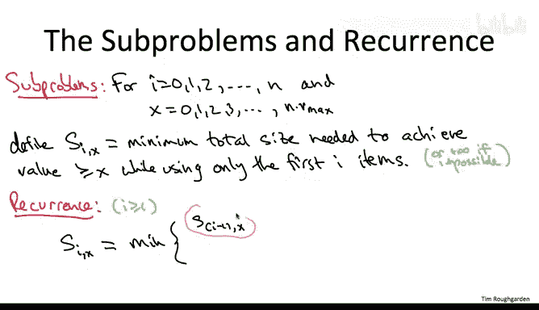

1.  **不使用物品 i**：那么最优解直接继承自仅使用前 **i-1** 个物品达到相同价值目标 **x** 的最小尺寸解。即：**S(i-1, x)**。
2.  **使用物品 i**：这为最优解的重量贡献了 **wᵢ**。在此最优解中，除物品 **i** 外的其余物品，其自身必须达到价值目标 **x - vᵢ**。根据常见的“剪切-粘贴”论证，在所有具有此性质的前 **i-1** 个物品的子集中，它们必须具有最小的总重量。即：**wᵢ + S(i-1, x - vᵢ)**。

**边界情况**：如果 **vᵢ** 实际上大于 **x**，那么 **x - vᵢ** 为负数。我们只需将 **S(i-1, x - vᵢ)** 解释为 **0**，因为仅物品 **i** 自身就满足了价值目标 **x**。

因此，完整的递推关系为：
**S(i, x) = min{ S(i-1, x), wᵢ + S(i-1, x - vᵢ) }**
其中，当 **x - vᵢ < 0** 时，定义 **S(i-1, x - vᵢ) = 0**。

## 算法伪代码

以下是新动态规划算法的伪代码。

```python
# 初始化
Let V_total = n * v_max  # 或所有 v_i 的总和
Initialize a 2D array A[0..n][0..V_total] to +∞

# 基础情况：i = 0 (不允许使用任何物品)
A[0][0] = 0
# 对于 x > 0，A[0][x] 保持为 +∞ (无法达到任何正价值)

# 填充表格
for i from 1 to n:
    for x from 0 to V_total:
        # 情况1：不使用物品 i
        candidate1 = A[i-1][x]
        
        # 情况2：使用物品 i
        if x - v[i] <= 0:
            candidate2 = w[i]  # 仅物品 i 就足够了
        else:
            candidate2 = w[i] + A[i-1][x - v[i]]
        
        A[i][x] = min(candidate1, candidate2)

# 寻找最优解
optimal_value = 0
for x from V_total down to 0:
    if A[n][x] <= W:  # 存在总尺寸不超过背包容量的方案达到价值 x
        optimal_value = x
        break

return optimal_value
```

## 算法解析与运行时间

在第一个背包动态规划算法中，有一个子问题 **(n, W)** 直接对应原始问题（使用所有物品，在容量 **W** 内最大化价值）。因此，填完表后可以直接在常数时间内得到答案。

然而，在这个新的动态规划算法中，没有一个子问题直接对应我们想解决的原始问题（在容量 **W** 内最大化价值）。它们告诉我们的是：对于每个目标价值 **x**，达到该价值所需的最小尺寸是多少。

那么，如何找到原始问题的最优解呢？方法如下：
1.  算法运行完毕后，我们查看最后一批子问题，即 **i = n** 对应的行。
2.  我们从**最高**的可能目标价值 **x**（例如 **V_total**）开始，向下扫描。
3.  我们寻找**第一个**（即最大的）目标价值 **x**，使得 **A[n][x] ≤ W**。这意味着存在一个物品子集，其总价值至少为 **x**，且总尺寸不超过背包容量 **W**。
4.  这个 **x** 就是原始背包问题的最优解值。

**运行时间分析**：
*   **子问题数量**：外层循环 **i** 从 1 到 n，内层循环 **x** 从 0 到 **n·v_max**。所以总子问题数为 **O(n²·v_max)**。
*   **每个子问题的工作量**：递推关系只考虑两个候选值，执行常数时间操作。
*   **最终扫描**：扫描最后一行需要 **O(n·v_max)** 时间。

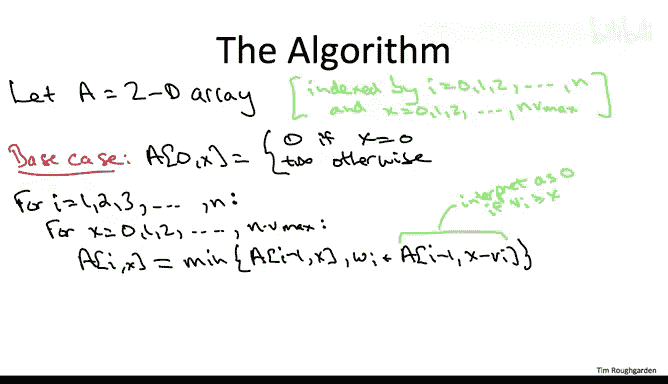

因此，总运行时间由每个子问题的常数工作主导，为 **O(n²·v_max)**，正如之前所承诺的。

## 总结

本节课中我们一起学习了背包问题的第二种动态规划解法。与第一种关注背包容量的方法不同，这种方法关注物品的价值。我们定义了子问题 **S(i, x)** 为使用前 **i** 个物品达到至少价值 **x** 的最小尺寸，并建立了相应的递推关系。通过填充一个规模为 **O(n²·v_max)** 的动态规划表格，并在最后进行扫描，我们可以在物品价值为整数且最大价值 **v_max** 不太大的情况下，高效地求解背包问题。这种解法是构建更高级近似算法的重要基石。