# 算法：31：动态规划启发式算法分析 🧮

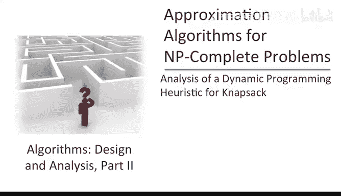

在本节课中，我们将分析基于动态规划的背包问题启发式算法。我们将精确理解该算法的运行时间如何依赖于期望的精度参数 ε。


## 算法回顾

我们的启发式算法包含两个主要步骤。

以下是算法的两个步骤：

1.  **调整物品价值**：我们将物品价值进行舍入，使其变为相对较小的整数。具体来说，对于每个物品 i，我们定义其调整后的价值 `V_hat_i` 为原始价值 `V_i` 除以参数 M 后向下取整的结果。公式表示为：
    ```
    V_hat_i = floor(V_i / M)
    ```
2.  **调用动态规划算法**：我们调用之前为背包问题设计的第二个动态规划解决方案，并将这些新的 `V_hat` 值、原始物品大小以及原始背包容量作为输入。

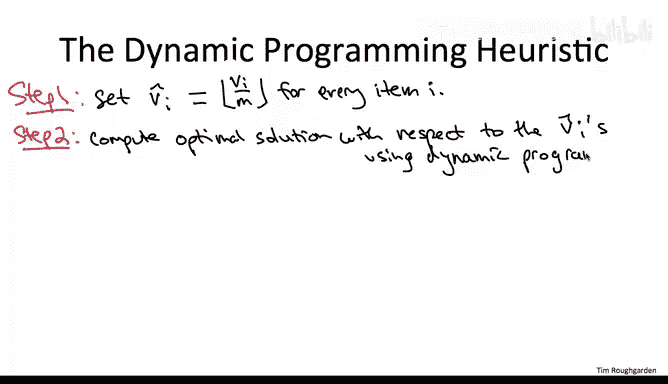

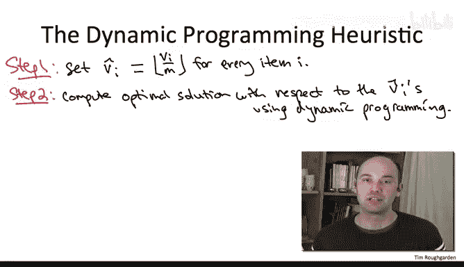

这个算法有一个未确定的参数 M。我们至少定性地理解 M 的作用：它影响着算法在精度和运行时间之间的权衡。

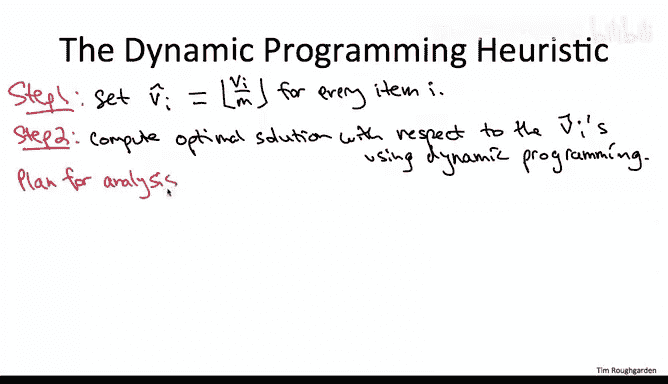

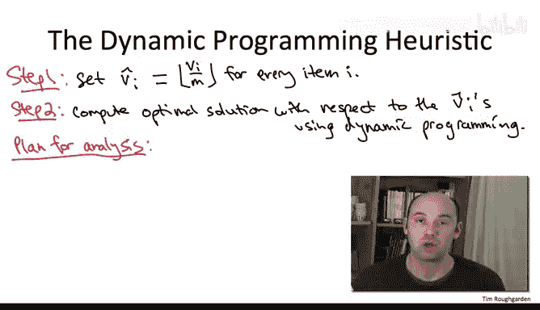

上一节我们介绍了算法的两个步骤，本节中我们来看看参数 M 如何影响算法的表现。

具体来说：
*   **M 越大**：我们对原始价值 `V_i` 的舍入操作丢失的信息就越多，这会导致**精度降低**。
*   **M 越大**：转换后的物品价值 `V_hat_i` 就越小。由于动态规划算法的运行时间与最大物品价值成正比，因此**运行时间更快**。

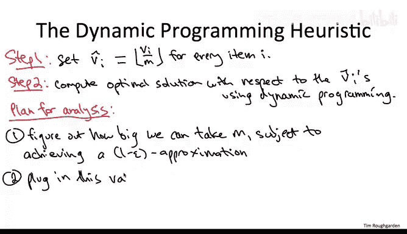

总结：M 越大，精度越低，但算法运行越快。


## 分析计划 📊

我们的分析计划如下。

首先，我们将研究精度约束。客户会给我们一个正参数 ε，我们的责任是输出一个可行解，其总价值至少是最优解总价值的 (1 - ε) 倍。这个精度约束将转化为我们能使用的 M 的上限。M 越大，精度损失越大。因此，我们要解决的第一个问题是：在保证计算出的解在最优解的 (1 - ε) 倍以内的前提下，M 最大可以取多大？

一旦我们解决了这个问题，知道了 M 的最大允许值，我们就会评估在此 M 值下算法的运行时间。

## 精度分析：M 的允许上限

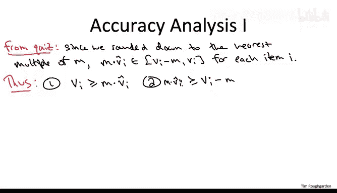

要回答第一个问题，即在不违反 (1 - ε) 精度约束的前提下，M 最大能取多大，关键在于详细理解舍入后的物品价值 `V_hat_i` 与原始价值 `V_i` 之间的关系。

我们从舍入操作的定义中可以得出两个基本不等式。

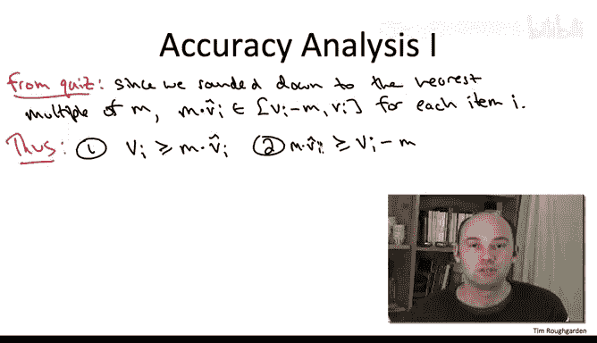

以下是两个基本不等式：
1.  `V_i >= M * V_hat_i`
2.  `M * V_hat_i >= V_i - M`

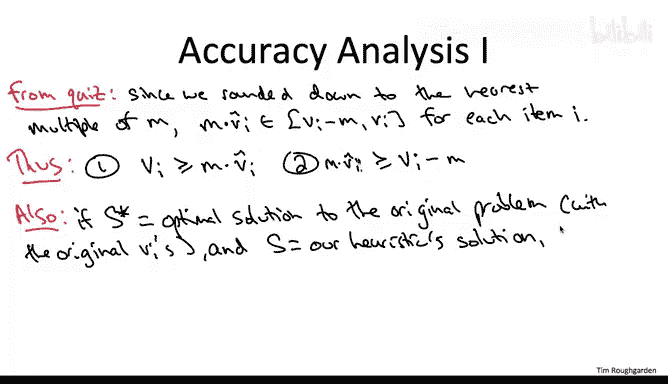

这两个不等式直接来自舍入操作的定义，内容相对简单。但算法的第二步为我们提供了一个更强大的第三个不等式。

第三步，我们针对调整后的价值 `V_hat_i` 最优地解决了一个背包问题实例。这意味着，如果使用 `V_hat_i` 来衡量价值，我们的启发式算法输出的解 S 比任何其他解都要好，包括针对原始问题（使用原始价值 `V_i`）的最优解 S*。

因此，我们得到第三个不等式：
3.  `sum_{i in S} V_hat_i >= sum_{i in S*} V_hat_i`

这三个不等式是我们分析的基础。幸运的是，它们足以帮助我们确定在保证 (1 - ε) 精度的前提下，M 的最大允许值。

为了看清这一点，让我们将这些不等式串联起来。第三个不等式内容最丰富，它表明我们针对转换后的价值 `V_hat` 最优地解决了问题。我们从它开始。

不等式 3 说，我们启发式解 S 中 `V_hat` 的总和，至少与任何其他解（特别是原始最优解 S*）中 `V_hat` 的总和一样大。这很好，但问题在于它用错误的数据（转换后的 `V_hat`）来证明解 S 的性能，而我们真正关心的是原始价值 `V`。

因此，我们需要以不等式 3 为种子，通过不等式 1 和 2，将不等式左右两边的 `V_hat` 用原始价值 `V` 重写，从而生长出一条不等式链。在向左扩展时，我们希望量值变得越来越大；在向右扩展时，我们希望量值变得越来越小。最终，我们希望得到一个关于启发式解 S 的近似最优性结果。

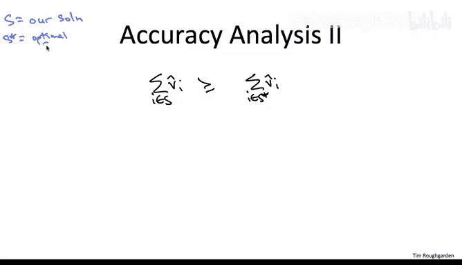

首先，为了便于使用不等式 1 和 2，我们将不等式 3 两边同时乘以 M（这仍然是有效的）：
`M * sum_{i in S} V_hat_i >= M * sum_{i in S*} V_hat_i`

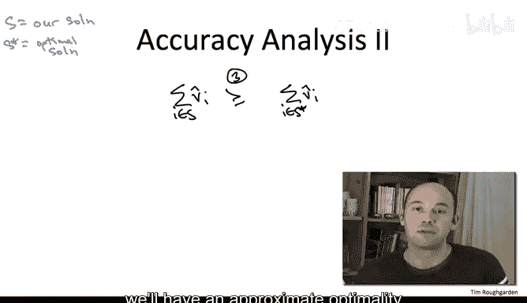

现在，我们来扩展这个不等式链。

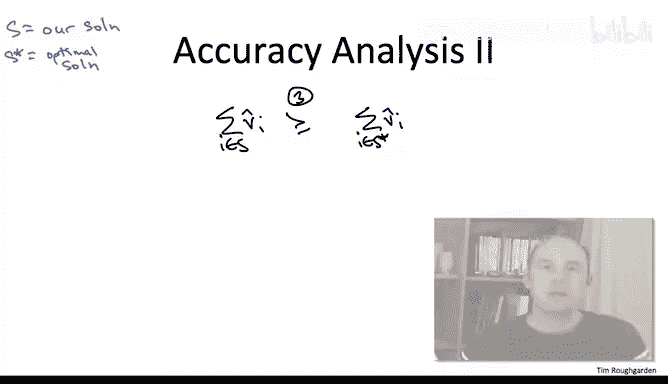


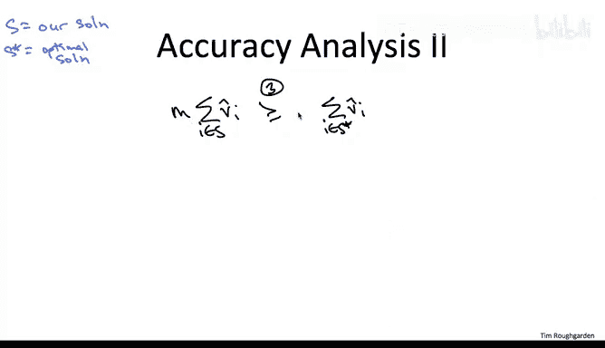

**扩展左侧**：我们需要附加一个只会更大的量，即用原始价值 `V_i` 来上界 `M * V_hat_i`。不等式 1 正好说明 `M * V_hat_i` 永远不会大于原始价值 `V_i`。因此，我们对解 S 中的每个物品应用不等式 1，得到：
`sum_{i in S} V_i >= M * sum_{i in S} V_hat_i`

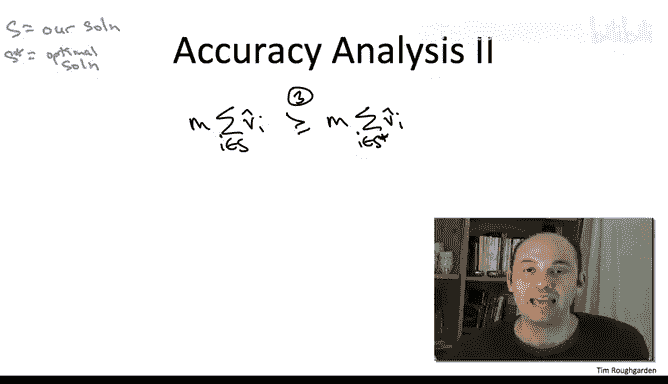

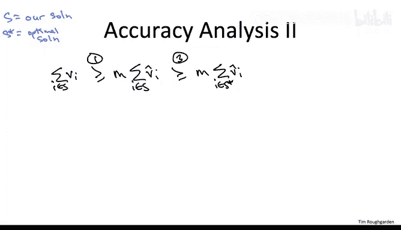

**扩展右侧**：我们需要一个只会更小的量，即用原始价值 `V_i` 的某个函数来下界 `M * V_hat_i`。`V_i` 可能大于 `M * V_hat_i`（因为我们向下舍入了），但不等式 2 说明它最多只能大 M。所以，从 `V_i` 中减去 M，就得到了 `M * V_hat_i` 的下界。我们对最优解 S* 中的每个物品应用这个关系，得到：
`M * sum_{i in S*} V_hat_i >= sum_{i in S*} (V_i - M) = (sum_{i in S*} V_i) - (M * |S*|)`

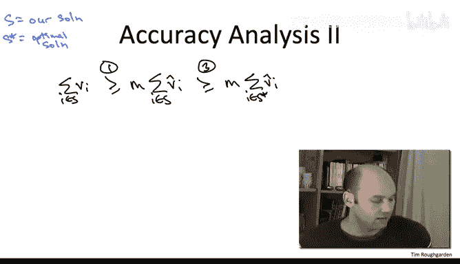

现在，将这三个部分串联起来，我们得到：
`sum_{i in S} V_i >= M * sum_{i in S} V_hat_i >= M * sum_{i in S*} V_hat_i >= (sum_{i in S*} V_i) - (M * |S*|)`

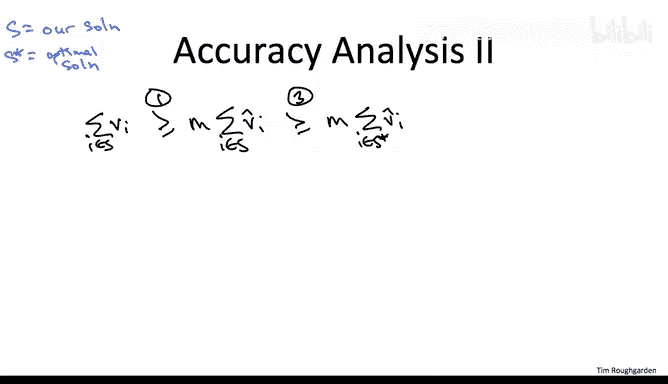

由于最优解 S* 最多包含 n 个物品，我们可以粗略地将其下界为 `(sum_{i in S*} V_i) - (M * n)`。


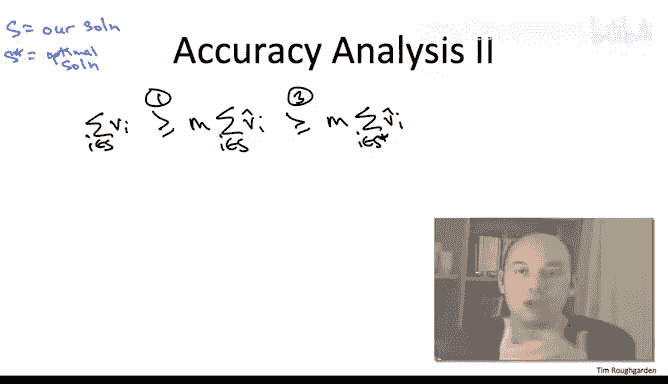

因此，最终的不等式链简化为：
`sum_{i in S} V_i >= (sum_{i in S*} V_i) - (M * n)`

现在，尘埃落定，我们得到了解 S 相对于最优解 S* 的性能保证。基本上，我们与最优解的差距就是这个误差项 `M * n`。正如我们所料，M 越大，我们偏离最优解的程度就越大（误差随 M 线性增长）。

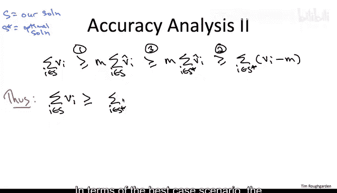

我们努力要回答的问题是：在保证解在最优解的 (1 - ε) 倍以内的前提下，M 最大能取多大？

为了实现 (1 - ε) 的近似比，我们需要确保解的最坏情况误差 `M * n` 不超过最优解价值的 ε 倍。也就是说，我们需要将 M 设置得足够小，使得 `M * n <= ε * (sum_{i in S*} V_i)`。

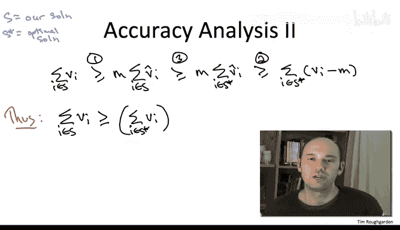

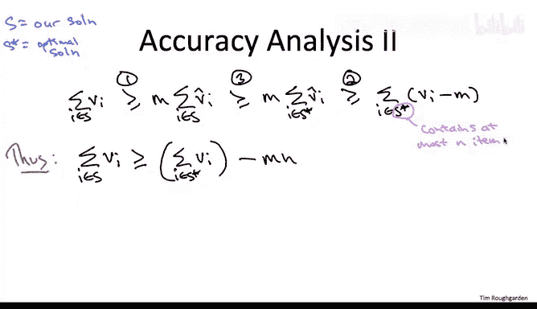

这个不等式告诉我们如何设置算法中的参数 M。但你会正确地指出，右边有一个我们实际上不知道的量——最优解 S* 的价值，而这正是我们最初试图近似计算的东西。

因此，我们将使用最优解价值的一个粗略下界。我们做一个平凡的假设：假设每个物品的大小都不超过背包容量（即每个物品都能单独放入背包）。任何不满足此条件的物品显然可以在预处理步骤中删除。那么，最优解的价值至少与最大价值物品的价值一样大。记 `V_max = max_i V_i`，则有 `sum_{i in S*} V_i >= V_max`。

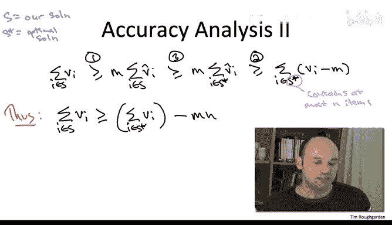

为了满足所需的精度约束，我们只需要将 M 设置得足够小，使得 `M * n <= ε * V_max` 即可。当然，将 M 设置得更小（使得 `M * n` 不大于更小的数）也是足够的。

因此，在我们的算法中，我们只需将 M 设置为使 `M * n` 等于 `ε * V_max` 的那个数。即：
`M = (ε * V_max) / n`

请注意，这些都是算法已知的参数：物品数量 n、客户提供的参数 ε，并且很容易计算最大物品价值 `V_max`。因此，算法可以据此设置 M。

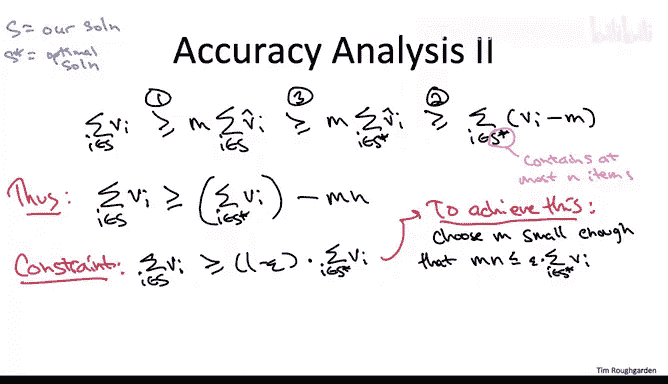

至此，我们完成了对第一个问题的回答：在 (1 - ε) 的精度约束下，我们可以使用的 M 最大为 `(ε * V_max) / n`。

## 运行时间分析 ⏱️

现在，我希望大家都屏住呼吸，因为记住，M 不仅控制精度，还控制运行时间。我们对数字的缩放越激进（M 越大），算法就越快。现在的问题是：我们是否被允许取足够大的 M，使得最终的启发式算法运行时间是多项式时间的？

启发式算法的运行时间主要由第二步决定，即调用动态规划子程序。该子程序的运行时间是 `n^2 * (传递给它的最大物品价值)`，也就是最大的缩放价值 `max_i V_hat_i`。

那么，关键问题是：这些缩放后的物品价值 `V_hat_i` 最大能有多大？


对于任意物品 i，`V_hat_i` 是通过取原始价值 `V_i`，向下舍入，然后除以 M 得到的。因此，`V_hat_i` 最大可能为 `V_i / M`，这显然至多是 `V_max / M`。

现在，代入我们对 M 的选择 `M = (ε * V_max) / n`。令人高兴的是，两个 `V_max` 相互抵消，只剩下 `n / ε`。

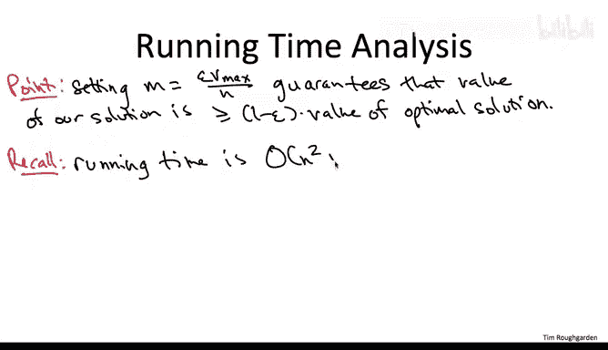

因此，每个传递给第二步动态规划子程序的转换价值的上界是 `n / ε`。代入运行时间公式，我们得到总运行时间为 `n^2 * (n / ε) = n^3 / ε`。

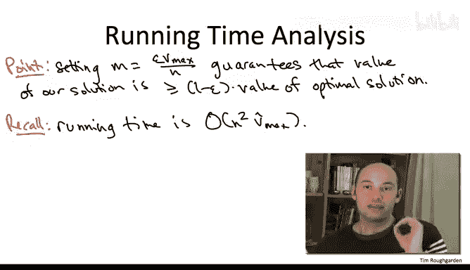

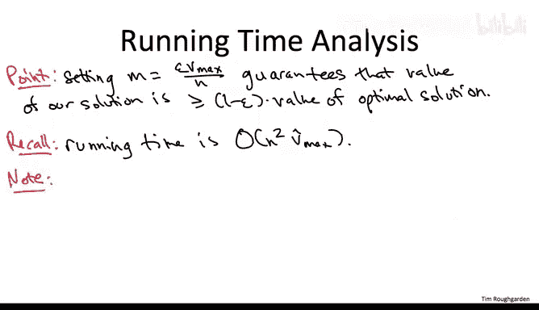

运行时间确实会随着 ε 的减小而增加（ε 越小，运行时间越长）。当然，对于任何 NP 完全问题，你都会预期到这一点。当 ε 越来越小时，你需要取更小的 M 来保证精度，这导致对物品价值的缩放不那么激进，从而传递给动态规划子程序的转换价值更大，运行时间也就更长。

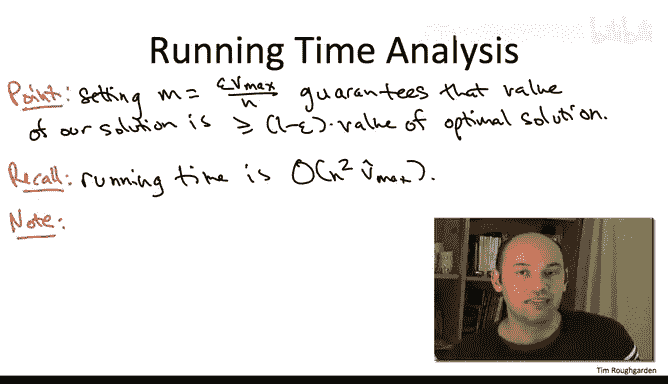

尽管如此，这个分析表明，对于背包问题，**完整的运行时间-精度权衡谱系是可能的**。如果你想要任意接近的近似解，你都可以通过此算法得到。

## 总结 📝

本节课中，我们一起学习了如何分析基于动态规划的背包问题启发式算法。

1.  我们首先回顾了算法的两个步骤：调整（舍入）物品价值和调用动态规划子程序。
2.  我们分析了参数 M 在精度与运行时间权衡中的作用。
3.  通过建立并串联三个关键不等式，我们推导出在保证 (1 - ε) 近似精度的前提下，M 的最大允许值为 `(ε * V_max) / n`。
4.  最后，我们评估了在此 M 值下算法的运行时间，证明其为 `O(n^3 / ε)`，这是一个多项式时间算法，并且可以通过调整 ε 来获得任意精度的近似解。

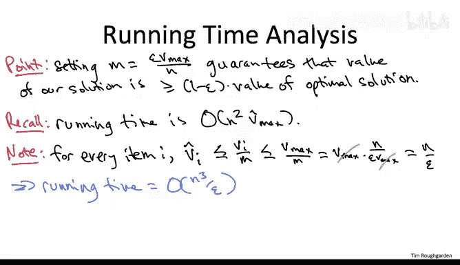

这个分析展示了如何通过巧妙的舍入和动态规划，为 NP 难的背包问题设计出有效的近似方案。