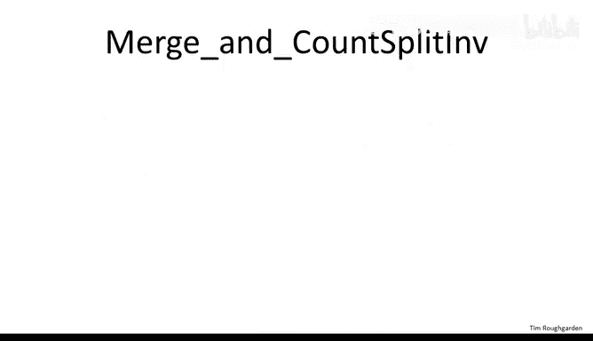
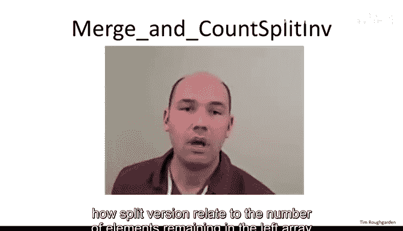
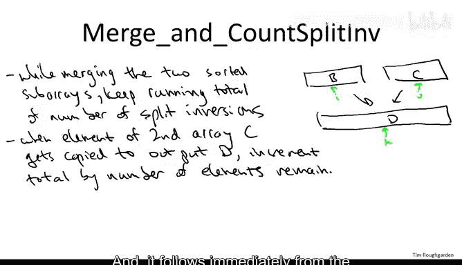

# 算法：15：计数逆序对的O(n log n)算法 II

## 概述
在本节课中，我们将学习如何高效地计算一个数组中的逆序对数量。我们将基于分治思想，并巧妙地利用归并排序的过程，在O(n log n)的时间内完成计数。

---

## 分治方法回顾
上一节我们介绍了使用分治法计算数组逆序对的基本思路。该方法将数组分成左右两半，递归地计算左半部分和右半部分的逆序对数量。

然而，分治法面临一个关键挑战：如何高效地计算“分裂逆序对”。分裂逆序对指的是一个元素在左半部分，另一个元素在右半部分，且左元素大于右元素的数对。这类逆序对不会被左右两边的递归调用所统计。

问题的核心在于，分裂逆序对的数量可能高达O(n²)，但我们必须在O(n)时间内完成统计，才能实现O(n log n)的总运行时间。

---

## 结合归并排序的巧妙想法
本节中我们来看看一个非常巧妙的想法，它能让我们实现目标。这个想法就是“搭载”在归并排序之上。

这意味着，我们将要求递归调用做更多的工作，以便让统计分裂逆序对的任务变得更简单。这类似于在数学归纳法中，有时需要加强归纳假设来推进证明。

我们将要求递归调用不仅统计传入数组的逆序对数量，还要在过程中对数组进行排序。为什么不呢？我们知道归并排序可以在O(n log n)时间内完成排序，而这正是我们追求的运行时间。所以，不妨加上排序这一步，也许它能在合并步骤中帮助我们。事实上，它确实会。

---

## 为什么要求递归调用做更多工作？
为什么我们要对递归调用提出更高的要求呢？正如我们将在接下来的几张幻灯片中看到的，归并子程序似乎就是为统计分裂逆序对数量而设计的。当你合并两个已排序的子数组时，你会自然地发现所有的分裂逆序对。

让我更清楚地说明，我们如何改进之前的高层算法，使得递归调用同时进行排序。

以下是之前提出的高层算法，我们只是递归地统计左右两边的逆序对，然后有一个尚未实现的子程序`CountSplitInv`来负责统计分裂逆序对的数量。

现在，我们将对这个算法进行如下增强：
*   我们将算法重命名为`SortAndCount`。
*   递归调用同样调用`SortAndCount`。
*   现在我们知道，每个递归调用不仅会返回子数组的逆序对数量，还会返回一个已排序的版本。
*   从第一个递归调用，我们将得到已排序的数组`B`。
*   从第二个递归调用，我们将得到已排序的数组`C`。
*   现在，`CountSplitInv`除了统计分裂逆序对，还负责合并两个已排序的子数组`B`和`C`。
*   因此，`CountSplitInv`将输出一个数组`D`，它是原始输入数组`A`的已排序版本。

为了反映其更宏大的目标，我们也应该重命名这个子程序，称之为`MergeAndCountSplit`。

我们不应该被要求合并子程序合并两个已排序子数组`B`和`C`的任务吓倒，因为我们已经知道如何在O(n)时间内完成合并。所以问题在于，在完成这项工作的同时，我们能否在额外的O(n)时间内统计分裂逆序对的数量？我们将看到这是可以的，尽管这并非显而易见。

---

## 归并如何揭示分裂逆序对
为了理解为什么合并过程能自然地揭示分裂逆序对的数量，让我们回顾一下归并排序中原始归并子程序的定义。

以下是我们在几个视频前看过的相同伪代码，我重命名了数组的字母以符合当前的符号表示。

我们得到两个已排序的子数组（来自递归调用），称之为`B`和`C`，长度均为`n/2`。我们的责任是生成`B`和`C`的已排序组合，即一个长度为`n`的输出数组`D`。

思路很简单：你取两个已排序的子数组`B`和`C`，以及你需要填充的输出数组`D`。使用索引`k`，你从左到右遍历输出数组`D`（这是外部`for`循环的作用）。你维护指针`i`和`j`，分别指向已排序子数组`B`和`C`的当前位置。唯一的观察是：无论尚未复制到`D`的最小元素是什么，它必须是`B`中尚未见过的最左元素，或者是`C`中尚未见过的最左元素。由于`B`和`C`已排序，剩余元素中的最小值必须是`B`或`C`中下一个可用的元素。

因此，你只需以显而易见的方式进行：比较两个候选的下一个要复制的元素，查看`B[i]`和`C[j]`，哪个更小就复制哪个。`if`语句的第一部分处理`B`包含较小元素的情况，`else`语句处理`C`包含较小元素的情况。

这就是归并的工作原理：你并行地遍历`B`和`C`，从左到右按排序顺序填充`D`。

---

## 无分裂逆序对的情况
为了理解这与数组的分裂逆序对有什么关系，请思考一个具有以下属性的输入数组`A`：该数组**没有任何分裂逆序对**。也就是说，这个输入数组`A`中的每一个逆序对要么是左逆序对（两个索引都≤ n/2），要么是右逆序对（两个索引都> n/2）。

现在的问题是：给定这样一个数组`A`，在合并步骤中，对于这样一个没有分裂逆序对的输入数组`A`，已排序的子数组`B`和`C`看起来是什么样子？

正确答案是第二个：**如果数组没有分裂逆序对，那么前半部分的所有元素都小于后半部分的所有元素**。

为什么？考虑逆否命题：假设前半部分有一个元素大于后半部分的任何一个元素，仅这一对元素就构成一个分裂逆序对。所以，如果你没有分裂逆序对，那么左半部分的所有元素都小于右半部分的所有元素。

更重要的是，思考一下在具有此属性的数组上执行归并子程序的情况，即在一个左半部分所有元素都小于右半部分所有元素的输入数组`A`上。

归并会做什么？记住，它总是在寻找剩余元素中较小的那个：`B`中剩余的第一个元素或`C`中剩余的第一个元素，并将其复制过去。那么，如果`B`中的所有元素都小于`C`中的所有元素，那么在`C`被触及之前，`B`中的所有元素都将被复制到输出数组`D`中。因此，在没有分裂逆序对（即分裂逆序对数量为零）的输入数组上，归并的执行过程异常简单：首先遍历`B`并复制其所有元素，然后直接连接`C`。两者之间没有交错。所以，没有分裂逆序对意味着在`B`耗尽之前，绝对不会从`C`复制任何元素。

这表明，从第二个子数组`C`复制元素可能与原始数组中的分裂逆序对数量有关，事实确实如此。我们将看到一个普遍模式：**从第二个数组`C`复制元素到输出数组的过程，揭示了原始输入数组`A`中的分裂逆序对**。

---

## 详细示例分析
让我们回到上一个视频中的例子，这是一个包含六个元素的数组：`[1, 3, 5, 2, 4, 6]`。

我们进行递归调用。实际上，数组的左半部分`[1, 3, 5]`和右半部分`[2, 4, 6]`都已经排序，所以递归调用中不会进行排序。你会从两个递归调用中得到零个逆序对。记住，在这个例子中，所有的逆序对都是分裂逆序对。

现在，让我们跟踪在这两个已排序子数组上调用的归并子程序，并尝试找出其与原始六元素数组中分裂逆序对数量的联系。

初始化索引`i`和`j`，分别指向这两个子数组的第一个元素。左边的是`B`，右边的是`C`，输出是`D`。

我们做的第一件事是将`B`中的`1`复制到输出数组。`1`被复制过去，我们将`B`的索引推进到`3`。这里没有发生什么有趣的事情，没有理由统计任何分裂逆序对。确实，元素`1`不涉及任何分裂逆序对，因为它比所有其他元素都小，并且它在第一个索引。

当我们从第二个数组`C`复制元素`2`时，事情变得有趣得多。注意，在这一点上，我们已经偏离了在无分裂逆序对数组上会看到的简单执行过程。现在，在耗尽`B`之前，我们从`C`复制了东西。我们希望这能揭示一些分裂逆序对。

我们复制了`2`，并将`C`的指针`j`向前推进。需要注意的关键点是：这揭示了**两个**分裂逆序对，即涉及元素`2`的两个分裂逆序对：`(3, 2)`和`(5, 2)`。

为什么会这样？原因是我们复制`2`是因为它小于`B`和`C`中所有我们尚未查看的剩余元素。特别是，`2`小于`B`中剩余的元素`3`和`5`。而且，因为`B`是左数组，`3`和`5`的索引必须小于这个`2`的索引。所以这些是逆序对：`2`在原始输入数组中更靠右，但它却小于`B`中这些剩余的元素。`B`中剩余两个元素，这就是涉及元素`2`的两个分裂逆序对。

现在让我们回到归并子程序，看看接下来会发生什么。接下来我们从第一个数组复制`3`，我们意识到从第一个数组复制时，至少就分裂逆序对而言，没有发生什么有趣的事情。然后我们复制`4`，再次发现一个分裂逆序对：`(5, 4)`。同样，原因是给定`4`在`B`中剩余元素之前被复制，它必须小于`5`，但因为它位于右半部分数组，它的索引必须更大。所以它必然是一个分裂逆序对。

现在，归并子程序的其余部分执行没有任何意外：`5`被复制（我们知道从左数组复制是“无聊”的），然后我们复制`6`（从右数组复制通常是有趣的，但如果左数组为空，则不涉及任何分裂逆序对）。

你会记得在之前的视频中，原始数组中的三个逆序对`(3,2)`、`(5,2)`和`(5,4)`，我们通过仅仅留意何时从右数组`C`复制，就以一种自动化的方式发现了它们。

---

## 一般性结论
这确实是一个普遍原则。让我陈述这个一般性主张。

**主张**：不仅在这个特定的例子或特定的执行过程中，而且无论输入数组是什么，无论可能有多少分裂逆序对，**涉及右半部分数组某个元素的分裂逆序对，恰好就是在该元素被复制到输出数组时，左数组中剩余的元素**。

这正是我们在例子中看到的模式。在右数组`C`中，我们有元素`2`、`4`和`6`。记住，每个分裂逆序对根据定义都涉及一个来自前半部分的元素和一个来自后半部分的元素。因此，对于分裂逆序对的计数，我们可以根据它们涉及的右数组元素进行分组。

对于`2`、`4`和`6`：
*   `2`涉及的分裂逆序对是`(3,2)`和`(5,2)`。`3`和`5`正是当我们复制`2`时`B`中剩余的元素。
*   `4`涉及的分裂逆序对是`(5,4)`。`5`正是当我们复制`4`时`B`中剩余的元素。
*   `6`不涉及任何分裂逆序对。确实，当我们将`6`复制到输出数组`D`时，`B`是空的。

**一般性论证**：这相当简单。让我们聚焦于左半部分数组（即前半部分元素）中的一个特定元素`x`，并检查哪些`y`（即原始输入数组右半部分的哪些元素）与`x`构成分裂逆序对。

有两种情况，取决于`x`是在`y`之前还是之后被复制到输出数组`D`。
1.  如果`x`在`y`之前被复制到输出数组`D`，那么由于输出是按排序顺序的，这意味着`x`小于`y`。因此，不会构成分裂逆序对。
2.  如果`y`在`x`之前被复制到输出数组`D`，那么同样因为我们是按排序顺序从左到右填充`D`，这必然意味着`y`小于`x`。此时`x`仍然留在左数组`B`中，所以它的索引小于`y`（`y`来自右数组）。因此，这确实是一个分裂逆序对。

将这两种情况结合起来，表明与`y`构成分裂逆序对的`B`中的元素`x`，正是那些将在`y`之后被复制到输出数组的元素。也就是说，它们恰好就是在`y`被复制时`B`中剩余的元素数量。这就证明了一般性主张。

这张幻灯片确实是关键的洞见。

---

## 算法实现与运行时间分析
既然我们完全理解了为什么在合并两个已排序子数组时统计分裂逆序对很容易，那么将其转化为代码并得到一个同时进行合并和统计分裂逆序对数量的线性时间子程序实现，就是一件简单的事情了。然后，在整体的递归算法中，它将具有与归并排序相同的O(n log n)运行时间。

让我们花一点时间填充这些细节。

我不会写出完整的伪代码，只会写出你需要如何增强几页前讨论的归并伪代码，以便在归并的同时统计分裂逆序对。这将直接遵循之前的主张，该主张指出了分裂逆序对与归并过程中左数组剩余元素数量的关系。

思路很自然：当你按照之前的伪代码合并两个已排序子数组时，只需维护一个运行总数，记录你遇到的分裂逆序对数量。

你有一个已排序子数组`B`，一个已排序子数组`C`，你将它们合并到一个输出数组`D`中。当你遍历`D`（`k`从1到`n`）时，将计数从零开始，每次从`B`或`C`复制一个元素时，你都将其增加某个值。

增量是多少？我们刚刚看到，涉及从`B`复制的操作不计入。当我们从`B`复制时，我们不看分裂逆序对，只有当我们从`C`复制时才看。每个分裂逆序对恰好涉及`B`和`C`各一个元素，因此我们不妨通过`C`中的元素来计数。一个给定的`C`元素涉及多少个分裂逆序对？恰好就是在它被复制时`B`中剩余的元素数量。

这告诉我们如何增加这个运行计数。从前一页的主张可以直接得出，这个运行总数的实现精确地统计了原始输入数组`A`所拥有的分裂逆序对数量。

回想一下，左逆序对由第一个递归调用统计，右逆序对由第二个递归调用统计。每个逆序对要么是左逆序对、右逆序对，要么是分裂逆序对，恰好是这三种类型之一。因此，通过这三个不同的子程序（两个递归调用和这里的合并计数），我们成功地统计了原始输入数组的所有逆序对。

这就是算法的正确性。

**运行时间是多少？** 回想在归并排序中，我们首先分析归并的运行时间，然后讨论整个归并排序算法的运行时间。让我们在这里也简要地做同样的事情。

这个同时进行合并和统计分裂逆序对数量的子程序的运行时间是多少？有我们在合并中所做的工作，我们已经知道那是线性的。这里唯一额外的工作是增加运行计数，这对于`D`的每个元素是常数时间（每次我们复制一个元素时，我们对运行计数进行一次加法操作）。所以每个元素常数时间，总体线性时间。

我在这里的表述有点不严谨，但这是非常常规的不严谨。通过写O(n) + O(n) = O(n)来表述。当你做这样的陈述时要小心：如果你把O(n)加到自己身上n次，那不会是O(n)；但如果你把O(n)加到自己身上常数次，它仍然是O(n)。作为练习，你可能想写出正式版本的含义。

基本上，存在某个常数C1，使得合并部分最多需要C1 * n步。存在某个常数C2，使得其余工作最多需要C2 * n步。当我们将它们相加时，我们得到最多(C1 + C2) * n步，这仍然是O(n)，因为C1 + C2是一个常数。

所以，归并的线性工作加上运行计数的线性工作，使得子程序总体上是线性工作。

现在，通过我们在归并排序中使用的完全相同论证，因为我们有两个对半大小数组的递归调用，并且在递归调用之外做线性工作，所以总体运行时间是O(n log n)。

因此，我们确实只是搭载在归并排序之上，在排序的同时进行计数，运行时间保持为O(n log n)。

---

## 总结
本节课中，我们一起学习了如何高效计算数组的逆序对数量。我们基于分治策略，并创造性地将计数过程与归并排序相结合。核心在于，在合并两个已排序子数组时，通过观察从右半部分数组复制元素的时机，可以线性时间内统计出所有的“分裂逆序对”。最终，我们得到了一个与归并排序时间复杂度相同（O(n log n)）的优雅算法。