# 斯坦福大学《算法（分治／排序／搜索／随机算法、图搜索／最短路径／数据结构、贪心算法／最小生成树／动态规划、最短路径／NP）｜Algorithms》中英字幕 - P161：33_04_03_最大割问题二.zh_en - GPT中英字幕课程资源 - BV1Rx4y1U7sZ

I'll approve this performance guarantee for you on the next slide。

 but let me first make a couple of comments。So first of all。

 the analysis of this algorithm stated in the theorem is tight。

 the 50% cannot be improved without making additional assumptions about the input。Indeed。

 here's an example which itself is even a bipartite graph。

 so it's a tractable special case of maximum cut， but even on bipartite graphs。

 the local searcheristic might return to you a cut which has merely 50% of the edges of a globally optimal maximum cut。

The example is drawn here in green， there's just four vertices and four edges。

 as I said it is a bipartite graph so the best cut is just to put U and W in one group and V and X in the other group that cuts all four of the edges。

On the other hand， one possible output of the local search algorithm is the cut where U and V are in one of the groups A。

 and W and X are the other group B。So this cut has only two crossing edges。

 only 50% of the maximum possible， yet it is locally optimal if you take any of the four vertices and you switch it to the other group。

 you get a cut with three vertices on one side and then the other vertex by itself。

 since every vertex in this graph has degree2， all of those cuts are also only going to have two crossing edges。

The second cautionary point that I need to tell you is that you maybe shouldn't be super impressed with a performance guarantee of 50% for the maximum cut problem。

 indeed， even if I just took a uniform at random cuts， by which I mean for each of the invertices。

 I flip independently a fair coin， if the coin comes up heads， I put that vertex in A。

 if the coin comes up tails I put that vertex in B。

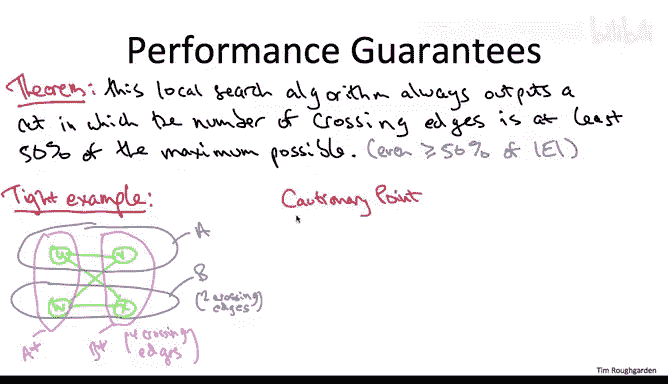

The expected number of edges that cross a random cut chosen in this way is already 50% of the edges of the graph。

Just for kicks， let me sketch a quick proof of this fact。Some of you may remember from part one。

 I introduced a decomposition principle for analyzing the expected value of complicated random variables you have a complicated random variable that you care about what you do。

 you express it as the sum of indicator random variables。

 random variables that only take on the values 0 and1 then you apply linearity of expectation that reduces computing the complicated expectation to a sum of simple expectations so it turns out that decomposition principle works beautifully to prove this fact。

The complicated random variable that we care about is the number of edges that cross a random cut。

 the constituents that are indicator 01 random variables are just whether or not a given edge crosses a random cut。

 that is for an edge E of this input graph G， I'm going to define the random variable x sub E to be one。

 if it's two endpoints wind up in different groups and zero。

 if it's two endpoints wind up in the same group。So what's the expected value of one of these indicator random variables x sub B Well as with any indicator random variable。

 that's just the probability that x sub E is equal to1。

 the probability that this edge E is cut by a random cut What's the chance of that Well let's say the endpoints of edge E are U and V。

 There's four possibilities U and V could both be in A U and V could both be in B U could be in A and V could be in B or you could be in B and V could be in A Each of those four outcomes is equally likely probability one fourth in the first two cases。

 this edge is not cut by the random cut the two endpoints are on the same side and the other two cases it is cut They're on different sides So it's a one half probability that this edge is cut in a random cut therefore the expected value of x sub B is one half。

And now we're good to go just by applying linearity of expectation so precisely what do we care about。

 we care about the expected number of edges across a random cut Well the number of edges crossing a cut is just by definition the sum of the x's over all of the edges E X is just whether or not a given edge crosses the cut so the expected value of the random variable we care about the number of crossing edges that's by linearity of expectation just the sum of the expected values of these indicator random variables。

 the x sub E's， each of those has value one half where summing up one for each of the edges so the total of the sum is just the number of edges divided by two as claimed。

Thanks for indulging my little digression again， the point of which is that just taking a random cut gives you a performance guarantee of 50% for the maximum cut problem。

 but in the defense of local search， which also only gets a 50% performance guarantee it took a while and in fact you have to work pretty hard do to get a performance guarantee better than 50% with a polynomial time algorithm for the max cut problem the most famous such algorithm is by Goms and Williamson that took till 1994 and it requires a tool called semidefinite programming。

 something that's even more powerful than linear programming。

Let's now prove that local search is guaranteed to output a cut whose number of crossing edges is at least half the total number of edges in the graph。

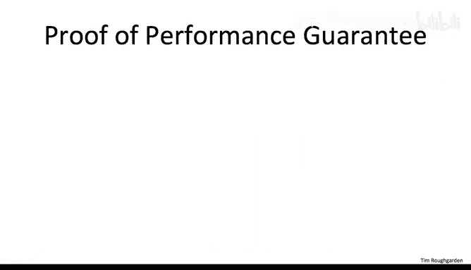

So pick your favorite locally optimal cut AB， and hereby locally optimal I just means something that the algorithm might return。

 that is a cut for which it's impossible to swap a single vertex from one side to the other and improve the value of the cut。

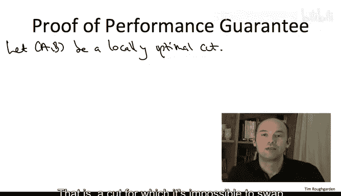

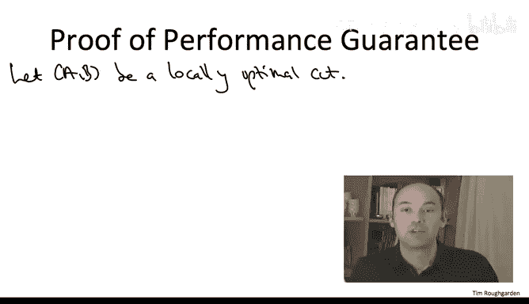

By virtue of being locally optimal， it must be the case that for this cut A B and for every single vertex of V。

 the number of edges incident to this vertex that are crossing the cut is at least as large as the number of vertees sees incident to this vertex that do not cross the cut。

 So in the previous notation， the C sub V is at least as big as D sub V。

 If not swapping V would give us a better cut。

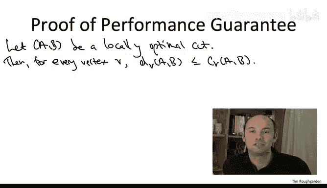

So we have n of these inequalities once for each vertex v so we can legitimately sum up those n inequalities。

 combining them into one。Now let's focus first on the right hand side of this summed up inequality。

 so the sum over all of the vertices in the graph of the number of edges incident to that vertex that are crossing the cut。

Now here's the main point what is this sum on the right hand side counting。

 it's counting each edge that crosses the cut AB exactly twice， consider an edge， say u comma W。

 which is crossing the cut AB， it gets counted twice in the its right hand side once when V equals U and once when V equals W。

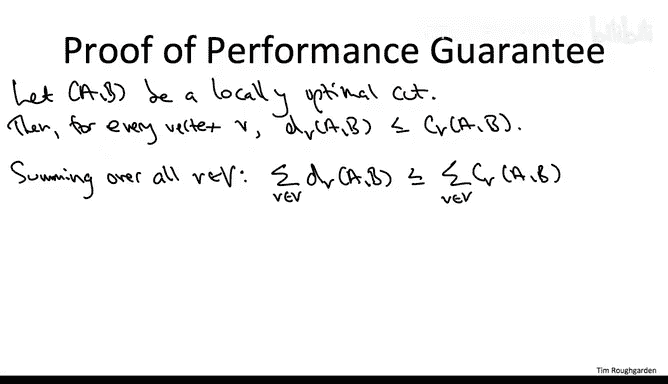

We can apply exactly the same reasoning to the left hand side what is this sum counting。

 it's counting each non crossssing edge exactly once consider an edge again a u comma x whose both endpoints are on the same side。

 that's going to be counted once in this sum when v equals U and then again when V equals x。

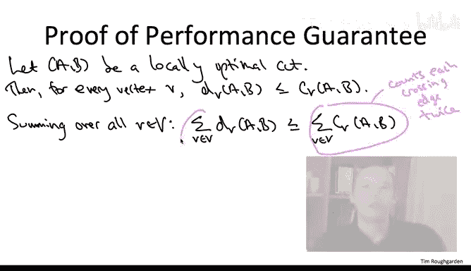

Now we want to compare the number of crossing edges of this locally optimal cut to the total number of edges。

 so on the left hand side we're missing the crossing edges so to complete that into all of the edges。

 let's just add double the number of crossing edges to both sides of this inequality。

On the left hand side， we get double of all of the edges。

 and now on the right hand side we have four times the number of crossing edges。

Dividing both sides of the inequality by4， we see we've proved of the theorem。

 the number of edges that cross a comma B is indeed a full 50% or more of the total number of edges in the graph。

It's interesting to discuss briefly how the conclusions we've reached for local search for Max cut extend to a natural weighted version of maximum cut。

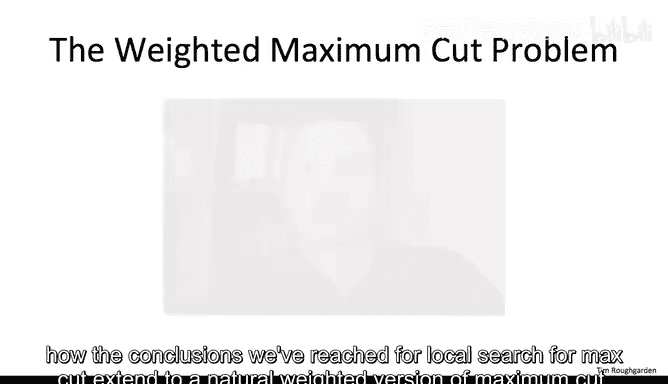

So which facts about the unweighted special case extend to the weighted case and which facts do not？

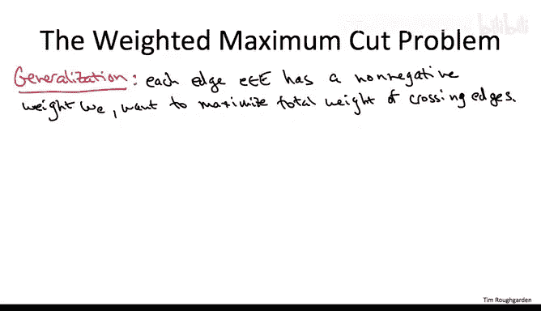

Well， it still makes perfect sense to take a local search approach to the weighted version of the maximum cut problem Now for each vertex and in a given cut。

 you just look at the total weights of the incident edges that are crossing the cut and the total weights of the incident edges。

 which are not crossing the cut。 and whenever the weights of the edges not crossing the cut is strictly bigger。

 that's an opportunity to improve the current cut by moving the vertex to the opposite side。

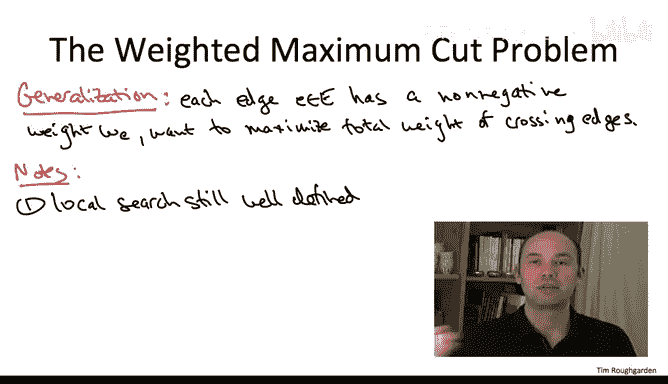

One cool thing is that the performance guarantee that we just established a 50% for the output of local search that carries over to the weighted case and the proof remains essentially the same。

 and I'll leave it for you to check that in the privacy of your own home。

Now it's also true that in the weighted case， a random cut still gets 50% of the total weight of the graph。

 so perhaps this performance guarantee is nothing really to write home about。

What breaks down is the running time analysis remember how this went for the unweighted case。

 we argued that there can be a most N choose two edges crossing any cut and since every iteration of local search increases the number of crossing edges it has to halt within a quadratic number of iterations and that means it's easy to implement the algorithm in polynomial time。

One way to think about what's special about the unweighted version of the maximum cut problem is that even though as we've seen。

 the graph has an exponential number of different cuts。

 all of those exponentially many cuts only take on a polynomial number of different objective function values。

 The number of crossing edges is somewhere between 0 and n choose 2 By contrast。

 once the edges can just have any old weights now you can have an exponential number of cuts with an exponential number of distinct objective function values of distinct values for their total weight。

 that means just because you're strictly improving the total weight crossing the cut in each iteration。

 it does not imply that you're going to converge in a polynomial number of iterations， and in fact。

 it's a highly nontrivial exercise to prove that there are instances of weighted maximum cut in which local search takes an exponential number of iterations before converging。

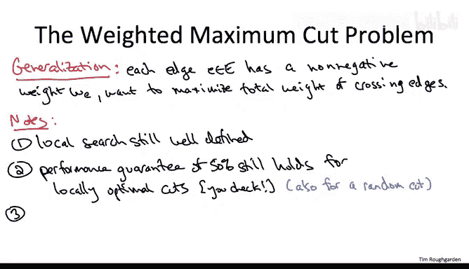