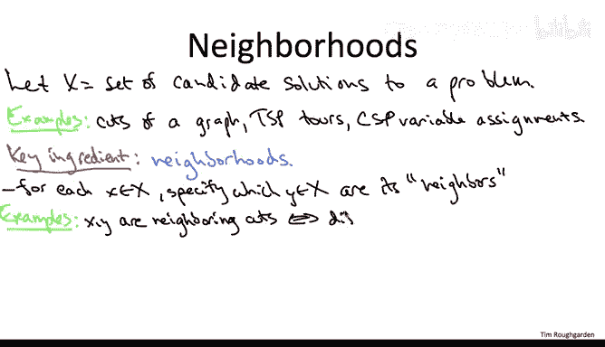
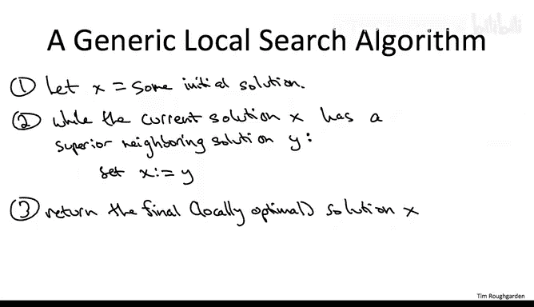

# 斯坦福大学《算法》课程：34：局部搜索原理一

## 概述
在本节课中，我们将学习局部搜索技术的一般原理。我们将从抽象层面理解局部搜索如何工作，探讨其核心组成部分，并分析在设计局部搜索算法时需要做出的关键决策。

---

## 候选解空间与邻域定义

上一节我们通过最大割问题的具体例子了解了局部搜索。本节中，我们将从更一般的角度来讨论这项技术。

让我们抽象地思考一个计算问题。假设存在一个候选解集合 **X**。你可能想搜索是否存在具有特定性质的解，或者想找到在某种意义下最优的解。

**例子**：
*   在我们上一节的视频中，**X** 是某个给定图 **G** 的所有割。
*   其他例子包括旅行商问题实例的所有环游，或者某个约束满足问题中变量的所有可能赋值。

局部搜索方法的一个基本要素是**邻域**的定义。也就是说，对于每个候选解 **x**（属于所有可能解的空间 **X**），你需要定义哪些其他解 **y** 是 **x** 的邻居。

以下是几个具体例子：
*   **最大割问题**：在上一节中，我们隐含地将一个给定割的邻居定义为，通过将单个顶点从一侧移动到另一侧所能得到的所有割。
*   **约束满足问题**：对于像 2-SAT 或 3-SAT 这样的问题，一种常见方法是定义两个变量赋值为邻居，当且仅当它们仅在一个变量的取值上不同。对于布尔变量（取值为真或假），这意味着通过翻转单个变量的值，可以从一个赋值得到另一个赋值。
*   **旅行商问题**：有很多合理的方式来定义邻域。一种简单且流行的方法是定义两个 TSP 环游为邻居，当且仅当它们在尽可能少的边数上不同。思考一下你会发现，两个 TSP 环游可能不同的最小边数是 **2**。例如，第一个环游可能包含边 **(U, V)** 和 **(W, X)**，而它的邻居环游则可能包含交叉边 **(U, X)** 和 **(V, W)**，两个环游的所有其他边都相同。

---

## 局部搜索通用流程

一旦你确定了计算问题的候选解空间，并为每个候选解确定了邻域，你就可以运行局部搜索了。局部搜索会迭代地改进当前解，总是移动到相邻的更好解，直到无法进一步改进为止。

我将在这里指定一个高度未确定的局部搜索版本，以强调在实际项目中应用局部搜索时需要做出的众多设计决策。我们将在接下来的几张幻灯片中讨论不同设计决策的可能实例化。

**通用局部搜索流程**：
1.  **初始化**：从某个候选解 **x** 开始搜索。
2.  **迭代改进**：
    *   检查当前解 **x** 的所有邻居 **y**。
    *   如果找到一个更优的邻居 **y**，则将当前解更新为 **y**。
    *   重复此过程。
3.  **终止**：如果当前解 **x** 的所有邻居都不比它更优，则 **x** 是局部最优解，算法终止并返回 **x**。

我们上一节讨论的最大割局部搜索算法，正是这个通用流程的一个实例化。其中，所有解的集合 **X** 就是给定图的所有割，并且定义两个割为邻居，当且仅当可以通过将单个顶点从一组移动到另一组来从一个割得到另一个割。

在那个算法中，我们从某个任意割开始，反复搜索更优的相邻解（即尝试查看是否有办法通过移动一个顶点来获得更好的割）。如果找到这样的更优邻居，我们就从那个更好的解开始迭代。当我们无法再迭代时（即没有更好的相邻割），我们就停止并返回最终结果。

你可以将这种通用的局部搜索过程以完全相同的方式应用于其他问题。例如，考虑旅行商问题。假设我们像上一张幻灯片那样定义邻域：两个环游是邻居当且仅当它们恰好有两条边不同，而其他 **n-2** 条边相同。你会怎么做？你从某个任意的 TSP 环游开始，然后迭代：不断寻找更优的相邻解。也就是说，从当前环游出发，考虑所有通过恰好改变当前环游的两条边所能到达的环游，检查其中是否有任何环游的成本严格更小。如果有，就从那个新的更优解开始迭代。当你无法再迭代时（即所有相邻解的成本都至少与你当前正在处理的解一样高），你就得到了一个局部最优环游，并将其作为最终输出返回。

---

## 局部搜索的设计决策与性能考量

在本视频的剩余部分，我将继续在高层面上讨论局部搜索，谈谈你需要做出的一些设计决策，以及可以预期的一些性能特征。在我们完成这个高层讨论之后，我们将继续学习局部搜索的另一个具体例子，特别是针对约束满足问题 2-SAT 的例子。

让我们从关于刚才展示的通用局部搜索流程中三个未确定特性的常见问题开始。

**问题一：如何选择初始起点 x？**

要回答这个问题，让我粗略地将你可能使用局部搜索的情况分为两类。

**第一类情况**：你确实依赖局部搜索来为优化问题找到一个良好的近似解。除了通过某种局部搜索方法外，你完全不知道如何接近最优解。

**第二类情况**：你已经有了一些相当好的启发式方法，似乎能为你的优化问题提供相当不错的解，你只想将局部搜索用作后处理步骤，以做得更好。

我们先从第一类情况开始，即你把所有希望都寄托在局部搜索上，需要它为你提供一个相当好的优化问题解。这是一个棘手的情况。局部搜索保证会给你一个局部最优解，但在许多问题中，局部最优解可能比全局最优解差很多。在最大割问题的特殊情况下，我们有一个 50% 的性能保证，这已经只是一个一般的保证。但对于大多数优化问题，即使是那种性能保证也是不可能的，存在比全局最优解差得多的局部最优解。另一方面，你知道存在一些好的局部最优解，特别是全局最优解本身也是一个局部最优解。

现在，如果你只运行一次局部搜索，很难评估返回给你的解的质量。你运行算法，它给你一个解，成本是 79217。这算好还是坏？谁知道呢？

一个明显的改进方法是多次运行局部搜索，比如数千次甚至数百万次，然后在你的局部搜索算法不同运行返回的所有局部最优解中，选择最好的一个作为最终解。

为了鼓励你的局部搜索算法在反复运行时返回不同的局部最优解，你需要在某些地方做出随机决策。一个极其常见的引入随机决策的点是在局部搜索的步骤 1，即选择初始起点 **x**。

**例子**：
*   在最大割问题中，你可能想从一个随机割开始，每个顶点以相等概率被分配到 A 或 B。
*   在旅行商问题中，你可能想从一个随机环游开始，即顶点的一个随机排列。
*   在约束满足问题中，你可以通过独立地给每个变量赋予随机值来开始。

如果这看起来有点像向飞镖盘扔飞镖，那确实如此。事实证明，对于许多极其困难的问题，最先进的技术并不比用不同的随机初始位置运行局部搜索的独立试验，并返回你找到的最佳局部最优解要好多少。

现在，假设你处于第二类更愉快的情况，你对优化问题有更好的把握。也许你已经知道如何使用贪心算法或数学规划，总之，你有一些技术可以为某些优化问题生成接近最优的解。但是，为什么不把这些接近最优的解变得更好呢？你该怎么做？将你当前启发式方法套件的输出，输入到一个局部搜索后处理步骤中。毕竟，局部搜索只会移动到更好的解，它只能让你已经相当好的解变得更好。

---

## 总结
本节课中，我们一起学习了局部搜索的一般原理。我们定义了**候选解空间**和**邻域**这两个核心概念，并概述了局部搜索的通用迭代流程：从初始解开始，不断移动到更优的邻居解，直到达到局部最优。我们还探讨了关键的设计决策，特别是如何选择**初始解**，并分析了在依赖局部搜索作为主要求解方法或作为后处理优化工具两种不同场景下的策略。理解这些基本原理，为我们接下来将局部搜索应用于具体问题（如 2-SAT）奠定了基础。