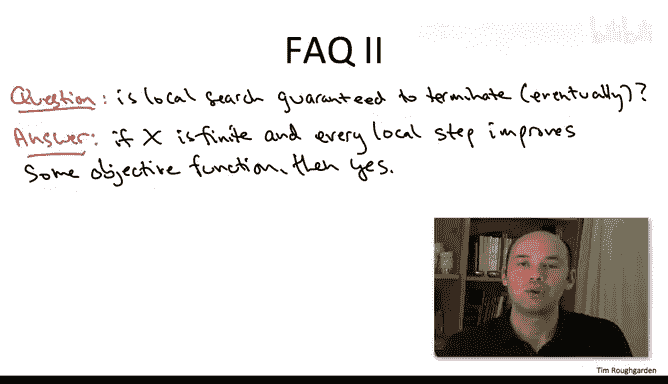
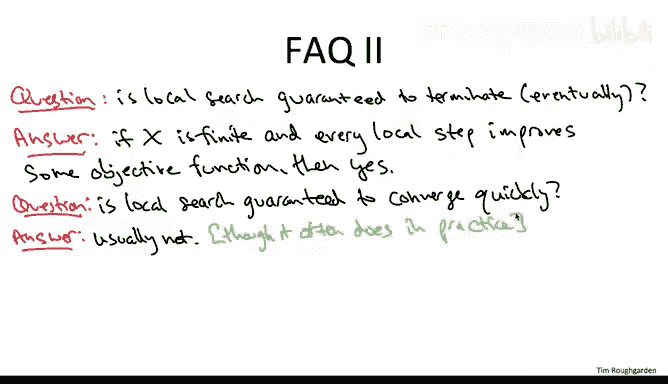

# 斯坦福大学《算法（分治／排序／搜索／随机算法、图搜索／最短路径／数据结构、贪心算法／最小生成树／动态规划、最短路径／NP）｜Algorithms》中英字幕 - P163：35_04_05_局部搜索原理二.zh_en - GPT中英字幕课程资源 - BV1Rx4y1U7sZ

Let's move on to the second sense in which the generic local search algorithm is underdetermined。

The mainwhile loop reads if there is a superior neighboring solution Y。

 then reset the current solution to be Y， but there may of course be many legitimate choices for y。

 for example in the maximum cut problem given a cut。

 there may be many vertices whose switch to the opposite group yields a cut with strictly more crossing edges。

 so when you have multiple superior neighboring solutions， which one should you choose。Well。

 this is a tricky question， and the existing theory does not give us a clearcut answer。 Indeed。

 it seems like the right answer is highly domain dependent。

 answering this question is probably going to require some serious experimentation on your part with the data that you're interested in。

 One general point I can make is that recall when you're using local search to generate from scratch an approximate solution to an optimization problem。

 you want to inject randomness into the algorithm to coax it to explore the solution space and return as many different locally optimal solutions as possible over a bunch of independent runs。

 You're going to remember the best of those locally optimal solutions and return remember the best one at the end of the day。

 So this is a second opportunity， in addition to the starting point where you can inject randomness into local search。

 If you have many possible improving values of why chooseose one at random。Alternatively。

 you could try to be clever about which y that you choose。 For example。

 if there's multiple superior neighboring whys， you could go to the best one， For example。

 in the maximum cut problem， if there's lots of different vertices who switch to the group will yield the superior cut。

 pick the vertex， which increases the number of crossing edges by the largest amount。

And the traveling salesman problem amongst all neighboring tourists with smaller cost。

 pick the one with the minimum overall cost。So this is a perfectly sensible rule about how to choose why。

 it is myopic and you could imagine doing much more sophisticated things to decide which why to go to next。

 and indeed if this is a problem you really care about。

 you might want to work hard to figure out what are the right heuristics for choosing why that work well in your application。

A third question that you have to answer in order to have a precisely defined local search algorithm is what are the neighborhoods for many problems there's significant flexibility in how to define the neighborhoods and theory again does not give clear-cut answers about how they should be designed Once again this seems like a highly domain dependent issue if you want to use local search on a problem of interest it's probably going to be up to you to empirically explore which neighborhood choices seem to lead to the best performance of the local search algorithm。

One issue it's likely you'll have to grapple with is figuring out how big to make your neighborhoods to illustrate this point。

 let's return to the maximum cut problem。 So there we define the neighbors of a cut to be the other cuts you can reach by taking a single vertex and moving it to the other group。

 This means each cut has a linear number O of n neighboring cuts。

But it's easy to make the neighborhood bigger if we want， for example。

 we could define the neighbors of a cut to be those cuts you can reach by taking two vertices or fewer and switching them to the opposite groups。

Now each cut is going to have a quadratic number of neighbors， more generally of course。

 we could allow what single local move to do k swaps of vertices between the two sides。

 and then the neighborhood size would be O of N to decay K。

So what are the pros and cons of enlarging your neighborhood sizes。 Well， generally speaking。

 the bigger you make your neighborhoods， the more time you're going to have to invest。

 searching for an improving solution in each step。 For example， in the maximum cut problem。

 if we implement things in the straightforward way。

 if we only allow one vertex to be swapped in an iteration。

 then we only have to search through a linear number of options to figure out if there's an improving solution or not。

 On the other hand， if we allow two vertices to be switched in a given iteration。

 we have to search through a quadratic number of possibilities to verify whether or not we're currently locally optimal。

 So the bigger the neighborhood， generally speaking。

 the longer it's going to take to check whether or not you're currently locally optimal or whether there's some better solution that you're supposed to move on to。

The good news about enlarging your neighborhood size is that you're going to have only fewer local optima。

 And in general， some of these local optima that you're pruning are going to be bad solutions that you're happy to be rid of。

 If you look back at the example I gave you in the previous video that demonstrated that the simple local search for maximum cut can be off by 50%。

 you'll see that if we just enlarge the neighborhoods to allow two vertices to be swapped in the same iteration。

 Then all of a sudden， on that four vertex example。

 local search will be guaranteed to produce the globally maximum cut。

 the bad locally optimal cuts have been pruned away。😊，Now。

 even if you allow two vertices to be swapped in a given iteration。

 there's going to be more elaborate examples showing that local search might be off by 50%。

 but on many instances， allowing this larger neighborhood will give you better performance from local search。

Summarizing one high levelvel design decision you should be clear on in your head before you apply the local searchuristic design paradigm to a computational problem is how much you care about solution quality versus how much you care about the computational resources required。

 if you care about solution quality a lot and you're willing to either weights or you're willing to throw a lot of hardware at the problem that suggests using bigger neighborhoods there's slower to search but you're likely to get a better solution at the end of the day。

 if you really want something quick and dirty。 you want it to be fast。

 you don't care that much about the solution quality that suggests using simpler。

 smaller neighborhoods that are fast to search knowing that some of the local optimalima you might get might not be very good。

Let me reiterate， these are just guidelines， these are not gospel in all computational problems。

 but especially with local search， the way you proceed has to be guided by the particulars of your application。

 so make sure you code up a bunch of different approaches， see what works， go with that。

For our final two questions， let's suppose you've resolved the initial three and you have a fully specified local search algorithm。

 so you've made a decision about exactly what your neighborhoods are。

 you've figured out the sweet spot for you between efficient searchability and the solution quality you're likely to get at the end of the day。

 you've made a decision about exactly how you're going to generate the initial solution and you've made a decision about how when you have multiple neighboring superior solutions。

 which one you're going to go to next。Now let's talk about what kind of performance guarantees you can expect from a local search algorithm。

 so let's first just talk about running time and let's begin with the most modest question。

 is it at least the case that this local search algorithm is guaranteed to converge eventually？

In many of the scenarios you're likely to come across， the answer is yes， here's what I mean。

Suppose you're dealing with a computational problem where the set of possible solutions is finite and moreover。

 your local search is governed by an objective function and the way you define a superior neighboring solution is that it's one with better objective function value This is exactly what we were doing in the maximum cut problem there。

 the space was finite， it was just the set of exponentially many graph cuts and our objective function was just the number of crossing cuts Similarlyly for the traveling salesman problem。

 the space is finite it's just the roughly n factorial possible tours and again。

 how do you decide which tour to go to next， you look for one that decreases the objective function value。

 the total cost of the tour。Whenever you have those two properties。

 finiteness and strict improvement and objective function， local search is guaranteed to terminate。

 you can't cycle because every time you iterate， you get something with a strictly better objective function value and you can't go on forever eventually you'll run out of the finitely many possible things to try。

There is of course no reason to be impressed by the finite convergence of local search after all brute force search equally well terminates in finite time。

 so this class is all about having efficient algorithms that run quickly so the real question you want to ask is local search guaranteed to converge in say polynomial time。

Here the answer is generally negative when we studied the unweighted maximum cut problem that was the exception that proves the rule that there we only needed a quadratic number of iterations before finding a locally optimal solution。

 but as we mentioned in passing， even if you just passed to the weighted version of the maximum cut problem。

 there already local search might need in the worst case。

 an exponential of iterations before halting with a locally optimal solution。In practice， however。

 the situation is rather different with local stricturistics often finding locally optimal solutions quite quickly。

We do not at present， have a very satisfactory theory that explains or predicts the running time of local search algorithms。

 If you want to read more about it， you might search for the keyword smooth analysis。

 Another nice feature of local search algorithms is that even if you're in the unlucky case where your algorithm is going to take a long time before it finds a locally optimal solution。

 you can always just stop it early。 So when you start the search you can just say， look。

 if after 24 hours you haven't found from me a locally optimal solution。

 just tell me the best solution you've found thus far。So in addition to running time。

 we want to measure the performance of a local search algorithm in terms of its solution quality。

 so is that going to be any good？So here the answer is definitely no and again the maximum cut problem was the exception that proves the rule that's a very unusual problem that you can prove at least some kind of performance guarantee about the local locally optimal solutions for most of the optimization problems in which you might be tempted to apply the local search design paradigm there will be locally optimal solutions quite far from globally optimalum ones Moreover。

 this is not just a theoretical pathology， local search algorithms in practice will sometimes generate extremely lousy locally optimal solutions。

So this ties back into a point we made earlier， which is if you're using local search not as a just postprocesing improving step。

 but actually to generate from scratch a hopefully near optimal solution to an optimization problem。

 you don't just want to run at once because you don't know what you're going get rather you want to run it many times making random decisions along the way either from a random starting point or choosing random improving solutions to move to so that you explore as best you can the space of all solutions you want over many executions of local search to get your hands on as many different locally optimal solutions as you can then you can remember the best one。

 hopefully the best one at least will be pretty close to a globally optimal solution。

