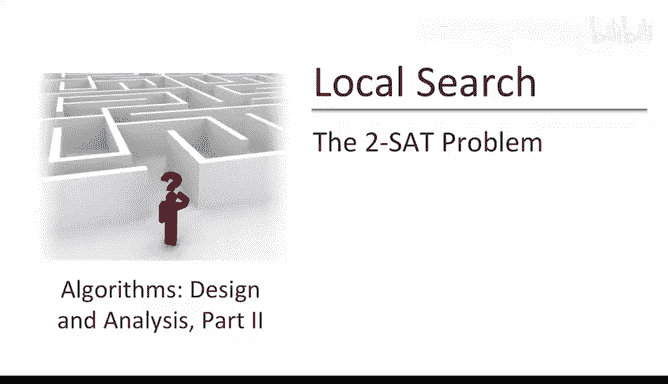
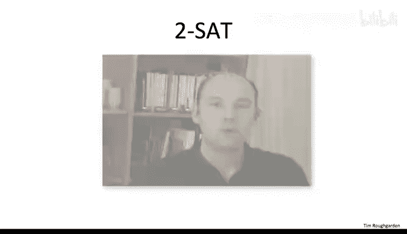
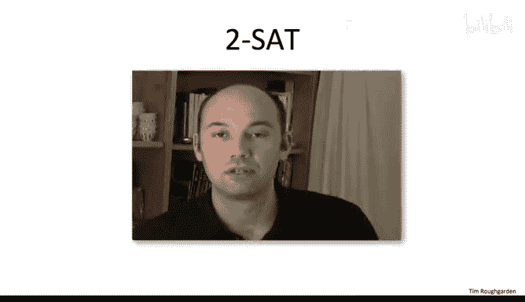
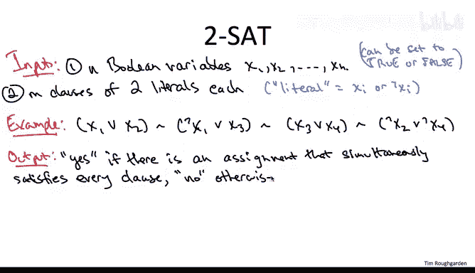
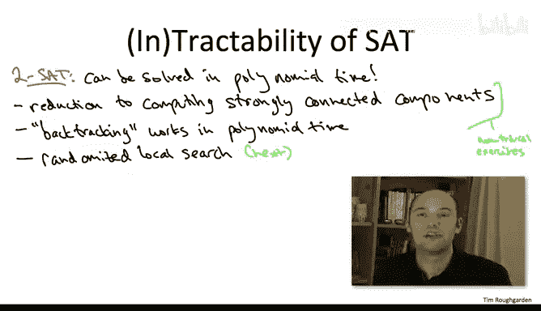
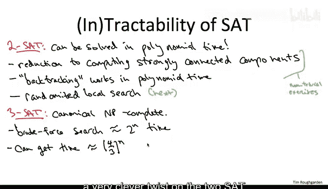
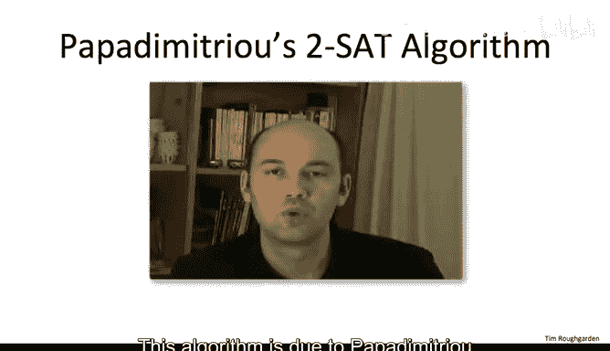
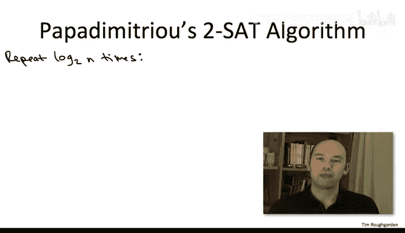
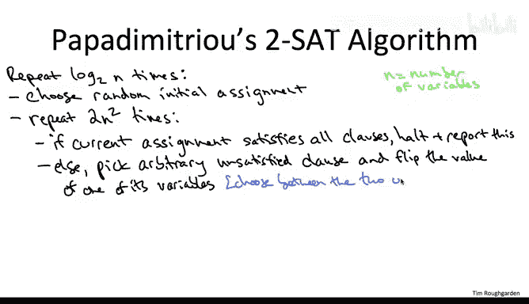

# 算法课程：P164：2-SAT问题



## 概述





在本节课中，我们将学习一个用于解决2-SAT问题的非典型局部搜索算法。该算法不寻常之处在于，它被证明能在多项式时间内解决这个重要且有趣的问题。2-SAT问题也为我们展示了局部搜索如何应用于约束满足问题。

## 2-SAT问题定义

我们之前已经多次提及SAT问题，现在让我们给出该计算问题的精确定义。

输入包含n个变量x1到xn，以及M个子句。每个变量都是布尔变量，即可以设置为真或假。每个子句是两个文字的析取（逻辑或）。文字可以是一个变量或其否定。

以下是一个例子，包含四个变量和四个子句：



*   第一个子句是 **x1 ∨ x2**。这个子句在x1为真或x2为真时得到满足。只有当x1和x2同时为假时，该子句才不满足。
*   第二个子句是 **¬x1 ∨ x3**。只有当x1为真且x3为假时，该子句才不满足。
*   第三个子句是 **x3 ∨ x4**。只有当x3和x4同时为假时，该子句才不满足。
*   第四个子句是 **¬x2 ∨ ¬x4**。只有当x2和x4同时为真时，该子句才不满足。

由于我们关心所有子句是否能被同时满足，通常用逻辑与符号连接这些子句。这就是一个2-SAT实例的样子。我们感兴趣的是一个决策问题：给定这样一个实例，我们想知道是否存在一种对n个变量的真值赋值，使得所有M个子句都得到满足。

## 2-SAT的可满足性

上面给出的2-SAT实例确实是可满足的，实际上存在不止一种满足赋值。以下是产生其中一种的方法：

1.  从第一个子句开始，要满足它，x1或x2必须设为真。我们设x1为真，这满足了第一个子句。
2.  现在看第二个子句。由于我们设x1为真，要满足第二个子句，必须设x3为真。我们就这样做。
3.  设x3为真不仅满足了第二个子句，也满足了第三个子句。
4.  最后剩下第四个子句。我们需要确保x2或x4为假。我们可以将它们都设为假。这样就满足了所有子句。

关于约束满足问题的计算易处理性（或难处理性），我们已经了解很多。2-SAT在这方面并不例外，我们知道关于它的许多事情。它的特殊之处在于它是多项式时间可解的。有多种方法可以证明这一点。

## 解决2-SAT的其他方法

学过第一部分课程的同学可能已经熟悉一种非常好的方法：将2-SAT问题归约到计算一个有向图的强连通分量。这种归约实际上表明2-SAT问题可以在线性时间内解决。

另一种确立其计算易处理性的方法是使用回溯算法。这里的回溯类似于我们在为顶点覆盖问题提供更快的指数时间算法时所做的工作，适用于具有小最优解的实例。

这两种证明计算易处理性的方法都不简单。这里不讨论它们，因为我们将把时间花在一个局部搜索算法上。

## 局部搜索算法概述

我们将重点讨论一个非常酷的随机局部搜索算法，它同样能在多项式时间内解决2-SAT实例。

需要澄清的是，正如我们之前讨论的，通常局部搜索算法不能保证在多项式时间内运行。即使在最大割问题的加权版本中也是如此。这个2-SAT例子是罕见的情况，我们可以证明它能快速收敛到正确答案。

局部搜索不仅可以用于识别可满足性的计算易处理版本，还可以改进对NP完全版本可满足性的朴素暴力搜索。



## 3-SAT问题

具体来说，让我们谈谈3-SAT问题。3-SAT与2-SAT类似，只是子句包含三个文字而不是两个。因此，2-SAT实例中的一个子句可以被视为禁止一对变量的四种可能联合赋值中的一种，而3-SAT实例中的一个子句可以被视为禁止三个变量的八种可能联合值中的一种。

将子句长度从2增加到3，问题就从计算易处理变为计算难处理。事实上，3-SAT在某种意义上是典型的NP完全问题。库克-列文定理通常被表述为“3-SAT是NP完全的”。

但仅仅因为它是NP完全的，并不意味着我们不能提出任何有趣的算法。暴力搜索会尝试变量的每一种可能赋值，这大约需要2^n的时间。值得注意的是，随机局部搜索可以显著改进朴素暴力搜索的运行时间。

## 局部搜索算法的优势



与大约2^n的运行时间相比，我们将要讨论的2-SAT算法（在多项式时间内运行）的一个非常巧妙的变体，用于3-SAT时，运行时间大约为(4/3)^n，远优于2^n。



这是一个相对较新的结果，大约只有十年历史，由Schöning提出。这里我们重点讨论如何使用随机局部搜索在多项式时间内解决2-SAT。对3-SAT的暴力搜索改进将留到以后讨论。

## Papadimitriou算法

这个算法由Papadimitriou在20多年前提出，其非常优雅的伪代码如下：



```
for j = 1 to 2n^2:
    if 当前赋值满足所有子句:
        return 当前赋值
    else:
        任选一个未被满足的子句C
        在子句C的两个变量中，随机均匀地选择一个变量v
        翻转变量v的值（真变假，假变真）
```

该算法有两个循环，但外循环的责任只是运行一定预算的独立随机试验。对于那些学过第一部分的同学，让我与Karger的随机收缩算法做个类比：对于那个最小割算法，我们有一个基本的随机算法，然后我们运行它很多次（很多独立试验），希望其中一次试验能找到最小割。这里的情况类似：算法的核心在内循环，它有一定的概率找到一个满足赋值，然后我们多次运行这个基本子程序，希望其中一次试验能找到满足赋值。

## 算法详解

从概念上讲，你应该只关注外循环的某一次固定迭代。它们都完全相同，只是使用不同的随机数。

在给定的一次外循环迭代中，我们将进行直接的局部搜索。我们必须指定解空间。解空间就是所有为n个变量分配真值的方式，即所有可能的赋值。我们必须指定相邻解。相邻解就是只在一个变量的值上不同的两个赋值。

我们必须决定从哪里开始局部搜索。我们将以最明显的方式进行随机化：从变量的均匀随机赋值开始。确定随机初始赋值后，我们就进行局部搜索，即不断翻转变量，试图提高当前赋值的质量。

这个算法与我们上一视频讨论的通用局部搜索算法略有不同的一点是：我将对我们在放弃之前进行的局部移动次数设置一个先验界限。一个明显的动机是，如果我们想要一个多项式时间算法，这将确保算法不会运行太多步骤。这个神奇的数字是2n^2，这是我们在放弃并返回到外循环的下一次独立试验之前将进行的变量翻转次数。记住，n表示变量的数量。

在内循环的每一代中，我们首先检查当前赋值是否确实可满足，即是否满足所有子句。如果是，我们就完成了，停止并报告这一事实。

假设当前赋值不满足。这意味着存在一个或多个子句当前未被满足。例如，可能有一个涉及变量x3和x7的子句，我们不幸地将x3设为真，x7设为假，而这正是该子句所禁止的联合值，即该子句可能是¬x3 ∨ x7。

接下来我们做什么？我们进行局部搜索的一次迭代。我们尝试改进我们的赋值。我们怎么做？我们选择一个未被满足的子句。如果有很多这样的子句，我们任意选择一个，然后尝试通过翻转该子句中一个变量的值来修正这个子句。

在我们的例子中，我们要么将x3从真翻转为假，这将满足该子句；要么将x7从假翻转为真，这也将满足该子句（假设子句是¬x3 ∨ x7）。这两个变量翻转中的任何一个都会成功地将该子句从未满足变为满足。你可以考虑各种关于决定翻转两个变量中哪一个的巧妙启发式方法，但我们将采用最简单的方式：我们以50-50的概率在两者之间随机选择。



## 算法的潜在风险

现在，是什么让这个算法思考起来如此令人担忧？我猜测这个非常优雅的算法在1991年之前没有被分析的原因之一是，当你翻转其中一个变量时，你可能会造成一些严重的损害。我的意思是，是的，你开始时关注的那个约束将从未被满足变为被满足。但就你所知，所有其他子句可能会从被满足变为未被满足。

例如，你取变量x3并将其从真翻转为假。这对¬x3 ∨ x7这个子句来说很棒，它变为真，变为被满足。但可能还有无数其他子句，其中x3以非否定形式出现，比如x3 ∨ 其他变量。也许通过将x3从真切换到假，其中一些子句现在变得不满足了。因此，当你进行这种局部搜索迭代时，你并不总是在增加被满足子句的数量。在这个意义上，这是一个非常非标准的局部搜索算法。

## 算法终止与正确性

为了完成对这个算法的描述，我必须告诉你如果它从未找到满足赋值会发生什么。当然，如果它找到了这样的赋值，它会适可而止，直接返回那个满足赋值。但在所有这些2n^2 log n步之后，如果它从未找到满足赋值，它会做一件非常傲慢的事情：它直接声明，如果我没找到满足赋值，我认为它不存在。

关于这个用于2-SAT的随机局部搜索算法，我们可以做出两个明显的正面陈述。首先，它以概率1在多项式时间内运行，无论算法的随机抛硬币结果如何。这是因为我们明确控制了局部搜索的迭代次数，它是O(n^2 log n)。因此，即使是你能想象到的最草率的实现，它也将在多项式时间内运行。

让我们转向正确性问题，并将2-SAT实例分为可满足的（存在满足赋值）和不可满足的。这个局部搜索算法的第二个明显的好属性是，如果你输入一个不可满足的实例，它总是正确的。为什么？在这样的实例上，算法会做什么？它会在这些2n^2 log n步中，在可能的赋值中翻找，尝试不同的赋值。显然，没有一个会是满足的，因为不存在满足赋值。最终，算法将正确得出结论：该实例确实是不可满足的。

## 关键问题

但关键问题是，在可满足的实例上会发生什么？如果在指数级大的赋值空间中，存在某个满足所有赋值的赋值，这个算法能否在仅仅2n^2 log n步内找到一个？

现在我必须稍微调整一下这个问题。这毕竟是一个随机算法，有微小的概率随机抛硬币会合谋阻碍算法找到满足赋值。所以我真正想问的是：是否可能以非常接近1的概率，在每个可满足的2-SAT实例上，这个简单的随机局部搜索算法实际上都能找到一个满足赋值？

## 总结

本节课中，我们一起学习了Papadimitriou提出的用于解决2-SAT问题的随机局部搜索算法。我们了解了2-SAT问题的精确定义，探讨了其可满足性，并对比了解决该问题的其他方法（如图强连通分量归约和回溯算法）。我们重点剖析了这个局部搜索算法的伪代码、执行步骤以及其潜在的风险（翻转变量可能破坏其他已满足子句）。最后，我们讨论了算法的运行时间（多项式时间）和正确性（对不可满足实例总是正确，对可满足实例能以高概率找到解）。这个算法展示了局部搜索在解决特定约束满足问题上的强大能力和理论保证。