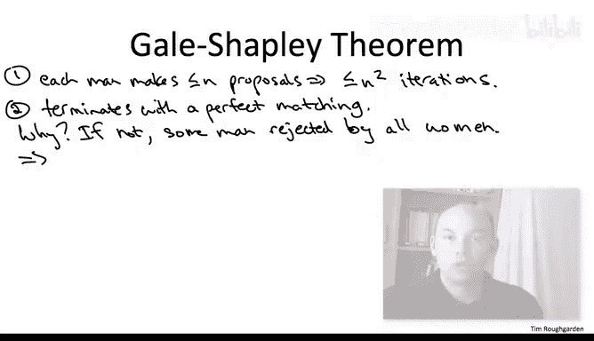

# 算法设计分析：39_04_01：稳定匹配（可选）🎯


在本节课中，我们将要学习一个经典且有趣的算法问题——稳定匹配。我们将了解其定义、应用场景，并学习一个著名的算法来求解它。稳定匹配问题在经济学、计算机科学等多个领域都有重要应用，例如大学招生、医疗住院医师匹配等。

---

## 概述

在算法设计与分析课程中，我们已经学习了许多著名算法、基础数据结构以及关键应用。尽管课程内容已经非常充实，但仍有一些重要的主题未能涵盖。在接下来的内容中，我们将简要介绍一些未涉及的技术，例如二分图匹配和最大流问题，并希望激发大家进一步学习的兴趣。算法领域充满活力，仍有许多基础问题和模型有待探索。

---

## 稳定匹配问题定义

稳定匹配问题可以被视为一个图论问题。图中有两组节点，分别用大写字母 **U** 和 **V** 表示。为方便起见，我们通常称这两组节点为“男士”和“女士”。一个非必要的简化假设是，这两组节点的数量相等，记这个共同的数量为 **n**。

例如，当 **n = 3** 时，第一组节点可以是 **A, B, C**，第二组节点可以是 **D, E, F**。

稳定匹配问题的关键在于，每个节点都有对其他节点的偏好排序。具体来说：
*   每个 **U** 中的节点都对 **V** 中的所有节点有一个排名列表。
*   每个 **V** 中的节点都对 **U** 中的所有节点有一个排名列表。

在这个例子中，假设所有左侧节点（A, B, C）的偏好一致：**D > E > F**。而右侧节点的偏好则各不相同：
*   **D** 的偏好：**A > B > C**
*   **E** 的偏好：**B > C > A**
*   **F** 的偏好：**C > A > B**

这些节点和排名列表可以代表许多现实场景。例如，一组是大学，另一组是申请者；或者一组是医院，另一组是寻求住院医师职位的医学院毕业生。双方都根据各自的偏好对对方进行排序。

给定这些数据（两组节点和它们的偏好列表），我们的目标是计算一个**稳定匹配**。

---

## 什么是稳定匹配？

首先，稳定匹配必须是一个**完美匹配**。完美匹配意味着 **U** 中的每个节点都恰好与 **V** 中的一个节点配对，反之亦然。

除了是完美匹配，它还必须满足**稳定性**，即不存在“阻碍对”。这意味着，对于任意一对没有匹配在一起的节点 **u**（来自 **U**）和 **v**（来自 **V**），他们不匹配必须有充分的理由。具体来说，要么 **u** 严格更喜欢它当前的匹配对象 **v'** 而不是 **v**，要么 **v** 严格更喜欢它当前的匹配对象 **u'** 而不是 **u**。

这个定义有现实动机。如果一个完美匹配不满足稳定性，那么存在一对未匹配的节点 **u** 和 **v**，他们都更倾向于对方而不是自己当前的伴侣。这将促使他们“私奔”，从而破坏整个匹配安排。例如，在学生与大学的匹配中，这样的不稳定对会促使学生和大学私下达成协议，破坏原有的录取结果。

---

## Gale-Shapley 算法 🧠

现在，我们来介绍一个极其优雅且著名的算法，用于计算稳定匹配：**Gale-Shapley 求婚算法**。Lloyd Shapley 因其在此算法上的贡献，于 2012 年获得了诺贝尔经济学奖。

我们将通过一个例子来解释算法，然后给出通用的伪代码。

我们从空匹配开始，即没有人匹配任何人。只要还存在某个未匹配的“男士”（左侧节点），我们就任意选择一个未匹配的男士 **u**，让他向他偏好列表中尚未拒绝过他的、排名最高的“女士”（右侧节点）求婚。

让我们用之前的例子来演示：
1.  初始状态：无人匹配。
2.  选择未匹配的男士 **C**。**C** 向他最喜欢的女士 **D** 求婚。**D** 暂时接受。
3.  选择未匹配的男士 **B**。**B** 也向他最喜欢的女士 **D** 求婚。**D** 比较 **B** 和 **C**，根据她的偏好（**B > C**），她拒绝 **C** 并与 **B** 暂时订婚。
4.  选择未匹配的男士 **A**。**A** 向他最喜欢的女士 **D** 求婚。**D** 比较 **A** 和 **B**，根据她的偏好（**A > B**），她拒绝 **B** 并与 **A** 暂时订婚。
5.  现在 **B** 和 **C** 未匹配。选择 **C**。**C** 的下一个选择是 **E**（因为已被 **D** 拒绝）。**E** 暂时接受 **C**。
6.  选择 **B**。**B** 的下一个选择是 **E**（因为已被 **D** 拒绝）。**E** 比较 **B** 和 **C**，根据她的偏好（**B > C**），她拒绝 **C** 并与 **B** 暂时订婚。
7.  最后，**C** 未匹配。**C** 向他列表中最后的女士 **F** 求婚。**F** 接受（**C** 是她的首选）。

最终得到的完美匹配是：**A-D**, **B-E**, **C-F**。可以验证这是一个稳定匹配。

---

### 算法伪代码

以下是 Gale-Shapley 算法的通用伪代码描述：

```
初始化所有男士和女士为未匹配状态
while 存在一个未匹配且仍有可求婚女士的男士 u:
    令 w 为 u 的偏好列表中，尚未拒绝过他的、排名最高的女士
    if w 未匹配:
        u 和 w 暂时订婚
    else: // w 已与 m‘ 订婚
        if w 更喜欢 u 而不是 m‘:
            解除 w 与 m‘ 的婚约
            u 和 w 暂时订婚
        else:
            w 拒绝 u
```

该算法维持一个不变性：当前的订婚集合总是一个匹配（不一定完美）。每个男士最多与一位女士订婚，每位女士也最多与一位男士订婚。

---

## 算法正确性证明 ✅

Gale-Shapley 定理指出，该算法不仅会快速终止（最多 **O(n²)** 次迭代），而且会终止于一个**稳定匹配**。这实际上构造性地证明了稳定匹配总是存在，这是一个非常不显然的事实。

证明分为三个部分：

**1. 算法在 O(n²) 步内终止。**
因为每个男士最多向每位女士求婚一次，所以总求婚次数不超过 **n * n = n²** 次。



**2. 算法终止时得到一个完美匹配。**
用反证法。假设终止时某位男士 **u** 未匹配，这意味着他向所有 **n** 位女士求婚并被全部拒绝。但一位女士只有在有更优的求婚者时才会拒绝他人。因此，**u** 被所有女士拒绝意味着所有女士在算法过程中都曾被求婚并订婚过。算法中，女士一旦订婚，之后只会更换为更优的伴侣，不会恢复单身。所以终止时所有女士都处于订婚状态。由于男女数量相等，所有女士都订婚意味着所有男士也必须订婚，这与 **u** 未匹配矛盾。因此，终止时必为完美匹配。

**3. 算法得到的完美匹配是稳定的。**
我们需要证明不存在阻碍对。考虑任意一对未匹配的男士 **u** 和女士 **v**。
*   **情况一**：**u** 从未向 **v** 求过婚。这意味着 **u** 在算法中与他最终匹配的女士 **w** 求婚时，**w** 在 **u** 的偏好列表中排在 **v** 之前，即 **u** 更喜欢 **w** 而不是 **v**。因此 **(u, v)** 不是阻碍对。
*   **情况二**：**u** 曾向 **v** 求过婚。那么他们最终未匹配，必定是因为 **v** 在当时（或之后）接受了一个她比 **u** 更喜欢的男士的求婚。在算法中，女士的伴侣只会越来越好。因此，在算法终止时，**v** 的伴侣 **m‘** 一定是她比 **u** 更喜欢的人。因此 **(u, v)** 也不是阻碍对。

由于 **(u, v)** 是任意未匹配对，故该匹配是稳定的。

---

## 总结

本节课我们一起学习了经典的**稳定匹配问题**。我们了解了其定义，即一个不存在“阻碍对”的完美匹配。我们重点学习了著名的 **Gale-Shapley 求婚算法**，该算法通过多轮“求婚”和“选择”的简单过程，总能找到一个稳定匹配。我们还概述了该算法的正确性证明，包括其终止性、完美匹配性和稳定性。这个算法不仅优美高效，而且在实际生活中有广泛的应用，是算法设计中一个重要的典范。