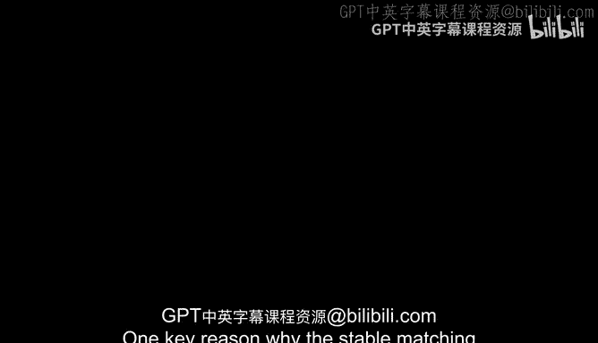
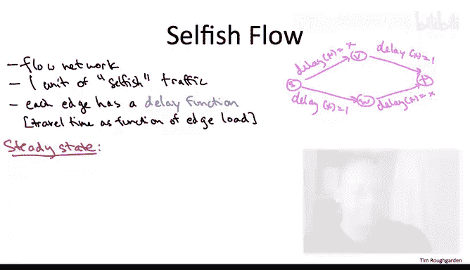

# 算法：P168：匹配、流量与布雷斯悖论（可选）🚦

在本节课中，我们将学习三个相互关联的核心概念：二分图匹配、最大流问题，以及一个有趣的现象——布雷斯悖论。我们将了解如何将匹配问题转化为流问题，并探讨在自私用户行为下，网络“改进”反而可能导致整体性能下降的悖论。

---

## 二分图匹配问题

上一节我们讨论了稳定匹配问题，它存在高效解的一个关键原因是，**原则上**可以将任意节点与另一侧的任意节点匹配。虽然节点有偏好，可能不希望与某些节点匹配，但并没有硬性约束阻止某些配对。

当存在这种硬性约束时，我们就得到了经典的**二分图匹配问题**。

二分图匹配问题的输入是一个二分图。这意味着可以将顶点分为两组，一组称为 **U**，另一组称为 **V**。每条边恰好连接两组中的一个顶点。换句话说，存在一个图的切割，能切断每一条边。

目标是计算一个**匹配**。匹配是指一个边的子集，其中任意两条边都没有公共端点。我们的目标是计算**规模最大**的匹配。

例如，在右侧的粉色图中，存在多个由三条边组成的匹配。可以验证，图中不存在完美匹配（即无法找到包含四条边的匹配）。

二分图匹配是一个极其基础的问题，它涉及在存在配对约束的情况下，尽可能多地配对对象。

好消息是，最大匹配问题可以在多项式时间内解决。事实上，不仅在二分图中（我们这里讨论的），甚至在一般的非二分图中，该问题也是多项式时间可解的。非二分图的情况需要更复杂的算法，而二分图的情况可以轻松地归约到另一个你应该知道的问题——**最大流问题**。

接下来，我们将描述最大流问题。为什么二分图匹配可以归约为最大流问题，这留给你作为一个很好的练习。

---

## 最大流问题

最大流问题可以在无向图或有向图中研究。有向图的情况在某种意义上更为通用。

以下是问题的定义：
*   **输入**：一个有向图。
*   **特殊顶点**：一个称为**源点 S**，另一个称为**汇点 T**。
*   **容量**：每条边 **e** 有一个容量 **c(e)**，表示该边可以容纳的最大流量或交通量。

非正式地说，目标是在尊重各边容量的前提下，从源点 **S** 向汇点 **T** 推送尽可能多的“东西”。你可以将其类比为从 **S** 产生的电流流向 **T**，或者从 **S** 注入、流经代表管道的边、最后从 **T** 排出的水流。关键在于，除了 **S** 和 **T** 之外，每个顶点都满足**流量守恒**，即流入的量必须等于流出的量。**S** 是流量产生的地方，**T** 是流量流出的地方。

作为一个简单示例，假设在右侧的粉色网络中，我给每条边分配容量为 1。在这个网络中，你可以从 **S** 推送到 **T** 的最大流量是 2 个单位。实现方法是：通过顶部路径 **S -> V -> T** 发送 1 个单位，通过底部路径 **S -> W -> T** 发送第二个单位。

好消息是，最大流问题可以在多项式时间内精确求解。有许多方法可以实现，有许多不同的酷算法可以解决最大流问题。最简单的方法本质上是**贪心算法**，即一次沿着一条路径路由流量。

需要指出的一点是，最大流问题最明显的贪心方法**并不奏效**。最明显的做法是：找到一条每条边都有剩余容量的路径，沿着该路径发送流量，然后重复。

这个朴素贪心算法的次优性在本幻灯片所示的四顶点网络中已经很明显了。

假设在第一次迭代中，你选择沿着路径 **S -> V -> W -> T** 推送流量。这条路径有三条边，容量均为 1，因此你可以沿着这条曲折的路径推送 1 个单位的流量。但如果你这样做，你就同时阻塞了其他路径（**S->V->T** 和 **S->W->T**），无法再沿着这些路径发送更多流量。因此，这个朴素的贪心算法只计算出了值为 1 的流，而我们已知最大流值为 2。

因此，必须采用一个更宽泛的**增广路径**概念，允许沿反向发送流量，这实际上相当于撤销之前迭代的增广。有了这个更宽泛的增广路径定义，由此产生的贪心算法确实能保证计算出最大流。

此外，如果你在贪心算法的每次迭代中聪明地选择使用哪条增广路径，你可以证明其运行时间界限是多项式的。实际上，也存在许多不基于增广路径的多项式时间算法来解决最大流问题。

事实上，最大流问题解决方案的多样性，让我很难给你一个关于该问题运行时间的简洁结论。但大致来说，我们还没有达到近似线性时间的算法，但我们有很多算法并不比这差太多，比如在二次方范围内（例如，类似贝尔曼-福特算法的 M * N 运行时间界限）。在实践中，许多这些算法的表现远好于二次方。

一件很酷的事情是，尽管最大流问题非常经典（增广路径算法最早由福特和富尔克森在 20 世纪 50 年代研究），但在 21 世纪，我们仍然看到了一些关于最大流的非常好的新进展，例如基于随机抽样或与电网连接的新算法。

---

## 自私路由与布雷斯悖论

在某些流网络的应用中，流量不是由某个集中式算法计算出来的，而是由许多参与者的行为产生的。例如，当你开车从家到公司时，没有人告诉你必须走哪条路线，而是你根据自己的偏好选择从家到公司的路线，比如你可能选择可用的最短路线。

这种网络中的自私行为是 21 世纪的一个主要研究课题。让我向你展示一个有趣的、适合在鸡尾酒会上谈论的例子，叫做**布雷斯悖论**。

想象我们有一个流网络（你可以把道路交通看作一个简单的例子）。让我们关注这样一个情况：一群早晨的通勤者从一个共同的郊区（用顶点 **S** 表示）出发，前往附近的城市（用顶点 **T** 表示），他们大致在同一时间出发，并且都可以选择他们想要的、从 **S** 到 **T** 的任意路线。

为了更好地反映交通网络中的问题，我们不再将链路视为具有容量，而是认为它们具有**延迟函数**。对于每条边，都有一个函数，描述随着使用该边的交通量变化，所有交通所承受的旅行时间是多少。正如你从自身经验所知，道路越拥堵，通过该道路所需的时间就越长。

作为说明，在右侧的粉色网络中，我们给两条道路赋予恒定的延迟函数，始终等于 1。这些道路可以看作是拥有无限车道，但也相当长。因此，无论有多少交通使用它，通过其中一条道路总是需要 1 小时。

相比之下，另外两条道路的旅行时间会随着拥堵而增加。为了简单起见，我们使用恒等函数，因此如果 100% 的交通使用其中一条道路，则需要 1 小时；如果 50% 的交通使用其中一条道路，那么所有这些交通通过该道路需要半小时，依此类推。

现在让我们看看这个粉色网络。我们有一个单位的自私交通（代表成百上千名选择自己从 **S** 到 **T** 路线的司机）。假设司机只想尽快到达 **T**，他们希望最小化旅行时间。问题是，这种聚合的自利行为会产生哪种流？

两条路线完全对称。每条路线都有一条总是需要 1 小时的道路，以及第二条旅行时间与使用它的交通比例成正比的道路。由于对称性，一旦达到稳定状态，我们预计一半的交通使用顶部路径，一半的交通使用底部路径。在 50/50 的交通分配下，两条路线的总旅行时间都是 1.5 小时。

现在，我提到了布雷斯悖论。那么悖论是什么？想象我们认为这 1.5 小时的旅行时间完全无法接受。此外，想象我们拥有一种新技术，有人刚刚发明了一种传送装置，我们想将其安装在这个网络中，以便人们能比以前更快地到达工作地点。让我们在顶点 **V** 安装一个这样的传送器，允许人们瞬间旅行到顶点 **W**。我们在粉色网络中增加第五条从 **V** 到 **W** 的边来表示这一点，其延迟函数恒等于零。

那么，增加这个允许你从 **V** 瞬间移动到 **W** 的传送装置会带来什么后果呢？

假设你是这些司机中的一员，目前正忍受着 1.5 小时的通勤时间。毫无疑问，你会想放弃旧路线来使用这个新传送器。你会想把你的旧路径（无论是 **S->V->T** 还是 **S->W->T**）切换到新的曲折路径 **S->V->W->T**。看起来这样你只需要 1 小时就能到达公司：在边 **S->V** 上花费半小时，瞬间传送，然后在边 **W->T** 上再花费半小时。

但问题在于：不仅你会切换路径使用传送装置，其他成千上万的司机也会这样做。因此，在我们用这个传送装置增强网络之后的新稳定状态下，每个人都会使用曲折路径 **S->V->W->T**。

既然每个人都在做完全相同的事情，所有的交通都使用边 **S->V**，将其旅行时间推高到 1 小时。所有人都使用边 **W->T**，也将其旅行时间推高到 1 小时。因此，尽管我们直观上只让网络变得更好，但在假设每个人都自私地选择其最小旅行时间路径的唯一新稳定状态下，通勤时间实际上变得更糟了。每个人的通勤时间从 1.5 小时跃升到了 2 小时。这就是布雷斯悖论：在存在自私用户的情况下，对网络的改进可能使每个人的结果变得更糟。

这就是布雷斯悖论，由德国数学家布雷斯于 1968 年发现。下次你参加一个书呆子鸡尾酒会时，可以用它来让你的朋友和同事感到惊讶。实际上，布雷斯悖论有一个物理实现，你可能觉得在那个场合更有用。

其思想是，你将使用**细绳**和**弹簧**作为材料。细绳旨在执行恒定延迟函数的功能。细绳当然是无弹性的物体，其长度与你施加的力无关。另一方面，弹簧是有弹性的，其长度与施加在弹簧上的力成正比。因此，它们扮演的角色类似于网络中的线性延迟函数。

布雷斯悖论表明，存在一种将细绳和弹簧连接在一起的方式，然后将这个细绳和弹簧的组合装置悬挂在一个固定的基座（比如桌子下面）上。你在这些细绳和弹簧的底部悬挂一个重物，使其伸展。

通常，当你有一个支撑着某个重物的装置，然后你开始“切断”——拿一把剪刀从这个装置的中间剪掉东西——你会预期装置变弱，因此重物会进一步下垂向地面。但同样地，布雷斯悖论表明，从一个网络中移除一个看似有帮助的传送装置实际上可以改善、缩短自私的通勤时间。这表明，从装置的中间剪掉细绳实际上可以让重物悬浮得离地面更远。这不仅仅是假设，我课堂上的学生已经建造了这些细绳和弹簧装置，并演示了这种悬浮现象。如果你在 YouTube 上搜索，我打赌你能找到一些视频。在家试试吧！

---

## 总结

本节课中，我们一起学习了三个核心概念。首先，我们介绍了**二分图匹配问题**，即在有硬性约束的二分图中寻找最大规模的配对。接着，我们探讨了更通用的**最大流问题**，它可以通过巧妙的贪心增广路径算法在多项式时间内求解，并且二分图匹配可以归约为此问题。最后，我们揭示了**布雷斯悖论**这一反直觉现象：在网络用户自私地选择最短路径时，为网络增加新的、快速的连接（如传送装置）反而可能导致所有人的旅行时间增加。这提醒我们，在设计和分析复杂系统（尤其是交通网络）时，必须考虑个体理性行为可能导致的集体非理性结果。