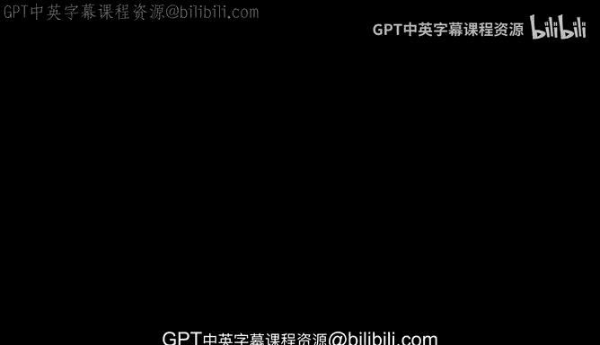
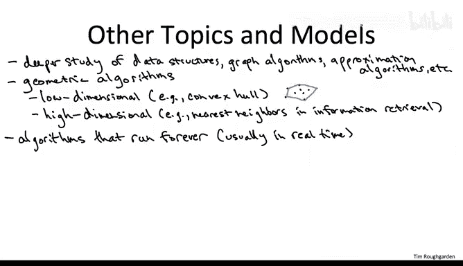

# 斯坦福大学《算法（分治／排序／搜索／随机算法、图搜索／最短路径／数据结构、贪心算法／最小生成树／动态规划、最短路径／NP）｜Algorithms》中英字幕 - P169：41_04_03_线性规划及其扩展（可选）.zh_en - GPT中英字幕课程资源 - BV1Rx4y1U7sZ

Next， let me mention embarrassingly briefly， linear programming。

 So linear programming is a problem that， on the one hand， is efficiently solvable。

 both in theory and in practice and on the other hand， is very general。

 It includes as a special case， bipartite matching， maximum flow and tons of other stuff。

The general problem solved by linear programming is to optimize a linear function。

 maximize or minimize， it doesn't matter。 Optimize a linear function over a set of linear constraints。

 Gemetrically， that corresponds to finding the best point， the optimal point in a feasible region。

 which is representable as the intersection of half spaces。

So let me just draw a cartoon picture which is going to be in the plane。

 although let me emphasize the power of linear programming is that you can efficiently solve problems that are in massively higher dimensions。

 not two dimensions， but think millions of dimensions。So in the plane。

 the intersection of half planes， assuming it's bounded is just going to be a polygon。

 And you can think about optimizing a linear function at just trying to push as far as possible in some direction subject to being inside the feasible region。

 So， for example， maybe you want to push as far to the northeast as possible。

 subject to being one of these blue points somewhere in this polygon。For example。

 the maximum flow problem is easily encoded as a special case of linear programming。

 You use one dimension that is one decision variable for each edge。

 The decision variable describes how much flow you route on a given edge。

 The linear objective function would be to maximize the sum of the flows on the edges going out of the source vertex。

 and then you would have linear constraints， just insisting that the amount of flow coming into a vertex is the same as the amount of flow coming out of a vertex。

 and linear programming encodes not just maximum flow， but tons and tons of other problems as well。

Despite its generality， linear programming problems can be solved efficiently。

 both in theory and in practice。The systematic formulation and algorithmic solution of linear programs was pioneered by George Danzig back in the 1940s。

 in particular， Danziig invented what's called the simplex method。

 which remains to date one of the most important practical methods for solving linear programs。

Have you ever heard that story about the student who walks in late to a class。

 sees what he thinks his homework written up on the chalkboard and solves them。

 not knowing that they are， in fact， major open research questions。 Well。

 maybe you thought that story was apocryphal。 Certainly I did for many years。

 but it's not turns out it's totally about George Danzig in 1939。

 he walked into his graduate statistics class late。

 The two major open questions in the field are written on the chalkboard and he solved them within a few days。

 that wound up being his PhD dissertation before he got interested in linear programming。

Now the algorithms used to efficiently solve linear programs， they're pretty complicated。

 both versions of the simplex method and so-cal interior point algorithms。

 so it may or may not be a good use of your time learning more about how the guts of these algorithms work。

 But what almost surely is a good use of your time is how to be an educated client of these algorithms。

 That is to get some practice formulating problems as linear programs and solving linear programs using either open source solvers or commercial linear programming solvers。

 Those solvers are very powerful black box tool to have in your algorithmist' toolbox。In fact。

 there are black box subroutines available to you that are strictly more powerful than linear programming。

 One generalization is convex programming。 So linear functions are a special case of convex functions。

 And if you want to minimize a convex function or equivalently maximize a concave function。

 subject to convex constraints。 that， again， is a problem you can solve efficiently both in theory in terms of polynomial time and in practice。

 maybe the problem sizes you can reach aren't quite as big as with linear programming。

 But they're pretty close。A different generalization is integer linear programming。

 So these are like linear programs， but where you add the extra constraints that certain decision variables have to take on an integer value。

 So something like one half as a value for decision variable would be disallowed in an integer program。

 Now， these in general are no longer solvable efficiently in theory。

 it's easy to encode and be complete problems， like， say。

 vertex cover as a special case of integer programming。

 But there is quite a bit of advanced technology out there for solving at least in special domains integer programs。

 So again， if you have anmp complete problem and you really need to solve it。

 integer programming as a technique。 you're going to want to learn more about。

What are some other important topics we haven't had time to discuss？Well， first of all。

 for many of the topics that we have discussed， we've only scratched the surface。

 There's beautiful and useful stuff beyond what we've discussed in these classes on topics ranging from data structures。

 for example， with hashing and research trees to graph algorithms。

 we already mentioned matchings and flows to approximation algorithms like better heuristics for the traveling salesman problem。

😊，A topic we've barely discussed at all is geometric algorithms。

 One exception being a divide and conquer algorithm for the closest payer problem that we discussed in Part 1。

Roughly speaking， the study of geometric algorithms has two flavors。

 low dimensional problems and high dimensional problems。So when I say low dimensional。

 I mean probably two or three dimensions。 So problems in the plane are problems in three space。

 A canonical computational problem here would be the convex hole problem。

 which means I give you a bunch of points， and then you want to know which points are on the convex hole of the points set。

 So here's a way to think about the convex whole problem in the plane。 So take a wooden board。

 a flat wooden board that represents the plane。 Now， pound a bunch of nails into the wooden board。

 Those are representing the points in the plane。 Now to compute the convex hole。

 What you can do is you can take a rubber band， stretch it out really far so that it bounds all of the nails you pound it into the wooden board。

 And now let the rubber band go， and it's going to snap around the boundary nails。

 That's a way to compute the convex hole in two dimensions。 And so the question is。

 how do you do that efficiently given just a bunch of coordinates of points。

 The state of the art here are divide and conquer algorithms very much in the spirit of what we discussed for the closest pair problem back in part1。

So why would you care about computing convex holes， Well， there's lots of reasons。 But， you know。

 as one example， supposepo you were doing some 3D graphics and you had moving objects in your scene and you wanted to know whether when two objects collide。

 because then you have to respond appropriately in rendering the scene。 Well。

 to know whether two objects collide。 You don't have to remember all of the details of the objects。

 you just have to keep track of their convex holes。

 They collide exactly when their convex holes intersect。

 And so that's one reason you might want to do that computation。

A very different flavor of geometric algorithms is the highdial case。

 And here I'm thinking of the number of dimensions as being a thhou in the thousand， say。

 or perhaps even quite a bit more than that。 Now， why would you ever have points in thousands of dimensions。

 Well， imagine you were doing， say information retrieval。 Imagine you had a much of document。 Now。

 documents don't really have geometry intrinsically。

 but it can be useful to imbue them with geometry。 How do you do that？ Well。

 imagine you make a list of all of the words in the world that you care about。

 So maybe say 10000 words that you think are interesting。 And for a given document。

 you just count the number of occurrences of each of these 10000 interesting words in the document。

 So maybe lots of them are 0， The words don't occur at all。 You know。

 but maybe there's some word that occurs 7 times in the document。

 So then you give it a 7 in that coordinate and boom。

 you've now represented each document as a point in 10000 dimensional space。

 One coordinate for each of the interesting words， The value of that coordinate being the frequency of that word in that document。

Now you can start asking questions like given a new document。

 is it similar to any of the documents you've already been storing and geometrically that just corresponds to asking something called a nearest neighbor query。

 given a bunch of points in possibly high dimensional space and given a new point。

 which of the previous points is closest， say a Euclidean distance to the new point you were just given。

 that would be a canonical question you would ask in high dimensional computational geometry。

In these design and analysis of algorithms courses。

 we've been focusing on the most classical style of computation， where you're given upfront an input。

 you do a computation and you produce some output， then you take a bow and you leave the stage。

But if you think about computation in the real world。

 there's plenty of algorithms whose work is never finished， algorithms that in effect， run forever。

2 applications that we've mentioned in passing in this class are the caching problem。 So。

 for example， if you're writing an algorithm to manage a cache shape for an operating system。

 that algorithms work is really never done。 It's going to have to manage the cache indefinitely。

 Similarlyly， you can think about routing in a network scene， Internet routing。 Again。

 that algorithm's work is never done。 There's always going to be link failures。

 There's always going to be new nodes。 as always going to be new data to route。

 So it has to keep making routing decisions indefinitely as long as the Internet exists。

As you would hope， both the theory and the practice of understanding algorithms that run indefinitely。

 making decisions in real time is based quite squarely on the lessons that we've learned in the classical computational paradigm here。

 but it is an interesting topic worthy of study in its own right。

A major concern of algorithm's research in the 21st century is massive data sets。

 meaning data sets that are way too big to fit in the main memory of a single machine。

One hunt topic has been so called streaming algorithms。 These are algorithms which have to。

 in effect， take a fire hose of data being generated a torrential pace and boil it down using small space into just a few accurate statistics。

 So you might think， for example， about an algorithm running locally at a network router with data packets flying through the router at a ridiculous pace or an algorithm which is responsible for summarizing the data generated by a bunch of telescopic observations。

Fin， important topic for which the current theory is actually quite immature。

 is understanding how to exploit parallelism in tackling massive data sets。 For example。

 using the distributed systems approach exported by the Mareduce or Hadoop systems。

