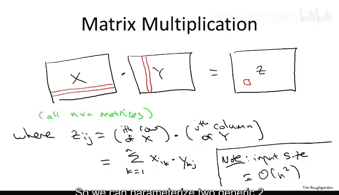
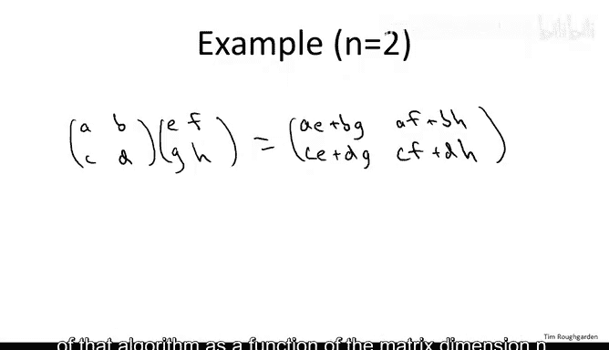
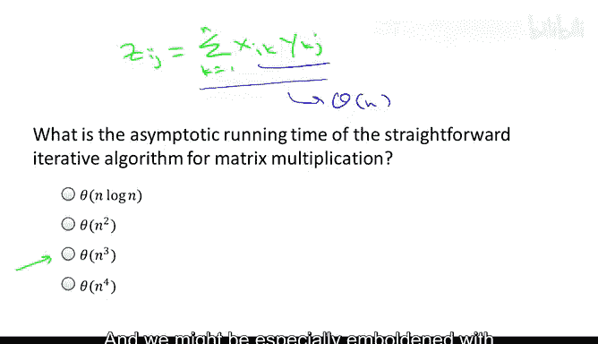
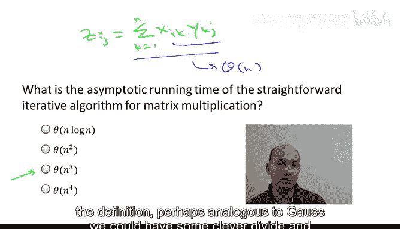
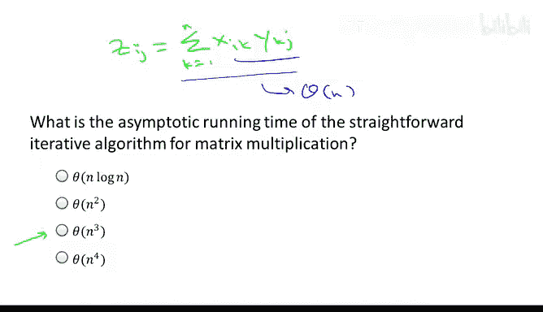
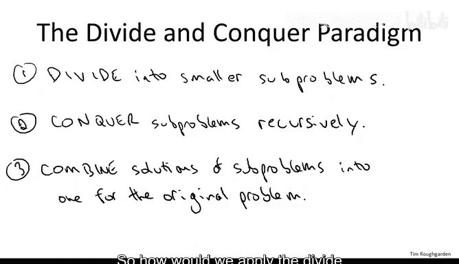
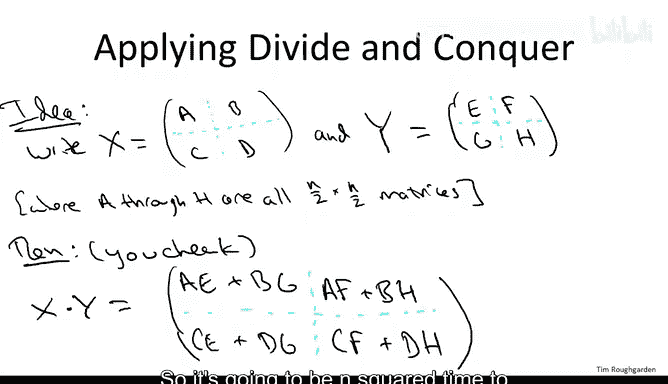
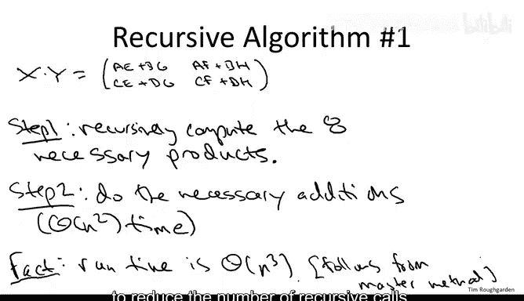
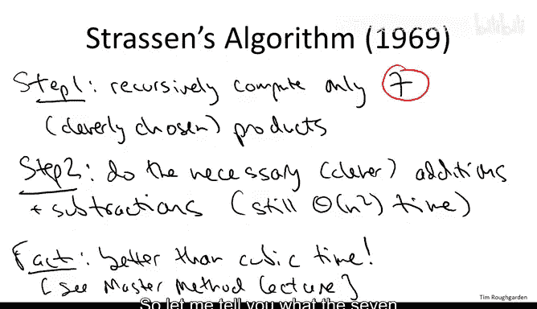
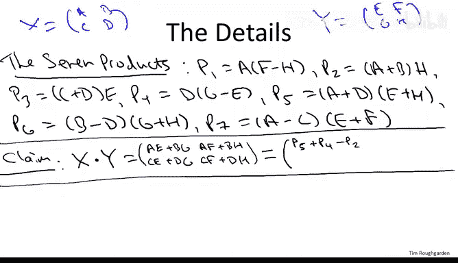

# 算法：16：Strassen次立方矩阵乘法算法 🧮

在本节课中，我们将学习如何应用分治算法设计范式来解决矩阵乘法问题。我们将从最直观的立方时间算法出发，探讨一种递归分治方法，并最终介绍Strassen的次立方时间矩阵乘法算法。该算法通过巧妙的数学变换，将递归调用次数从8次减少到7次，从而实现了运行时间的根本性改善。

## 矩阵乘法问题定义

首先，我们需要明确矩阵乘法问题的定义。我们关注三个矩阵 **X**、**Y** 和 **Z**，并假设它们都是 **N × N** 的方阵。矩阵中的元素可以是整数、有理数或来自某个域，关键在于我们可以对它们进行加法和乘法运算。

两个矩阵 **X** 和 **Y** 相乘得到 **Z** 的规则是：**Z** 中第 **i** 行第 **j** 列的元素 **Zᵢⱼ**，等于 **X** 的第 **i** 行与 **Y** 的第 **j** 列的点积。



用公式表示如下：
**Zᵢⱼ = Σₖ₌₁ⁿ (Xᵢₖ × Yₖⱼ)**

这里，输入大小并非 **n**，而是 **n²**，因为每个矩阵有 **n²** 个元素。因此，一个理想的矩阵乘法算法，其运行时间最好能达到 **O(n²)**。我们的目标是探索能否接近这个理想值。



为了确保理解，我们来看一个具体的2×2矩阵乘法例子。给定矩阵：
```
[ A  B ]   [ E  F ]
[ C  D ] × [ G  H ]
```
其结果为：
```
[ AE+BG  AF+BH ]
[ CE+DG  CF+DH ]
```

## 朴素算法及其复杂度



根据上述定义，最直接的算法是使用三重循环计算每个输出元素。





以下是该算法的核心逻辑：
```python
def naive_matrix_multiply(X, Y):
    n = len(X)
    Z = [[0 for _ in range(n)] for _ in range(n)]
    for i in range(n):
        for j in range(n):
            for k in range(n):
                Z[i][j] += X[i][k] * Y[k][j]
    return Z
```



该算法的运行时间是 **Θ(n³)**。因为计算每个 **Zᵢⱼ** 需要 **Θ(n)** 时间，而总共有 **n²** 个这样的元素需要计算。

## 分治法的初步尝试

受到整数乘法分治算法（如Karatsuba算法）的启发，我们很自然地想将分治法应用于矩阵乘法。分治法的步骤是：
1.  **分解**：将原问题划分为更小的子问题。
2.  **解决**：递归地解决这些子问题。
3.  **合并**：将子问题的解合并为原问题的解。

对于 **n × n** 矩阵，我们将其划分为四个 **n/2 × n/2** 的象限（或称为分块矩阵）。假设我们将矩阵 **X** 和 **Y** 分块如下：
```
X = [ A  B ]    Y = [ E  F ]
    [ C  D ]        [ G  H ]
```
其中 **A, B, C, D, E, F, G, H** 都是 **n/2 × n/2** 的矩阵。

那么，乘积 **Z = X × Y** 也可以表示为分块形式：
```
Z = [ AE+BG  AF+BH ]
    [ CE+DG  CF+DH ]
```
这个公式与2×2矩阵乘法的形式完全一致，只是这里的元素本身是矩阵。



基于此，我们可以设计第一个递归算法：
1.  递归计算8个必要的矩阵乘积：**A×E**, **B×G**, **A×F**, **B×H**, **C×E**, **D×G**, **C×F**, **D×H**。
2.  按照上述公式，通过矩阵加法组合这些乘积结果，得到最终的 **Z**。

然而，这个算法需要进行8次递归调用，每次处理规模为 **n/2** 的问题，外加 **Θ(n²)** 的矩阵加法时间。根据主定理（将在后续课程中详细讲解），该算法的运行时间仍然是 **Θ(n³)**，与朴素迭代算法相同。

## Strassen算法的核心思想

既然简单的分治没有带来改善，那么关键问题在于：能否减少递归调用的次数？Strassen算法的惊人之处就在于，它通过一系列巧妙的线性组合，将递归调用次数从8次减少到了7次。

Strassen算法同样分为两步，但计算过程更为精巧：
1.  **递归计算7个精心构造的矩阵乘积**（**P₁** 到 **P₇**）。
2.  **通过加/减运算组合这7个乘积**，得到最终结果矩阵的四个象限。



虽然第二步中的加/减运算比朴素递归算法稍多，但这只增加了常数倍的时间，仍然为 **Θ(n²)**。而将递归调用从8次减为7次，却对总运行时间产生了根本性的影响，使其从立方时间降低到了次立方时间（具体为 **O(n^log₂7) ≈ O(n^2.81)**）。

## Strassen算法详解

让我们具体看看Strassen算法是如何构造这7个乘积的。我们继续使用之前的分块表示。

以下是需要计算的7个乘积：
*   **P₁ = A × (F - H)**
*   **P₂ = (A + B) × H**
*   **P₃ = (C + D) × E**
*   **P₄ = D × (G - E)**
*   **P₅ = (A + D) × (E + H)**
*   **P₆ = (B - D) × (G + H)**
*   **P₇ = (A - C) × (E + F)**

在计算这些乘积之前，我们需要先进行一些矩阵的加法和减法（如 **F-H**, **A+B** 等），这些操作可以在 **Θ(n²)** 时间内完成。然后，我们对这7个表达式进行7次递归调用，计算 **n/2 × n/2** 矩阵的乘积。



最关键的是，我们可以仅用这7个乘积 **P₁** 到 **P₇**，通过更多的加/减运算，重构出原始乘积 **X × Y** 的四个象限：

*   **Z 的左上角 (原为 AE+BG) = P₅ + P₄ - P₂ + P₆**
*   **Z 的右上角 (原为 AF+BH) = P₁ + P₂**
*   **Z 的左下角 (原为 CE+DG) = P₃ + P₄**
*   **Z 的右下角 (原为 CF+DH) = P₁ + P₅ - P₃ - P₇**



我们可以验证其中一个等式。例如，展开左上角的表达式：
```
P₅ + P₄ - P₂ + P₆
= (AE + AH + DE + DH) + (DG - DE) - (AH + BH) + (BG + BH - DG - DH)
= AE + BG
```
经过一系列项的对消，我们恰好得到了 **AE + BG**，与定义相符。其他等式的验证也类似。

因此，Strassen算法确实能用7次递归调用完成矩阵乘法。减少一次递归调用，在递归的每一层都会累积优势，最终实现了运行时间的质变。

## 总结

本节课我们一起学习了矩阵乘法的算法演进。
*   我们首先明确了矩阵乘法的定义和朴素的 **O(n³)** 算法。
*   接着，我们尝试应用分治法，将矩阵划分为象限进行递归乘法，但最初的递归方案仍需8次调用，未能超越立方时间。
*   最后，我们深入探讨了Strassen的突破性算法。该算法通过极其巧妙的数学构造，将递归调用次数减少到7次，从而首次实现了矩阵乘法的次立方时间复杂度（**O(n^log₂7)**）。

Strassen算法展示了算法设计的巨大威力：即使对于像矩阵乘法这样基础且被深入研究的问题，通过深刻的洞察和精巧的设计，仍然有可能取得根本性的效率提升。在接下来的课程中，我们将学习“主定理”，它可以用来严格分析这类分治算法的运行时间。