# 斯坦福大学《算法（分治／排序／搜索／随机算法、图搜索／最短路径／数据结构、贪心算法／最小生成树／动态规划、最短路径／NP）｜Algorithms》中英字幕 - P17：17_02_05_最近点对O(n log n)算法 I（进阶可选）.zh_en - GPT中英字幕课程资源 - BV1Rx4y1U7sZ

So in this video in the next we're going to study a very cool divide and conquer algorithm for the closest pair problem。

 this is a problem where you're given endpoints in the plane and you want to figure out which pair of points are closest to each other。

 so this will be the first taste we get of an application and computational geometry which is the part of algorithms which studies how to reason and manipulate geometric objects so those algorithms are important in among other areas robotics。

 computer vision and computer graphics。So this is relatively advanced material。

 It's a bit more difficult than the other applications of divide and conquer that we've seen the algorithms a little bit tricky and it has a quite non-trivial proof of correctness。

 So just be ready for that and also be warned that because it's more advanced I'm going to talk about the material at a slightly faster pace than I do in most of the other videos So let's begin now by defining the problem formally So we're given as endpoint in the plane so each one just defined by its x coordinate and its Y coordinate and when we talk about the distance between two points in this problem we're going focus on Euclidean distance So let me remind you what that is briefly but we'll introduce some simple notation for that which we'll use for the rest of the lecture So we're just going note the Euclidean distance between two points Pi and Pj by D of PPj So in terms of the x and Y coordinates of these two points we just look at the squared differences in each coordinate sewing them up and take the square root。

And now， as the name of the problem would suggest， the goal is to identify among all pairs of points。

 that pair， which has the smallest distance between them。Next。

 let's start getting a feel for the problem by making some preliminary observations First I want to make an assumption purely for convenience that there's no ties so that is going to assume all endpoints have distinct X coordinates and also all endpoints have distinct Y coordinates。

 it's not difficult to extend the algorithm to accommodate ties。

 I'll leave it to you to think about how to do that。

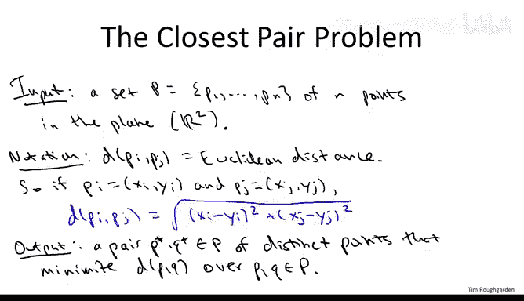

So next let's draw some parallels with a problem of counting inversions which was an earlier application of divide and conquer that we saw。

 The first parallel I want to point out is that if we're comfortable with a quadratic time algorithm then this is not a hard problem we can simply solve this by brute force search and again by brute force search I just mean we set up a double for loop which iterates over all distinct pairs of points we compute the distance for each such pair and we remember the smallest that's clearly a correct algorithm。

 it has to iterate over a quadratic number of pairs so it's running time is going to be theta of n squared and as always the question is can we apply some algorithmic ingenuity to do better。

 can we have a better algorithm than this naive one which iterates over all pairs of points you might have an initial instinct that because the problem asks about a quadratic number of different objects。

 perhaps we fundamentally need to do quadratic work but again recall back in counting inversions using divide and conquer we're able to get an n log n algorithm despite the fact that there might be as many as a quadratic number of inversions in an array so the question is can we do something similar。

For the closest pair problem Now one of the keys to getting an N log end time algorithm for counting inversions was to leverage a sorting subroutine recall that we piggybacked on merge sort to count the number of inversions in N log at a time so the question is here with the closest pair problem perhaps sorting again can be useful in some way to beat the quadratic barrier So to develop some evidence that sorting will indeed help us compute the closest pair of points and better than quadratic time。

 let's look at a special case of the problem really an easier version of the problem which is when the points are just in one dimension So on the line rather than in two dimensions in the plane。

So in the 1 D version， all of the points just lie on a line like this one。

 and we're given the points in some arbitrary order， not necessarily in shortid order。

So a way to solve the closest pair problem in one dimension is to simply sort the points and then of course the closest pair better be adjacent in this ordering so you just iterate through the n minus1 consecutive pairs and see which one is closest to each other。

 So more formally here's how you solve the one- dimensional version of the problem you sort the points according to their only coordinate because again remember this is one dimension So as we've seen using merge sort we can sort the points ined long end time and then we just do a scan through the points so this takes linear time and for each consecutive pair we compute their distance and we remember the smallest of those consecutive pairs and we return that that's got to be the closest pair。

So in this picture on the right， I'm just going to circle here in green the closest pair of points。

 So this is something we discover by sorting and then doing a linear scan Now。

 needless to say this isn't directly useful， this is not the problem I started out with we wanted to find the closest pair among points in the plane。

 not points in the line， but I want to point out that this even in the line there are a quadratic number of different pairs。

 so brute force search is still a quadratic time algorithm even in the 1D case So at least with one dimension we can use sorting piggyback on it to beat the naive brute force search bound and solve the problem in N log N time。

 So our goal for this lecture is going to be devise an equally good algorithm for the twodial case。

 we want to solve closest pair of points in the plane again in n log N time。

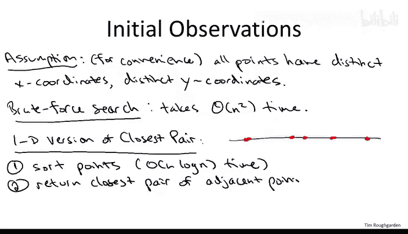

So we will succeed in this goal， I'm going to show you an in log N time algorithm for 2D closest pair。

 it's going to take us a couple steps， so let me begin with the high level approach。

All right so the first study to try is just to copy what worked for us in the one-dial case。

 and the one dimensional case we first sorted the points by their coordinate。

 and that was really useful Now in the 2D case， points have two coordinates x coordinates and y coordinates。

 So there's two ways to sort them So let's just sort them both ways。

 that is the first step of our algorithm which is really think of as a preprocessing step we're going to take the input points we invoke merge sort once to sort them according to x coordinate。

 that's one copy of the points and then we make a second copy of the points where they's sorted by Y coordinate So we're going to call those copies of the points Px that's an array of the points sort by x coordinate and py for them sorted by Y coordinate Now we know merge short takes n log n time So this preprocessing step when we takes o of n log n time And again。

 given that we're shooting for an algorithm with running time big o of n log n why not sort the points we don't even know how we're going to use this fact right now but it's sort of harmless It's not going affect our goal of getting a big of o of n log n time algorithm and indeed this illustrates a broader points which is one of the themes of this course So recall I hope one of the things you take。

away from this course is a sense for what are the four free primitives what are manipulations or operations you can do on data which basically are costless。

 meaning that if your data set fits in the main memory of your computer。

 you can basically invoke the primitive and it's just going to run blazingly fast and you can just do it even if you don't know why and again sorting is the canonical for free primitive although we'll see some more later in the course and so here we're using exactly that principle so we don't even understand why yet we might want the points to be sorted it just seems like it's probably going to be useful motivated by the 1D case so let's go ahead and make sorted copies of the points by X and Y coordinate upfront。

So reasoning by analogy with the 1 B case suggests that sorting the points might be useful。

 but we can't carry this analogy too far， so in particular we're not going to be able to get away with just a simple linear scan through these arrays to identify the closest pair of。

So to see that， consider the following example， so we're going to look at a point set which has six points。

It's going to be two points， which I'll put in blue。Which are very close in X coordinate。

 but very far away in Y coordinate。 And then there's going to be another pair of points。

 which I'll do in green。Wwhichch are very close in Y coordinate， but very far away in x coordinate。

 And then there's going to be a red pair of points。

 which are not too far away in either the x coordinate or the Y coordinate。

 So in this set of six points， the closest pair is the pair of red points。

 we're not even going to show up consecutively in either two arrays right So in the array that's sort of by x coordinate。

 this blue point here is going to be wedged in between the two red points。

 they won't be consecutive And similarly in the in py which just sort of by y coordinate。

 this green points is going to be wedged between the two red points。

 So you won't even notice these red points， if you just do a linear skin through px and p or py and look at the consecutive pairs of points。

 So following our preprocessing step where we just inver invoke merged or twice。

 we're going to do a quite nontrivial divide and conquer algorithms to compute the closest pair。

So really in this algorithm， we're applying the divide and conquer algorithm twice first internal to the sorting subroutine。

 assuming that we use the merge sort algorithm to sort D and conquerors being used there to get an n log and running time in this preprocessing step and then we're going to use it again on the sorted arrays in a new way。

 that's what I'm going to tell you about next So let's just briefly review the divide and conquer algorithm design paradigm before we apply to the closest pair problem So as usual the first step is to figure out a way to divide your problem into smaller subproble。

 So sometimes this has a reasonable amount of ingenuity。

 but it's not going to here in the closest pair problem we're going to proceed exactly as we did in the merge sort and counting inversions problems or we took the array and broke it into its left and right half。

 So here we're going take the input points set and again just recurs on the left half of the points and recursor on the right half of the points we're here by left and right I mean with respect to the points X coordinates it's pretty much never any ingenuity in the conquer step that just means you take the sub problemsble you identify in the first step and you solve them recursively that's what we'll do here but we recursively compute the closest pair in the。

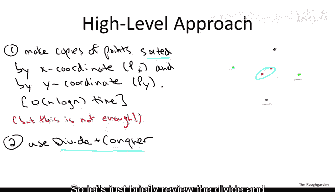

Ha of the points and the closest pair in the right half of the points So where all the creativity in divide and conquer algorithms lie is in the combined step。

 given solutions to your subproblems， how do you somehow recover a solution to the original problem。

 the one that you actually care about So for closest pair the question is going to be given that you've computed the closest pair in the left half of the points the closest pair in the right half of the points how do you then quickly recover the closest pair from the whole point set So's a tricky problem that's we're going to spend most of our time on So let's make this divide and conquer approach for closest pair a little bit more precise So let's now actually start spelling out our closest pair algorithm the input we're given it this follows the preprocessing step So recall that we invoke merge short twice we get our two sorted copies of the points set px sort by x coordinate and p sort by Y coordinate So the first step then is the division step So given that we have a copy of the points px sort by x coordinate it's easy to identify the leftmost half of the points those would those n over to smallest x coordinates and then the right half those with the n over two largest x coordinates we're going call。

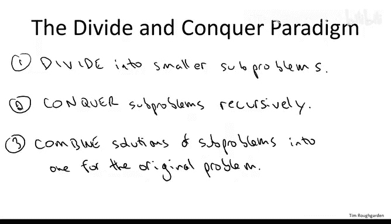

Q&R respectively。One thing I'm skipping over is the base case。

 I'm not gonna bother writing that down。 So base case omitted。

 but it's what you would think it would be。 So basically once you have a small number of points。

 say two points or three points， then you can just solve the problem in constant time by brute4 search you just look at all the pairs and you return the closest pair。

 So think of there being at least four points in the input。

 Now in order to recurse to call close pair again on the left and right half we need sorted versions of Q and R both by x coordinate and by Y coordinate。

 So we're just going to form those by doing suitable linear scans to px and Py。

 And so one thing I encourage you to think through carefully or maybe even code up after the video is how would you form Qx Qy Rx and R Y。

 given that you already have px and P。 And if you think about it because Px and Py are already sorted just producing these sorted sublists takes linear time It's in some sense the opposite of the merge of routine used in merge sort here we're splitting rather than。

But again， this can be done in linear time， that's something you should think through carefully later。

So that's the division step now we just conquer meaning we recursively call closest pair on each of the two subproblems。

 so when we invoke closest pair on the left half of the points on Q。

 we're going to get back what are indeed the closest pair of points amongst those in Q so we're going to call those P1 and PQ so among all pairs of points that both line Q P1 and Q1 minimize the distance between them。

Similarly， we're going to call P2 Q2， the results of the second recursive call that is P2 and Q2 are amongst all pairs of points that both lion are the pair that has the minimum Euclidean distance。

Now conceptually there's two cases there's a lucky case and there's an unlucky case in the original point set P if we're lucky the closest pair of points in all of P actually both of them lie in Q or both of them lie in R in this lucky case we'd already be done if the closest pair in the entire point set they happen to both lie in Q then this first recursive call is going to recover them and we just have them in our hands P1 Q1 Similarlyly if both of the closest pair of points in all of P lies in the right side in R。

 then they get handed to us on a silver platter by the second recursive call that just operates on R so in the unlucky case。

 the closest pair of points in P happens to be split that is one of the points lies in the left half in Q and the other point lies in the right half in R notice if the closest pair of points in all of P is split is half in Q and half in R neither recursive call is going to find it the pair of points is not to I。

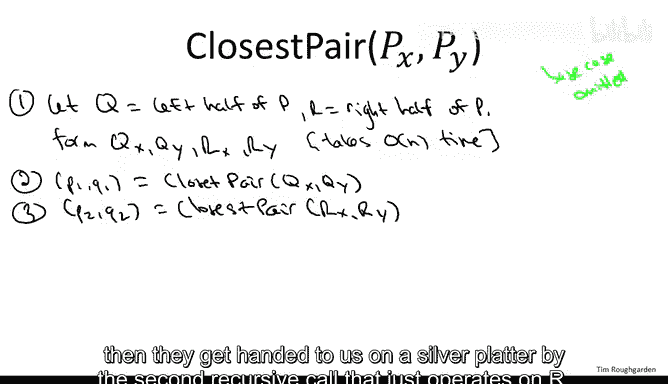

the two recursive calls so there's no way it's going to be returned to us okay so we have not identified the closest pair after these two recursive calls if the closest pair happens to be split this is exactly analogous to what happened when we were counting inversions。

 the recursive call on the left half of the array counted the left inversions the recursive call on the right half of the array counted the right inversions but we still had to count the split inversions so in this closest pair algorithm we still need a special purpose subroutine that computes the closest pair for the case in which it is split in which' one point and Q and one point in R so just like in counting inversions are'm going to write down that subroutine I'm going to leave it unimplemented for now we'll figure out how to implement it quickly in the rest of the lecture。

Now if we have a correct implementation of closest split pair。

 so that takes us input the original point set sort of by X and Y coordinate and returns the smallest pair that's split or one points in Q and1 points at R。

 then we're done， so split then the closest pair has to either be on the left or on the right or it has to be split。

 steps two through four， compute the closest pair in each of those categories。

 so those are the only possible candidates for the closest pair and we just return the best of them。

So that's an argument for why if we have a correct implementation of the closest split pair subroutine。

 then that implies a correct implementation of closest pair now what about the running time so the running time of the closest pair algorithm is going to be in part determined by the running time of closest split pair so in the next quiz I want you to think about what kind of run on time we should be shooting for with the closest split pair subroutine。

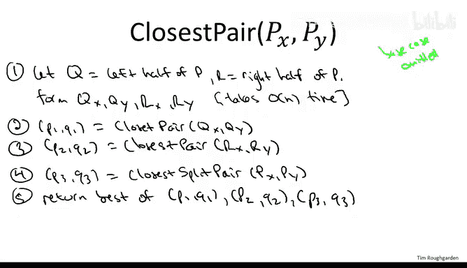

So the correct response to this quiz is the second one。

And the reasoning is just by analogy with our previous algorithms for merge sort and for accounting inversions So what is all of the work that we would do in this algorithm what we do have this preprocessing step we call merge sort twice we know that's n log N so we're not going to have a running time better than n log n because we sort at the beginning and then we have a recursive algorithm with the following flavor and makes two recursive calls each recursive call is on a problem of exactly half the size with half the points of the original one and outside of the recursive calls by assumption in the problem we do a linear amount of work in the computing the closest split pair So the exact same recursion tree which proves an n log n bound for merge short proves an n log n bound for how much work we do after the pre-processing step so that gives us an overall running time bound of n log n remember that's what we were shooting for we were working n log n already to solve the one- dimensional version of closest pair and the goal of these lectures is to have an n log n algorithm for the 2D version so this would be great So in other words。

 the goal should be to have a correct linear time implementation of the closest split pair。

Subroutine， if we can do that we're home free， we get the desired and log and algorithm Now I'm going to proceed in a little bit to show you how to implement closest split pair。

 but before I do that I want to point out one subtle but key idea which is going to allow us to get this linear time correct implementation。

So let me just put that on this slide。So the key idea is that we don't actually need a full blownown correct implementation of the closest split pair subroutine So I'm not actually going to show you a linear time subroutine that always correctly computes the closest split pair of a point set The reason I'm not going to do that is that's actually a strictly harder problem than what we need to have a correct recursive algorithm we do not actually need a subroutine that for every point set always correctly computes the closest split pair of points。

 remember， there's a lucky case and there's an unlucky case the lucky case is where the closest pair in the whole point set P happens to lie entirely in the left half of the points Q or in the right half of the points R in that lucky case we one of our recursive calls will identify this closest pair and hand it over to us on a silver platter we could care less about the split pairs in that case we get the right answer without even looking at the split pairs Now there's this unlucky case where the split pair happens to be the closest pair of points。

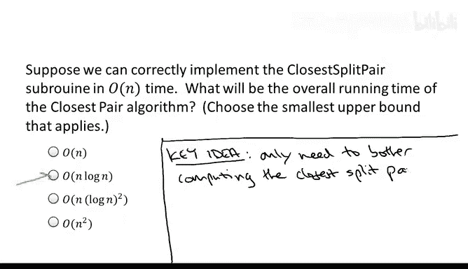

That is when we need this linear time sub routineout and only then only in the unlucky case where the closest PowerPoins happens to be split。

Now that's in some sense a fairly trivial observation。

 but there's a lot of ingenuity here in figuring out how to use that observation。

 the fact that we only need to solve a strictly easier problem。

 and that will enable the linear time implementation that I'm going to show you next。

So now let's rewrite the high level recursive algorithm slightly to make use of this observation that the closest split pair subroutine only has to operate correctly in the regime of the unlucky case when in fact the closest split pair is closer than the result of either recursive call so I've erased the previous steps4 and5 but we're going to rewrite them in a second so before we invoke closest split pair。

 what we're going to do is we're going to see how well did our recursive calls do that is we're going to define a parameter little delta。

Whi is going to be the closest pair that we found or the distance of the closest pair we found by either recursive call。

 so the minimum of the distance between P1 and Q1， the closest pair that lies entirely on the left。

AndP2 Q2 the closest pair that lies entirely on the right Now we're going to pass this delta information as a parameter into our closest split pair subroutine we're going to have to see why on Earth that would be useful。

 I still owe you that information， but for now we're just going to pass delta as a parameter for use in closest split pair。

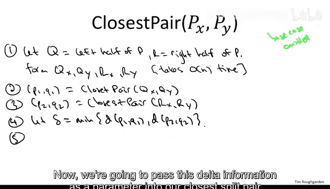

And then as before， we just do a comparison between the three candidate closest pairs and return the best of the trio。

And so just we're all clear on where things stand， so what remains is to describe the implementation of closest split pair。

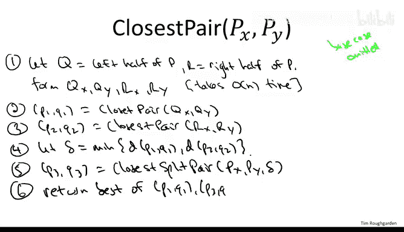

Before I describe it， let me just be crystal clear on what it is that we're going to demand of the subroutine。

 what do we need to have a correct and O of N log N time closest pair algorithm。

Well as you saw in the quiz， we want the running time to be O of N always。And for correctness。

 what do we need， again， we don't need it to always compute the closest split pair。

 but we needed to compute the closest split pair in the event that there is a split pair of distance strictly less than delta。

 strictly better than the outcome of either recursive call。So now that we're clear on what we want。

 let's go ahead and go through the pseudocode for this closest split pair subroutine and I'm going to tell you up front it's going to be fairly straightforward to figure out that the subroutine runs in linear time O of N time the correctness requirement of closest split pair will be highly non-obvious In fact after I show you the pseudocode you're not going believe me you're gonna to look at the pseudocode you're gonna be like what are you talking about but in the second video on the closest spare lecture we will in fact show that this is a correct subroutine。

So how's it work， well let's look at a point set。So the first thing we're going to do is a filtering step。

 we're going to prune a bunch of the points away and sort of zoom in on a subset of the points and the subset of the points we're going to look at is those that lie in a vertical strip which is roughly centered in the middle of the point set So here's what I mean by center we're going to look at the middle X coordinate so that x bar be the biggest x coordinate in the left half so that is in the sorted version of the points by X coordinate。

 We look at the n over tooth smallest X coordinate。So in this example where we have six points。

 all this means is we draw， we imagine drawing a line between the third points。

 so that's going to be x bar。The ex coordinate of the third point from the left。Now。

 since we're passed as input a copy of the points sorted by x coordinate。

 we can figure out what x bar is in constant time just by accessing the relevant entry of the array Px Now the way we're going to use this parameter delta that were passed。

 So remember what delta is so before we invoke the closest split pair subed in the recursive algorithm we make our two rehearsive calls we find the closest pair on the left the closest pair on the right and delta is whatever the smaller of those two distances are So deta is the parameter that controls whether or not we actually care about the closest split pair or not we care if and only if there is the split pair at distance less than delta So how do we use delta well that's going to determine the width of our strip So the strips going to have with two delta and it's going to be centered around X and the first thing we're going to do is we're going to ignore forever more points which do not lie in this vertical strip So the rest of the algorithm will operate only on the subset of P the subset of the points that lie in this strip and we're going to keep track of them sorted by Y coordinate。

So the formal way to say that they lie in this strip is that they have x coordinate in the interval with lower endpoint x bar minus delta and upper endpoint x bar plus delta。

Now how long does it take to construct this set SY sorted by Y coordinate。

 well fortunately we've been passed as input assorted version of the points PY。

 so to extract SY from PY， all we need to do is a simple linear scan through PY checking for each point where its X coordinate is so this can be done in linear time。

Now， I haven't yet shown you why it's useful to have this sorted set S Y。

 but if you take it on faith that it's useful to have the points in this vertical strip sorted by Y coordinate。

 you now see why it was useful that we did this merge sort all the way at the beginning of the algorithm for we even underwent any recursion。

 remember what is our running con goal for closest split pair we want this to run in linear time。

 That means we cannot sort inside the closest split pair subroutine that would take too long。

 we want this to be linear time。 Fortunately， since we sorted once and for all at the beginning of the closest pair algorithm extracting sorted sublists from those sorted list of points can be done a linear time。

 which is within our goals here。 Now it's the rest of the subroutine where you're never going believe me that it does anything useful So I claim that essentially with a linear scan through Sy。

 we're going to be able to identify the closest split pair of points in the interesting unlucky case where there is such a split pair with distance less than delta。

 So here's what I mean by that linear scan through Sy。

So as we do the scan we're going to keep track of the closest pair of points of a particular type that we've seen so far。

 so let me introduce some variables to keep track of the best candidate we've seen so far so there's going to be a variable best which will initialize to be Delta remember we're uninterested in split pairs unless they have distance strictly less than delta。

And then we're going to keep track of the points themselves， so initialize the best pair to be null。

Now here's the linear scan。So we go through the points of SY in order of Y coordinate。 Okay。

 well not quite all the points of SY。 We stop at the eighth to last point。

 and you'll see why in a second， and then for each position I of the array SY。

 we investigate the seven subsequent points of the same array SY。So for J going from one to seven。

We look at the Ith and I plus Jth entry of SY。

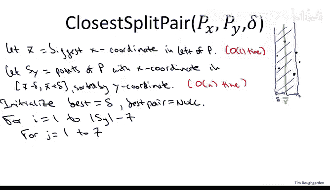

So if S Y looks something like this array here at any given point in this double for loop。

 we're generally looking at。An index I a point in this in this if entry of the array。

 and then some really quite nearby point in the array。

 I plus J because J here is going to be at most7 Okay。

 so we're constantly looking at pairs in this array， but we're not looking at all pairs at all。

 We're only looking at pairs that are very close to each other within seven positions of each other。

And what do we do for each choice of INJ when we just look at those points， we compute the distance。

 we see if it's better than all of the pairs of points of this form that we've looked at in the past。

 and if it is better then we remember it， so we just remember the best Ie closest pair of points of this particular type for choices of INJ of this form。

So in more detail， if the distance between the current pair of points P and Q is better than the best we've seen so far。

 we reset the best pair of points to be equal to P and Q when we reset the best distance。

 the closest distance seems so far to be the distance between P and Q and that's it then once this double4 loop terminates。

 we just return the best pair So one possible execution of closest split pair is that it never finds a pair of points P and Q a distance less than delta in that case this is going to return null and then in the outer call in the closest pair。

 obviously you interpret a null pair points to having infinite distance So if you call closest split pair and it doesn't return any points then the interpretation is that there's no interesting split pair of points and you just return the better of the results of the two recursive calls P1 Q1 or P2 Q2。

Now as far as the running time of this subroutine， what happens here。

 when we do constant work just initializing the variables。

 then notice that the number of points in Sy， well in the worst case。

 you have all of the points of P so there's going to be a most end points and so you do a linear number of iterations in the outer for loop。

 but here's the key point in the inner for loop normally double four loops give rise to quadratic running time。

 but in this inner four loop， we only look at a constant number of other positions we only look at seven other positions and for each of those seven positions we only do a constant number of work we just compare a distance and make a couple other comparisons and reset some variables so for each of the linear number of outer iterations we do a constant amount of work so that gives us a running time of o of n for this part of the algorithm。

So as I promised， analyzing the running time of this closest split pair of subroutine was not challenging we just in a straightforward way I looked at all the operations and again。

 because in the key linear scan， we only do constant work per index。

 the overall running time is big O event just as we want it。

 So this does mean that our overall recursive algorithm will have running time O of n log n What is totally non obviousvious and perhaps even unbelievable is that this subroutine satisfies the correctness requirements that we wanted。

 remember what we needed we needed that whenever we're in the unlucky case whenever in fact the closest pair of points in the whole points that is split。

 this subroutine better find it so but it does and that's been precise in the following correctness clam。

So let me phrasese the claim in terms of an arbitrary split pair， which has distance less than delta。

 not necessarily the closest such pair。 So suppose there exists。

A P on left a point on the left side and a point on the right side so that is a split pair and suppose the distance of this pair is less than Q Now there may or may not be such a pair of points Pq don't forget what this parameter delta means what delta is by definition is the minimum of d of1q1 where P1q1 is the closest pair of points that line entirely in the left half of the point set Q and D of P2 Q2。

Where similarly P2q2 is the closest pair of points that lies entirely on the right inside of R。

 So if there's a split pair with distance less than delta。

 this is exactly the unlucky case of the algorithm。

 this is exactly where neither recursive calls successfully identifies the closest pair of points instead that closest pair is a split pair on the other hand。

 if we are in the lucky case then there will not be any split pairs with distance less than delta because the closest pair lies either all on the left or all on the right and it's not split but remember so we're interested in the case where there is a split pair that has distance less than delta where there is a split pair that is the closest pair。

So the claim has two parts， the first part， part A says the following。

 it says that if there's a split pair P& Q of this type， then P and Q are members of SY。

Now let me just sort of redraw the cartoon， so remember what SY is， SY is that vertical strip。

And again， the way we got that is we drew a line through a median X coordinate。

 and then we fattened it by delta on either side， and then we focused only on points that lie in the vertical strip。

Now notice our counts split pair of subroutine if it ever returns a pair of points it's going to return a pair of points PQ that belong to SY first it filters down to Sy then it does a linear search through SY So if we want to believe that our subroutine identifies best split pairs of points then in particular such split pairs of points better show up in SY it better survive the filtering step so that's precisely what part A of the claim is here's part B of the claim。

And this is the more remarkable part of the clang， which is that P and Q are almost next to each other in this sortdid array S Y。

 So they're not necessarily adjacent， but they're very close。

 They're within seven positions away from each other。

 So this is really the remarkable part of the algorithm。

 This is really what's surprising and what makes the whole algorithm work。

So just to make sure that we're all clear on everything。

 let's show that if we prove this claim then we're done。

 then we have a correct fast implementation of a closest pair algorithm。

 I certainly owe you the proof of the claim that's what the next video is going to be all about。

 but let's show that if the claim is true， then we're home free。So if this claim is true。

 then so is the following corollary， which I'll call corollary1。

 so corollary1 says if we're in the unlucky case that we discussed earlier。

 if we're in the case where the closest point in the whole point said P does not lie both on the left。

 does not lie both on the right， but rather has one point on the left and one on the right。

 that is it's a split pair。

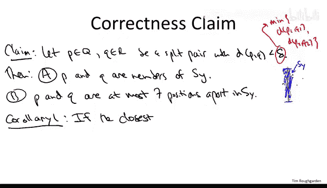

Then， in fact， the count split pair subroutine will correctly identify the closest split pair and therefore the closest pair overall。

Why is this true， Well， what does count split pair do so it has this double for loop and it thereby explicitly examines a bunch of pairs of points and it remembers the closest pair of all of the pairs of points that it examines What does this So what are the criteria that are necessary for a count split pair to examine a pair of points。

 Well， first of all， the points P and Q both have to survive the filtering step and make it into the array S Y right So count split pair only searches over the array S Y。

 Secondly， it only searches over pairs of points that are almost adjacent in S Y that are only seven positions apart。

 But amongst pairs of points that satisfy those two criteria。

 count split pair will certainly compute the closest such pair It just explicitly remembers the best of them。

Now， what's the content of the claim but the claim is guaranteeing that every potentially interesting split pair of points。

 namely every split pair of points with distance less than delta meets both of the criteria。

 which are necessary to be examined by the count split pair of suboutine。 So first of all。

 and this is the content of part A。 if you have an interesting split pair of points with distance less than delta。

 then they'll both survive the filtering step。 they'll both make it into the array。

 S Y Part A says that Part B says they're almost adjacent and Sy。

 So if you have an interesting split pair of points， meaning it has distance less than delta。

 then they will in fact be at most seven positions apart。 Therefore。

 count split pair will examine all such split pairs。

 all split pairs with distance less than delta and just by construction or compute the closest pair of all of them。

 So again， in the unlucky case where the best pair of points is a split pair。

 then this claim guarantees that the count split pair will compute the closest pair of points。

 Therefore， having handled correctness， we can just combine that with。

Eer observations about running time and corollary2 just says。

 if we can prove the claim that we have everything we wanted。

 we have a correct O of N log n implementation for the closest pairPoins so with further work and a lot more ingenuity we've replicated the guarantee that we got just by sorting for the one dimensional case。

Now again， these corollaries hold only if the claim is in fact true。

 and I've given you no justification for this claim and indeed even the statement of the claim I think is a little bit shocking。

 so if I were you， I would demand an explanation for why this claim is true and that's what I'm going to give you in the next video。

