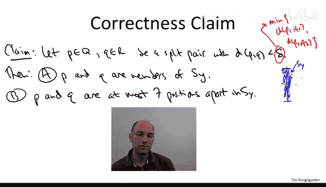
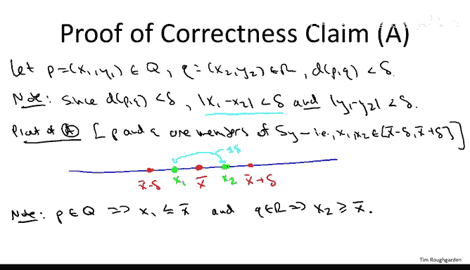
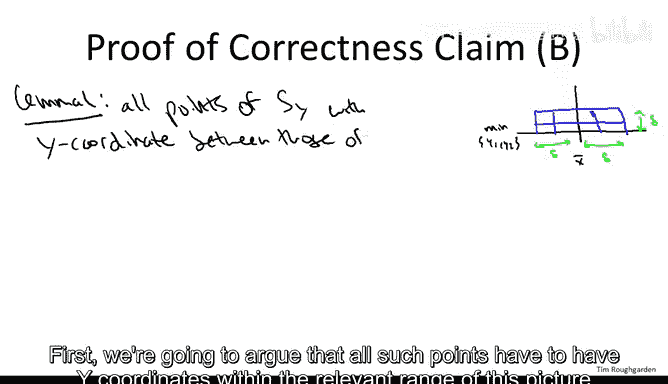
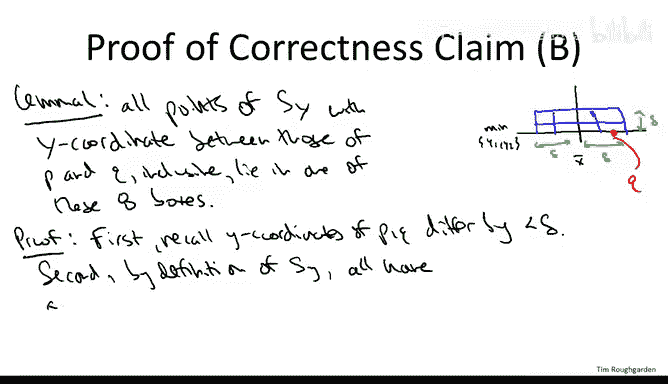
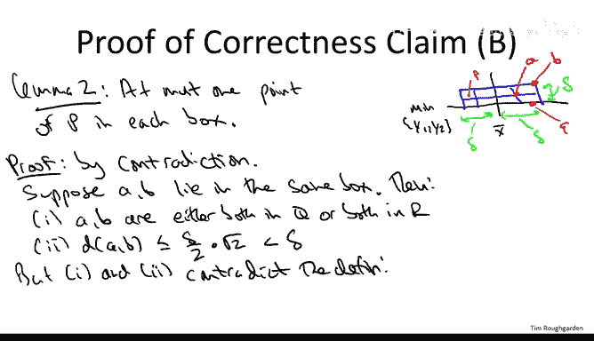
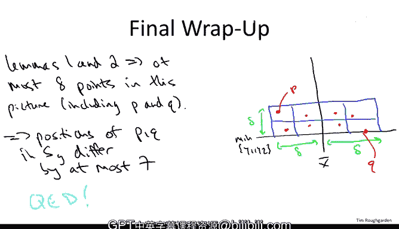

# 斯坦福大学《算法（分治／排序／搜索／随机算法、图搜索／最短路径／数据结构、贪心算法／最小生成树／动态规划、最短路径／NP）｜Algorithms》中英字幕 - P18：18_02_06_最近点对O(n log n)算法 II（进阶可选）.zh_en - GPT中英字幕课程资源 - BV1Rx4y1U7sZ

So the plan for this video is to prove the correctness of the divide and conquer closest pair algorithm that we discussed in the previous video。

 so just to refresh your memory， how does the outer algorithm work。

 while we're given endpoints in the plane， we begin by sorting them first by x coordinate and then by y coordinate that takes n log n time then we enter the main recursive divide and conquer powder of the algorithm so what do we do we divide the point set into the left half into the right half capital Q and capital R。

 then we conquer we recursively compute the closest pair in the left half of the point set Q we recursively compute the closest pair in the right half of the point set R there is a lucky case where the closest pair in the entire point set lies either all on the left are all on the right in that case the closest pair is handed to us on a silver platter that one of the two recursive calls but there remains the unlucky case where the closest pair is actually split with one point on the left and one point on the right so to get our n log n running time bound analogous to merge sort in our inversion counting we need to have a linear time implementation of a subroutine which computes the best the closest pair。

Points， which is split one on the left or one on the right Well， actually。

 we don't need to do quite that。 We need to do something only a little bit weaker。

 We need a linear time algorithm， which whenever the closest payer in the whole point set is in fact。

 split。Then computes that split pair in linear time。

 So let me now remind you how that subroutine works。 So it has two basic steps。

 So first there's a filtering step。 so it looks at first of all a vertical strip roughly down the middle of the point set and that looks at only at points which fall into that vertical strip that was a subset of the points that we called S sub y because we keep track of them sorted by y coordinate and then we do essentially a linear scan through Sy。

 so we go through the points one at a time。 and then for each point。

 we look at only the almost adjacent points So for each index I we look only a js that are between one and seven positions further to the right then I So among all such points。

 we compare them we look at their distances， we remember the best such pair of points and then that's what we return from the count split pair subroutine So we've already argued in the previous video that the overall running time of the algorithm is n log n and what remains just to prove correctness and we also argued in the previous video that correctness boils down to the following correctness claim in the sense that if we can prove this claim。

Then the entire algorithm is correct， So this is what remains Our residual work is to provide a proof of the correctness claim。

 What does it say， It says consider any split pair that is1 point p from the left side  Q capital  Q and another point little Q drawn from the right side of the point set capital R and further suppose that it's an interesting split pair meaning that the distance between them that most delta here Delta is recall the parameter past to the count split pair subroutine。

 which is the smallest distance between a pair of points which is all on the left or all on the right and this is the only case we're interested in There's two claims first of all。

 P and Q both members of the split pair survive the filtering step they make it into the sorted list S sub Y and second of all they will be considered by that double four loop in the sense that the positions of p and Q in this array S sub Y differ by at most7 So that's the story so far。

 let's move on to the proof。

So let's start with part A， which is the easy part relatively of the claim。

 so remember what we start with our assumptions we have a point P。

 let's write it out in terms of the X coordinates x1 and y1。

 which is from the left half of the point set。And we have a point Q， which we'll call x2Y2。

 which comes from the right half of the point set， and furthermore。

 we're assuming that these points are close to each other and we're going to use that hypothesis over and over again。

 so the Euclidean distance between P and Q is no more than this parameter delta。

So first something very simple， which is that if you have two points which are close in Euclidean distance。

 then both of their coordinates have to be close to each other。

 right if you have two points and they differ by a lot in one coordinate。

 then the Euclidean distance is going to be pretty big as well so specifically。

By our hypothesis that P and Q have Euclidean distance less than delta。

 it must be that the difference between their coordinates and absolute value is no more than delta and as well。

 the difference between their y coordinates is the most delta and this is easy to see if you just return to the definition of Euclidean distance that we reviewed the beginning of the discussion of closest point Okay so your distance is the most delta than in each coordinate you differ by at most delta as well Now what does a say。

So proof of A。So what is part A of the claim assert it asserts that P and Q are both members of S Y are both members of that vertical strip。

 so another way of saying that is that the x coordinates of P& Q that is the number x1 and x2 both are within delta of x bar。

 remember x bar was in some sense the median x coordinate。

 so the x coordinate of the N over tooth leftmost point。So we're going to do a proof by picture。

 so consider forget about Y coordinates that's sort of irrelevant right now and just focus on the X coordinates of all of these points。

So on the one hand， we have X bar。This is the x coordinate of the n over2th point from the left。

 and then there are the x coordinates which define the left and the right borders of that vertical strip。

 namely x bar minus delta and x bar plus delta and then somewhere in here are x1 and y1 the x coordinates of the points we care about p and Q。

 So a simple observation So because p comes from the left half of the point set and x bar is the right most x coordinate of the left half of point set the x coordinate of p is at most x bar so all points of Q have x coordinate at most x bar in particular p does Similarlyly since x bar is the rightmost edge of the left half of the point set。

 everything in the right half of the point set has x coordinate at least x bar So in particular little  Q does as well So what does this mean so this means x1 wherever it is has to be to the left of x bar x2 wherever it is has to be to the right of x bar and what we're trying to prove is that they're wedged in between x bar minus delta and x bar plus delta and the reason why that's true。

Is because their x coordinates also differ by its most delta so what you should imagine is you can imagine x1 and x2 are sort of people tied by a rope at the waist and this rope has linked to delta。

 So wherever x1 and x2 move their most delta apart。 Furthermore。

 x1 we just observed can't move any farther to the right than x bar。

 So even if x1 moves as farther to the right as a k all the way to x bar x2。

 since it's at most delta away tied by the waist can't extend beyond x bar plus delta By the same reasoning x2 can't move any further to the left than x bar x1 being tied to the waist to x2 can never drift further to the left than x bar minus delta。

 So that's the proof that x1 and x2 both y within this region that defines the vertical strip。

 So that's part a。 you if any split pair whose distance between them is less than delta。

 they both have to wind up in this vertical strip and therefore wind up in the filtered set the prune set S sub y。

So that's part A of the claim， let's now move to Part B。Recall what Part B asserts。

 it says that the points P and Q， the split pair that are distance only delta apart。

 not only do they wind up in this sort of filtered set SY。

 but in fact they are almost adjacent in SY in the sense that the indices in the array differ by at most seven positions。

And this is the part of the claim that's a little bit shocking。

 Really what this says is that we're getting away with more or less a variant of our one-dimensional algorithm。

 Remember when we wanted to find the closest pair of points in the line。

 all we had to do was sort them by their single coordinate and then look at consecutive pairs and return the best of those consecutive pairs here what we're saying is really once we do a suitable filtering and focus on points in this vertical strip。

 then we just go through the points according to their Y coordinate and we don't just look at adjacent pairs we look at pairs within seven positions but still we basically do a linear sweep through the points in Sy according to their Y coordinate and that's sufficient to identify the closest split pair So why on earth would this be true So our workhorse in this argument will be a picture which I'm going to draw next。

So I'm going to draw eight boxes， which have heightened with Delta over2。 So here。

 Delta is the same parameters that's passed to the closest split pair subrtine。

 and it's also the same delta， which we're assuming P And Q are closer to each other then right So let's remember。

 that's one of our hypotheses in this claim。 The distance between P and Q is strictly less than Delta。

 So we're going to draw8 deelta over two boxes。And they're going to be centered at X bar。

 so this same center of the vertical strip that defines SY。

And the bottom is going to be the smaller of the Y coordinates。Of the points P and Q。

 So it might be P might be Q it doesn't really matter。

 So just the bottom is going to be the smaller of the two。So the picture then looks as follows。

 so the center of these collections of eight boxes is X bar。The bottom is the minimum of y1。Yhy2。

We're going to have two rows and four columns。And needless to say。

 we're drawing this picture just for the sake of this correctness this picture is just a thought experiment in our head。

 We're just trying to understand why the algorithm works。 The algorithm， of course。

 does not draw these boxes。 The subroutine， the closest split pair of subroutine is just that pseudocode we saw in the previous video。

 This is just the reason about the behavior of that subroutine。 Now， looking at ahead。

 I'll make this precise and two limitss that are about to come up。

 What's going to be true is the following。 So either P or Q is on this bottom line So we define the bottom to be the lower y coordinate of the two。

 So maybe， for example， Q is the one that has the smaller y coordinate。

 which case is going to be somewhere， say down here。 P remember from the left half of the point set。

 So P is maybe going to be here or something。 and we're going to argue that both P and Q have to be in these boxes。

 Moreover， we're going to argue that these boxes are sparsely populated。

 Everyone contains either0 or one point of the array S sub Y。

So what we're going to see is that there's at most eight points in this picture。

 two of which are P and Q， and therefore if you look at these points sorted by Y coordinate。

 it has to be that they're within seven of each other。

 the difference of indices is no more than seven。So we're going to make those two statements precise one at a time by the following two lemmas。

 let's start with Lemma one。Lema1 is the easy one， and it states that all of the points of S sub Y。

 which show up in between the Y coordinates of the points we care about P& Q have to appear in this picture。

 they have to lie one of these eight boxes。So we're going to argue this in two steps。

 first we're going to argue that all such points have to have y coordinates within the relevant range of this picture between the minimum of y1 and y2 and delta more than that。

 and secondly that they have to have x coordinates in the range of this picture。

 mainly between x bar minus delta and X bar plus delta。

So let's start with Y coordinates so again remember this key hypothesis we have okay we're dealing with a split pair PQ that are close to each other。

 the distance between x and Y is strictly less than delta so the very first thing we did at the beginning of this proof is we said well if their Euclidean distance is less than delta。

 then they have to differ by most delta in both of their coordinates and in particular in their Y coordinate。

Now remember whichever is the lower of P and Q， whichever one has a smaller Y coordinate is precisely at the bottom of this diagram。

 so for example， if Q is the one with a smaller Y coordinate。

 it might be on the black line right here。So that means in particular X has Y coordinate no more than the top part of this diagram。

 no more than delta bigger than Q， and of course all points with Y coordinates in between them are equally well wedged into this picture。

 so that's why all points of SY with Y coordinate between those of P and Q have to be in the range of this picture between the minimum of the two Y coordinates and delta more than that。

Now， what about horizontally， what about the X coordinates？

Well this just follows from the definition of S sub Y。

 so remember S sub Y are the points that fall into this vertical strip。

 how do we define the vertical strip， we had center x bar and then we've fattened it by delta on both sides。

 so just by definition， if you're an S Y you got to have x coordinates in the range of this picture x delta plus minus sorry x bar plus minus delta。

So that completes the proof of thelemma so is not this is just a dilemma so I'll use a lowercase QED。

 remember this is just a step toward proving the overall correctness claim。

 but this is a good step and again the way to think about this is it says we draw these boxes we know either P or  Q is at the bottom the other one is going to be on the other side of the black line x bar but will be in some other box so perhaps maybe P is here and the lemma is saying that all the relevant points of s Y have to be somewhere in this picture Now remember in our double for loop。

 we only search seven positions away So the concern is that this is a sort of super highly populated collection of8 boxes that's the concern that that's not going to be the case and that's exactly what limit2 is going to say not only do the points between P and  Q and y coordinates show up in this diagram but there have to be a very few in particular every box has to be sparse with population either zero or1 So let's move on the lemma2。

So for me， the claim is。We have at most one point of the point set in each of these eight boxes。

And this is finally where we use in a real way， the definition of Delta。

 this is where we finally get the payoff from our realization long ago that when defining the closest split pair subroutine we only really need to be correct in the unlucky case in the case we're not handed the right answer by one of our recursive calls we're finally going to use that fact。

In a fundamental way。So we're going to proceed by contradiction。

So we're going to think about what happens if there are two points in a single box and from that we'll be able to derive a contradiction。

So call the points that wind up in the same box A and B。So to the contrary， I suppose A and B。

Ly in the same box。So maybe this is A here and this is B here。

And typical corners of this particular box。So from this supposition。

 we have two consequences first of all。I claim that A and B。

Ly on the same side of the point set they're either both in the left side Q。

 or they're both in the right side R。So why is this true Well。

 it's because every box lies either entirely in the left half of the point set or in the right half of the point set。

 recall how we define x bar X bar is the x coordinate of the rightmost point amongst the left half of the point set capital Q So therefore points with x coordinate at most x bar half to lie inside the left half Q points with x coordinates at least x bar half to lie inside the right half of the point set capital R。

 So that would be like in this example， A and B both lie in a box。

 which is the right of x bar so they both have to come from the right half of the point set capital R。

 This is one place we're using that there's no ties in X coordinate。

 So if there's a point with x coordinate x bar we can count it as part of the left half。

So every box by virtue of being either to the left of X bar to the right of X bar can only contain points from a common half of the point set。

 so that's the first consequence of assuming that you have two points in the same box the second consequence is because the boxes are small。

 the points got to be close。So if A and B cohabitate a box， how far could they be from each other。

 well the farthest they could be is like I've drawn in the picture with the points A and B where they're at opposite corners of a common box。

 and then you bust out Pythagorean's theorem and what do you get。

 you get at the distance between them is delta over to the side of the box times root 2 and what's relevant for us is this is strictly less than Dlta。

But now here's where we used finally， the definition of Delta。

Consequences one and two in tandem contradict how we define Dlta remember what Dlta is。

 it's as close as two pair a pair of points can get if they both lie on the left side of the point set or if they both lie on the right side of the point set that is how we defined it as small as a pair of points on a common half can get to each other。

 but what have we just done we've exhibited a pair A and B that lie on the same half of the point set and are strictly closer than delta so that contradicts the definition of Dlta。

So that completes the proof of Lemma2， let me just make sure we're all clear on why having proved LemMma1 and Lema2。

 we're done with the proof of part B of the clam and therefore the entire clam because we already proved part one now a long time ago。

So let's interpret the two limas in the context of our picture that we've had all throughout in terms of the eight boxes of side length of delta over 2 by delta over 2。

 so again whichever is the lower of P and Q and again let's just for the sake of concrete and I say it's Q is at the bottom of the picture。

The other point is on the other half of the line X bar and is in one of the other boxes。

 so for example， maybe P is right here。So Le1 says that every relevant point。

 every point that survives the filtering and makes it into SY by virtue of being in the vertical strip has to be in one of these boxes okay if it has Y coordinate in between P and Q。

Lema2 says that you can only have one point in each of these boxes from the point set。

 so that's going to be at most a total。 so combining them。Then there's one and two imply。

they are at most eight points in this picture， and that includes P and Q because they also occupy two of the eight boxes。

So in the worst case， if this is as densely populated as could possibly be， given lemmas 1 and 2。

 every other box might have a point and perhaps every one of those points has y coordinate between P and Q。

 But this is as bad as it gets any point of those strip with Y coordinate between P and Q occupies a box So at most there are these six wedged in between them。

 What does this mean this means if from Q， you look seven positions ahead in the array。

 you are guaranteed to find this point P。 So a split pair with distance less than delta is guaranteed to be identified by our double4 loop。

 looking seven positions ahead and the sortded array S Y is sufficient to identified to look at every conceivably interesting split pair。

So that completes the assertion B of the correctness claim and we're done that establishes that this supremely clever divine and conquer algorithm is indeed a correct O of n log n algorithm that computes the closest pair of a set of endpoints in the plane。

