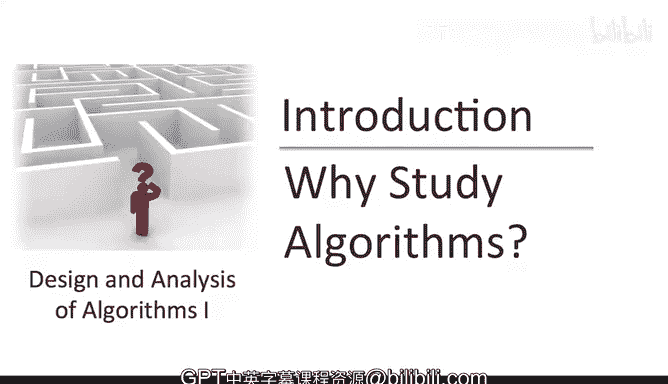
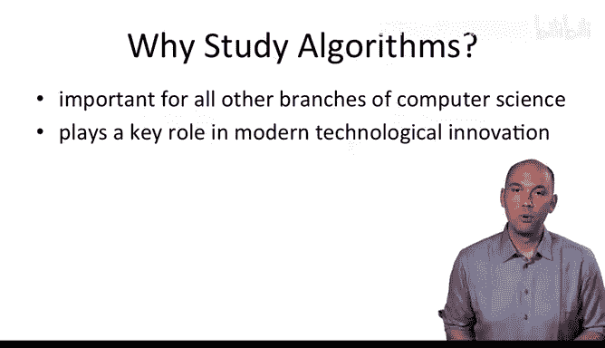
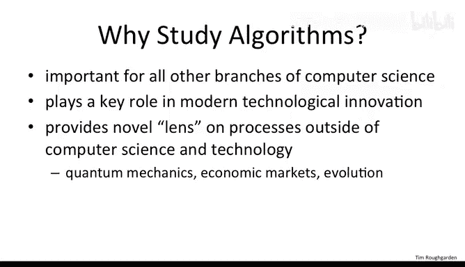

# 算法设计与分析：01：为何学习算法 🧠

在本节课中，我们将探讨学习算法设计与分析的重要性。我们将从算法的基本定义开始，逐步了解其在计算机科学、技术创新乃至更广泛领域中的核心作用。

---

## 什么是算法？

算法是一组明确定义的规则，本质上是一个用于解决特定计算问题的“配方”。

例如：
*   你可能有一组数字，需要将它们重新排列成有序序列。
*   你可能有一张地图、一个起点和一个终点，需要计算从起点到终点的最短路径。
*   你可能面临多个需要在不同截止日期前完成的任务，需要确定完成任务的顺序，以确保所有任务都能在各自的截止日期前完成。

---

## 为何学习算法？

上一节我们了解了算法的基本概念，本节中我们来看看学习算法的几个关键原因。

### 原因一：计算机科学工作的基础

理解算法和数据结构的基础知识，对于从事计算机科学几乎所有分支的严肃工作都至关重要。这也是斯坦福大学计算机科学系所有学位（学士、硕士和博士）都要求学习这门课程的原因。

以下是几个具体例子：
*   **路由和通信网络** 依赖于经典的**最短路径算法**。
*   **公钥密码学的有效性** 依赖于**数论算法**。
*   **计算机图形学** 需要**几何算法**提供的计算原语。
*   **数据库索引** 依赖于**平衡搜索树**数据结构。
*   **计算生物学** 使用**动态规划算法**来衡量基因组相似性。

### 原因二：技术创新的关键驱动力

算法在现代技术创新中扮演着关键角色。一个最明显的例子是搜索引擎，它使用一系列复杂的算法来高效计算各个网页与给定搜索查询的相关性。其中最著名的算法是谷歌目前使用的**PageRank算法**。

事实上，在2010年12月提交给美国白宫的一份报告中，总统科技顾问委员会指出，在许多领域，**算法改进带来的性能提升，甚至远远超过了处理器速度提升所带来的显著性能增益**。

### 原因三：理解世界的全新视角

虽然这超出了本课程的范围，但算法正越来越多地被用作观察计算机科学和技术之外过程的新视角。

例如：
*   对**量子计算**的研究为量子力学提供了新的计算视角。
*   经济市场中**价格波动**可以被富有成效地视为一种算法过程。
*   甚至**进化**也可以被有效地看作一种出奇有效的搜索算法。

### 原因四：智力的挑战与乐趣

最后两个学习算法的原因听起来可能有些随意，但都包含不少真理。

首先，具有挑战性的课程在努力攻克后，能让人感觉比开始时更聪明。希望这门课程能为你们中的许多人提供类似的体验。

其次，希望到课程结束时，我能说服你们中的一些人同意我的观点：**算法设计与分析本身就充满乐趣**。这是一项需要精准性与创造性罕见结合的事业。它有时确实令人沮丧，但也极易让人上瘾。

---

## 从抽象回归具体

现在，让我们从这些崇高的概括中回归，变得更加具体。请记住，**我们从小就开始学习和使用算法了**。

---

本节课中，我们一起学习了算法的基本定义，并深入探讨了学习算法的四大原因：它是计算机科学的基础、技术创新的核心、理解世界的新透镜，同时也是一项充满智力挑战和乐趣的活动。在接下来的课程中，我们将开始具体探索各种经典的算法思想与技术。