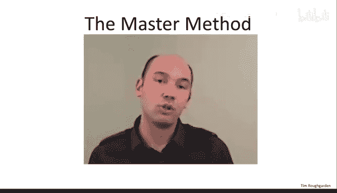
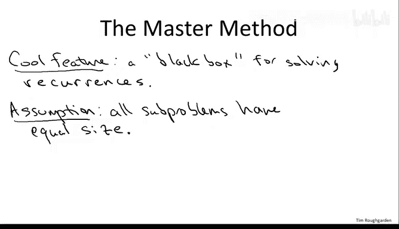
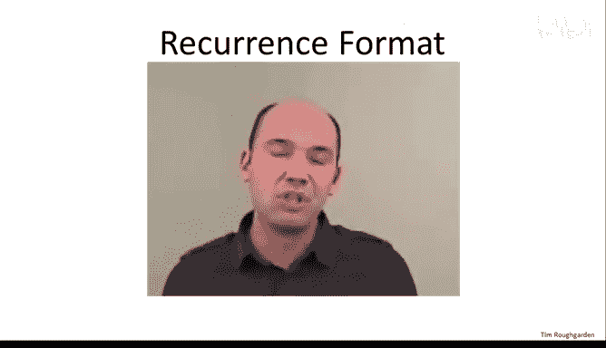
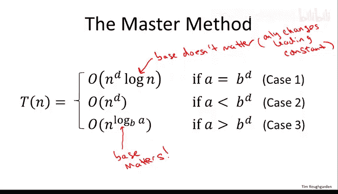

# 算法分析：20：主定理的形式化表述 📘

在本节课中，我们将学习主定理的精确数学表述。主定理是一个用于分析递归算法运行时间的强大工具，它能够处理特定格式的递归式，并直接输出算法运行时间的上界。

## 递归算法的通用格式

上一节我们介绍了主定理的通用性，本节中我们来看看其精确的数学表述形式。主定理适用于所有子问题规模相同的递归算法。

### 基本假设

首先，主定理（至少在本课程给出的版本中）只适用于所有子问题规模完全相同的递归算法。例如，在归并排序中，有两个递归调用，每个调用处理原数组的一半。因此，归并排序满足此假设。同样，在我们之前的整数乘法算法中，所有子问题处理的整数位数都是原问题的一半。

如果递归算法处理的子问题规模不同（例如，一个处理三分之一，另一个处理三分之二），那么本节介绍的主定理将不适用。虽然存在更通用的主定理版本可以处理不平衡的子问题规模，但这超出了本课程的范围。我们介绍的这个版本足以覆盖我们将要看到的大多数例子。

### 递归式的标准格式

接下来，我们描述主定理所适用的递归式格式。更通用的主定理版本可以处理更多类型的递归式，但这里给出的版本相对简单，并且足以覆盖你可能遇到的大多数情况。

递归式包含两个部分：
1.  一个相对不重要但必要的**基本情况**。我们做一个显而易见的假设：当输入规模减小到足够小时，递归停止，子问题可以在常数时间内解决。这个假设在本课程的所有例子中都成立，因此我们不再深入讨论。
2.  包含递归调用的**一般情况**。

我们假设递归式具有以下格式：
`T(n) ≤ a * T(n/b) + O(n^d)`

其中：
*   `n` 是输入规模。
*   `a` 是递归调用的次数（子问题的数量）。`a` 是一个不小于1的整数。
*   `b` 是每次递归调用前输入规模缩小的因子。`b` 是一个大于1的常数（例如，递归处理一半问题则 `b=2`）。
*   `d` 是递归调用之外所做工作的运行时间的指数。`d` 是一个不小于0的常数（`d=0` 表示常数时间的工作）。

需要强调的是，`a`、`b` 和 `d` 都是**常数**，它们是独立于输入规模 `n` 的数字（如1，2，3等）。

关于公式中的 `O(n^d)` 项，我们暂时忽略大O记号中隐藏的常数因子，这在证明主定理时不会影响最终结论。当然，指数 `d` 本身非常重要，它决定了工作是常数级、线性级还是平方级等。

## 主定理的精确表述 🧮

在建立了上述符号体系后，我们现在可以精确地陈述主定理。

给定一个形如 `T(n) ≤ a * T(n/b) + O(n^d)` 的递归式，其解（即运行时间上界）由以下三种情况之一给出，具体取决于 `a` 与 `b^d` 的比较结果：

**情况1：** 如果 `a = b^d`，那么 `T(n) = O(n^d * log n)`。
**情况2：** 如果 `a < b^d`，那么 `T(n) = O(n^d)`。
**情况3：** 如果 `a > b^d`，那么 `T(n) = O(n^(log_b a))`。

以下是几点说明：
*   这个版本的主定理只给出了运行时间的**上界**（Big-O），这是因为我们在递归式中也使用了Big-O。这符合本课程作为算法设计者的视角，即我们主要关注最坏情况运行时间的上界保证。
*   作为一个练习，你可以尝试证明：如果将递归式加强为 `T(n) = a * T(n/b) + Θ(n^d)`，那么主定理结论中的所有Big-O都可以加强为Θ，从而得到渐近精确的解。
*   注意两种对数处理方式的差异：
    *   在情况1的 `log n` 中，我们没有指定对数的底数。这是因为不同底数的对数之间只相差一个常数因子，而这个常数因子被Big-O记号隐藏了。
    *   在情况3的指数 `log_b a` 中，我们必须明确指出对数的底数 `b`，因为指数上的常数差异会导致运行时间发生质变（例如，从线性时间变为平方时间）。

## 总结与预告

本节课中，我们一起学习了主定理的精确数学表述。我们明确了其适用范围（子问题规模相同），定义了递归式的标准格式 `T(n) ≤ a * T(n/b) + O(n^d)`，并完整陈述了依赖于 `a` 与 `b^d` 比较结果的三个解的情况。

目前这三个公式可能看起来有些神秘。在接下来的课程中，我们将首先通过多个例子（包括解决高斯递归整数乘法算法的运行时间问题）来应用主定理，然后我们将证明主定理本身。通过分析和证明，这三个案例及其对应的公式将变得非常自然且易于理解。