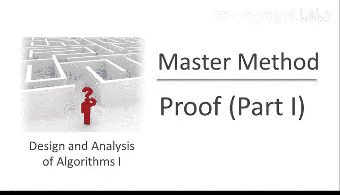
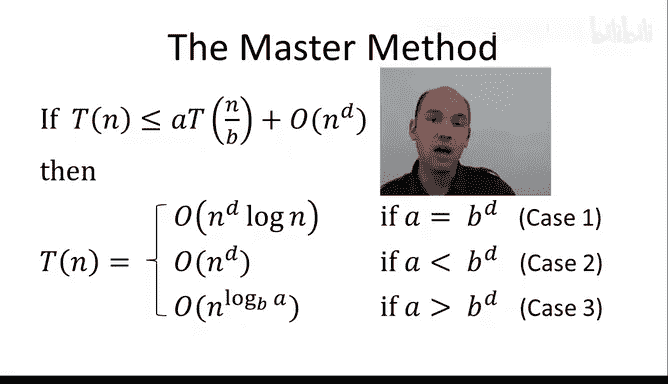
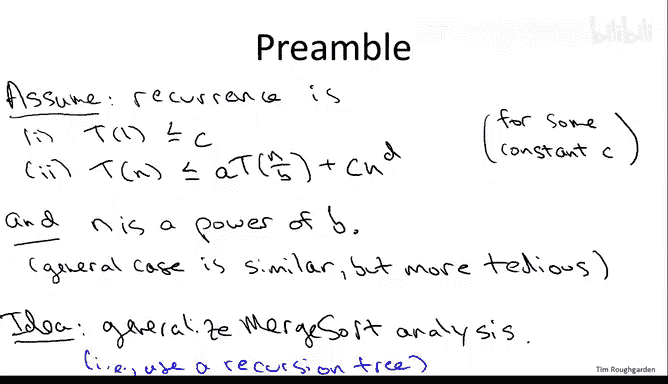
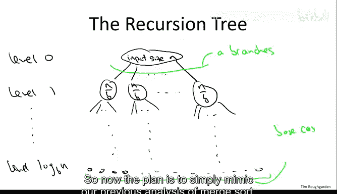
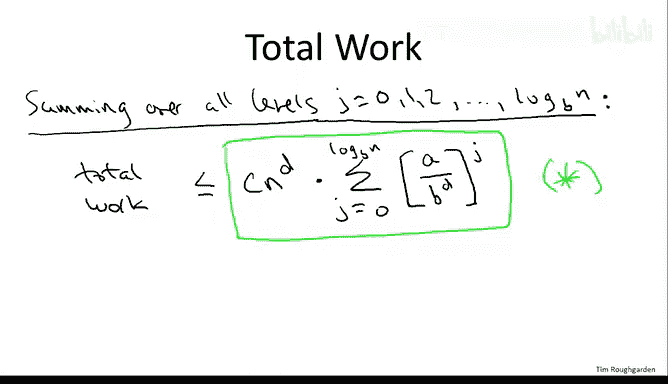

# 斯坦福大学《算法（分治／排序／搜索／随机算法、图搜索／最短路径／数据结构、贪心算法／最小生成树／动态规划、最短路径／NP）｜Algorithms》中英字幕 - P22：22_02_04_证明 I.zh_en - GPT中英字幕课程资源 - BV1Rx4y1U7sZ

In this video we begin the proof of the master method。 The master method。

 you'll recall is a generic solution to recurrences of a given form。

 recurrences in which there is a recursive calls， each on a sub problemm of the same size。

 size N over B， assuming that the original problem had size N。

 And plus there is big O of entity D work done by the algorithm outside of these a recursive calls。

 The solution that the master method provides has three cases。

 depending on how a compares2 B to the D。

Now， this proof will be the longest one that we've seen so far by a significant margin。

 It'll span this video as well as the next two。 So let me say a few words upfront about what you might want to focus on。

 Overall， I think the proof is quite conceptual。 there's a couple of spots where we're going to have to do some computations。

 and the computations I think are worth seeing once in your life。

 I don't know that they're worth really committing to long-term memory。

 What I do think is worth remembering in the long term， however。

 is the conceptual meaning of the three cases of the master method。 In particular。

 the proof will follow a recursion tree approach just like we used in the runningtime analysis of the merge sort algorithm。

 and it's worth remembering what three different types of recursion trees the three cases of the master method corresponds to。

 If you can remember that there will be absolutely no need to memorize any of these three running times。

 including the third rather exotic looking one。 Rather。

 you'll be able to reverse engineer those running times just from your conceptual understanding of what the three cases mean and how they correspond to recursion trees of different types。

So one final comment before we embark on the proof。 So as usual。

 I'm uninterested in formality in its own sake。 The reason we use mathematical analysis in this course is because it provides an explanation of fundamentally why things are the way they are。

 For example， why the master method has three cases and what those three cases mean。

 So I'll be giving you an essentially complete proof of the master method In the sense that it has all of the key ingredients。

 I will cut corners on occasion where I don't think it hinders understanding and where it's easy to fill in the details。

 So it won't be 100% rigorous。 I won't dot every eye and cross every T。

 but it will be a complete proof on the conceptual level。

That being said， let me begin with a couple of minor assumptions I'm going to make to make our lives a little easier。

So first we're going to assume that the recurrence has the following form。

 So here essentially all I've done is I've taken our previous assumption about the format of recurrence and I've written out all of the constants。

 so I'm assuming that the base case kicks in when the input size is1 and I'm assuming that the number of operations and the base case of Mo C and that that constant C is the same one that was hidden in the big O notation of the general case of the recurrence the constants C here isn't going to matter in the analysis it's just all going to be a wash but to keep everything clear I'm going to write out all of the constants that were previously hidden in the big O notation。

Another assumption I'm going to make analogous to our merge short analysis is that n is a power of B。

The general case would be basically the same， just a little more tedious。At the highest level。

 the proof of the master method should strike you as very natural。 Really。

 all we're going to do is revisit the way that we analyze merge short。

 recall our recursion tree method worked great and gave us this n log nbound on the running time of merge short。

 So we're just going to mimic that recursion tree and see how far we get。

So let me remind you what a recursion tree is at the root at level 0， we have the outermost。

 the initial indication of the recursive algorithm at level1。

 we have the first batch of recursive calls at level 2。

 we have the recursive calls made by that first batch of recursive calls and so on all the way down to the leaves of the tree which correspond to the base cases where there's no further recursion。

Now， you might recall from the merge sort analysis that we identified a pattern that was crucial in analyzing the running time and that pattern that we had to understand was at a given depth J。

 at a given level J of this recursion tree， first of all。

 how many distinct subproblems are there in level J。

 how many different level J recursive calls are there， and secondly。

 what is the input size that each of those level J subproblems has to operate on。

So think about that a little bit and give your answer in the following quiz。

So the correct answer is the second one at level J of this recursion tree。

 there are a to the J subproblem and each has an input of size n over b to the J。 So first of all。

 wire there a to the j subproblems。 Well， when j equals0 at the root， there's just the one problem。

 the original indication of the recursive algorithm and then each call of the algorithm makes a further calls for that reason the number of subproblems goes up by a factor of a with each level leading to a to the J subproblems at level J。

 Similarlyly， B is exactly the factor by which the input size shrinks once you make a recursive call。

 So j levels into the recursion， the input size has been shrunk J times by a factor of B each time So the input size of level J is n over B to the J。

 That's also the reason why if you look at the question statement。

 we've identified the number of levels as being log based B of N back in merge short， B was2。

 we recursed on half the array So the leavess all resided at level log。2 of n in general。

 if we're dividing by a factor B each time， then it takes log base B of n times before we get down to the base cases of size1。

 so the number of levels overall is zero through log base B of n for a total of log base B of n plus one levels。

Here then is what the recursion tree looks like。At level zero。

 we have the roots corresponding to the outermost call。And the input size here is n。

The original problem。Children of a node correspond to the recursive calls because there are A recursive calls by assumption there are eight children or aid branches。

Level one is the first batch of recursive calls。Each of which operates on an input of size， N over B。

At level log base B of n， we've cut the input size by a factor B this many times。

 so we're down to one so that triggers the base case。

So now the plan is to simply mimic our previous analysis of merge sort。

 so let's recall how that worked What we did is we zoomed in in a given level and for a given level J we counted the total amount of work that was done at level J subproblem not counting work that was going to be done later by recursive calls。

 then given a bound on the amount of work at a given level J we just summed up over all the levels to capture all of the work done by all of the recursive indications of the algorithm。

 So inspired by our previous success， let's zoom in on a given level J and see how much work gets done with level J subproblem。

We're going to compute this in exactly the way we did in merge sort。

 namely we're just going to look at the number of problems that are at level J。

 and we're going to multiply that by a bound on the work done persA problem。

We just identified the number of level J subproble as A to the J to understand the amount of work done for each level J subproblem。

 let's do it in two parts。 So first of all， let's focus on the size of the input for each level J subproble That's what we just identified in the previous quiz question Since the input size is being decreased by a factor B each time the size of each level J subproblem is n over B to the J。

Now， we only care about the size of a level J sub problemble inasmuch as it determines the amount of work。

 the number of operations that we perform per level J subproblem and to understand the relationship between those two quantities we just returned to the recurrence。

 The recurrence says how much work gets done in a given subproble。

 while there's a bunch of work done by recursive calls。

 the a recursive calls and we're not counting that。

 We're just counting up the work done here at level J。

 and the recurrence also tells us how much work is done outside of the recursive calls， namely。

 it's no more than the constant C times the input size raised to the D power。

So here the input size is n over B to the J， so that gets multiplied by the constant C。

And it gets raised to the D power。Okay， so C times quantity， n over B to the J。

 that's the input size raised to the D power。Next I want to simplify this expression a little bit and I want to separate out the terms which depend on the level number J and the terms which are independent of the level number J。

 so if you look at it A and B are both functions of J where the C and N of the D terms are independent of J so let's just separate those out。

And you will notice that we have now our grand entrance of the ratio between A and B to the D。

 and foreshadowing a little recall that the three cases of the master method are governed by the relationship between A and B to the D。

 and this is the first time of the analysis where we get a clue that the relative magnitude of those two quantities might be important。

So now that we've zoomed in on a particular label J and on the necessary computation to figure out how much work is done just at that level。

 let's sum over all of the levels so that we capture all of the work done by the algorithm。

So this is just going to be the sum of the expression we saw on the previous slide now since C end the D doesn't depend on J I can yank that out in front of the sum and I'll sum the expression over all J that results in the following。

So believe it or not， we've now reached an important milestone in the proof of the master method。

 specifically this somewhat messy looking formula here， which I'll put a green box around。

 is going to be crucial。And the rest of the proof will be devoted to interpreting and understanding this expression and understanding how it leads to the three different running time bounds in the three different cases。

Now I realize that at the moment， this expression star probably just looks like alphabet soup。

 probably just looks like a bunch of mathematical gibberish， but actually interpreted correctly。

 this has a very natural interpretation， so we'll discuss that in the next video。

