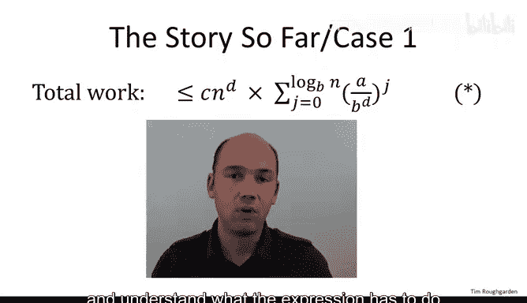
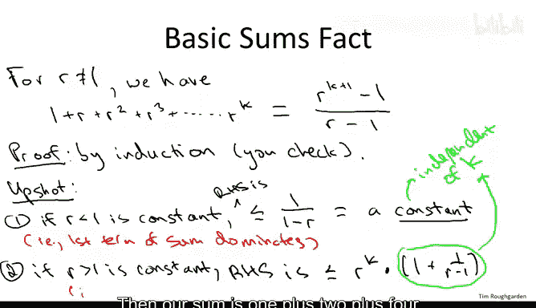
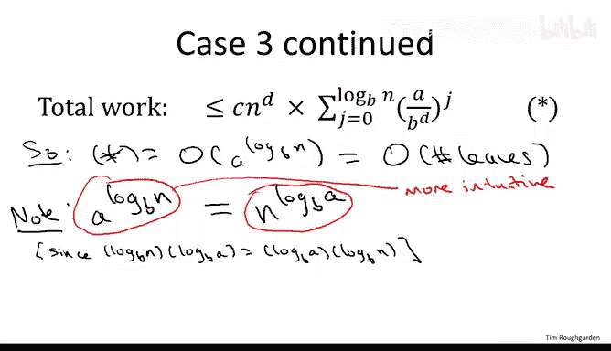
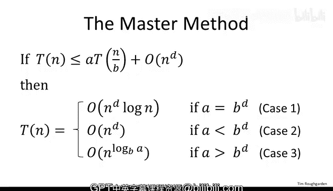

# 算法分析：24：主定理证明 II 🔍

在本节课中，我们将完成主定理的证明。我们将回顾递归树的分析，并利用几何级数的知识，将之前视频中关于三种递归树情况的直觉转化为严格的数学证明。

---

## 递归树与工作量表达式回顾

上一节我们介绍了如何使用递归树来分析递归算法的工作量。我们聚焦于树的第 `J` 层，识别出该层的总工作量，然后对所有层求和，得到了一个相当复杂的表达式：

**公式：**
```
T(n) = c * n^d * Σ_{j=0}^{log_b(n)} (a / b^d)^j
```



我们为这个表达式赋予了语义，并意识到比值 `a / b^d` 是区分三种根本不同类型递归树的关键：
*   **情况一：** `a = b^d`，每层工作量相同。
*   **情况二：** `a < b^d`，每层工作量递减。
*   **情况三：** `a > b^d`，每层工作量递增。

这为我们提供了主定理三种情况的直觉，甚至预测了可能的运行时间。接下来，我们需要将这种直觉转化为严谨的证明。

---

## 情况一：工作量恒定

首先，我们来看最简单的情况，即情况一。我们假设 `a = b^d`。

**公式：**
```
a = b^d
```

在这种情况下，子问题增殖的速率与每个子问题工作量减少的速率完美平衡。现在，检查表达式 `(a / b^d)^j`，当 `a = b^d` 时，这个比值等于 `1`。因此，对于所有 `j`，`(a / b^d)^j` 也等于 `1`。

于是，求和变得非常简单。求和结果就是 `1` 自加 `log_b(n) + 1` 次。所以，总和等于 `log_b(n) + 1`。这个结果将乘以与求和无关的 `c * n^d` 项。

**总结：** 当 `a = b^d` 时，表达式 `T(n)` 等于 `c * n^d * (log_b(n) + 1)`。用大 O 记号表示，就是 `O(n^d * log n)`。我们通常省略对数的底数，因为不同底数的对数只相差一个常数因子，可以被大 O 记号中的常数隐藏。

情况一的证明到此结束。这确实是最简单的情况。

---

## 几何级数预备知识

当 `a` 不等于 `b^d` 时（即 `a < b^d` 或 `a > b^d`），我们需要借助几何级数的知识。为此，我们进行一个简短的讨论。

考虑一个常数 `r`（`r > 0` 且 `r ≠ 1`）。假设我们求和 `r` 的幂，从 `r^0` 到 `r^k`。这个和有一个简洁的封闭形式公式：

**公式：**
```
Σ_{j=0}^{k} r^j = (r^{k+1} - 1) / (r - 1)
```

为了建立直觉，可以考虑两个典型值：
*   当 `r = 2` 时，我们求和 `1 + 2 + 4 + 8 + ...`。
*   当 `r = 1/2` 时，我们求和 `1 + 1/2 + 1/4 + 1/8 + ...`。

这个公式可以通过归纳法证明，我们将其留作练习。我们关注的是这个事实能为我们带来什么。

我们将用这个公式来形式化一个观点：在递归树中，如果工作量随层数增加，则叶子节点主导总运行时间；如果工作量随层数减少，则根节点主导运行时间。我们可以忽略递归树的其他层。



基于这个公式，我们得到两个重要推论：
1.  **当 `r < 1` 时：** 右边的表达式 `(r^{k+1} - 1) / (r - 1)` 可以被上界 `1 / (1 - r)` 所限定。关键在于，这是一个常数（与求和项数 `k` 无关）。这意味着，当我们对一系列 `r < 1` 的项求和时，第一项（`1`）占主导地位，无论我们加多少项，总和都不会超过某个常数。
2.  **当 `r > 1` 时：** 通过一点代数运算，我们可以将右边表达式上界为 `r^k` 乘以一个与 `k` 无关的常数。这意味着，整个和不会超过最大（即最后）一项的常数倍。在这个意义上，级数的最大项主导了整个和。

**总结：** 当我们对一个常数 `r` 的幂求和时，如果 `r > 1`，则最大的幂主导了和；如果 `r < 1`，则和只是一个常数。

---

## 情况二：工作量递减

现在，我们应用几何级数的知识来证明主定理的情况二。在情况二中，我们假设 `a < b^d`。

**公式：**
```
a < b^d
```

这意味着子问题增殖的速率被每个子问题工作量减少的速率所淹没。这是工作量随递归树层级递减的情况。我们的直觉是，在最简单的情况下，我们希望所有工作（至多差一个常数因子）都在根节点完成。

令比值 `r = a / b^d`。由于 `a < b^d`，所以 `r < 1`。我们的求和表达式 `Σ (a / b^d)^j` 正是对常数 `r`（`r < 1`）的幂求和。

根据上一节的结论，任何这样的和都被一个与求和项数无关的常数所限定。因此，表达式 `T(n)` 等于 `c * n^d` 乘以一个常数。在大 O 记号中，我们可以说 `T(n)` 的上界是 `O(n^d)`。

这精确地证实了我们的直觉：在这种工作量递减的递归树中，算法的总运行时间确实由根节点主导。总工作量仅仅是树第 0 层（根节点）工作量的常数倍。

---

## 情况三：工作量递增与叶子节点

最后，我们进入证明中最具挑战性的部分：情况三。在情况三中，我们假设 `a > b^d`。

**公式：**
```
a > b^d
```

从概念上讲，我们假设子问题增殖的速率超过了每个子问题工作量减少的速率。这是递归树中工作量随层级递增的情况，最多的工作在叶子节点完成。再次利用几何级数的事实，我们可以精确地实现我们的期望：实际上我们只需要关心叶子节点，可以忽略其他工作，最多损失一个常数因子。

同样，我们记比值 `r = a / b^d`。在这种情况下，`r > 1`。这个求和是对一系列 `r > 1` 的幂求和。

根据几何级数的结论，这样的和被求和中的最大（即最后）项所主导，它们被该项的一个常数倍所限定。因此，我们可以将表达式 `T(n)` 简化为以下形式（用大 O 记号表示，同时隐藏来自原递推式的常数 `c` 和来自几何级数结论的常数）：

**公式：**
```
T(n) = O( n^d * (a / b^d)^{log_b(n)} )
```

现在，我们处理这个看似复杂的表达式。首先，关注 `(1 / b^d)^{log_b(n)}` 这一部分：

**推导：**
```
(1 / b^d)^{log_b(n)} = b^{-d * log_b(n)} = (b^{log_b(n)})^{-d} = n^{-d}
```

神奇的是，这个 `n^{-d}` 将与表达式前面的 `n^d` 相抵消。于是，我们只剩下：

**公式：**
```
T(n) = O( a^{log_b(n)} )
```

`a^{log_b(n)}` 是一个非常有意义的量。它描述了递归树中叶子节点的数量。回想一下，在情况三的直觉中，我们认为工作量可能由叶子节点的工作量主导，而叶子节点的工作量与叶子数量成正比。

为什么这是叶子数量？在递归树中，第 0 层有 1 个节点。每向下一层，节点数变为上一层的 `a` 倍。这个过程持续到我们到达叶子节点。输入规模从根节点的 `n` 开始，每次除以因子 `b`，直到变为 `1`。因此，叶子节点恰好位于第 `log_b(n)` 层。所以，叶子节点的数量就是分支因子 `a` 乘以我们实际乘以 `a` 的次数，即层数 `log_b(n)` 次，结果为 `a^{log_b(n)}`。

因此，我们在数学上以一种非常酷的方式证实了关于主定理情况三的直觉。我们证明了在情况三中，当 `a > b^d` 时，运行时间是 `O(叶子节点数量)`，正如直觉所预测的那样。

---

## 最终形式与总结

然而，这留下了一个最后的疑问：回顾主定理的陈述，在情况三中，运行时间写的是 `O(n^{log_b(a)})`，而不是 `O(a^{log_b(n)})`。我们之前多次使用情况三的公式来评估高斯递归整数乘法算法、Strassen矩阵乘法算法等。

原因很简单：`a^{log_b(n)}` 和 `n^{log_b(a)}` 是完全相同的量。如果你不相信，可以对两边取以 `b` 为底的对数，你会发现两边相等。



**公式：**
```
a^{log_b(n)} = n^{log_b(a)}
```

你可能会问，为什么不在主定理中直接陈述运行时间是 `O(a^{log_b(n)})`（即递归树的叶子数量）这个更有概念意义的形式？原因是，虽然左边的表达式在概念上更有意义，但右边的形式 `O(n^{log_b(a)})` 在应用时最为方便。回想我们之前用主定理评估算法运行时间的例子，当我们代入 `a` 和 `b` 的具体数值时，右边的形式超级方便。

无论如何，无论你选择将情况三的运行时间视为与树的叶子数量成正比，还是视为与 `n^{log_b(a)}` 成正比，证明都已经完成。这就是情况三，也是最后一个情况。至此，主定理证明完毕。

---

## 核心概念回顾

证明主定理是一项艰巨的工作，我们不期望有人能复述所有细节。但是，这个证明中有几个高层次的概念点值得长期记住：

1.  **通用分析：** 我们从为递归算法绘制递归树开始，以通用方式逐层计算算法的工作量。这部分证明与 `a`、`b`、`d` 之间的关系无关。
2.  **三种树类型：** 我们识别出三种根本不同类型的递归树：每层工作量相同、随层递增、随层递减。记住这一点，你甚至可以回忆起三种情况的运行时间。
3.  **运行时间推导：**
    *   **情况一（工作量恒定）：** 我们知道有对数数量的层级，在根节点做 `n^d` 的工作，因此运行时间为 `O(n^d log n)`。
    *   **情况二（工作量递减）：** 我们知道根节点占主导（至多差一个常数因子），可以忽略其他层，根节点做 `n^d` 的工作，因此总运行时间为 `O(n^d)`。
    *   **情况三（工作量递增）：** 叶子节点占主导。叶子数量为 `a^{log_b(n)}`，等于 `n^{log_b(a)}`，这就是主定理情况三中运行时间的比例。



本节课中，我们一起学习了如何将递归树的直觉分析，通过几何级数的工具，转化为对主定理三种情况的严格证明。我们明确了每种情况下主导工作量的部分（根节点、所有层、叶子节点），并最终得到了熟悉的主定理公式。