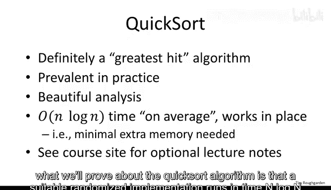
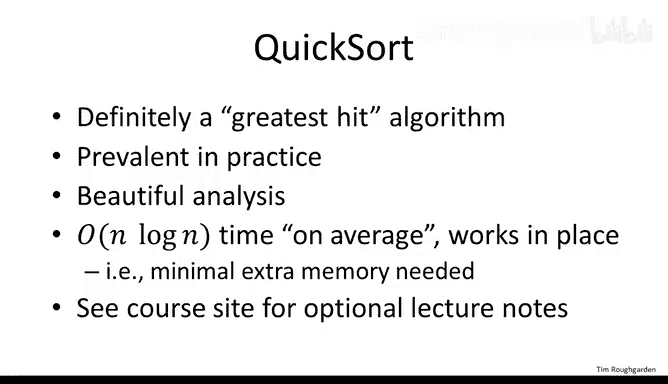
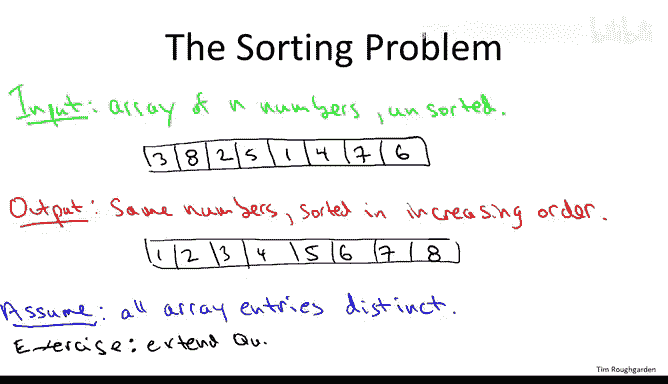
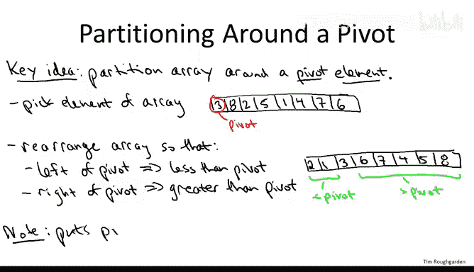
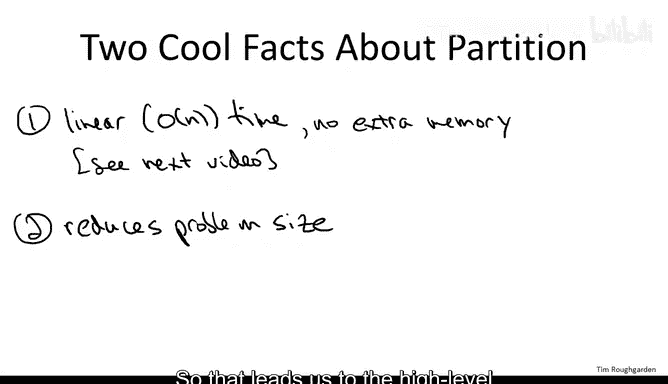
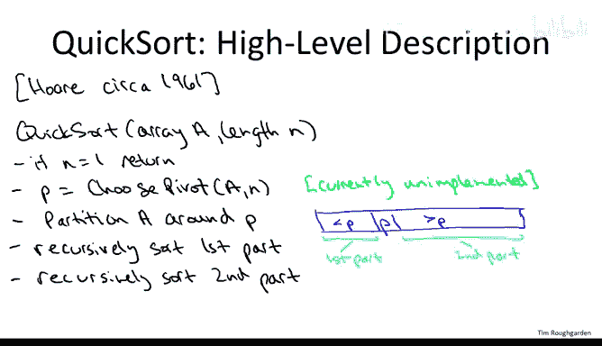
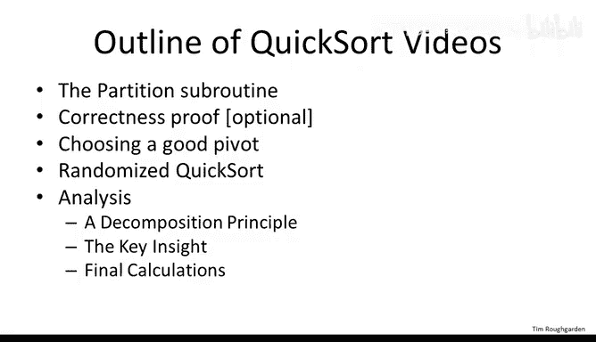

# 斯坦福大学《算法（分治／排序／搜索／随机算法、图搜索／最短路径／数据结构、贪心算法／最小生成树／动态规划、最短路径／NP）｜Algorithms》中英字幕 - P25：25_03_02_快速排序概述.zh_en - GPT中英字幕课程资源 - BV1Rx4y1U7sZ

So now we come to one of my favorite sequence of lectures where we get to discuss the famous Quick sort algorithm。

If you ask professional computer scientists and professional programmers to drop a list of their top five top 1 favorite algorithms。

 I'll bet you'd see quicksort on many of those people's lists so why is that after all we've already discussed sorting we already have a quite good and practical sorting algorithm name the merge sort algorithm Well quick sort in addition to being very practical it's competitive with and often superior to merge sort so in addition to being very practical and used all the time in the real world and in programming libraries it's just extremely elegant algorithm when you see the code it's just so succinct it's so elegant you just sort of wish you would come up with it yourself Moreover the mathematical analysis which explains why quick sort runs so fast and that mathematical analysis will cover in detail it's very slick it's something I can cover in just about half an hour or so。

So more precisely what we'll prove about the QuickSo algorithm is that a suitable randomized implementation runs in time n log n on average and I'll tell you exactly what I mean by on average later on in the sequence of lectures and moreover the constants hidden in the big notation are extremely small and that'll be evident from the analysis that we do Finally。

 and this is one thing that differentiates Quick sort from the merge sort algorithm is it operates in place that is and needs very little additional storage beyond what's given in the input array in order to accomplish the goal of sorting essentially what Quicksort does is just repeated swaps within the space of the input array until it finally concludes with a sorted version of the given array。

The final thing I want to mention on this first slide is that unlike most of the videos。

 this set of videos will actually have an accompanying set of lecture notes which I' posted in PDF from the course website。

 those are largely redundant， they're optional but if you want another treatment of what I'm going to discuss a written treatment I encourage you to look at the lecture notes on the course website so for the rest of this video I'm going to give you an overview of the ingredients of Quick sort and what we have to discuss in more detail and the rest of the lectures will give details of the implementation as well as the mathematical analysis。

So let's begin by recalling the sorting problem， this is exactly the same problem we discussed back when we covered merge sort。

 so we're given as input an array of n numbers in arbitrary order。So for example。

 perhaps the input looks like this array here。And then what have we got to do。

 we just got to output a version of these same numbers， but an increasing order。

Like when we discuss merge short， I'm going to make a simplifying assumption just to keep the lectures as simple as possible。

 namely I'm going to assume the input array has no duplicates。

 that is all of the entries are distinct。And like with mergeS。

 I encourage you to think about how you would alter the implementation of QuickS so that it deals correctly with Tos。

 with duplicate entries。

To discuss how QuickSo works at a high level I need to introduce you to the key subroutine。

 and this is really the key great idea in QuickSo， which is to use a subroutine which partitions an array around a pivot element。

So what does this mean， Well， the first thing you got to do is you got to pick one element in your array to act as a pivot element。

Now eventually we'll worry quite a bit about exactly how we choose this magical pivot element。

 but for now you can just think of it that we pluck out the very first element in the array to act as the pivot。

So for example， in the input array that I mentioned on the previous slide。

 we could just use three as the pivot element。After you've chosen a pivot element。

 you then rearrange the array and you rearrange it so that every all the elements which come to the left of the pivot element are less than the pivot and all the elements which come after the pivot element are greater than the pivot。

So for example， giving this input away， one legitimate way to rearrange it so that this holds is the following。

Perhaps in the first two entries， we have the two and the one， then comes the pivot element。

 and then comes the elements 4 through8 in some perhaps jumbled order。

So notice that the elements to the left of the pivot。

 the two and the one are indeed less than the pivot， which is three。

And the five elements to the right of the pivot， to the right of the three are indeed all greater than three。

Notice in the partitioning subroutine we do not insist that we get the relative order correct amongst those elements less than the pivot or amongst those elements bigger than the pivot。

 so in some sense we're doing some kind of partial sorting。

 we're just bucketing the elements of the array into one bucket。

 those less than the pivot and then a second bucket those bigger than the pivot and we don't care about getting right the order within each of those two buckets。

So partitioning is certainly a more modest goal than sorting。

 but it does make progress towards sorting in particular。

 the pivot element itself winds up in its rightful position。

 that is the pivot element winds up where it should be in the final sortded version of the array you'll notice in the example we chose as the pivot the third largest element and it does indeed wind up in the third position of the array。

 so more generally where should the pivot be in the final sorted version。

 well it should be to the right of everything less than it。

 it should be to the left of everything bigger than it。

 and that's exactly what partitioning does by definition。

So why is it such a good idea to have a partitioning subroutine After all we don't really care about partitioning what we want to do is sort Well the point is that partitioning can be done quickly。

 can be done in linear time and it's a way of making progress toward having a sorted version of an array and it's going to enable a divide and conquer approach toward sorting the input array So in a little bit more detail。

 let me tell you about two cool facts about a partition subroutine I'm not going to give you the code for partitioning here I'm going to give it to you in the next video but here are the two salient properties of the partition subroutine discussed in detail in the next video。

So the first cool fact is that it can be implemented in linear， that is big O of N time。

Where n is the size of the input array and moreover， not just linear time。

 but linear time with essentially no extra overhead。

 so we're going to give a linear time of implementation where all you do is repeated swaps。

 you do not allocate any additional memory and that's key to the practical performance of the Quickword algorithm。

Secondly， it cuts down the problem size， so it enables a divide and conquer approach。

Namely after we've partitioned an array around some pivot elements。

 all we have to do is recursively sort the elements that lie on the left of the pivot and recursively sort the elements that lie on the right of the pivot and then will' be done so that leads us to the high level description of the quick sort algorithm。

Before I give the high level description， I should mention that this algorithm was discovered by Tony Hor。

Roughly 1961 or so， this was at the very beginning of Hor's career， he was just about 26。

 27 years old， he went on to do a lot of other contributions and eventually wound up winning the highest honor in computer science。

 the ACM Turing Award in 1980 and when you see this code。

 I'll bet you feel like you wish you would come up with this yourself It's hard not to be envious of the inventor of this very elegant quickword algorithm。

So just like in merge short， this is going to be a divide and conquer algorithm so it takes an array of some length n and if it's an array of length n it's already sorted and that's the base case and we can return。

 otherwise we're going to have two recursive calls。

The big difference from merge sort is that whereas in merge short。

 we first split the array in two pieces， recurarse and then combine the results here the recursive calls come last。

 so the first thing we're going to do is choose a pivot element。

 then partition the array around that pivot element and then do two recursive calls and then it will be done。

 there will be no combined step， no merge step。So in the general case。

 the first thing you do is choose a pivot element for the moment I'm going to lose leave the Cho pivot subroutine unimplemented。

 there's going to be an interesting discussion about exactly how you should do this for now you just do it in some way that for somehow you come up with one pivot element。

 for example， a naive way would be to just choose the first element。

Then you invoke the partition subroutine that we discussed in the last couple of slides。

So recall that results in a version of the array in which the pivot element P is in its rightful position。

 Everything to the left of P is less than P。 Everything to the right of the pivot is bigger than the pivot。

 And now all you have to do to finish up is recurse on both sides。

So let's call the elements less than P the first part。

Of the partition array and the elements greater than P， the second part。Of the recursive array。

And now we just call Quicksort again to recursively sort the first part and then the recursively sort the second part。

And that is it， that is the entire quick sort algorithm at a high level。

 this is one of the relatively rare recursive or divine and conquer algorithms that you're going to see where you literally do no work after solving the subproble there is no combined step。

 no merge step once you've partitioned you just sort the two sides and you're done。

So that's the high level description of the Quickword algorithm。

 Let me give you a quick tour of what the rest of the video is gonna be about。

 So first of all I owe you details on this partition subroutine。

 I promised you it could be implemented in linear time with no additional memory so I'll show you an implementation of that on the next video we'll have a short video that formally proves correctness of the quickword algorithm I think most of you will kind of see intuitively why it's correct so that's a video you can skip if you'd want but if you do want to see what a formal proof of correctness for a divine and conquer algorithm looks like。

 you might want to check out that video then we'll be discussing exactly how the pivot is chosen。

 It turns out the running time of quick sort depends on what pivot you choose so we're gonna have to think carefully about that then we'll introduce randomized quick sort which is where you choose a pivot element uniformly at random from the given array hoping that a random pivot is going to be pretty good sufficiently often and then we'll give the mathematical analysis in three parts we'll prove that the Quickword algorithm runs an n log in time with small constants on average for a randomly chosen pivot in the first analysis video。

I'll introducetro a general decomposition principle of how you take a complicated random variable。

 break it into indicator random variables and use linearity of expectation to get a relatively simple analysis that's something we'll use a couple more times in the course。

 for example when we study hashing then we'll discuss sort of the key insight behind the quick sort analysis which is about understanding the probability that a given pair of elements gets compared at some point in the algorithm that'll be the second part and then there's gonna to be some mathematical computations just to sort of tie everything together and that'll give us the bound on the quick sort running time Another video that's available is a review of some basic probability concepts for those of you that are rusty that we'll be using in the analysis of Quick sort so that's it for the overview let's move on to the details。

