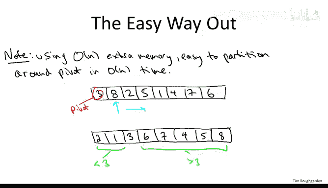
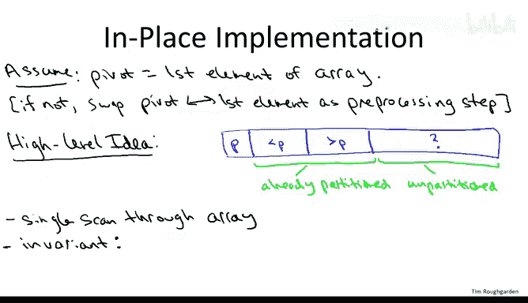
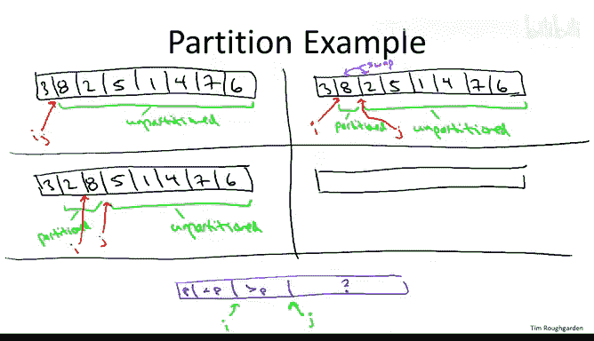
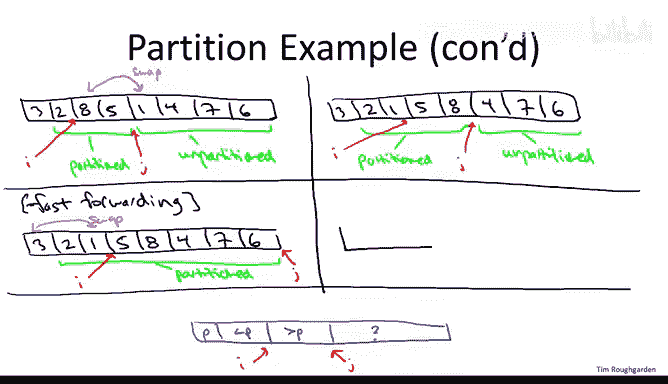
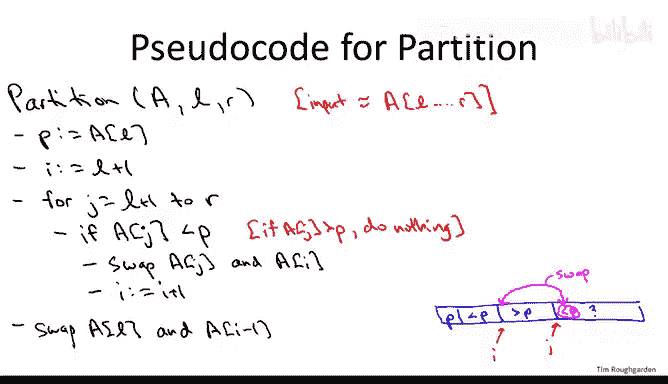
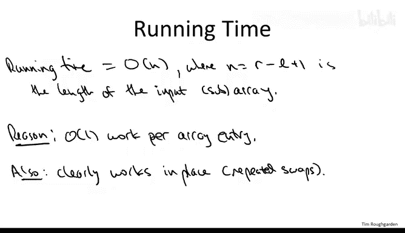
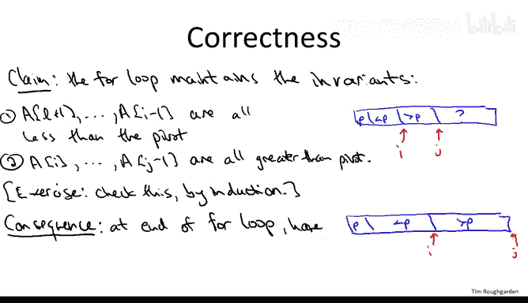

# 斯坦福大学《算法》课程：P26：基于枢轴的分区 🎯


在本节课中，我们将深入学习快速排序算法的核心实现细节，特别是其关键的**分区子程序**。我们将详细探讨如何在线性时间内、仅使用常数级额外空间，围绕一个枢轴元素重新排列数组。

## 概述

快速排序算法的核心思想是围绕一个**枢轴元素**对输入数组进行分区。分区完成后，所有小于枢轴的元素都位于其左侧，所有大于枢轴的元素都位于其右侧。这样，枢轴元素就找到了其在最终排序数组中的正确位置。之后，算法只需递归地对枢轴的左侧和右侧子数组进行排序即可。


## 分区子程序的目标

上一节我们介绍了快速排序的基本思想，本节中我们来看看其核心——分区子程序的具体实现。

分区子程序的任务是：给定一个数组和一个枢轴元素，重新排列数组，使得：
*   所有小于枢轴的元素都位于枢轴左侧。
*   所有大于枢轴的元素都位于枢轴右侧。



例如，对于数组 `[3, 8, 2, 5, 1, 4, 7, 6]`，若选择第一个元素 `3` 作为枢轴，一个合法的分区结果可能是 `[2, 1, 3, 8, 5, 4, 7, 6]`。注意，小于 `3` 的元素 `[2, 1]` 和大于 `3` 的元素 `[8, 5, 4, 7, 6]` 内部的顺序并不重要。

## 简单（但非原地）的分区方法

在深入原地分区算法之前，我们先看一个简单易懂但需要额外空间的方法，这有助于理解分区的本质。



如果允许使用 `O(n)` 的额外空间，实现线性时间的分区非常简单。以下是其步骤：

1.  创建一个与原数组等长的新数组。
2.  遍历原数组。
3.  若当前元素小于枢轴，则将其放入新数组的**左侧**（从左向右填充）。
4.  若当前元素大于枢轴，则将其放入新数组的**右侧**（从右向左填充）。
5.  遍历完成后，将枢轴元素放入新数组中间剩余的空位。

这种方法直观有效，但它需要线性级的额外内存。接下来，我们将学习如何在不使用额外数组的情况下完成同样的任务。

## 原地分区算法的高层思想

现在，我们转向核心的原地分区算法。为了简化，我们假设枢轴是数组的第一个元素。如果枢轴在其他位置，只需一个常数时间的交换操作，将其与第一个元素交换即可。

算法的核心是进行一次**线性扫描**。在扫描过程中，我们将维护一个关键的不变性（Invariant），以确保已处理的部分始终是正确分区的。

以下是算法在任何时刻维护的数组状态示意图：

```
[ Pivot | < Pivot | > Pivot | Unseen ]
         ^         ^         ^
         |         |         |
        (L)       (i)       (j)
```



*   **Pivot**: 枢轴元素，始终位于数组起始位置（直到最后一步）。
*   **< Pivot**: 已扫描且**小于**枢轴的元素区域。
*   **> Pivot**: 已扫描且**大于**枢轴的元素区域。
*   **Unseen**: 尚未扫描的元素区域。

我们用两个指针来维护边界：
*   **指针 `j`**: 指向**已扫描**与**未扫描**区域的分界点。
*   **指针 `i`**: 指向**小于枢轴**区域与**大于枢轴**区域的分界点。

算法的目标就是在每次扫描一个新元素时，通过交换操作，维持上述分区结构。

## 通过示例理解算法

在给出伪代码之前，让我们通过一个具体的例子来走查这个算法。我们将对数组 `A = [3, 8, 2, 5, 1, 4, 7, 6]` 进行分区，枢轴 `p = A[0] = 3`。

**初始化**:
*   枢轴 `p = 3`。
*   `i = 1`, `j = 1`。此时“小于区”和“大于区”都为空。
*   数组状态：`[3, 8, 2, 5, 1, 4, 7, 6]`
*                p i/j



**第1步 (j=1, 元素 A[1]=8)**:
*   `8 > 3`，属于“大于区”。简单地将 `j` 右移即可。
*   操作：`j++` (现在 `j=2`)。
*   数组状态不变：`[3, 8, 2, 5, 1, 4, 7, 6]`
*                p i   j

**第2步 (j=2, 元素 A[2]=2)**:
*   `2 < 3`，属于“小于区”。为了维持不变性，我们需要将这个新发现的“小元素”放到“小于区”的末尾。具体做法是：将 `A[j]` (2) 与 `A[i]` (8，当前“大于区”的第一个元素) 交换，然后同时将 `i` 和 `j` 右移。
*   操作：`swap(A[i], A[j])` -> `swap(8, 2)`；`i++`；`j++`。
*   数组状态变为：`[3, 2, 8, 5, 1, 4, 7, 6]`
*                p   i   j
*   “小于区”现在是 `[2]`，“大于区”是 `[8]`。

**第3步 (j=3, 元素 A[3]=5)**:
*   `5 > 3`，属于“大于区”。简单地将 `j` 右移。
*   操作：`j++` (现在 `j=4`)。
*   数组状态：`[3, 2, 8, 5, 1, 4, 7, 6]`
*                p   i       j

**第4步 (j=4, 元素 A[4]=1)**:
*   `1 < 3`，属于“小于区”。再次交换 `A[j]` (1) 与 `A[i]` (8)，然后移动 `i` 和 `j`。
*   操作：`swap(A[i], A[j])` -> `swap(8, 1)`；`i++`；`j++`。
*   数组状态变为：`[3, 2, 1, 5, 8, 4, 7, 6]`
*                p     i       j
*   “小于区”现在是 `[2, 1]`，“大于区”是 `[5, 8]`。

**后续步骤 (j=5,6,7, 元素 4,7,6)**:
*   剩余元素 `4, 7, 6` 都 `> 3`。对于每一个，我们都只需将 `j` 右移。
*   最终，当 `j` 移出数组边界后，扫描结束。
*   最终数组状态：`[3, 2, 1, 5, 8, 4, 7, 6]`
*                    p     i               (j 已越界)

**最终调整**:
*   此时，枢轴 `3` 还在数组开头。我们需要将其与“小于区”的最后一个元素（即 `A[i-1]`，也就是 `1`）交换，将其放入正确位置。
*   操作：`swap(A[L], A[i-1])` -> `swap(3, 1)`。
*   **最终分区结果**：`[1, 2, 3, 5, 8, 4, 7, 6]`
*   验证：`3` 左侧的 `[1, 2]` 都小于 `3`；右侧的 `[5, 8, 4, 7, 6]` 都大于 `3`。

## 分区算法的伪代码

通过上面的示例，算法的逻辑已经清晰。以下是该分区子程序的伪代码：

```pseudocode
function Partition(A, left, right):
    // 选择第一个元素作为枢轴
    pivot = A[left]
    // i 指向“小于区”的末尾的下一个位置（即“大于区”的开始）
    i = left + 1

    // j 遍历从 left+1 到 right 的所有元素
    for j = left + 1 to right:
        if A[j] < pivot:
            // 如果当前元素小于枢轴，需要将其纳入“小于区”
            swap(A[i], A[j])
            i = i + 1  // “小于区”向右扩张一位
        // 如果 A[j] >= pivot，则什么都不做，j++ 会自然将其留在“大于区”
        // (隐含在 for 循环的 j++ 中)

    // 将枢轴元素交换到其正确位置（即“小于区”的末尾）
    swap(A[left], A[i - 1])

    // 返回枢轴的最终位置，供快速排序递归使用
    return i - 1
```



## 算法分析



现在我们已经有了完整的算法，让我们来分析其关键特性：

*   **时间复杂度**：算法只包含一个从 `left+1` 到 `right` 的 `for` 循环。在每次迭代中，我们只进行常数次操作（比较和可能的交换）。因此，总时间复杂度为 **`O(n)`**，其中 `n = right - left + 1` 是待分区子数组的长度。
*   **空间复杂度**：算法只使用了几个额外的变量（`pivot`, `i`, `j`），没有分配任何与输入规模相关的额外数组。因此，它是一个**原地**算法，空间复杂度为 **`O(1)`**。
*   **正确性**：正确性的核心在于维护之前提到的**循环不变式**。我们可以通过归纳法证明，在 `for` 循环的每一次迭代开始和结束时，以下性质都成立：
    1.  `A[left+1 ... i-1]` 中的所有元素都 `< pivot`。
    2.  `A[i ... j-1]` 中的所有元素都 `>= pivot`。
    3.  `A[j ... right]` 是尚未处理的元素。
    当循环结束时（`j = right+1`），所有元素都已处理，且满足前两条性质。最后的 `swap` 操作将枢轴放置到 `i-1` 的位置，从而完成了整个分区。

## 总结



本节课中我们一起学习了快速排序算法的核心——**基于枢轴的原地区分子程序**。我们首先明确了分区的目标，然后从一个需要额外空间的简单方法入手，逐步推导出高效的原位算法。通过详细的示例走查和伪代码分析，我们理解了算法如何利用双指针 `i` 和 `j` 在一次线性扫描中完成数组的重排，并维护关键的不变性。该算法以 `O(n)` 的时间和 `O(1)` 的额外空间高效地完成任务，为快速排序的递归分治策略奠定了坚实的基础。下一节，我们将探讨如何选择枢轴，以及不同的选择策略如何影响快速排序的整体性能。