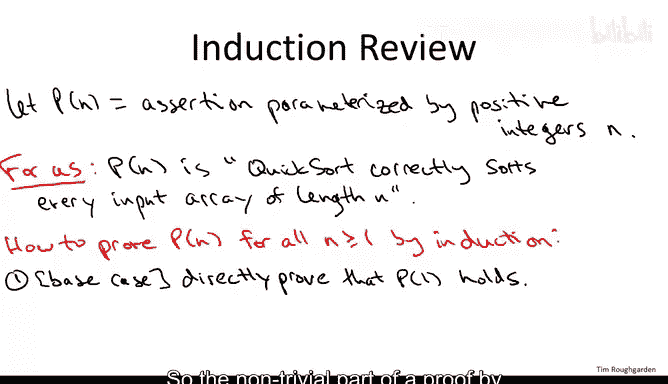
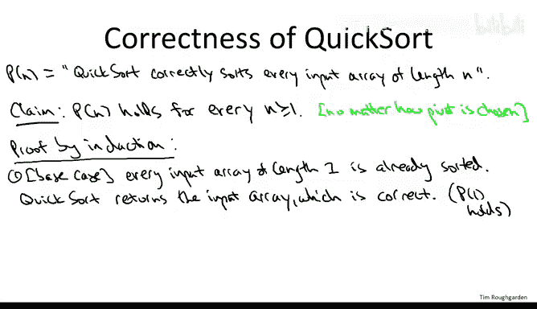
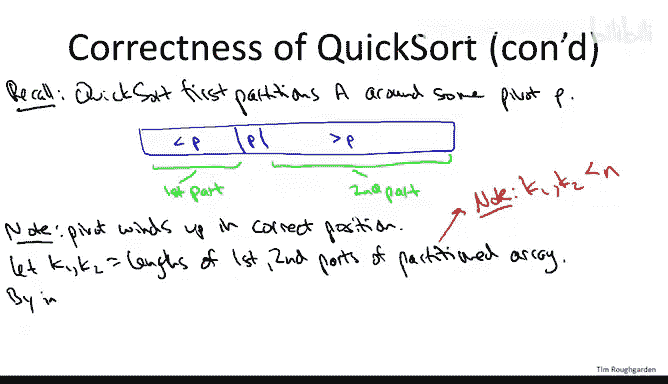

# 算法：P27：快速排序正确性证明（复习可选）📚

在本节课中，我们将学习如何使用数学归纳法来严格证明快速排序算法的正确性。我们将回顾归纳法的基本格式，并将其应用于快速排序，以证明无论选择何种枢轴元素，该算法都能正确地对任意长度的数组进行排序。

## 归纳法证明格式回顾 📝

上一节我们介绍了证明快速排序正确性的目标。本节中，我们来看看将用于证明的工具——数学归纳法。

归纳法通常用于证明一个关于所有正整数 `n` 的断言 `P(n)`。对于快速排序，我们的断言 `P(n)` 是：**快速排序总能正确地对长度为 `n` 的数组进行排序**。

一个归纳法证明包含两个部分：
1.  **基础情况**：证明断言对于最小的 `n`（通常是 `n=1`）成立。
2.  **归纳步骤**：假设断言对所有小于 `n` 的正整数 `k`（即 `P(k)` 成立）都成立，然后证明在此假设下，断言对 `n` 本身（即 `P(n)`）也成立。

如果成功完成了这两个步骤，就证明了断言 `P(n)` 对所有正整数 `n` 都成立。

## 快速排序正确性证明 🧮

现在，让我们将归纳法框架应用于快速排序。

### 基础情况：`n = 1`
当数组长度为 `1` 时，证明是简单的。长度为 `1` 的数组本身就是有序的。快速排序在 `n=1` 时直接返回输入数组，不做任何操作，这确实返回了一个有序数组。因此，我们直接证明了 `P(1)` 成立。

### 归纳步骤：`n >= 2`
现在，我们进入证明的核心部分。我们固定一个任意大于等于 `2` 的整数 `n`，并假设归纳假设成立：**快速排序对所有长度严格小于 `n` 的数组都是正确的**。我们需要证明，在此假设下，快速排序对任意长度为 `n` 的数组 `A` 也是正确的。

以下是证明步骤：

1.  **选择枢轴与分区**：快速排序首先任意选择一个枢轴元素 `p`（选择方式不影响正确性）。然后，算法围绕 `p` 对数组进行分区。分区结束后，数组被重新排列为：`[小于 p 的元素]`，`p`，`[大于 p 的元素]`。枢轴 `p` 被放置在其最终排序后应在的正确位置。
2.  **定义子数组**：设第一个部分（小于 `p` 的元素）的长度为 `k1`，第二个部分（大于 `p` 的元素）的长度为 `k2`。关键点在于，由于枢轴 `p` 本身不包含在这两个部分中，因此 `k1` 和 `k2` 都严格小于 `n`。
3.  **应用归纳假设**：根据我们的归纳假设（`P(k)` 对所有 `k < n` 成立），快速排序对长度为 `k1` 和 `k2` 的子数组的递归调用将是正确的。即，`P(k1)` 和 `P(k2)` 成立。
4.  **组合结果**：
    *   第一个递归调用正确排序了所有小于 `p` 的元素。
    *   枢轴 `p` 已经位于其正确位置（大于左侧所有元素，小于右侧所有元素）。
    *   第二个递归调用正确排序了所有大于 `p` 的元素。
    将这三部分按顺序拼接起来，就得到了输入数组 `A` 的一个正确排序版本。

由于数组 `A` 是任意一个长度为 `n` 的数组，这便证明了断言 `P(n)` 成立。又因为 `n` 是任意大于等于 `2` 的整数，我们完成了归纳步骤的证明。

## 总结 ✨

本节课中，我们一起学习了如何使用数学归纳法来严格证明快速排序算法的正确性。我们首先回顾了归纳法的标准格式，然后将其应用于快速排序：
*   在基础情况（`n=1`）中，我们直接验证了算法的正确性。
*   在归纳步骤中，我们假设算法对更小的数组正确，然后通过分析快速排序的分区过程和递归调用，证明了在此假设下，算法对大小为 `n` 的数组也必然正确。

这个证明的关键在于，无论枢轴如何选择，分区操作都能将枢轴置于其最终位置，并产生两个更小的子问题，从而允许我们应用归纳假设。这确保了快速排序在任何输入上都能输出正确的排序结果。