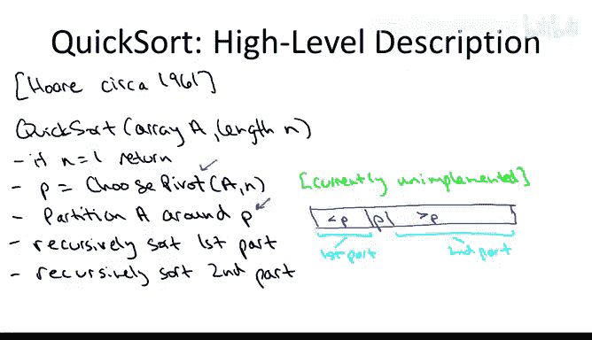
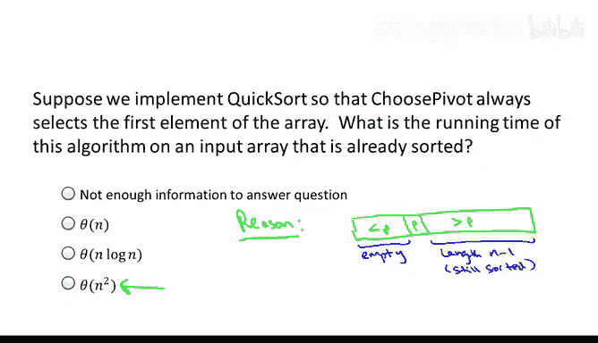
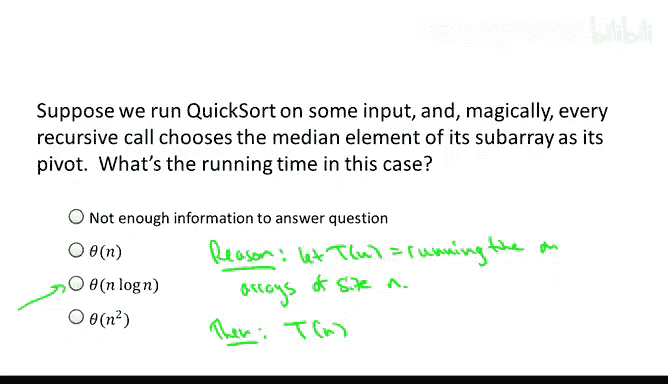
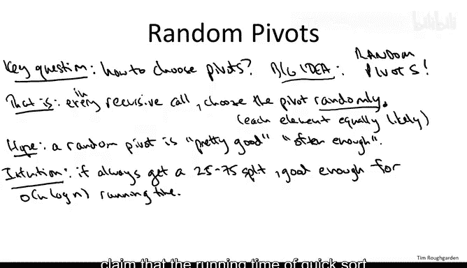
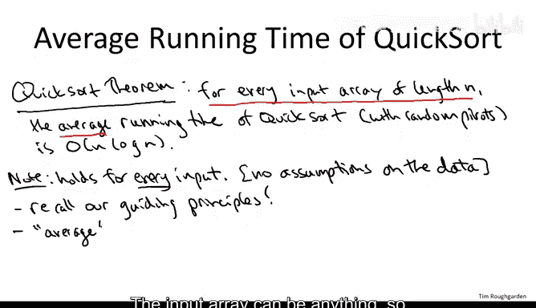

# 斯坦福大学《算法（分治／排序／搜索／随机算法、图搜索／最短路径／数据结构、贪心算法／最小生成树／动态规划、最短路径／NP）｜Algorithms》中英字幕 - P28：28_03_05_选择优质枢轴.zh_en - GPT中英字幕课程资源 - BV1Rx4y1U7sZ

So let's review the story so far。 We've been discussing the quickword algorithm here again is the highlevel description。

 So quicksort you call two subroutines first and then you make two recursive calls So the first subroutine choose pivot we haven't discussed yet at all that'll be one of the main topics of this video but the job of the Cho pivot subroutine is to somehow select one of the n elements in the input array to act as a pivot element Now what does it mean to be a pivot well that comes into play in the second subroutine the partition subroutine which we did discussed quite a bit in a previous video so what partition does is it rearranges the elements in the input array so that it has the following property so that the pivot P winds up in its rightful position that is it's to the right of all of the elements less than it and it's to the left of all of the elements bigger than it the stuff less than it's to the left in some jumbled order the stuff bigger than it's to the right in some jumbled order that's what's listed here as the first part in the second part of the partitioned array Now once you've done this partitioning you're good to go you just recursively solve。

Recursively sort the first part to get them in the right order you call Quicksort again to recursively sort the right part and bingo the entire array is sorted。

 you don't need a combined step， you don't need a step Moreover recall in a previous video we saw that the partition array can be implemented in linear time and moreover it works in place with essentially no additional storage we also in an optional video formally prove the correctness of QuickSo and remember Quicksort is independent of how you implement the choose pivot subroutine So what we're going to do now is discuss the running time of the Quick sort algorithm and this is where the choice of the pivot is very important。

So what everybody should be wondering about at this point is quick sort of good algorithm。

 does it run fast， the bar is pretty high， we already have merge short。

 which is a very excellent practical and login algorithm。

The key point to realize at this juncture is that we are not currently in a position to discuss the running time of the QuickSo algorithm。

 the reason is we do not have enough information， the running time of QuickSo depends crucially on how you choose the pivot。

 it depends crucially on the quality of the pivot chosen。

You'd be right to wonder what I mean by a pivot's quality。

 And basically what I mean is a pivot is good if it splits the Britishian array into roughly two equal sized sub problemsble and it's bad。

 It's of low quality if we get very unbalanced sub problemsble。

 So to understand both what I mean and the ramifications of having good quality and bad quality pivots。

 let's walk through a couple of quiz questions。

This first quiz question is meant to explore a sort of worstcase execution of the Quick sort algorithm。

 What happens when you choose pivots that are very poorly suited for the particulate input array Let me be more specific suppose we use the most naive Choose pivot implementation like we were discussing in the partition video So remember here we just pluck out the first element of the array and we use that as the pivot So suppose that's how we implement the Cho pivots subrout and moreover。

 suppose that the input array to quick sort is an array that's already in sorted order So for example。

 if it just had the number 1 through 8， it would be1，2，3，45，6，7。

8 in order My question for you is what is the running time of this recursive quick sort algorithm on an already sorted array if we always use the first element of a subarray as the pivot。

Okay， so this is slightly tricky， but actually a very important question。

 so the answer is the fourth one。So it turns out to quick sort。

 if you pass it in an already sorted array and you're using the first element as pivot elements。

 it runs in quadratic time， and remember for a sorting algorithm， quadratic is bad。

It's bad in the sense that we can do better， merge sort runs in time n log n。

 which is much better than n squared， and if we were happy with an n squared running time。

 we wouldn't have to resort to these sort of relatively exotic sorting algorithms。

 we could just use insertion sort and we'd be fine we'd get that same quadratic running time。Okay。

 so now I owe you an explanation， why is it that QuickSo can actually run in quadratic time in this unlucky case of being passed already shorted input array？

Well to understand， let's think about what pivot gets chosen and what are the ramifications of that pivot choice for how the array gets partitioned and then what the recursion looks like。

 So let's just think of the array as being the numbers one through n in sorted order What is going to be our pivot Well by definition we're using the first element of the pivot so the pivots is just going to be one。

Now we're going to invoke the partition subroutine and if you go back to the pseudocode of the partition subcutoutine。

 you'll notice that if we pass it an already sorted array。

 it's going to do essentially nothing because it's just going to advance the index J until it falls off the end of the array。

 and it's just going to return back to us the same array that it was passed as input so partition subroutine。

 if given and already sorted array， returns an already sorted array so we have just to pivot one in the first position and then the number2 through n in order in the remainder of the positions。

So if we draw our usual picture of what a partition array looks like with everything less than the pivot to the left。

 everything bigger than the pivot to the right。 Well， since nothing is less than the pivot。

 this stuff is going to be empty。 This will not exist。And to the right of the pivot。

 this will have length and -1。And moreover， it will still be sorted。So once partition completes。

 we go back to the outer call of Quick sort， which then calls itself recursively twice。 Now。

 in this case， one of the recursive calls is just vacuous。 There's just an empty array。

 There's nothing to do。 So really， there's only one recursive call。

 and that happens on a problem of size only one less。

 So this is about the most unbalumd split we could possibly see right where one size has zero elements。

 one size n-1， but don't really get any worse than that。

And this is going to keep happening over and over and over again。

 We're going to recurse on the numbers2 through N。 We're going to choose the first element。

 the two as the pivot。 again， we'll feed it to partition。

 We'll get back the exact same subar that we handed it in。

 we get through the numbers2 through n and sort at order。 We exclude the pivot2。

 We rese on the numbers 3 through n。 a subarray of length n-2。 The next recursion level。

 we recur on an array of size of length n -3， then n -4， then n-5 and so on。 until finally。

 after added recursion depth of n。 roughly， weve got down to just the last element n。

 the base case kicks in and we will return that in quick sort completes。

 So that's how quick sort is going to execute on this particular input with these particular pivot choices。

 So what running time does that give to us。

Well， the first observation is that you know in each recursive call。

 we do have to invoke the partition subroutine and the partition subroutine does look at every element in the array it is passed as input。

 So if we pass partition and array of length K， it's going to do at least k operations because it looks at each element at least once。

 So the runtime is going to be bounded below by the work we do in the outermost call。

 which is on an array of length n plus the amount we do in the second level of recursion。

 which is on a subar of length n minus1 plus n minus2 plus blah， blah blah blah。

 blah all the way down to plus1 for the very last level of recursion。

So this is a lower bound on our running time， and this is already theta of n squared。

So one easy way to see why this sum n plus n minus1 plus etca， etc cetera。

 leads to a bound of n squared is you just focus on the first half of the terms。

 So the first n over two terms in the sum are all of magnitude at least n over2 so the sum is at least n squared over4 it's also evident that this sum is at most n squared So overall the running time of quick sort on this bad input is going to be quadratic。

Now， having understood what the worst case performance of the Quickword algorithm is。

 let's move on to discuss its best case running time。 Now。

 we don't generally care about the best case performance of algorithms for its own sake。

 The reason that we want to think about quickword in the best case。 First of all。

 itll give us better intuition for how the algorithm works。 Second of all。

 it'll draw a line in the sand。 Its average case running time certainly can't be better than the best case。

 So this will give us a target for what we're shooting for in our subsequent mathematical analysis。

So what was the best case， What is the highest quality pivot we could hope for， Well again。

 we think of the quality of a pivot as the amount of balance that it provides between the two subproble。

 So ideally， we choose a pivot which gave us two subproblem。 both of size and over to or less。

 and theres a name for the element that would give us that perfectly balanced split。

 It's the median element of the array， the element where exactly half of the elements are less than it and half of the elements are bigger than it。

 that would give us essentially perfect 5050 split of the input array。 So here's the question。

 suppose we had some input and we rank quick sort and everything just worked out in our favor in the magically in the best possible way。

 that is in every single recursive imvocation of Quick sort on any subarray of the original input array。

 suppose we happen to get as our pivot the median element that is suppose in every single recursive call we wind up getting a perfect 5050 split of the input array before we recurse。

 this question asks you。Aze the running time of this algorithm in this magical best case scenario。

So the answer to this question is the third option。 The answer is it runs in and log n time。

Why is that Well， the reason is that then the recurrence which governs the running time of QuickS is exactly matches the recurrence that governs the merge short running time。

 which we already know is N log N。That is the running time Quick sort requires in this magical special case on an array of length N。

 Well as usual， you have a recurrence in two parts。

 there's the work that gets done by the recursive calls， and there's the work that gets done now。

 Now by assumption， we wind up picking the median as the pivot。

 so there's going to be two recursive calls， each of which will be on an input of size at most and over2。

We can write this， this is because the pivot equals the M mediaian。

So this is not true for Quickword in general， it's only true in this magical case where the pivot is the median。

So that's what gets done by the two recursive calls and then how much work do we do outside of the recursive calls Well we have to do the choose pivot subroutine and I guess strictly speaking I haven't said how that was implemented but let's assume the Cho pivot does only a linear amount of work and then as we've seen the partition subroutine only does a linear amount of work as well so let's say oh then。

For work outside of the recursive calls。And what do we know， We know this implies。

 say by using the master method or just by using the exact same argument as for merge short。

 this gives us a running time bound of and login。And again。

 something I haven't really been emphasizing though which is true is that actually we can write theta of n log n and that's because in the recurrence。

 in fact， we know that the work done outside of the recursive causes is exactly theta of n partition needs really linear time。

 not just big O of n time In fact the work done outside of the recursive causes is theta of n that's because the partition submartine does indeed look at every entry in the array that it passed and as a result we didn't really discuss this so much in the master method。

 but as I mentioned in passing， if you have recurrences which are tight in this sense then the result of the master method can also be strengthened to be theta instead of just big O。

But those are just some extra details。 The upshot of his quiz is that even in the best case。

 even if we magically get perfect pivots throughout the entire trajectory of quick sort。

 the best we can hope for is an n log n upper bound。 It's not going to get any better than that。

 So the question is， how do we have a principled way of choosing pivots so that we get this best case or something like it。

 This best case N log N running time。 So that's what the problem that we have to solve next。

So the last couple quizzes have identified a super important question as far as the implementation of Quicksort。

 which is how are we going to choose these pivots， right。

 We now know that they have a big influence on the running time of our algorithm。

 It could be as bad as n squared or as good as n log N。 and we really want to be on the N log N side。

 So the key question。How to choose pivots。And QuickSo is the first killer application we're going to see of the idea of randomized algorithms that is allowing your algorithms to flip coins in the code so that you get some kind of good performance on average。

So， the big idea。Is random pivots。By which I mean for every time we recursively call Quicksortt and we are past some subaret of length K among the K candidate pivot elements in the subaret we're going to choose each one with equally likely with probability one over K and we're going to make a new random choice every time we have a recursive call and then we're just going to see how the algorithm does so this is our first example of a randomized algorithm。

 this is an algorithm where if you feed it exactly the same input it will actually run differently on different executions and that's because there's randomness internal to the code of the algorithm Now it's not necessarily intuitive that randomization should have any purpose in computation and software design and algorithm design but in fact。

 this has been sort of one of the real breakthroughs in algorithm design。

 mostly in the 70s realizing how important this is that the use of randomization can make algorithms more elegant。

 simpler， easier to code more faster or just simply you can solve problems that you could not solve or at least not solved as easily。

Withoutout the use of randomization， so it's really one thing that should be in your toolbox as an algorithm designer。

 randomization quick sort of be the first killer application。

 but we'll see a couple more later in the course。Now， by the end of this sequence of videos。

 I' have given you a complete rigorous argument about why this works， why with random pivots。

 QuickSot always runs very quickly on average， but before moving into anything too formal。

 let's develop a little bit of intuition or at least kind of a daydream about why on earth could this possibly work。

 why on earth could this possibly be a good idea to have randomness internal to our quick sort implementation。

Well， so first just you know very high level， what would be sort of the hope or the dream。

 the hope would be， you know random pivots are not going to be perfect。

 I mean you're not going to just sort of guess the median or you have only have a one and in chance of figuring out which one the median is。

 but the hope is that most choices of a pivot will be good enough。So that's pretty fuzzy。

 let's drill down a little bit and develop this intuition further。Let me describe it in two steps。

The first claim is that， you in our last quiz， we said。

 suppose we get lucky and we always pick the median in every single recursive call。

 and we observed we'd do great。 We get n log in running time。

 So now let's observe that actually to get the n log in running time。

 it's not important that we magically get the median every single recursive call。

 if we get any kind of reasonable pivot by which a pivot that gives us some kind of approximately balanced split of the problems。

 again， we're going to be good。 so the last quiz really wasn't particular to getting the exact median near medians are also fine。

To be concrete， suppose we always pick a pivot which guarantees us a split of 25。

 75 or better that is both recursive calls should be called on a raises of size and most 75% of the one that we started with。

So precisely， if we always get a 2575 splitter better in every recursive call。

 I claim that the running time of quick sort in that event will be big O of N log n。

 just like it was in the last quiz where we're actually assuming something much stronger that we're getting the median Now。

 this is not so obvious the fact that 2575 splits guarantee N log n running time for those of you that are feeling keen。

 you might want to try to prove this， you can prove this using a recursion tree argument that because you don't have balance subproblems。

 you have to work a little bit harder than you do in the cases covered by the master method。

So that's the first part of the intuition， and this is what we mean by a pivot being good enough if we get a 25。

 75 splitter better， we're good to go， we get our desired our target analog and running time。

So the second part of the intuition is to realize that actually we don't have to get all that lucky to just be getting a 25。

75 split。 That's actually a pretty modest goal。 and even this modest goal is enough to get the N log n running time right So suppose R contains the numbers the integers between1 and 0。

 So it's an array of length 100。Think for a second。

 which of those elements is going to give us a split that's 25，75 or better。

So if we pick any element between 26 and 75。Inclusive will be totally good。

 right If we pick something that's at least 26。 That means the left subprom is going to have at least the elements 1 through 25。

 That'll even have at least 25% of the elements。 And if we pick something less than 75。

 then the right subproblem will have all of the elements 76 through 100 after we partition。

 So that'll also have at least 25% of the elements。 So anything between 26 and 75， gives us a 75。

25 split or better。 But that's a full half of the elements。

 So it's as good as just flipping fair coin， hoping we get heads。 So with 50% probability。

 we get a split and good enough to get the good enough to get this analog log n bound。And so again。

 the high level hope is that often enough， half of the time， we get these good enough splits。

 25 so5 splits are better， so that would seem suggest an N log N running time on average is a legitimate hope。

So that's the high level intuition。 but if I were you。

 I would certainly not be content with this somewhat handwy explanation that I've given you so far。

 What I've told you is sort of the hope， the dream， why there is at least a chance this might work。

 but that the question remains， and I would encourage such skepticism。Which is does this really work？

And to answer that we're going to have to do some actual mathematical analysis and that's what I'm going to show you。

 I'm going show you a complete rigorous analysis of the Quickword algorithm with random pivots and we'll show that yes。

 in fact， it does really work。And this highlights what's going to be a recurring theme in this course and a recurring theme just in the study and understanding of algorithms。

 which is it's quite often there's some fundamental problem when you're trying to code up a solution and you come up with a novel idea it might be brilliant and it might suck and you have no idea now obviously you can code up the idea run it on some concrete instances and get a feel for whether it seems like a good idea or not。

 but if you really want to know fundamentally what makes the idea good or what makes the idea bad really you need to turn to mathematical analysis to give you a complete explanation and that's exactly what we're going to do with Quick sort and it will explain in a very deep way why it work so well。

Specifically， in the next sequence of three videos， I'm going to show you an analysis。

 a proof of the following theorem about QuickSo。So under no assumptions about the data。

 that is for every input array of a given length， say n。The average running time。Of quick sort。

 implemented with random pivots。Is big O of M loggan。And again， in fact， it's theta of N log n。

 but we'll just focus on the Big O of N log N part。So this is a very。

 very cool theorem about this randomized quick sort algorithm。

 One thing I want to be clear so that you don't undersell this guarantee in your own mind。

 This is a worst case guarantee with respect to the input。 Okay。

 so notice at the beginning of this theorem， what do we say for every input array of length n。

Al right， so we have absolutely no assumptions about the data。

 this is a totally general purpose sorting subroutine， which you can use whenever you want。

 even if you have no idea where the data is coming from and these guarantees are still going to be true。

This， of course， is something I held forth about at some length back in our guiding Princs video。

When I argued that if you can get away with it， what you really want is general purpose algorithms which make no data assumptions so they can be used over and over again in all kinds of different contexts and that still have great guarantees and Quicksort is one of those so basically if you have a data set and it fits in the main memory of your machine again sorting is a for- free subroutine in particular Quick sort the QuickSo implementation is for free so this just runs so blazingly fast。

 doesn't matter what the array is maybe you don't even know why you want to sort it but go ahead why not maybe it'll make your life easier like it did for example in the closest pair algorithm for those of you that watch those two optional videos。

Now the word average does appear in this theorem and as I've been harping on this average is not over any assumptions on the data。

 we're certainly not assuming that the input array is random in any sense。

 the input array can be anything， so whereas the avering coming from the averaging is coming only from randomness which is internal to our algorithm。

 randomness that we put in the code ourselves that where're responsible for。

So remember， randomized algorithms have the interesting property that even if you run it on the same input over and over again。

 you're going to get different executions， so the running time of a randomized algorithm can vary as you run it on the same input over and over again。

 the quizzes have taught us that the running time of Quick sort on a given input fluctuates from anywhere between the best case of n log n to the worst case of n squared。

 So what this theorem is telling us is that for every possible input array。

 while the running time does indeed fluctuate between an upper bound of n squared and the lower bound of n log n。

 the best case is dominating on average， it's n log n on average。

 it's almost as good as the best case。 That's what's so amazing about Quick sort n squared that can pop up once in a while doesn't matter。

 You're never going to see it you're always going see this n log n like behavior and randomized Quicksort。

 So for some of you， I'll see you next in a video on probability review that's optional for the rest of you I'll see you in the analysis of this theorem。

