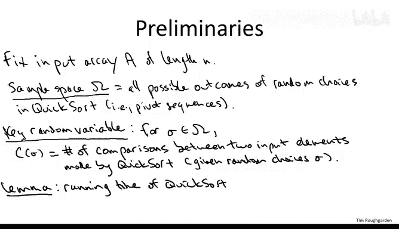
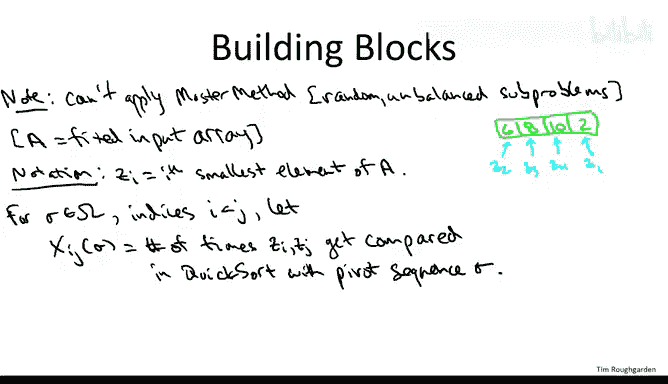
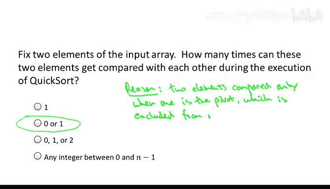
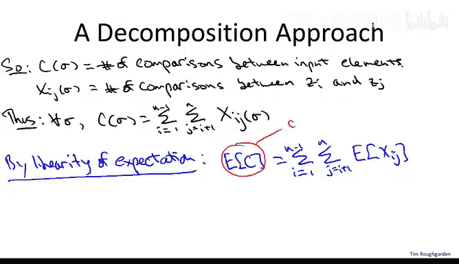
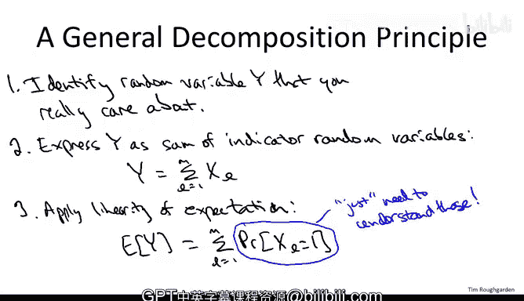

# 算法分析：29：分解原理 🧩

在本节课中，我们将对快速排序算法的随机化实现进行数学分析，并证明其平均运行时间为 **O(n log n)**。这是课程中首次分析随机化算法，因此我们将首次引入概率论知识。

## 概述

我们将分析快速排序算法的随机化版本，其中每个递归子调用都均匀随机地选择一个主元。我们将证明，对于任意长度为 **n** 的输入数组，仅考虑算法内部随机性（而非输入数据）的平均运行时间为 **O(n log n)**。这意味着无论输入如何，快速排序的典型行为都更接近其最佳情况（n log n），而非最坏情况（n²）。

## 预备知识

在开始分析前，你需要了解离散概率论的基础知识：
*   **样本空间**：所有可能随机结果（即所有可能的随机主元选择序列）的集合。
*   **随机变量**：定义在样本空间上、取实数值的函数。
*   **期望值**：随机变量的平均值。
*   **期望的线性性质**：这是分析快速排序所需的关键性质。

如果你对这些概念不熟悉或需要复习，建议先观看课程网站上的概率论复习视频，或阅读 Eric Lehman 和 Tom Leighton 的《计算机科学数学》在线讲义。

## 建立分析框架

首先，我们固定一个任意的长度为 **n** 的输入数组 **A**，并以此作为快速排序的输入。整个分析将围绕这个固定的数组展开。

### 样本空间与随机变量

*   **样本空间 Ω**：所有可能的随机主元选择序列 **σ** 的集合。
*   **核心随机变量 C**：对于给定的主元序列 **σ**，定义 **C(σ)** 为快速排序算法执行的**比较次数**。这里的“比较”特指对输入数组中两个不同元素（例如，比较第三个元素和第七个元素的大小）的操作。

快速排序的运行时间主要由比较操作决定。更正式地说，存在一个常数 **c**，使得对于任何主元序列 **σ**，快速排序执行的总操作数 **RT(σ)** 满足：
`RT(σ) ≤ c * C(σ)`
因此，要证明平均运行时间为 **O(n log n)**，只需证明平均比较次数为 **O(n log n)**。即，我们需要证明：
`E[C] = O(n log n)`

### 分解原理的引入

随机变量 **C** 本身很复杂，难以直接分析。我们将采用一种称为**分解原理**的方法：
1.  将我们关心的复杂随机变量 **C** 分解为一系列更简单的随机变量之和。
2.  这些简单随机变量本身可能不直接重要，但易于分析。
3.  利用**期望的线性性质**，将这些简单随机变量的分析结果组合起来，从而理解 **C** 的期望值。

这种方法不仅适用于快速排序，也适用于分析许多其他随机化算法。

## 定义基础构件：指示器随机变量

为了应用分解原理，我们需要定义一组简单的随机变量作为基础构件。

首先，引入一些符号：
*   用 **Z_i** 表示输入数组 **A** 中第 **i** 小的元素（即第 **i** 个顺序统计量）。注意，**Z_i** 不一定是原始数组中第 **i** 个位置的元素，而是排序后最终会出现在第 **i** 个位置的元素。

现在，我们定义关键的简单随机变量族：
对于给定的主元序列 **σ**，以及满足 `1 ≤ i < j ≤ n` 的索引 **i** 和 **j**，定义 **X_ij** 为：
`X_ij(σ) = Z_i 和 Z_j 在快速排序执行过程中被比较的次数`

**重要性质**：对于任意一对元素 **(Z_i, Z_j)**，它们在整个快速排序过程中**最多被比较一次**，也可能一次都不比较。因此，**X_ij** 是一个**指示器随机变量**，其取值只能是 **0** 或 **1**。它指示了“Z_i 和 Z_j 是否被比较”这一事件（1 表示发生，0 表示未发生）。

**原因**：在快速排序中，比较只发生在 `partition` 子程序中，且每次比较都涉及当前递归调用的**主元**。如果 **Z_i** 和 **Z_j** 第一次被比较，那么其中之一必定是当时的主元。该主元在此次划分后，将不会进入任何后续的递归调用，因此 **Z_i** 和 **Z_j** 再无机会被比较。

## 应用分解原理

现在，我们将复杂的随机变量 **C** 用简单的指示器随机变量 **X_ij** 表示出来。

由于每一次比较都恰好涉及一对元素 **(Z_i, Z_j)**（其中 `i < j`），因此总的比较次数 **C** 可以表示为所有可能元素对的比较指示器之和：
`C = Σ_{i=1}^{n-1} Σ_{j=i+1}^{n} X_ij`

这个等式对任何主元序列 **σ** 都成立。

接下来，我们应用**期望的线性性质**：
`E[C] = E[ Σ_{i=1}^{n-1} Σ_{j=i+1}^{n} X_ij ] = Σ_{i=1}^{n-1} Σ_{j=i+1}^{n} E[X_ij]`

期望的线性性质非常强大，即使这些 **X_ij** 随机变量之间**并不独立**，该性质依然成立。

由于 **X_ij** 是指示器随机变量（取值 0 或 1），其期望值恰好等于事件“X_ij = 1”发生的概率：
`E[X_ij] = 0 * Pr(X_ij = 0) + 1 * Pr(X_ij = 1) = Pr(X_ij = 1)`

而 `Pr(X_ij = 1)` 正是元素 **Z_i** 和 **Z_j** 在快速排序过程中被比较的概率。

将上述结果结合起来，我们得到核心表达式（记为 **(*)**）：
`E[C] = Σ_{i=1}^{n-1} Σ_{j=i+1}^{n} Pr( Z_i 与 Z_j 被比较 )`

## 本节总结与后续计划

在本节中，我们为快速排序的平均运行时间分析建立了框架：
1.  我们明确了分析目标：证明平均比较次数 `E[C] = O(n log n)`。
2.  我们引入了**分解原理**，将复杂的比较次数随机变量 **C** 分解为一系列简单的指示器随机变量 **X_ij** 之和。
3.  利用期望的线性性质，我们将问题转化为计算所有元素对 **(Z_i, Z_j)** 被比较的概率之和。

至此，分析的第一部分（分解）已经完成。我们得到了一个清晰的路线图：要证明 `E[C] = O(n log n)`，现在只需要计算概率 `Pr( Z_i 与 Z_j 被比较 )`，然后将其代入双重求和式 **(*)** 并进行计算。

在下一节中，我们将深入分析，精确计算出任意一对元素 **Z_i** 和 **Z_j** 在快速排序中被比较的概率。这将是完成证明的关键一步。