# 斯坦福大学《算法（分治／排序／搜索／随机算法、图搜索／最短路径／数据结构、贪心算法／最小生成树／动态规划、最短路径／NP）｜Algorithms》中英字幕 - P2：02_01_05_整数乘法.zh_en - GPT中英字幕课程资源 - BV1Rx4y1U7sZ

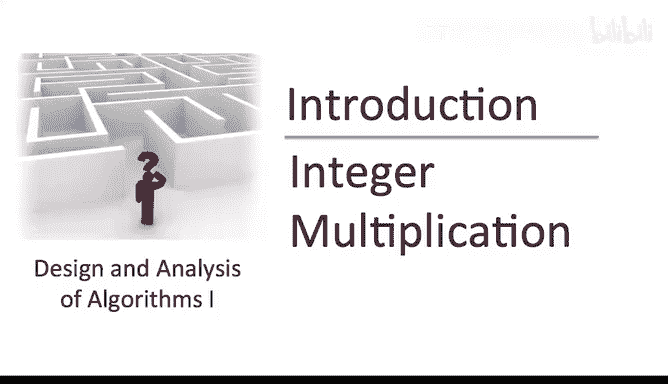

Sometime when you were a kid， maybe say third grade or so。

 you learned an algorithm for multiplying two numbers。

 maybe your third grade teacher didn't call it that， maybe that's not how you thought about it。

 but you learned a welldefined set of rules for transforming an input。

 namely two numbers into an output， namely their product。

 so that is an algorithm for solving a computational problem， let's pause and be precise about it。

Many of the lectures in this course will follow a pattern， will define a computational problem。

 we'll say what the input is， and then we'll say what the desired output is。

 then we will proceed to giving a solution to giving an algorithm that transforms the input into the output when the integer multiplication problem。

 the input is just two indigit numbers。

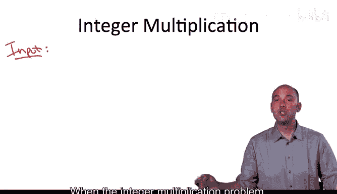

So the length n of the two input integers X and Y could be anything。

 but for motivation you might want to think of n as large in the thousands or even more。

 perhaps we're implementing some kind of cryptographic application which has to manipulate very large numbers。

😡，We also need to explain what is the desired output in this simple problem。

 it's simply the product x times y。

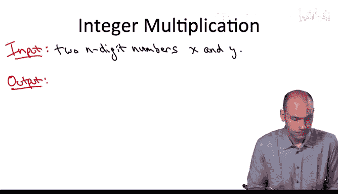

So a quick digression， so back in third grade around the same time I was learning this integer multiplication algorithm。

 I got a C in penmanship， and I don't think my handwriting has improved much since Many people tell me。

 you know by the end of the course， they think of it fondly as a sort of acquired taste。

 but if you're feeling impatient， please note they are typed versions of these slides。

 which I encourage you to use as you go through the lectures。

 if you don't want to take the time deciphering the handwriting。

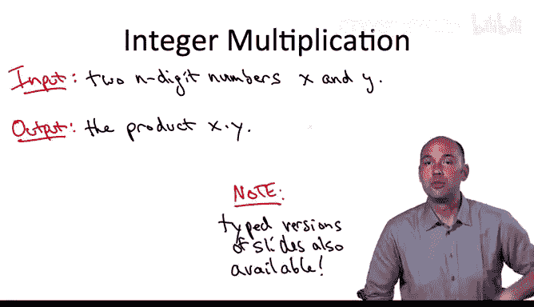

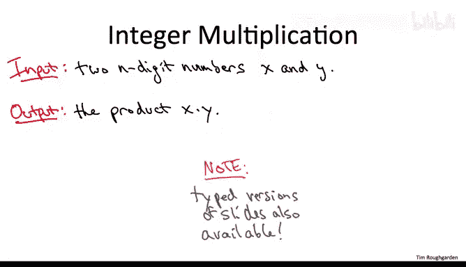

Returning to the integer multiplication problem， having now specified the problem precisely the input。

 the desired output， will move on to discussing an algorithm that solves it。

 namely the same algorithm you learned in third grade。

 The way we will assess the performance of this algorithm is through the number of basic operations that it performs。

 And for the moment， let's think of a basic operations as simply adding two single digit numbers together or multiplying two single digit numbers。

 We're going to then move on to counting the number of these basic operations performed by the third grade algorithm as a function of the number N of digits in the input。

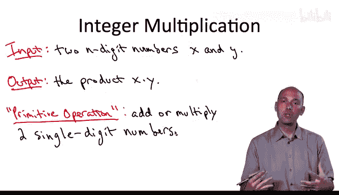

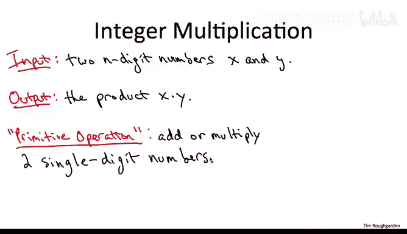

Here is the integer multiplication algorithm that you learned back in third grade。

 illustrated on a concrete example， let's take， say the numbers 12，3，4 and 5678。

As we go through this algorithm quickly， let me remind you that our focus should be on the number of basic operations this algorithm performs as a function of the length of the input numbers。

 which in this particular example is four digit long。

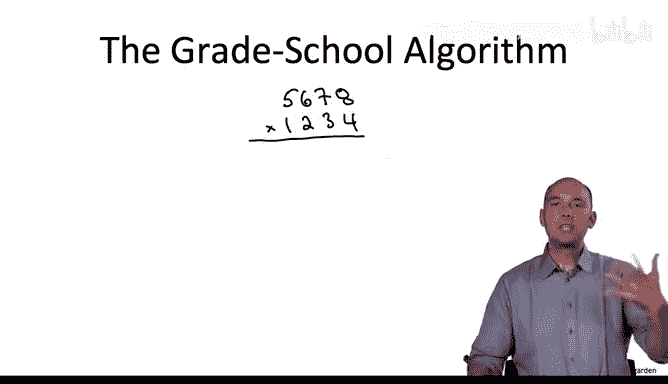

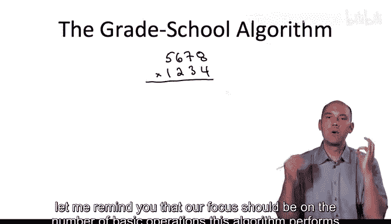

So as you'll recall， we just compute one partial product for each digit of the second number。

 so we start by just multiplying four times the upper number 567，8， so you know four times 8 is 32，2。

 carry the three，  four times 7 is 28 with the three that's 31， write down the one。

 carry the three and so on。

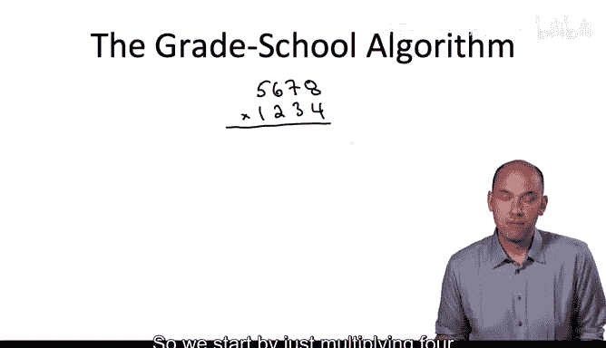

When we do the next partial product， we do a shift effectively， we add a zero at the end。

 and then we just do exactly the same thing。And so on for the final two partial products。And finally。

 we just add everything up。

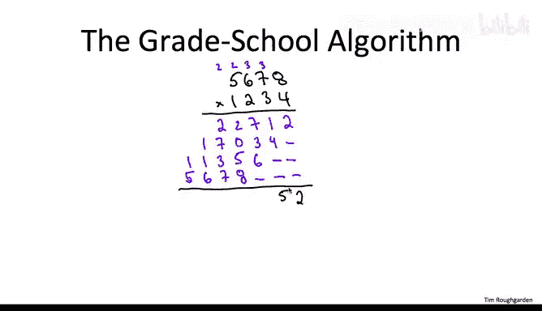

What you probably realized back in third grade is that this algorithm is what we would call correct。

 that is no matter what integers X and y you start with， if you carry out this procedure。

 this algorithm and all of your intermediate computations are done properly。

 then the algorithm will eventually terminate with the product x times y of the two input numbers。

 you're never going to get a wrong answer you're always going get the actual product what you probably didn't think about was the amount of time needed to carry this algorithm out to its conclusion to termination that is the number of basic operations。

 additions or multiplications of single- digit numbers needed before finishing So let's now quickly give an informal analysis of the number of operations required as a function of the input length n。

Let's begin with the first partial product to the top row how did we compute this number 22712 Well we multiplied four times each of the numbers 5。

6，7 and8， so that was four basic operations， one for each digit of the top number plus we had to do these carries so those were some extra additions。

 but in any case this is at most twice times the number of digits in the first number at most two n basic operations to form this first partial product。

And if you think about it， there's nothing special about the first partial product。

 the same argument says that we needed it most2N operations to form each of the partial products of which there are again n one for each digit of the second number。

Well， if we need at most2N operations to compute each partial product and we have n partial products。

 that's a total of at most 2N squared operations to form all of these blue numbers。

 all of the partial products Now we're not done at that point。

 we still have to add all of those up to get the final answer in this case， 76652。

 and that final addition requires a comparable number of operations。

 roughly another say 2N squared at most operations。So the upshot。

 the high level point that I want you to focus on is that as we think about the input numbers getting bigger and bigger。

 that is as a function of n， the number of digits and the input numbers。

 the number of operations that the grade school。

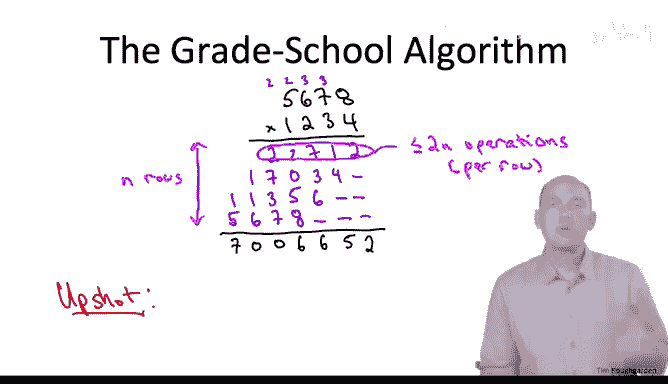

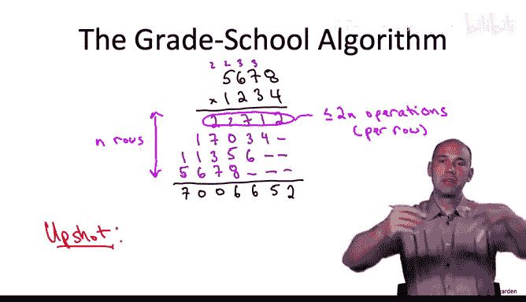

Mulultplication algorithm performs， grows like some constant， roughly foray times n squared。

 that is its quadratic in the input length n。

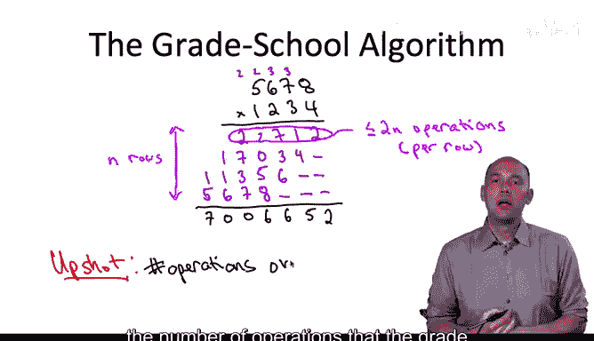

For example， if you double the size of the input， if you double the number of digits in each of the two integers that you're given。

 then the number of operations you will have to perform using this algorithm has to go up by a factor of four。

 similarly if you quadruple the input length， the number of operations is going to go up by a factor of 16 and so on。

😡，Now， depending on what type of third grader you were。

 you might well have accepted this procedure as the unique or at least the optimal way of multiplying two numbers together to form their product。

 Now， if you want to be a serious algorithm designer， that kind of obedient timidity is a quality。

 you're going to have to grow out of。

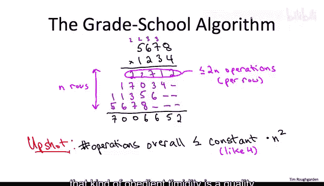

An early and extremely important textbook on the design and analysis of algorithms was by Ajo。

 Hoprot and omens。 It's about 40 years old now。 And there's the following quote。

 which I absolutely adore。 So after iterating through a number of the algorithm design paradigms covered in the textbook。

 they say the following， perhaps the most important principle of all for the good algorithm designer is to refuse to be content。

 And I think this is a spot on comments， I might summarize it a little bit more succinctly。

 as as an algorithm designer， you should adopt as your mantra， The question can we do better。

This question is particularly operapropo when you're faced with a naive or straightforward solution to a computational problem。

 like， for example， the third grade algorithm for integer multiplication。

A question you perhaps did not ask yourself in third grade was。

 can we do better than the straightforward multiplication algorithm。

 and now is the time for an answer。