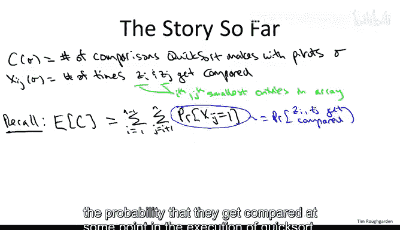
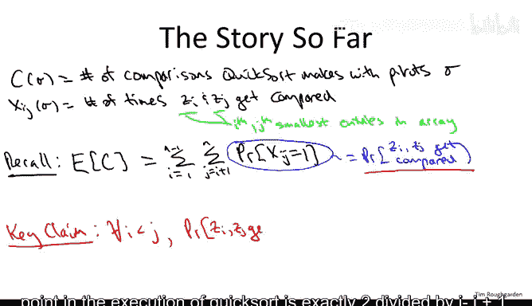
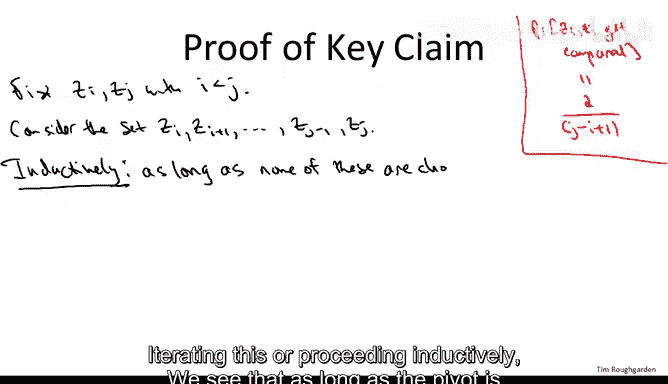
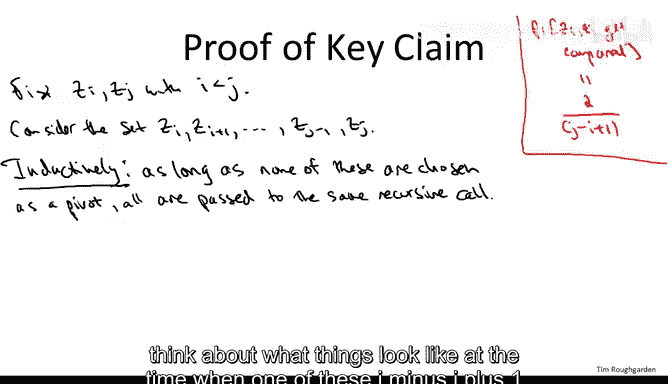
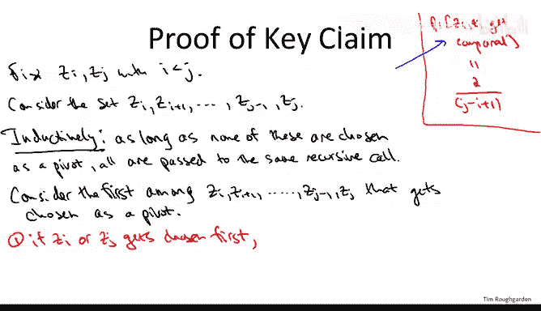
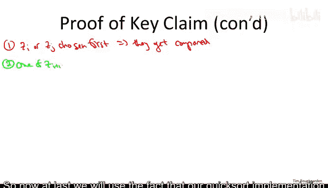
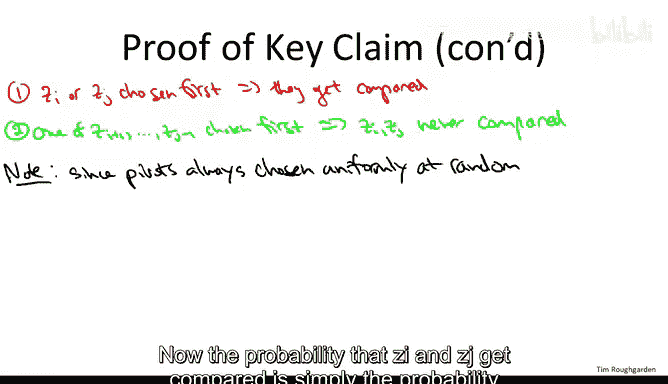
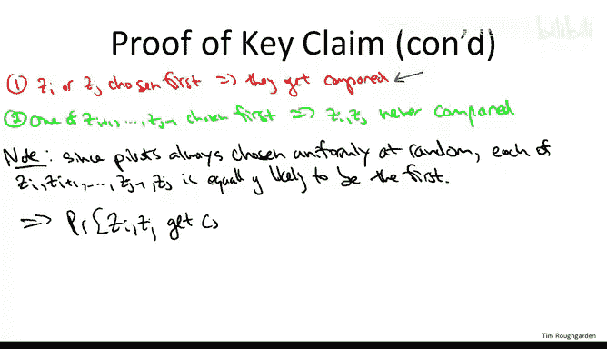

# 斯坦福大学《算法（分治／排序／搜索／随机算法、图搜索／最短路径／数据结构、贪心算法／最小生成树／动态规划、最短路径／NP）｜Algorithms》中英字幕 - P30：30_03_02_分析 II：关键洞见.zh_en - GPT中英字幕课程资源 - BV1Rx4y1U7sZ

This is the second video of three in which we prove that the average running time of randomized Quicksort is big O of n log n。

 so to remind you of the formal statement， so again we're thinking about Quick sortt where we implement the choose pivot subroutine to always choose a pivot uniformly at random from the subarray that it gets passed and we're proving that for a worstcase input array for an arbitrary input array of linked N。

 the average running time of Quick sort where the average is over the random pivot choices is big O of n log n。

 So let me remind you the story so far， this is where we left things at the previous video。

We define a few random variables， the sample space recall is just the all of the different things that could happen。

 that is all of the random coin flip outcomes that Quicksort could produce。

 which is equivalent to all of the pivot choices made by Quick sort Now the random variables we care about so first of all there's capital C。

Which is the number of comparisons between pairs of elements in the input array the quick sort makes for a given pivot sequence sigma。

And then there are the XI Js， and so that's just meant to count the number of comparisons involving the Is smallest and the J's smallest elements in the input array。

Where you'll recall Z I and ZJ denote the height smallest and J smallest entries in the array。

Now because every comparison involves sum ZI and sum Zj。

 we can express capital C as a sum over the XIJs so we did that in the last video。

 we applied linearity of expectation， we used the fact that XIj or 01 that is indicator random variablesote to write the expectation of an XIJ just as the probability that it's equal to1 and that gave us the following expression。

So the key insight and really the heart of the QuickSo analysis is to derive an exact expression for this probability as a function of INJ。

 so for example， if the third smallest element in the array。

 the seventh smallest element in the array， wherever they may be scattered in the input array。

 we want to know exactly what's the probability that they get compared at some point in the execution of QuickSo and we're going to get extremely precise understanding of this probability in the form of this key claim。

So for all pairs of elements and again， ordered pairs who are thinking of I being less than J。

The probability that ZI and ZJ get compared at some point in the execution of quick sort。

Is exactly2 divided by J minus I plus1。

So for example， in this example of the third smallest element and the seventh smallest element。

 it would be exactly 40% of the time two over five is how often those two elements would get compared if you ran quick sort with a random choice of pivots and that's going to be true for every J&I The proof of this key claim is the purpose of this video。

So how do we prove this key claim， How do we prove that the probability that the Z I and ZJ get compared？

Is exactly。2 over quantity， J minus I plus1。Well， fix your favorite ordered pair。So fixed elements。Z。

 I， Z， J。With IS than J， for example， the third smallest and the seventh smallest element in the array。

Now， what we want to reason about is the set of all elements in the input array between ZI and Zj inclusive。

 I don't mean between in terms of positions in the array， I mean， between in terms of their values。

So consider the set。Between Z I and Zj plus1 inclusive。 So Z I is Z plus1 dot dot dot Zj1， Zj。

 So for example， the third， fourth， fifth， sixth and seventh smallest elements in the input array wherever they may be and of course。

 the initial array is not sorted。 So there's no reason to believe that these J minus I plus1 elements are contiguous they're scattered throughout the input array。

 but we're going to think about them Z I through Zj inclusive。Now。

 throughout the execution of Quicksort， these J minus I plus1 elements lead parallel lives at least for a while in the following sense。

Begin with the outermost call to Quicksort and suppose that none of these J minus I plus1 elements is chosen as a pivot where then could the pivot lie Well it could only be a pivot that's greater than all of these。

 or it could be less than all of these For example if this is the third， fourth， fifth。

 sixth and seventh smallest elements in the array， while the pivot is either the minimum or the second minimum in which case it's smaller than all five elements。

 or it's the eighth or largest or larger elements in the array in which case it's bigger than all of them there's no way you can have a pivot that somehow is wedged in between this set because this is a contiguous set of order statistics okay。

Now， what do I mean by these elements leading parallel lives。

 while in the case where the pivot is chosen to be smaller than all of these elements。

 then all of these elements will wind up to the right of the pivot and they will all be passed to a common recursive call。

 the second recursive call。 If the pivot is chosen to be bigger than all of these elements。

 then they'll all show up on the left side of the partition array。

 and they'll all be passed to the first recursive call。Iterating this or proceeding inductively。

 we see that as long as the pivot does not is not drawn from the set of J - I plus1 elements。

 this entire set will get passed on to the same recursive call。

So these J minus I plus1 elements are living blissfully together in harmony until the point at which one of them gets chosen as a pivot and that of course has to happen at some point。

 the recursion only stops when the array length is equal to zero or1 so if for no other reason at some point there will be no other elements in a recursive call other than these J minus I plus1 so at some point the reverie is interrupted and one of them is chosen as a pivot so let's pause the quicksword algorithm and think about what things look like at the time that one of these J minus I+1 elements is first chosen as a pivot element。

There are two cases worth distinguishing between， in the first case。

 the pivot happens to be either ZI or ZJ。Now， remember what it is we're trying to analyze。

 we're trying to analyze the frequency， the probability with which ZI and ZJ gets compared。 Well。

 if Z I and ZJ are in the same recursive call and one of them gets chosen as the pivot。

Then they're definitely going to get compared remember when you partition an array around this pivot element。

 the pivot gets compared to everything else， so if ZI is chosen as a pivot it certainly gets compared to ZJ if ZJ gets chosen as a pivot it gets compared to ZI so either way if one of these two is chosen。

 they're definitely compared。

If， on the other hand， the first of these J minus I plus1 elements to be chosen as a pivot is not Z or Zj。

 if instead it comes from the setzi plus 1， so on up to Zj 1， then the opposite is true。

 then Z I and Zj are not compared now， nor will they ever be compared in the future。

So why is that Well that requires two observations first recall that when you choose a pivot and you partition an array。

 all of the comparisons involve the pivot， so two elements which are neither of which is the pivot do not get compared in a partition subroutine so they don't get compared right now moreover。

 since ZI is the smallest of these and Zj is the biggest of these and the pivot comes from somewhere between them this choice of pivot will split ZI and ZJ into different recursive calls。

 ZI gets passed to the first recursive call， ZJ gets passed to the second recursive call and they will never meet again。

 so there's no comparisons in the future either。So these two observations right here， I would say。

 is the key insight in the Quickword analysis。 The fact that for a given pair of elements。

 we can very simply characterize exactly when they get compared and when they do not get compared in the Quickword algorithm。

 That is they get compared exactly when one of them is chosen as the pivot before any of the other elements with value in between those two has had the opportunity to be a pivot。

 That's exactly when they get compared。 So this allows us to prove this key claim。

 this exact expression on the comparison probability that will plug into the formula we had earlier and we'll give us the desired bound on the average number of comparisons。

 So let's fill in those details。So first， let me just rewrite the high order bit from the previous slide。

So now at last， we will use the fact that our Quickword implementation always chooses a pivot uniformly at random。

 that each element of a subart is equally likely to serve as the pivot elements in the corresponding partition call。

So what is this bias， this just says all of the elements are symmetric， so each of the elements ZI。

 ZI+ 1 all the way up to ZJ is equally likely to be the first one asked to serve as a pivot element。

Now the probability that ZI and ZJ get compared is simply the probability that we're in case1 as opposed to in case2 and since each element is equally likely to be the pivot。

 that just means there's sort of two bad cases， two cases in which one can occur out of the J minus I plus1 possible different choices of pivot。

Now we're talking about a set of J minus I plus one elements。

 each of whom is equally likely to be asked to be served first as a pivot element and the bad case。

 the case that leads to a comparison， there's two different possibilities for that if Z I or Zj is first and the other J minus I minus1 outcomes lead to the good case where Z and Zj never get compared so overall because everybody's equally likely to be the first pivot。

We have that the probability of the ZI and the ZJ get compared。

I's exactly the number of pivot choices that lead to comparison。

Divided by the number of pivot choices overall。And that is exactly the key claim。

 that is exactly what we asserted was the probability that given ZI and ZJ get compared for no matter what INJ are。

So wrapping up this video， where does that leave us。

 we can now plug in this expression for this probability of comparison probabilities into the double sum that we had before。

So putting it all together， what we have is that what we really care about。

 the average number of comparisons that QuickSo makes on this particular input of array n of length n is just this double sum which iterates over all possible。

Ordered pears。IJ。And what we had here before was the probability of comparing Z and Zj。

 we now know exactly what that is， so we just substitutes。

And this is where we're going to stop for this video， So this is going to be our key expression star。

 which we still need to evaluate， but that's going to be the third video。

 So essentially we've done all of the conceptual difficulty in understanding where comparisons come from and the quickword algorithm。

 All that remains is a little bit of an algebraic manipulation to show that this star expression really is big of and login。

 and that's coming up next。