# 斯坦福大学《算法（分治／排序／搜索／随机算法、图搜索／最短路径／数据结构、贪心算法／最小生成树／动态规划、最短路径／NP）｜Algorithms》中英字幕 - P32：32_03_01_概率论回顾 I.zh_en - GPT中英字幕课程资源 - BV1Rx4y1U7sZ

Welcome to part one of our probability review， the first time that we need these concepts in the course is for those of you that want to understand the analysis of Quicksort。

 why it runs in bigO of N log N time on average， and these topics will also come up a couple other times in the course。

 for example， when we study a randomized algorithm for the minimum cut problem in graphs and also when we try to understand the performance of hashing。

Here are the topics we're going to cover we'll start at the beginning with sample spaces and we'll then we'll discuss events in their probabilities。

 we'll talk about random variables which are real valued functions on a sample space。

 we'll talk about expectation which is basically the average value of a random variable will identify and prove a very important property called the linearity of expectation which will come up over and over again in our analyses of randomized processes so that's going to be the topics for part one that will conclude the video with one example time these concepts together in load balancing and this video is by no means the only source you can turn to to learn about these concepts a couple other sources I recommend the online lecture notes by Eric Lehman and Tom Leton Also there's a wiki book on discrete probability which you could check out and I want to be clear this is really not meant to be a courserus or a tutorial on probability concepts it's really only meant to be a refresher so I'm going to go at a reasonably fast pace and it's going to be a pretty cursory presentation and if you want a more thorough review I would check out one of these other sources or your favorite book on discrete probability。

And along those same lines， I'm thinking that many of you have seen some of this material before。

 don't feel compelled to watch this video straight from the beginning to the end。

 feel free to just sort of dip in and review the concepts that you need to refresher on。

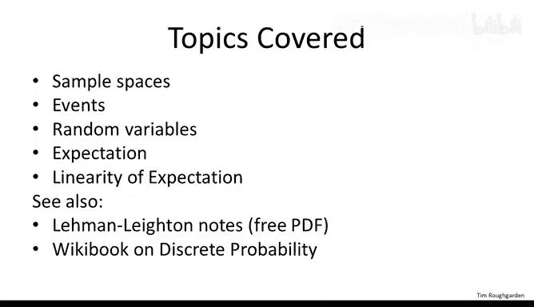

So let's start at the beginning with sample spaces。

So what is a sample space while we're analyzing random processes so any number of things could happen and the sample space is just a collection of all of the things that could happen。

 so this is basically the universe in which we're going to discuss probabilities and average values。

So I'll often use the notation big omega to describe the sample space。

So one thing we've got going for us in the design of algorithms is typically we can take omega to be a finite set。

 so that's why we're dealing only with discrete probability。

 which is a very happy thing because that's much more elementary than more general probability。

In addition to defining the outcomes， everything that could possibly happen。

 we need to define what is the probability of each individual outcome。So of course。

 the probability of each outcome should be at least zero should be non negative。

 and there's also the obvious constraint that the sum of the probability should be one。

 so exactly one thing is going to happen。Now I realize this is a super abstract concept and the next two definitions are also a little abstract。

 so throughout them I'm going to use two really simple。

 really concrete examples to illustrate what these concepts mean。

 so the first example is just going to be you take two six sided dice and you roll them and then of course the sample space is just the 36 different outcomes you could have of these two dice。

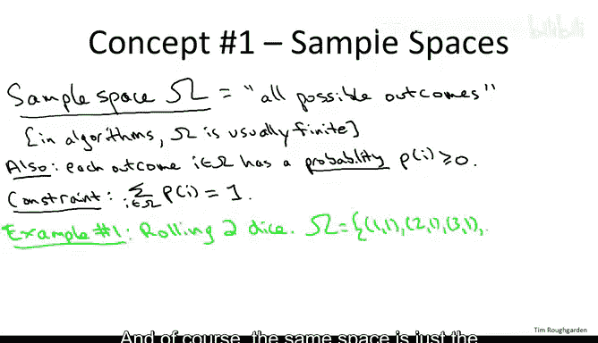

And assuming that each of these two dice is well crafted。

 then we expect each of these 36 outcomes to be equally likely to occur with probability of 1 over 36。

The second running example I'm going to use is more directly related to algorithms and it's motivated by the Quick sort algorithm recall that we're studying the implementation of Quick sort that chooses a pivot uniformly or random in every recursive call。

 so let's just focus on the very first outermost call of Quick sort and think about the random choice of the pivot just in that call So then the sample space。

 all of the different things that could happen is just all of the n different choices for a pivot。

 assuming the array has length。So we can represent the sample space just as the imageteger is12 all the way up to n corresponding to the array index of the randomly chosen pivot。

 and again， by definition， by the depth construction of our code。

 each of these things is equally likely probability1 over n。Now let's talk about events。

An event is nothing more than a subset of all of the things that could happen。

 That is a subset of the sample space omega。The probability of an event is exactly what you'd think it would be。

 it's just the sum of the probabilities of all of the outcomes contained in that event right so an event is just a bunch of stuff that might happen。

 we know the probability of each individual thing that could happen。

 we add them up to get the probability of an event。

So the next two quizzes are meant to give you some practice with these concepts and in particular they'll ask you to compute the probability of events in our two running examples。

So in the first quiz， this is our first running example where we think about two dice and we have our 36 possible outcomes。

 consider the subset of outcomes in which the sum of the two dice equals seven。

 what is the probability of that event？

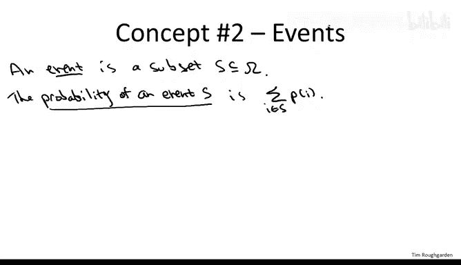

so the correct answer is the third one， the probability is one over6。 Why is that。

 well first let's be more precise about what this event is。

What are the outcomes in which the sum of the dice is equal to7。

 while there's exactly six such outcomes？1，6，2，5。3，4，4，3。5，2， and 6，1。

Each of the 36 outcomes is equally likely has probability 1 over 36。

 so we have six members of the set， each of the probability one over 36， so the probability is 16。

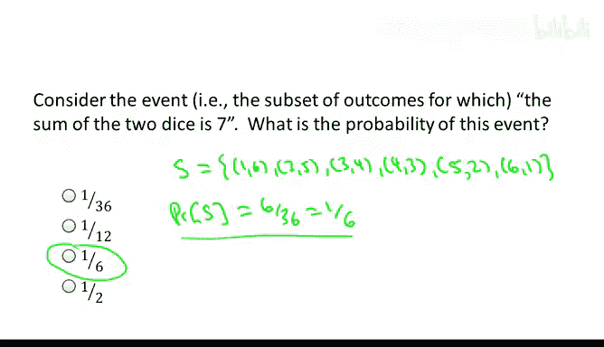

Let's move on to the next quiz， which considers our second running example。

 namely the randomly chosen pivot and the outermost calledqui sort on an input array of length n。

 So recall that in quick sort， when you choose a pivot you then partition the array around the pivot and this splits the input array into two subars。

 left one elements less than the pivot and a right one those bigger than the pivot and the more balanced the split into these two subproblems。

 the better So ideally we'd like a 5050 split So with this quiz ask you is what fraction of pivots。

 that is what's the probability that a randomly chosen pivot， we'll give you a reasonably good split。

 meaning both of the subproblems have size at least 25% that is you get a split 25，75 or better。

 So that's what this quiz asks about what's the probability that your randomly chosen pivot satisfies that property。

So the correct answer to this quiz is again， the third option。 It's a 50% probability。 you get a 25。

75 split or better。 So to see why let's again be precise about what is the event that we're talking about。

 then we'll compute its probability。 So when does a pivot give you a 25，75 split or better。

 Well for concrete is suppose the array contained just the integer between 1 and 100。

 Now what's the property we want， we want that both of the two subars have at least 25% of the elements。

 neither one has more than 75% of the elements。 Well。

 if we choose an element that's 26 or bigger in value。

 then the left subproblem will have at least 25 elements。 The numbers1 through 25。

 And if we choose index， which is if we choose an element that's most 75。

 then the right subarray is going to have at least 25 elements， name the numbers 76 to 100。

 So anything between 26 and 75 inclusive is going to give us a 25，75 split。

 more generally any pivot from the middle 50% of the quantiles。

And it gives us the desired split so we do badly if we get something within the first quarter。

 we do badly if we get something within the last quarter， anything in the middle works。

So more formally， we can say that the event S that we're analyzing。Is。

Among the possible pivot choices， we're interested in the ones that is not in the first quarter or not in the last quarter。

Now the cardinality of S， the number of pivots in this set is essentially half of the overall number of pivot choices。

 I'm ignoring fractions here for simplicity。So the probability of this event is the cardinality of this。

Divided by or times the probability of each of the individual outcomes and since we choose to pivot uniformly a random。

 each one has probability1 over n， so we n over two divided by n or12。

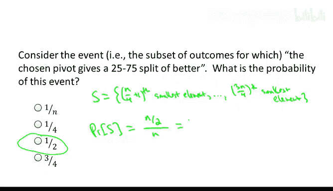

Okay now that we've explored the concept of events in our running two examples。

 we see that the probability that the sum of two dice is equal to1/6。

 a useful fact to know if you're ever playing crs， and we know that a pivot gives us a 2575 split or better and randomized quick sort with 50% probability a useful fact if you want to develop intuition for why quick sort is in fact quick so that's events let's move on to random variables so random variables are basically some statistic measuring what happens in the random outcome so formerly if we want to define it it's a real valued function defined on the sample space omega so given an outcome given a realization of the randomness。

 this gives you back a number。Now， the random variable that we most often care about in algorithm design is the running time of a randomized algorithm。

 That's the case， for example。With a quickword algorithm。

 so notice that is in fact a random variable， if we know the state of the world。

 if we know the outcome of all of the coin flips that our code's going to make。

 then there's just some running time of our algorithm so in that sense it's a random variable given the outcomes of the coin flips out pops a number the running time say a milliseconds of the algorithm。

Here I'm going to give you a couple more modest examples of random variables in our two running examples。

If we're rolling two dice， one very simple random variable takes as input the outcome。

 so the result of the two dice and spits out the sum。

So that's certainly a random variable on any given outcome it's going to take on some integer value between two at the minimum and 12 at the maximum。

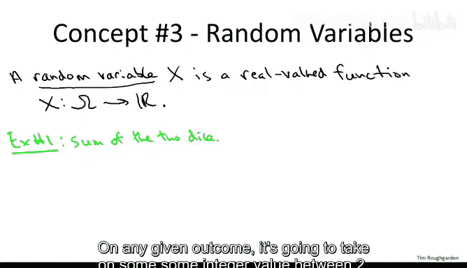

Our second running example is the randomly chosen pivot made by the outermost call to Quicksort。

 so let's think about the random variable which is the size。

 meaning the suburray length passed to the first recursive call equivalently this random variable is the number of elements of the input array smaller than the randomly chosen pivot。

So this is a random variable that takes on some integral value between zero at the smallest。

 that's if we happen to pick the pivot equal to the minimum of the array and n minus1 at the largest。

 that's if we happen to pick the maximum element as the pivot element。

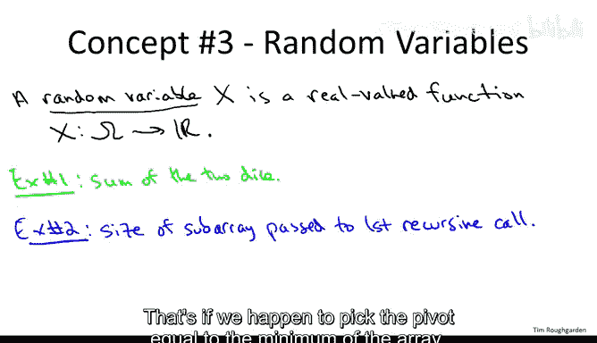

Next， let's talk about the expectation of a random variable。

 This is really nothing more than the average。 And of course。

 when you take the average of some statistic， you want to do it weighted by the probability of its various values。

 So let's just make that precise real quick。So consider some random variable capital X。

The expectation， this is also called the expected value。

And the notation is capital E square bracket then of the random variable。And again， in English。

 the expectation is just the average value naturally weighted by the probability of the various possible outcomes。

Or more mathematically， we sum over everything that could happen so let little I denote one possible outcome。

 We look at the value of this random variable when that outcome occurs。

 and then we wait at times the probability of that outcome occurring。

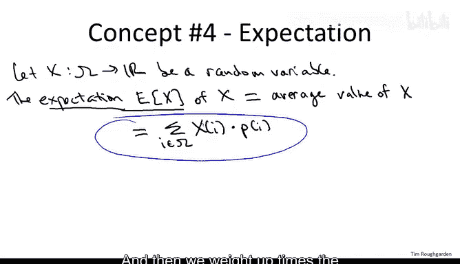

So the next two your quiz is ask you to compute the expectation of the two random variables that we identified on the previous slide。

 so the first quiz is about two dice and the random variable which is the sum of the values of those two dice。

 what is the average value of that random variable， what is its expectation？

Okay so the answer to this question is the second option。 The average value is 7。

 There's a bunch of different ways to see that。 in my opinion。

 the best way to compute this is using linearity of expectation。

 which is the next concept we're going cover。 if you wanted to you could just compute this by brute force by which I mean you could iterate over all 36 possible outcomes look at the value of the two dice in each and just evaluate that some we had in the definition on the last slide。

 a slightly sneakier way to do it if you don't know linearity of expectation would be to pair up the various outcomes So it's equally likely that sum of the two dice is2 or 12 it's equally likely to be  three or 11。

4 and 10 and so on。 each way of pairing up these values of the two dice results in 14 and when you average you get7。

 but again the right way to do this is linearity of expectation which we'll cover next。

So the second quiz covers the second random variable we identified。

 so now we're back to Quick sort and the random pivot chosen in the outermost call。

 and the question is how big on average in expectation is the subaret in the first recursive call equivalently on average。

 how many elements are going to be less than the randomly chosen pivot？

So the correct answer of this quiz is the third option。 In fact， it's actually quantity n -1 over2。

 not n over2， but basically half of the elements。 Again。

 there's sort of a sneaky way to see this if you want， which is that clearly。

 the two recursive calls are symmetric。 the expected value of the left recursive call is going to be the same as the expected size of the right recursive call。

 The two recursive calls always comprise n-1 of the elements。 So because they're symmetric。

 you expect half in each。 So n -1 over2 in each。 So for this problem。

 I think it's perfectly fine just to compute this using the definition of expectation。

 So if we let x denote the random and variable that we care about。 the sub array size。

Then we can just compute directly by summing over all of the possible outcomes。

 all of the possible choices of the pivot， so with Thr body 1 over n。

 we choose the minimum of the pivot resulting in zero elements being passed to the first recursive call。

With probability1 over n we pick the second smallest element resulting in one element being passed to the first recursive call with probability1 over n。

 we pick the third smallest， giving us a sub array size of two and so on。

 And then with probability1 over n， we pick the maximum element， giving us a sub size of n minus-1。

 So if you just sort of compute this sum out， you will get as expected n minus-1。Over2。

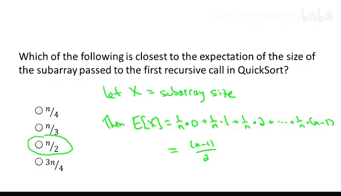

So expectation is the last definition that I'm going to give you in this part one of the probability review next is our fifth and final concept for this video。

 which is linearity of expectation， and that's not a definition that's more of a theorem。

So what is linear of expectation Well this is a very simple property of random variables that's super。

 super important， this comes up all the time when we analyze randomized algorithms and random processes more generally so what is linearity of expectation Well it's the following very simple claim。

Which I'll sometimes denote just by L X for short。Suppose you got a bunch of random variables defined on the same sample space。

Then if you want to think of the expected value of the sum of these random variables。

 it doesn't matter if you take the sum first and then take the expectation or if you take expectations first and then sum。

 that is the expected value of a sum of random variables。

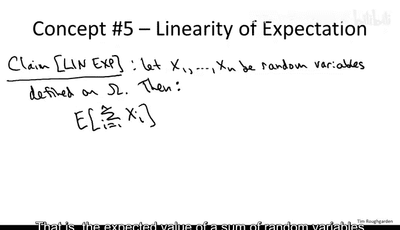

Is equal to。The sum of the expectations of the individual random variables。

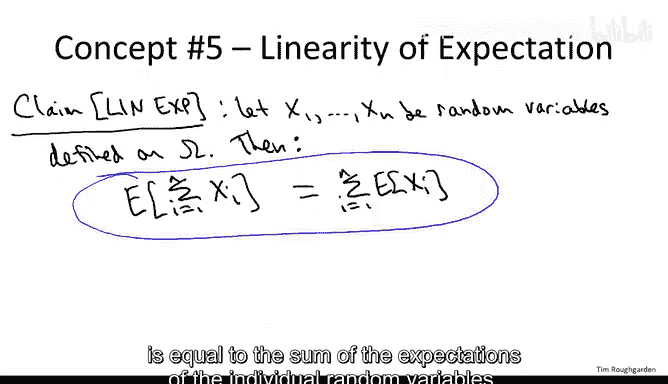

And one of the reasons linearity of expectation is so ubiquitously useful。Is because it always works。

 no matter what these random variables are， in particular。

 even when the random variables are not independent Now I haven't defined independent random variables yet。

 that will come in part two of the probability review。

 but hopefully you have an intuitive sense of what independence means。

 So things are independent if knowing something about one of the random variables doesn't influence what you expect from the other random variable。

Now I realize the first time you see linearity of expectation it's a little hard to appreciate。

 so first of all， as far as applications will see plenty throughout this course。

 pretty much every single application of probability that will see the analysis will involve linearity of expectation。

 but it may be hard to appreciate why this is not a taology just symbolically it may look like it has to be true。

 but to point out that there is content here if I replace the sums by products。

 then this equation would in general be false if the random variables are not independent so the same thing is not true about products。

 it's really about sums。

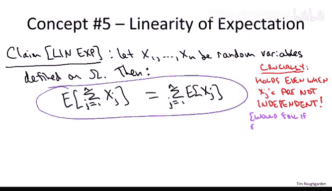

So let me just give you a trivial illustration of linearity of expectation。

 point out how it really easily allows us to evaluate the sum of two dice。

So in our first running example， let's introduce the random variables X1 and x2 for the results of the first and second die respectively。

Now， computing the expected value of a single die is easy。

 as only six outcomes to enumerate over contrast that with the 36 outcomes to enumerate over when we evaluated the sum of the two dies。

So the average value of a single die you won't be surprised to here is 3。

5 so it ranges integers between one and 6 uniformly so 3。5 on average。

 and now using linear of expectation， the sum of two dice is simply double the average value of a single one。

So in the next slide I'm going to prove this property， prove linearity of expectation。

 but frankly the proof is pretty trivial， so if you don't care about the proof that's fine。

 you can skip it without loss， I'm including it just for completeness and I got to say I don't know of another mathematical statement which is simultaneously so trivial to prove and so unbelievably useful。

 it's really something remarkable linearity of expectation。

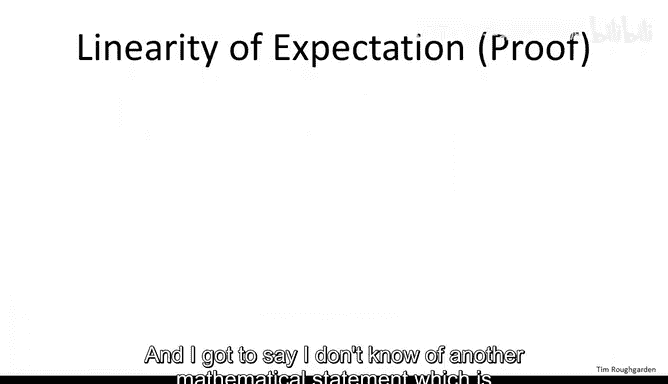

So as the proof go， well， honestly we just write out the sum， the definition of an expectation。

 we reverse the sums and we're done。So let me start with the right hand side of the equation。

So that was the sum of the expectations of the random variables。

So now let's just apply the definition of expectation。

 so it's just a weighted average over the possible outcomes。

And now instead of summing first over the random variable J and then over the realized outcome I。

 I'm going to do it in reverse order。 I'm going to sum first over the outcome I and then over the random variable J。

Now the probability of outcome I is independent of J so we can yank the P of I outside of that inner sum。

But now what have we got so inside the parentheses we simply have the value of the sum of the Xs XJs on the outcome I。

 and then over here we're just averaging the sum of the XJs with respect to the probabilities。

 the PIs， so this is just the definition of the expectation of the sum of the random variable。

So that's it， so linear of expectation is really just a reversal of the double sums。Now。

 for those of you that are rusty on these kinds of manipulations， I just want to point out， you know。

 this reversal of the double sum itself is there's nothing complicated at all about what's going on。

 So if you want a really pedestrian way to think about what's happening。

 just imagine that we take these sum ends， these X J I Ps。

And we just write them out in a group where one， or let's just say the columns are indexed by the random variable J and the rows are indexed by the outcome I。

And in a given cell of this grid， we just write the summan XJI times PI。

So if you get lost in the notation with these double sums。

 the point is you can just interpret each of them in terms of this grid。

 Both of these double sums are nothing more than the sum of the values in all of the cells of this grid。

 One order of summation just says you group first， according to row sums and then sum those up。

 That's the first summation。 The second summation， you first take column sums and then sum those up。

 But of course， it doesn't matter。 You just get the result of everything in the grid。 Okay。

 so there's no tricks up my sleeve when I reverse these sums。

 It's a totally elementary trivial thing。 Okay， so again， linear of expectation。

 trivial to prove In useful。 Don't forget it。

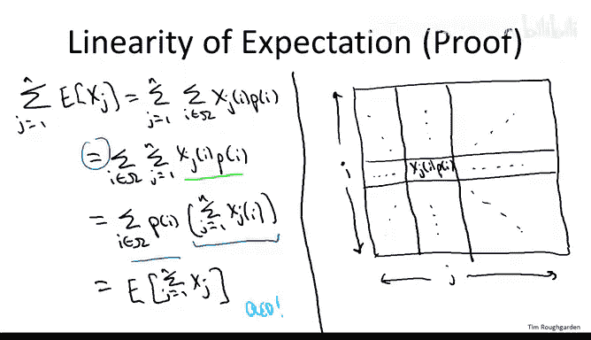

So I want to conclude this video with one final example in order to tie together all of the concepts that we just learned or just reviewed。

 and it's going to be an example about load balancing， assigning processes to servers。

 but this in fact is quite important for the analysis of hatching that we're going to see toward the end of the course as well。

But for now let's just think about the following simple problem， for some integer N。

 you have N computer processes that have to be assigned to end servers in some way。

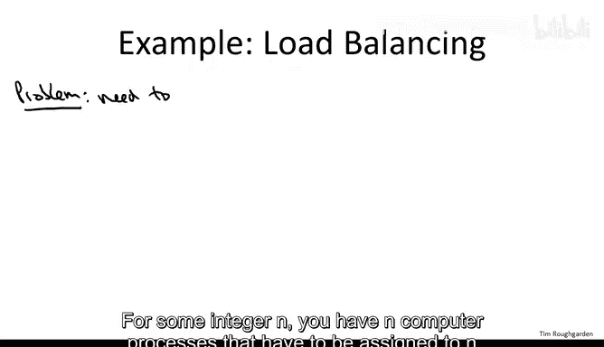

Now you're feeling really lazy， okay， so you're just going to take each of these processes and you're just going to assign it to a totally random server。

 get with each server equally likely to get a given process。And the question I want to study is。

 does this laziness cost you at least on average， so if you look at a server。

 what's the expected load？So let's proceed to the solution， the answer to this question。

 so before you start talking about expectations， one has to be clear about the sample space and what are the probabilities of the various outcomes。

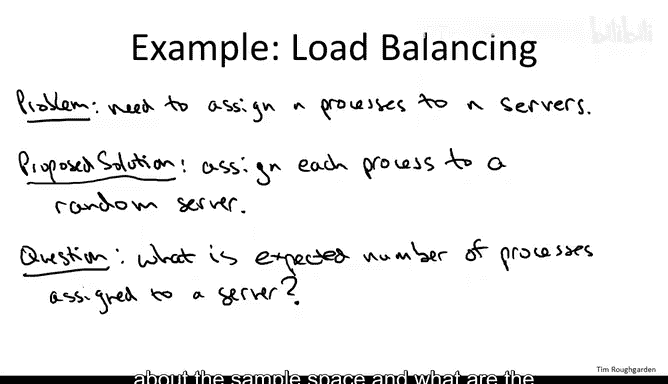

So remember the sample space mega just denotes every possible thing that could happen。

 so what are we doing for each process we're assigning it to a random server。

 so all of the things that could happen are all of the different assignments of these end processes to these end servers and if you think about it there are n raised to the n possible outcomes because you have n choices for each of the n processes。

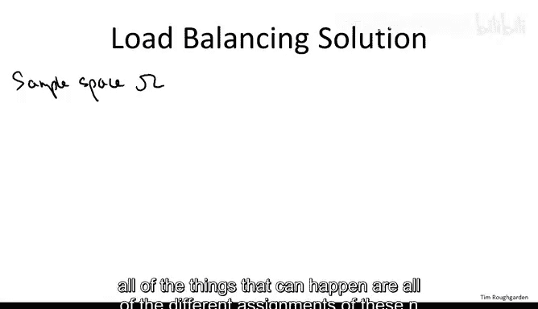

Moreover， because each process is assigned to one of the servers uniformly at random。

 each of these end of the N assignments is equally likely， probability one over end of the end。

Now that we have a sample space we're in a position to define a random variable and we already know a random variable we care about。

 we care about the average load of a server Now all of the servers are exactly the same。

 so we just have to focus on one server， let's say the first server and look at the number of processes assigned to it。

And if you go back to the problem statement， what we're asked is to compute the expected value of y。

 the expected number of processes assigned to a server。Now of course， in principle。

 we could go to the definition of expectation and just compute by brute force the sum over all possible outcomes of the value of y and take the average。

 Unfortunately there are entity the and different outcomes and that's a lot。

 So what could we do other than this brute force computation well recall our example of linearity of expectation and the sum of two dice we observe that instead of computing the sum by enumerating over all 36 outcomes。

 it was much better to just focus on a single die， compute its expectation and then conclude with linearity of expectation。

 So we'll do the same thing here instead of focusing on the sum y we'll focus on constituent parts of y So whether or not a single process gets assigned to the first server and then we'll get away with that by linearity of expectation。

So more precisely for a given process， J， let's define Xj whether to be one。

 if and only if the Jth process gets assigned to the first server， zero otherwise。0。

1 random variables like X J are often called indicator random variables。 That's because they。

 in effect， indicate whether or not a certain event occurs。 In this case。

 whether or not the J process gets assigned to the first server。 Why did I make this definition。

 Well， observe that the total number。

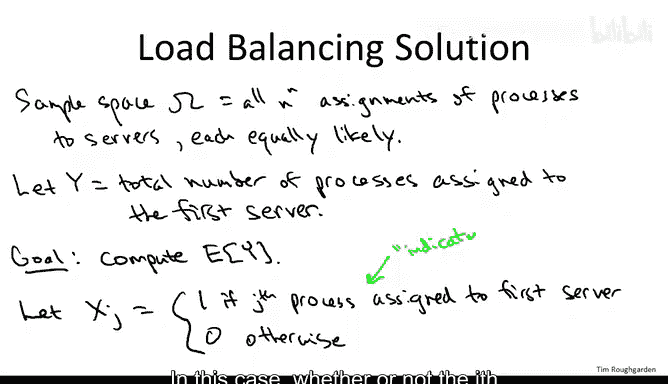

Of processes that gets assigned to the first server is simply the sum from J equal 1 to n of Xj。

Xj says whether or not a given process， the JF process is on the first server。

 the total number is just the sum of these overall J。Now。

 the benefit from this maneuver is we only have to compute the expectation of an extremely simple indicator random variable Xj。

 This is like the win that we got when we were summing up to dice by instead of having to compute the sum。

 the expected value of the sum。 we just had to focus on the expectation of a single die。

 That was really easy。  Similarly here， the expectation of a single Xj is really easy  specifically。

 let's write it out just using the definition of the expectation。 So the expected value of an Xj is。

 well， let's group together all the outcomes in which it takes on the value 0。

 So the contribution of the expectation is0 for all of those outcomes。

 and then there's the rest of the outcomes where Xj takes on the value 1。And in those cases。

 it contributes one to the expectation。Now， obviously。

 we get some happy cancellation happening here with the zero part。

And all we have to worry about is the probability that Xj takes on the value1。 Okay。

 what was Xj again， how do we define it， remember it's the event that it's one exactly when the Jth process gets assigned to the first server。

 how a process is assigned or remember the proposed solution assigns each process to each of the end servers equally likely with uniform probability。

 So the probability of the JF process gets assigned to the first server is one over n。

So this leaves us with just the sum。Jical 1 to N of one over n。

That is we just sum up one over n with itself， n times， this of course is equal to one。

So at the end of the day， what we find is that the expected number of processes assigned through a given server。

 say the first server is just one。So at least if we only care about averages we lose very little from this trivial process of randomly spraying the process to the server on average any given server has just one process on it。

 this is characteristic of the role that randomization plays in algorithm design and computer science more generally。

 often we can get away with really simple heuristics just by making random choices of course Quickwordt is one example of that where we get an extremely prevalently used practical sorting algorithm just by making a randomly chosen pivots in every recursive call。

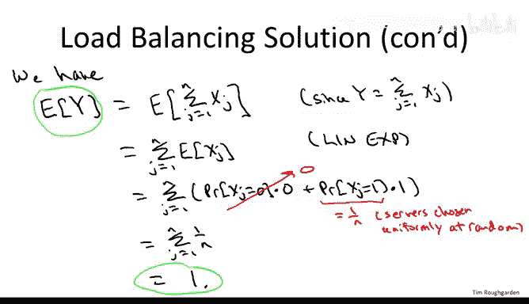