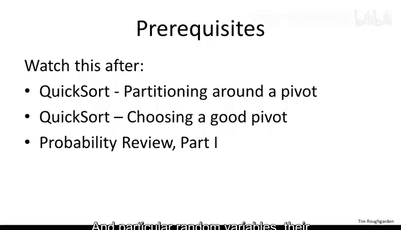
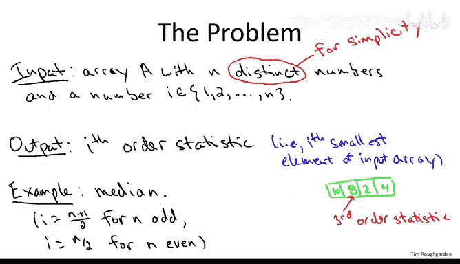
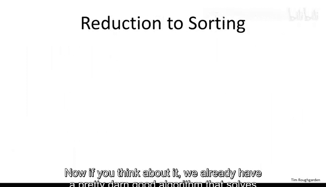
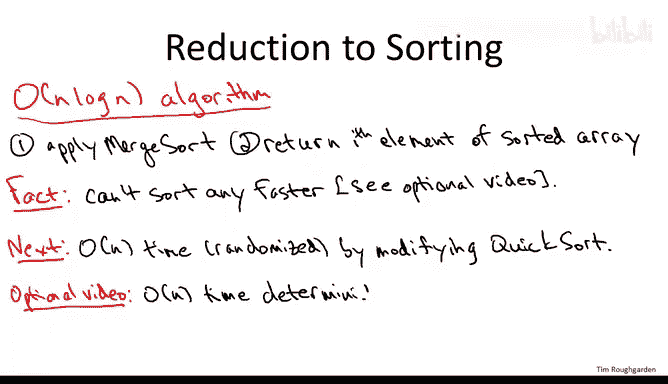
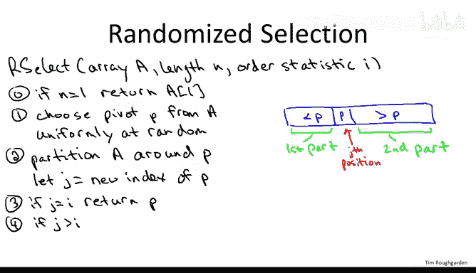
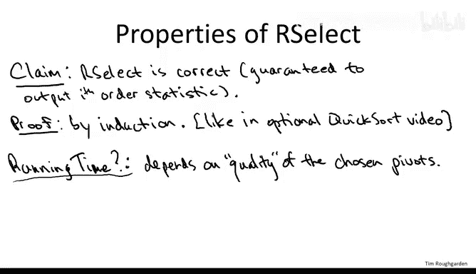
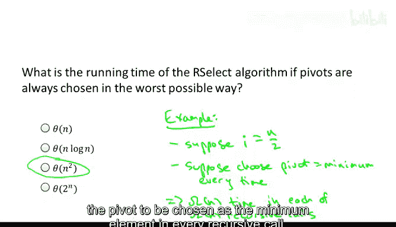
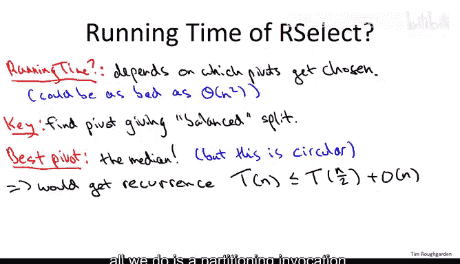
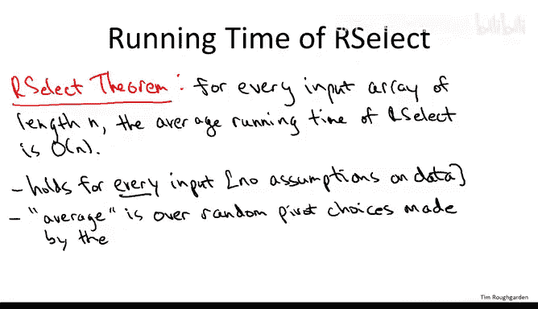

# 斯坦福大学《算法（分治／排序／搜索／随机算法、图搜索／最短路径／数据结构、贪心算法／最小生成树／动态规划、最短路径／NP）｜Algorithms》中英字幕 - P34：34_04_02_随机选择算法.zh_en - GPT中英字幕课程资源 - BV1Rx4y1U7sZ

I say pretty much everything I want to say about sorting at this point。

 but I do want to cover one more related topic namely the selection problem。

 This is the problem of computing order statistics of an array with computing the median of array being a special case。

 analogous to our coverage of quick sort the goal is going to be the design and analysis of a super practical randomized algorithm that solves the problem and this time will even achieve an expected running time that is linear in the length of the input array that is big O of n for input arrays of length n as opposed to the O of n log n time that we had for the expected running time of Quick sort。

 like quick sort， the mathematical analysis is also going to be quite elegant So in addition。

 these two required videos on this very practical algorithm will motate to optional videos that are on very cool topics but of a somewhat more theoretical nature。

 the first optional video is going to be on how you solve the selection problem in deterministic linear time that is without using randomization and the second optional video will be a sorting lower bound that is why no comparison-based sort can be better than merge short。

And have better running time than digo of and login。

So a few words about what you should have fresh in your mind before you watch this video。

 I'm definitely assuming that you've watched the quickword videos and not just watched them but that you have that material pretty fresh in your mind So in particular the video of quickword about the partition subroutine so this is where you take an input where a you choose a pivot and you do by repeated swaps you rearrange the array so that everything less than the pivots to the left of it。

 everything bigger than the pivot is to the right of it。

 you should remember that subroutine you should also remember the previous discussion about pivot choices。

 the idea that the quality of a pivot depends on how balanced to split into two different subprobles it gives you those are both can be important for the analysis of this randomized linear time selection algorithm I need you to remember the concepts from probability review part one in particular random variables to their expectation and linearity of expectation。

That said， let's move on and formally define what the selection problem is。

The input is the sameus for the sorting problem， just you're given an array of end distinctist entries。

But in addition， you're told what order statistic you're looking for。

 so that's going to be a number I， which is an integer between1 and n。

And the goal is to output just a single number， namely the IF order statistic that is the IF smallest entry in this input array。

So just to be clear。If you had an array entry， let's just say four elements。Continuing the number 10。

8，2 and 4， and you were looking for say the third or statistic that would be this eight。

The first order statistic is just the minimum element of the array that's easy to find with a linear scan。

 the n order statistic is just the maximum again easy to find with a linear scan。

 the middle element is the median and you should think of that as the canonical version of the selection problem。

Now， when n is odd， it's obvious what the median it is， that's just the middle element。

 so the n plus1 over2th order statistic。If the array has even linked， there's two possible medians。

 so let's just take the smaller of them， that's the end of a tooth or statistic。

You might wonder why you'd ever want to compute the median of an array rather than the mean that is the average。

 it's easier to see that you can compute the average just with a simple linear scan and the median one motivation is it's a more robust version of the mean。

 so if you just have a data entry problem and it corrupts one element of an input away。

 it can totally screw up the average value of the array。

 but it has generally very little impact on the median。

Final comment about the problem is I am going to assume that the array entries are distinct。

 that is there's no repeated elements， but just like in our discussions of sorting。

 this is not a big assumption， I can encourage you to think about how to adapt these algorithms to work。

 even if the arrays do have duplicates， you can indeed still get the same very practical。

 very fast algorithms with duplicate elements。

Now， if you think about it， we already have a pretty darn good algorithm that solves the selection problem。

Here's the algorithm。 It's two simple steps， and it runs in O of n log N time。Step one。

 sort the input array， we have various subroutines to do that， let's say we pick mergech sort。

Now what is it we're trying to do， we're trying to find the I smallest element of the input array。

 well once we've sorted it， we certainly know where the I smallest element is。

 it's in the I position of the sorted array。So that's pretty cool。

 we've just done what a computer scientist would call a reduction and that's a super useful and super fundamental concept。

 it's when you realize that you can solve one problem by reducing it to another problem that you already know how to solve so what we just showed is that the selection problem reduces easily to the sorting problem we already know how to solve the sorting problem and N log N time so that gives us an N log N time solution to the selection problem。

But again， remember， the mantra of any algorithm designer worth their salt is can we do better。

 We should avoid contentness just because we got in log N doesn't mean we should stop there。

 Maybe we can be even faster。 Now， certainly， we're going to have to look at all of the elements in the input array in the worst case。

 We shouldn't expect to do better than linear。 But hey， why not linear time。Actually。

 if you think about it， we probably should ask that question back when we were studying the sorting problem。

 why were we so content with the N log N time bound for merge sort and the O of N log N time on average bound for Quick sort Well it turns out we have a really good reason to be happy with our N log N upper bounds for the sorting problem。

It turns out， and this is not obvious and would be the subject of an optional video。

 you actually can't sort an input array of length n better than n log N time。

 either in the worst case or on average。So in other words。

 if we insist on solving the selection problem via a reduction to the sorting problem。

 then we're stuck with this n log N time mount okay strictly speaking that's for something called comparison sorts。

 see the video for more details but the upshot is if we want a general purpose algorithm and we want to do better than N log N for selection we have to do it using ingenuity beyond this reduction we have to prove that selection is a strictly easier problem than sort it。

 that's the only way we're gonna have an algorithm that beats N log N It's the only way we conceivably get a linear time algorithm。

And that is exactly what is up next on our plate。 we're going to show selection is indeed fundamentally easier than sorting。

 we can have a linear time algorithm for it， even though we can't get a linear time algorithm for sorting。

 you can think of the algorithm we're going to discuss as a modification of quick sort and in the same spirit of quick sort it will be a randomized algorithm and the running time will be an expected running time that will hold for any input array。

Now， for the sorting problem， we know that quick sort thats n log n time on average were the averages over the coin flips done by the code。

 but we also know that if we wanted to， we could get a sorting algorithm in n log n time that doesn't use randomization。

 The merge sort algorithm is one such solution。 So here we're giving a linear time solution for selection for finding order statistics that uses randomization and we naturally to wonder。

 is there an analog to merge sort， Is there an algorithm which does not use randomization and gets this exact same linear time bound In fact。

 there is the algorithms a little more complicated and therefore not what is practical is as randomized algorithm。

 but it's still very cool。 It's a really fun algorithm to learn and teach。

 So I will have an optional video about linear time selection without randomization。

So for those of you who aren't going to watch that video or want to know what's the key idea。

 the idea is to choose the pivot deterministically in a very careful way using a trick called the median of medias。

 that's all I'm going to say about it now， you should watch the optional video if you want more details。

I do feel compelled to warn you that if you're going to actually implement a selection algorithm。

 you should do the one that we discuss in this video。

 not the linear time one because the one we'll discuss in this video has both smaller constants and works in place。

So what I want to do next is develop the idea that we can modify the quick sort paradigm in order to directly solve the selection problem。

 So to get an idea of how that works， let me review the partition subroutine。 like in quick sort。

 this subroutine will be our workhorse for the selection algorithm。

 So what the partition subroutine does， it takes as input some jumbled up array and it's going solve a problem which is much more modest than sorting。

 So in partitioning is going to first choose a pivot element somehow we'll have to discuss what's a good strategy for choosing a pivot element。

 But suppose you know in this particular input array， it chooses the first element。

 this three as the pivot element。 the responsibility of the partition subroutine then is to rearrange the elements in this array so that the following properties are satisfied。

 Anything less than the pivot is to the left of it。 it can be in jumbled order。

 but if you're less than the pivot you better be to the left like this two and1 is less than the three。

 if you're bigger than the pivot， then again， you can be in jumbled order amongst those elements but all of them have to be。

TheRight of the pivot。 And that's true for the numbers4 through8。

 they all are to the right of the pivot 3 in a jumbled order。 So this in particular。

 puts the pivot in its rightful position where it would belong in the final sorted array。

 and at least for quick sort it enabled us to recursively sort to smaller subproblem。

 So this is where I want you to think a little bit about how we should adapt this paradigm。

 So suppose I told you the first step of our selection algorithm is going to be to choose a pivot and partition the array。

 Now， the question is how are we going to recurse。 We need to understand how to find the Ih order statistic of the original input array。

 It suffices to recurse on just one subprom of smaller size and find a suitable order statistic in it。

 So how should we do that， Let me ask you that with some very concrete examples about what pivot we choose and what order statistic we're looking for and see what you think。

So the correct answer to this quiz is the second answer。

So we can get away with recursing just once and in this particular example we're going to recurse on the right side of the array and instead of looking for the fifth order statistic like we were originally。

We're going to recursively search for the second order statistic。 So why is that。 Well， first。

 why do we recurursse on the right side of the array？

 So by assumption we have this array with 10 elements。 We choose the pivot。 We do partitioning。

 Remember， the pivot winds up in its rightful position。 That's what partitioning does。

 So if the pivot winds up in the third position。 we know it's the third smallest element in the array。

 Now， that's not what we were looking for。 We were looking for the fifth smallest element in the array。

 That， of course， is bigger than the third smallest element of the array。 So by partitioning。

 where is the fifth element going to be， It's got to be to the right of this third smallest element to the right of the pivot。

 So we know for sure that the fifth order statistic of the original array lies to the right of the pivot。

 That is guaranteed。 So we know where to recurse on the righthand side。 Now， what are we looking for。

 We are no longer looking for the fifth order statistic， the fifth smallest element。 Why。

 well we've thrown out both the pivot and everything smaller than it。Remember。

 we're only recursing on the right hand side。 So we've thrown out the pivot。

 the third element and everything less than it， the minimum and the second minimum。

 having deleted the three smallest elements and originally looking for the fifth smallest of what remains of what we're recursing on or're looking for the second smallest element。

So the selection algorithm in general is just the generalization of this idea to arbitrary arrays and arbitrary situations of whether the pivot comes back equal to less than or bigger than the element you're looking for so let me be more precise。

I'm going to call this algorithm our select for randomized selection。

And according to the problem definition it takes as input as usual an array a of some length n。

 but then also the order statistic that we're looking for。

 so we're going to call that I and of course we assume that I is some integer between one and n inclusive so for the base case。

 that's going to be if the array has size one， then the only element we could be looking for is the one order statistic and we just return the sole element of the array。

Now we have to partition the array around the pivot elements， and just like in Quick sortt。

 we're not going to be very lazy about choosing the pivot。

 we're going to choose it uniformly at random from the end possibilities and hope things work out。

 and that'll be the crux of the analysis proving that random pivots are good enough sufficiently often。

Having chosen the pivot， we now just invoke the standard partitioning sub routine as usual that's going to give us the partition array。

 you'll have the pivot element， you'll have everything less than the pivot to the left。

 everything bigger than the pivot to the right， As usual。

 I'll call everything to the left the first parts of the partition array。And everything bigger。

 the second part。Now we have a couple of cases depending on whether the pivot is bigger or less than the element we're looking for。

 so I need a little notation to talk about that so let's let J。The the order statistic that P is。

 so if P winds up being the third smallest element， like in the quiz。

 then J is going to be equal to three。Equivalently。

 we can think of J is defined as the position of the pivot in the partition version of the array。

Now there's one case which is very unlikely to occur but we should include it just for completeness if we're really lucky。

 then in fact our random pivot just happens to be the order statistic we were looking for that's when I equals J we're looking for the I smallest element if by dumb luck the pivot wind up being the ice smallest element we're done we can just return it we don't have to recurse。

Now， in general， of course， we don't randomly choose the element we're looking for。

 We choose something that well， it could be bigger or it could be smaller than it In the quiz。

 we chose a pivot that was smaller than what we're looking for。 actually， that's the harder case。

 So let's first start with a case where the pivot winds up being bigger than the element we're looking for。

 So that means that the J is bigger than I。 We're looking for the I smallest。

 we randomly chose the J smallest for J bigger than I。

So this is the opposite case of the quiz this is where we know what we're looking for has to be to the left of the pivot The pivot's the J smallest。

 everything less than it's to the left， we're looking for the I smallest iss less J so that's got to be on the left that's what we recur。

 Moreover， it's clear we're looking for exactly the same order statistic if we're looking for the third smallest element we're only throwing out stuff which is bigger than something even bigger than the third smallest element so we're still looking for the third smallest of what remains。

And naturally， the new array size is J -1 because that's what is to the left of the pivot。

 And then finally， the final case is when the random element that we choose is less than what we're looking for。

 and then we're just like the quiz。 So namely， what we're looking for is bigger than the pivot。

 it's got to be on the right hand side。 we know we got to recurse on the right hand side。

 We know the right hand side has n minus J elements， we throw out everything up to the pivot。

 So we threw out J things， there's n minus J left。 and all of those j things we threw out are less than what we're looking for。

 So if we used to be looking for the I smallest element Now we're looking for the I minus J smallest elements。

So that is the whole algorithm， that is how we adopt the approach we took toward the sorting problem and quick sort and adapt it to the problem of selection so is this algorithm any good let's start studying its properties and understand how well it works。

So let's begin with correctness。So the claim is that no matter how the algorithm's coin flips come up。

 no matter what random pivots we choose， the algorithm is correct in the sense that is' guaranteed to output to the I order statistic。

The proof is by induction， it proceeds very similarly to QuickSot。

 so I'm not going to give it here if you're curious about how these proofs go。

 there's an optional video about the correctness of QuickSot， if you watch that and understand it。

 it should be clear how to adapt that inductive argument to apply to the selection algorithm as well。

So as usual for divide and conquer algorithms， the interesting part is not so much knowing understanding why the algorithm works。

 but rather understanding how fast it runs。 So the big question is what is the running time of this selection algorithm Now to understand this we have to understand the ramifications of pivot choices on the running time So you've seen the quick sort videos thatre fresh in your mind so what should be clear is that just like in quick sort。

 how fast this algorithm runs is going to depend on how good the pivots are and what good pivots means is pivots the guarantee balanced split。

So the next quiz will make sure that you understand this point and ask you to think about just how bad the running time of the selection algorithm could be if you get extremely unlucky in your pivot choices。

So the correct answer to this question is exactly the same as the answer for Quick sort the worst case running time if the pivots are chosen just in a really unlucky way is actually quadratic in the array link。

 remember we're shooting for linear time so this quadratic is a total disaster So how could this happen Well suppose you're looking for the median。

And suppose you choose the minimum element as the pivot every single time。

 So if this is what happens if every time you choose the pivot to be the minimum。

 just like in quick sort， this means every time you recurse。

 all you succeed in doing is peeling off a single element from the input array。 Now。

 you're not going to find the median element until youve done roughly N over two recursive calls。

 Each on an array that has size at least a constant fraction of the original one。

 So that's a linear number of recursive calls， each on an array of size at least some constant times n。

 So that gives you a total running time of quadratic。 Overall， of course。

 this is an absurdly unlikely event， frankly， your computer is more likely to be struck by a meteor than it is for the pivot to be chosen as the minimum element in every recursive call。

 But if you really had an absolutely worst case choice of pivots。

 it would give this quadratic runtime bound。

So the upshot then is that the running time of this randomized selection algorithm depends on how good our pivots are and for a worst case choice of pivots。

 the running time can be as large as N squared now hopefully most of the time we're going to have much better pivots and so the analysis proceeds by making that idea precise。

So the key to a fast running time is going to be the usual property that we want to see in divide and conquer algorithms。

 namely every time recurse， every time we recurse， the problem size is better not just be smaller。

 but it better be smaller by a significant factor， how would that happen in this selection approach based on the prediction subroutine。

 well if both of the subproblem are not too big， then we're guaranteed that when we recurse we make a lot of progress。

So let's think about what the best possible pivot would be in the sense of giving a balanced split right so of course in some sense。

 the best pivot is you just choose the autotistic you're looking for and then you're done in constant time。

 but that's extremely unlikely and it's not worth worrying about so ignore the fact that we might guess the pivot what's the best pivot if we want to guarantee an aggressive decrease in the input side for the next iteration Well the best pivot is the one that gives us as most balanced split as possible So what's the pivot that gives us the most balanced split a 5050 split well if you think about it it's exactly the median。

Of course， this is not super helpful because the median might well be what we're looking for in the first place。

 so this is sort of a circular idea。But for intuition。

 it's still worth exploring what kind of running time we would get in the best case， right。

 if we're not going to get linear time even in this magical best case。

 we certainly wouldn't expect to get it on average over random choices of the pivots。

 So what would happen if we actually did luckily choose the median as the pivot every single time we get the recurrence that the running time that the algorithm requires an a array of length end。

Well there's only going to be one recursive call so this is the big difference from quick sort where we had to recursse on both sides and we had two recursive calls so here we're gonna to have only one recursive call in the magical case where pivots are always equal to the median both subproblem sizes contain are only half as large as the original one So when we recurse it's on a problem size guaranteed to be at most n over2 and then outside of the recursive call pretty much all we do is a partitioning invocation and we know that that's linear time So the recurrence we get is t of n is a most t of n over2 plus big O of n This is totally ready to get plugged into the master method it winds up being case2 of the master method and indeed we get exactly what we wanted linear time。

To reiterate， this is not interesting in its own right， this is just for intuition。

 This was a sanity check that at least for a best case choice of pivots。

 we'd get what we want a linear time algorithm and we do。 Now， the question is。

 how well do we do with random pivots， Now the intuition。

 the hope is exactly as it was for quickword， which is the random pivots are a perfectly good surrogate for the median。

 for the perfect pivot。So having the analysis of Quicksort under our belt where indeed random pivots do approximate very closely the performance should get with best case pivots。

 maybe now we have reason to believe that this is hopefully true。

 that said as a mathematical statement this is totally not obvious and it's going to take a proof that's the subject for the next video but let me just be clear exactly what we're claiming here is the running time guarantee that randomized selection provides。

For an arbitrary input array of Li in。The average running time of this randomized selection algorithm is linear Big O of n。

Let me reiterate a couple points I made for the analogous guarantee for the QuickSo algorithm。

 the first is that we're making no assumptions about the data whatsoever。

 in particular we're not assuming that the data is random。

 this guarantee holds no matter what input array you feed into this randomized algorithm in that sense this is a totally general purpose subroutine。

So where then does this averaging come from， where does the expectation come from。

 the randomness is not in the data， rather the randomness is in the code。

 and we put it there ourselves。

Now let's proceed to the analysis。