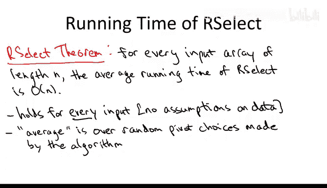
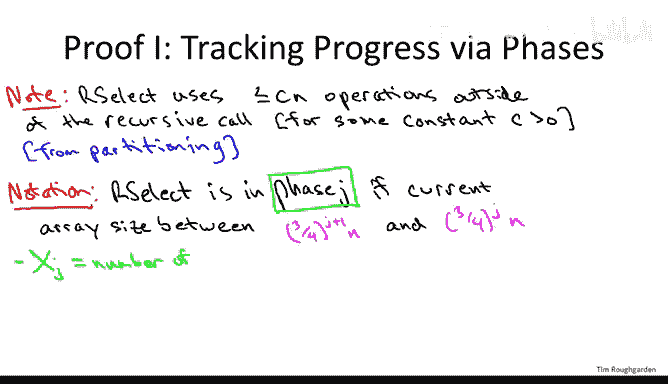
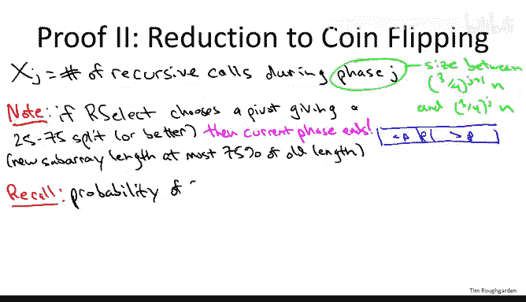
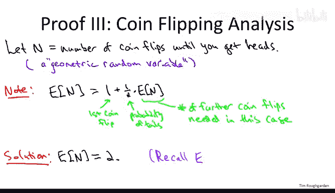
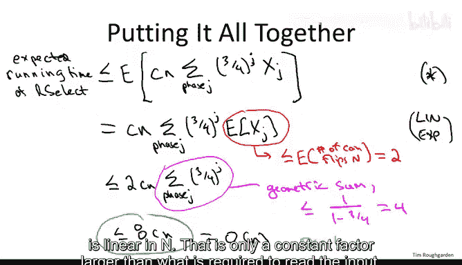

# 斯坦福大学《算法（分治／排序／搜索／随机算法、图搜索／最短路径／数据结构、贪心算法／最小生成树／动态规划、最短路径／NP）｜Algorithms》中英字幕 - P35：35_04_03_随机选择算法分析.zh_en - GPT中英字幕课程资源 - BV1Rx4y1U7sZ

In this video， I'll explain the mathematical analysis of the randomized linear time selection algorithm that we studied in the previous video。

 Specifically I'm going to prove to you the following guarantee for that algorithm for every single input array of length N。

 the running time of this randomized selection algorithm on average will be linear。

 Pret amazing if you think about it because that's barely more than when the time it takes just to read the input。

 And in particular， this linear time algorithm is even faster than sorted。

 So this shows that selection is a fundamentally easier problem than sorting。

 you don't need to reduce the sorting。 you can solve it directly in big O of n time。

 I want to reiterate the same points I made about quick sort。 the guarantee is the same。

 It is a general purpose subroutine， we make no assumptions about data。

 This theorem holds no matter what the input array is。

 The expectation the average that's in the theorem statement is only over the coin flips made by the algorithm made inside its code of our own devising。

Before we plunge into the analysis， let me just make sure you remember what the algorithm is so it's like quick sort。

 we partition around a pivot except we only recurse once not twice So we're given an array with some length and we're looking for the I order statistic。

 the I smallest element the base case is obvious if you're not in the base case you choose a pivot P uniformly random from the input array just like we did in quick sort。

 we partition around the pivot just like we didn't in quick sort that splits the array into a first part。

 those elements less than the pivot and the second part those elements。

 which are bigger than the pivot Now we have a couple cases the case which is very unlikely so we don't really worry about it is if we're lucky enough to guess the pivot as the I order statistic what we're looking for。

 That's when the new position J of the pivot element happens to equal I what we're looking for then of course we just return it that was exactly what we want it in the general case。

 the pivot is going to be in a position J which is either bigger than what we're looking for I that's when the pivot is too big or J its position will be less than the order statisticsistic。

I that we're looking for。 that's when the pivot is too small。

 So if the pivot's too big if J is bigger than I， then we know that what we're looking for is on the lefthand side amongst the elements less than the pivot so that's where we recur。

 we've thrown out both the pivot and everything to the right of it that leaves us with an array of j minus-1 elements and we're still looking for the height smallest among these J minus1s smallest elements and in the final case this is what we went through in the quiz in the last video is if we choose a pivot who's smaller than what we're looking for that's when j is less than I then it means we're safe to throw out the pivot and everything less than it。

 we're safe recursing on the second part， those elements bigger than the pivot having thrown out the J smallest elements we're recursing on an element of length n minus J and we're looking for the I minus J's smallest element in those that remain having already thrown out the Js smallest from the input array so that's randomized selection let's discuss why it's linear time on average。

The first thought that you might have。 and this would be a good thought would be that we should proceed exactly the same way that we did in Quicks。

 You recall that when we analyzed Quicksort， we set up these indicator random variables Xonj。

 determining whether or not a given pair of elements Scott compared at any point in the algorithm。

 And then we just realize that sum of the comparisons just the sum over all of these exon Js。

 we apply linearity of expectation and boil down to just figuring out the probability that a given pair of elements gets compared。

 You can analyze this randomized selection algorithm in exactly the same way。

 and it does give you a linear time bound on average， but it's a little messy。

 winds up being not quite as clean as in the quick sort analysis。 Moreover。

 because of the special structure of the selection problem。

 we can proceed in an even more slick way here than the way we did with Quicks。

 So again we'll have some constituent random variables will again apply linearity of expectation。

 but the definition of those random variables is going to be a little bit different than it was in Quick sort。

So first a preliminary observation， which is that the workhorse for this randomized selection procedure is exactly the same as it was in QuickSo。

 namely it's the partition subroutine， essentially all of the work that gets done outside of the recursive cause just partitions the input array around some pivot element as we discussed in detail in a separate video that takes linear time。

So usually when we say something's linear time， we just use Big O notation。

 I'm going to go ahead and explicitly use a constant C here for the operations outside the recursive call that'll make it clear that I'm not hiding anything up my sleeves when we do the rest of the analysis。

Now what I want to do on this slide is introduce some vocabulary。

 some notation which will allow us to cleanly track the progress of this recursive selection algorithm and by progress。

 I mean the length of the array on which it's currently operating remember we're hoping for a big win over quick sort because here we do only one recursive call not too we don't have to recursse on both sides of the pivot just on one of them so it stands the reason that we can think about the algorithm is making more and more progress as a single recursive call is operating on arrays of smaller and smaller length so the notion that will be important for this proof is that of a phase disquifies how much progress we've made so far with higher numbered phases corresponding to more and more progress。

Willll say that the aillic algorithm at some midpoint of its execution is in the middle of phase J。

 if the array size that the current recursive call is working on has length between three fourth race to the J times n and the smaller number of 3 fourth race to the J plus1 times n。

For example， think about the case where J equals0。 That says phase0 recursive calls operate on arrays with size between n。

 That's the length of the original input array and 75% of n。

 So certainly the outermost recursive call is going to be in phase0 because the input array has size N。

 And then depending on the choice of the pivot， you may or may not get out of phase0 in the next recursive call。

 If you choose a good pivot and you wind up recursing on something that has at most 75% of the original elements。

 you will no longer be in phase 0。 if you recursse on something that has more than 75% of what you started with of the input array。

 then you're still going to be in phase 0 even in the second recursive call。 So overall。

 the phase number J quantifies the number of times we've made 75% progress relative to the original input array。

 And the other piece of notation that's going to be important is I'm going to call X J。

So for a phase J， Xj simply counts the number of recursive calls in which a randomized selection algorithm is in phase J。

 so this is going to be some integer， it could be as small as zero if you think about it for some of the phases or it could be larger。

So why am I doing this， why am I making these definitions of phases and of these XJs what's the point Well again remember the point was we want to be able to cleanly talk about the progress that the randomized selection algorithm makes through its recursion and what I want to now show you is that in terms of these XJs counting the number of iterations in each phase。

 we can derive a relatively simple upper bound on the number of operations that our algorithm requires。

Specifically， the running time of our algorithm can be bounded above by the running time in a given phase and then summing those quantities over all of the possible phases。

 So we're going to start with a big sum over all the phases J。

We're going to look at the number of recursive calls that we have to endure during phase J。

 So that's xj by definition。 And then we're to look at the work that we do outside of the recursive calls in each recursive call during phase J。

 Now， in a given recursive call outside of its recursive call， we do C times M operations。

 where M is the length of the input array。 And during phase J。

 we have an upper bound on the length of the input array。

 by definition its most three quarters raised to the J times n。So that is。

 we multiply the running time times this constant C， this we inherit from the partition subroutine。

 and then we can for the input length， we can put an upper bound。

Of three quarters raised to the J times n。So just to review where all of these terms come from。

 this three quarters J times n is an upper bound on the array size。During phase J。

 this is by the definition of a phase。Then if we multiply that times C。

That's the amount of work that we do on each phase J subproblem。

How much work do we do in phase J overall， Well we just take the work per subpro That's what's circled in yellow and we multiply at times the number of such subproble we have。

 And of course， we don't want to forget any of our subproblem。

 So we just make sure we sum over all of the phases J to ensure that at every point we count the work done in each of the subproble so that's the upshot of the slide。

 we can upper bound the running time of our randomized algorithm very simply in terms of phases and the XJs。

 the number of subproblems that we have to endure during phase J。

So this upper bound on our running time is important enough to give some not， we'll call this star。

This will be the starting point of our final derivation when we complete the proof of this theorem。

 Now， don't forget， we're analyzing a randomized algorithm。

 So therefore the left hand side of this inequality， the running time of R select。

 that's a random variable。 So that's a different number depending on the outcome of the random coin flips of the algorithm。

 depending on the random pivots shows and you'll get different running times。 Similarlyly。

 the right hand side of this inequality。Is also a random variable。

 That's because the Xj is are random variables。 the number of subproblem in phase J depends on which pivots get chosen。

 So to analyze what we care about is the expectation of these quantities。

 their average values So we're going to start modestly and as usual this will extend our modest accomplishments to much more impressive ones using linearative expectation。

 but our first modest goal is just to we understand the average value of an Xj。

 the expected value of Xj。 We're going to do that in two steps on the next slide I'm going to argue that to analyze the expectation of Xj。

 it's sufficient to understand the expectation of very simple coin fliplipping experiment。

 then we'll analyze that coin flipping experiment then we'll have the dominoes all set up in a row and on the final slide will knock them down and finish the proof。

So let's try to understand the average number of recursive calls we expect to see in a given phase so again just so we don't forget。

XJ is defined as the number of recursive calls during phase J。Where a recursive call is in phase J。

 if and only if the current sub array length lies between three quarters raised to the J plus1 times n and then the larger number of。

Three quarters raised to the J times n。So again， for example。

 phase zero is just the recursive calls in which the array length is between 75% of the original elements and 100% of the original elements。

 So what I want to do next is point out that a very simple。

 sufficient condition guarantees that will proceed from a given phase on the next phase so it's condition guaranteeing termination of the current phase and it's an event that we've discussed in previous videos namely that the pivot that we choose gives a reasonably balanced split 2575 or better。

So recall how preding works， we choose a pivot P。It winds up wherever it winds up and the stuff to the left of it's less than P。

 the stuff to the right of it's bigger than P。So 2575 split are better。

 what I mean is that each of these each the first part and the second part has at most 75% of the elements in the input array。

 both have at least 25% and at most 75%。And the key point is that if we wind up choosing a pivot that gives us a split that's at least to this good。

 the current phase must。Why must the current phase end well if we get a 2575 split or better then no matter which case we wind up in the algorithm。

 we're guaranteed to recur on a subproblem that has at most 75% of what we started with that guarantees that whatever phase we're in now we're going to be in an even bigger phase when we recur Now I want you to remember something that we talked about before。

 which is that you've got a decent chance when you pick a random pivot of getting something that gives you a 2575 split or better。

 In fact， the probability is 50% if you have an array that has the integers from 1 to 100 inclusive。

 anything from 76 to 26 to 75 will do the trick that'll ensure that at least the first 25 elements are excluded from the rightmost call and at least the rightmost 25 elements are excluded from the left recursive call。

So this is why we can reduce our analysis of the number of recursive calls during a given phase to a simple experiment involving flipping coins。

 specifically the expected number of recursive calls。

That we are going to see in a given phase J is no more than the expected number of coin flips in the following experiment Okay so you have a fair coin。

 50% heads， 50% tails， you commit to flipping it until you see a head and the question is how many coin flips does it take up to and including the first head that you see so at minimum it's going to be one coin flip if you get a head the first time。

 it's one， if you get a tails then a head， then it's two， if it's tail's tails heads。

 it's three and so on and you always stop when you get that first head。So what's the correspondence。

 Well， think of heads as being you're in phase J and if you get a good pivot that gives you a 2575 split。

 call that heads and it guarantees that you exit this phase J just like it guarantees that you get to terminate the coin flipping experiment Now if you get a pivot which doesn't give you a 2575 split。

 you may or may not pass to a higher phase J but in the worst case don't you stick in phase J if you get a bad split and that's like getting a tails in the coin flipping experiment and you have to try again。

This correspondence gives us a very elementary way to think about the progress that a randomized selection algorithm is making。

 So there's one recursive call in every at every step in our algorithm。

 And each time we either choose a good pivot or a bad pivot， both could happen，50，50 probability。

 Good pivot means we get a 75，25 split or better。 bad pivot means by definition。

 we get a split worse than 25，75。So what have we've accomplished。

 we've reduced the task of upper bounding the expected number of recursive calls in a phase J2 understanding the expected number of times you have to flip a fair coin before you get one head So on the next slide we'll give you the classical and precise answer to this coin flipping experiment。

So let me use capital N to denote the random variable， which we were just talking about。

 the number of coin flips you need to do before you see the first heads。And it's not very important。

 but you should know that these random variables have their own name。

 This would be a geometric random variable with parameter1 half。

So you can use a few different methods to compute the expected value of a geometric random variable such as this and rootte force using the definition of expectation works fine as long as you know how to manipulate infinite soundss。

 but for the se variety， let me give you a very sneaky proof of what its expectation is。

So the sneaky approach is to write the expected value of this random variable in terms of itself and then solve for the unknown。

 solve for the expectation。So let's think about it， so how many coin flips do you need。

 well for sure you're going to need one。That's the best case scenario and now two things could happen either you get heads and that happens with 30% probability。

 you stop or you get tails， that happens with 50% probability and now you start all over again again you just flip coins until you get the first heads on average how many times does that take well。

 by the definition of capital N， you expect。The expectation of N coin flips in the case where you get tails and you have to start all over。

So this one represents the first coin flip， the one half is the probability that you can't stop。

 but you have to start all over probability of tails。And then because it's a memoryist process。

 because when you start a new on the second coin fliplip having gotten the tails。

 it's as if you're back at time one all over again。

So now we have a trivial equation in terms of the unknown expected value of n and the unique solution。

 the unique value that the expected value of capital n could have in light of this equation is2。

So on average， if you flip a fair coin and stop and you get heads。

 you're going to see two coin flips on average。To make sure you haven't sort of lost the forest for the trees。

 let me remind you why we were talking about this coin flipping analysis in the first place。

 So recall on the previous slide， we showed that X J。 And remember。

 X J is the number of recursive calls you expect to see in a given phase J。

 And we argued that the number of recursive calls you're going to see is bounded above by the expected number of coin flips until a head。

 So this exact calculation of two for the coin flips。

 gives us an upper bound of two for the number of recursive calls on average in any given phase J。

 So now we got all our ducks lined up in a row。 Let's wrap up the proof on this final slide。

 So inherited from part one of the proof。 We have an upper bound on the expected running time。

Of the R Select algorithm。This is what we were calling star on the first proof slide。In star。

 it looked a little messy， but we had the sum over the phases J。

 but we had two things that were independent of J， the constant C and the original input length end。

 so let me just yank the C and the N out front。And then we have this residual sum over the phases J。

Of three quarters raised to the J。 remember that comes from our upper bound on the subproblem size during phase J。

 and then of course we have to keep track of how many phase J subpro we got to solve that by definition is Xj。

Now star was written as a inequality in terms of the random variables。

 now we're going to go ahead and take the expectations and again I've said this over and over but don't forget where does the expectation come from。

 this is over the random pivot choices that our code makes so the expensive running time of the algorithms as much as the expectation of this stard quantity。

So like I said earlier， pretty much every time we're going to do any analysis of a randomized process。

 we're going to wind up using linearity of expectation at some point， here's where we do it。

Linear of expectation says the expectation of a sum is just the sum of the expectations。

 so we yank the C and the N outside of the expectation， we yank this sum over phases。

Outside of the expectation。We yank this three quarters raised to the J outside of the expectation。

 and then we just have the expected value of Xj， the average number of rehearsive calls we expect to see in Bays J。

Now， in the previous two slides， we figured out an upper bound on how many recursive calls we expect to see in each phase。

 So first by the coin flip analysis， by the reduction of the coin flip analysis。This is the most。

An expected number。Of coin flips in。Which on the previous thought， we argued was exactly two。

So bringing that two out in front of the sum that no longer depends on J。So we get a most2 C。

Times the sum over phase is J of three/ quarters raised to the J。

Now this kind of sum we have seen previously in the course it came up when we are analyzing the master method and we summed up our running time upper bounds over the levels of our recursion tree and if we're not in case one。

 if you were in case two or three we had geometric sums that were nontrivial that required a certain formula to calculate so let me remind you of that formula here when three quarters is the number being powered up to the J。

 so this has value at most one over one minus the number that's getting powered so in this case it's three quarters so one minus- three quarters is a quarter you take the reciprocal you get four。

And the upshot is that the expected number of operations that this randomized selection algorithm uses to find the I ordered statistic in a given input array is eight times C times n where C is the hidden constant。

 the linear running time of partition and so that completes the proof the input array was arbitrary。

 we show the expected running time over the random choices of the algorithm is linear in。

That is only a constant factor larger than what is required to read the input， pretty amazing。

