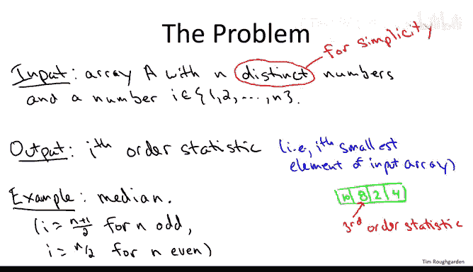
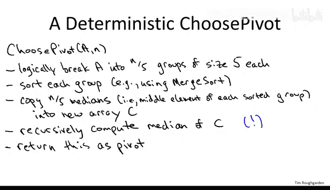
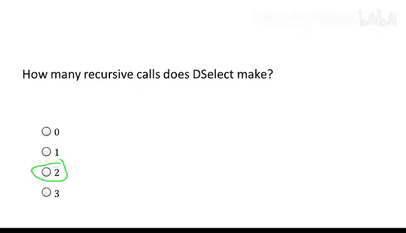
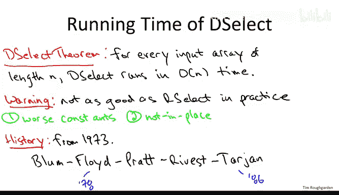

# 算法：4：确定性选择算法（进阶可选）🔍

在本节课中，我们将学习一种用于解决选择问题的确定性算法。该算法不使用任何随机化，却能在最坏情况下保证线性时间复杂度。我们将详细探讨其工作原理、步骤，并分析其性能。

---

## 概述 📋

上一节我们介绍了随机选择算法（RSelect），它通过随机选择枢轴元素来高效地找到数组的第 i 小元素。本节中，我们将探讨一种确定性选择算法（DSelect），它不使用随机化，而是通过一种巧妙的“中位数的中位数”方法来选择枢轴，从而在最坏情况下也能达到线性时间复杂度。

---



## 问题回顾 📝

选择问题的目标是：给定一个包含 n 个**互异**元素的数组 A 和一个介于 1 到 n 之间的整数 i，找出数组中第 i 小的元素（即第 i 阶统计量）。例如，当 i = n/2 时，我们寻找的是中位数。

**公式表示：**
给定数组 A[1..n] 和整数 i (1 ≤ i ≤ n)，目标是找到元素 x，使得恰好有 i-1 个元素小于 x。

---

## 随机选择算法（RSelect）快速回顾 🔄

在深入确定性算法之前，让我们简要回顾随机选择算法，因为 DSelect 可以看作是其修改版。

RSelect 的核心步骤如下：
1.  **随机选择枢轴**：从数组中均匀随机选择一个元素作为枢轴 p。
2.  **分区**：围绕枢轴 p 对数组进行分区，将小于 p 的元素移到其左侧，大于 p 的元素移到其右侧。设枢轴最终位于位置 j。
3.  **递归查找**：
    *   如果 j == i，则枢轴 p 就是我们要找的第 i 小元素，直接返回。
    *   如果 j > i，则在左侧子数组（小于 p 的部分）中递归寻找第 i 小元素。
    *   如果 j < i，则在右侧子数组（大于 p 的部分）中递归寻找第 (i - j) 小元素。

该算法的优势在于，随机选择的枢轴通常能带来较好的分割（接近 50-50 分割），从而在**期望**上达到 O(n) 的时间复杂度。

---

## 确定性算法的挑战与核心思想 💡

现在的问题是：如果不允许使用随机化，我们如何确定性地选择一个“好”的枢轴？一个好的枢轴应能产生平衡的分割，即分区后左右两部分的元素数量尽可能接近。

一个完美的枢轴是中位数，但寻找中位数本身就是我们要解决的问题，这似乎陷入了循环。


确定性选择算法（DSelect）的**核心思想**是：使用“**中位数的中位数**”作为真实中位数的近似，并用它作为枢轴。虽然它不一定是真正的中位数，但可以证明它是一个足够好的近似，能保证递归调用时问题规模以恒定比例缩小。


---

## 确定性选择算法（DSelect）步骤详解 🛠️

以下是 DSelect 算法的具体步骤，它与 RSelect 的主要区别在于枢轴选择子程序。

**代码框架：**
```python
def DSelect(A, i):
    # 基础情况：如果数组长度很小，直接排序并返回第 i 个元素
    if len(A) <= 1:
        return A[0]

    # 步骤 1 & 2: 选择枢轴 p（使用“中位数的中位数”方法）
    # 1. 将数组 A 分成 n/5 组，每组 5 个元素（最后一组可能少于 5 个）
    # 2. 对每组进行排序（例如使用归并排序），并找出每组的中位数
    # 3. 将这些中位数收集到一个新数组 C 中
    # 4. 递归调用 DSelect 找出数组 C 的中位数（即第 len(C)/2 小元素），将其作为枢轴 p

    # 步骤 3: 围绕枢轴 p 对数组 A 进行分区
    # 将数组分为三部分：小于 p 的元素、等于 p 的元素、大于 p 的元素
    # 设 p 在分区后的位置为 j

    # 步骤 4: 根据 j 与 i 的关系决定下一步
    if j == i:
        return p
    elif j > i:
        # 在左侧子数组中递归寻找第 i 小元素
        return DSelect(左侧子数组, i)
    else: # j < i
        # 在右侧子数组中递归寻找第 (i - j) 小元素
        return DSelect(右侧子数组, i - j)
```

以下是关键步骤的详细说明：

### 枢轴选择子程序（“中位数的中位数”）

这是算法中最巧妙的部分，目的是确定性地找到一个近似中位数。

1.  **分组**：将输入数组 A（长度为 n）逻辑上划分为大约 n/5 组，每组 5 个元素（最后一组可能不足 5 个）。
2.  **找各组中位数**：对每个包含 5 个元素的组分别进行排序（因为规模小，任何排序方法均可），然后取出每组的中位数（即排序后的第三个元素）。这样我们得到了大约 n/5 个“第一轮获胜者”。
3.  **递归找中位数**：将这 n/5 个中位数复制到一个新数组 C 中。然后，**递归调用** `DSelect` 算法本身，在数组 C 中寻找其中位数（即第 `floor(len(C)/2)` 小的元素）。这个找到的“中位数的中位数”就是最终选定的枢轴 p。



**注意**：这里出现了一个递归调用，用于在更小规模（n/5）的问题上寻找中位数。这是算法正确性和效率分析的关键。

---

## 算法结构：递归调用次数 🔢

理解 DSelect 的递归结构很重要。以下是算法中递归调用的位置：

1.  **在枢轴选择过程中**：为了计算“中位数的中位数”，我们需要递归地在数组 C（大小为 n/5）上调用 DSelect。
2.  **在主分区之后**：根据枢轴位置 j 与目标 i 的比较结果，在左侧或右侧子数组上递归调用 DSelect。

因此，**在每次非基础情况的调用中，DSelect 总共会进行两次递归调用**。一次用于内部选择“好枢轴”，另一次用于解决主要的子问题。这确保了算法最终会终止，因为每次递归调用处理的问题规模都严格小于原问题。

---

## 为什么是线性时间复杂度？ 📈

直观上，选择“中位数的中位数”作为枢轴 p 能保证它不是一个特别“坏”的枢轴。可以证明，至少有 30% 的元素小于等于 p，也至少有 30% 的元素大于等于 p。这意味着，在分区之后，无论我们递归到哪一边，需要处理的子问题规模最多是原规模的 70%。



**递归式推导：**
设 T(n) 为 DSelect 在最坏情况下的运行时间。
1.  分组和找各组中位数需要 O(n) 时间（对 n/5 个大小为 5 的组排序）。
2.  递归地在大小为 n/5 的数组 C 上寻找中位数：`T(n/5)`。
3.  分区操作需要 O(n) 时间。
4.  递归解决一个规模至多为 0.7n 的子问题：`T(0.7n)`。

因此，递归式为：`T(n) <= T(n/5) + T(0.7n) + O(n)`

通过主定理或递归树法可以证明，此递归式的解为 `T(n) = O(n)`。关键在于两个递归调用的规模之和 `(n/5 + 0.7n) = 0.9n` 严格小于 n，确保了每次递归总工作量线性减少，从而聚合为线性总和。

---

## 与随机选择算法（RSelect）的比较 ⚖️

| 特性 | 随机选择算法 (RSelect) | 确定性选择算法 (DSelect) |
| :--- | :--- | :--- |
| **时间复杂度** | **期望** O(n) | **最坏情况** O(n) |
| **最坏情况** | O(n²)（概率极低但可能） | O(n)（有保证） |
| **随机化** | 需要 | 不需要 |
| **空间复杂度** | **原地** (O(1) 额外空间) | **非原地** (需要 O(n) 额外空间存储数组 C) |
| **实际性能** | **通常更快**，常数因子小，且利用缓存局部性 | 较慢，常数因子大，且需要额外内存操作 |
| **核心思想** | 随机枢轴通常足够好 | 使用“中位数的中位数”保证枢轴质量 |

**重要提示**：尽管 DSelect 具有优美的理论保证，但在实际应用中，RSelect 通常是更好的选择，因为它更简单、更快且是原地操作。DSelect 的主要价值在于其理论意义，证明了线性时间选择可以在不依赖随机化的情况下实现。

---

## 算法发明者 👨‍🔬

这个精妙的算法由五位杰出的计算机科学家在 1973 年提出：
*   Manuel Blum
*   Robert W. Floyd
*   Vaughan Pratt
*   Ronald L. Rivest
*   Robert Tarjan

值得一提的是，这五位作者中有四位（Blum, Floyd, Rivest, Tarjan）后来都获得了计算机科学最高荣誉——图灵奖，这充分说明了该算法的深远影响和创造性。

---

## 总结 🎯



本节课中我们一起学习了确定性选择算法（DSelect）。我们了解到：

1.  **问题**：在无需随机化的情况下，如何最坏情况下以 O(n) 时间找到第 i 阶统计量。
2.  **核心技巧**：使用“**中位数的中位数**”作为枢轴，它能保证分区相对平衡。
3.  **算法步骤**：包括分组、找各组中位数、递归求中位数的中位数、分区、以及根据情况递归查找。
4.  **递归结构**：算法包含两次递归调用，一次用于选择枢轴，一次用于解决子问题。
5.  **时间复杂度分析**：通过递归式 `T(n) = T(n/5) + T(0.7n) + O(n)` 证明了最坏情况下的线性复杂度。
6.  **实际考量**：虽然理论保证强大，但由于较大的常数因子和额外的内存需求，在实践中随机选择算法（RSelect）通常更受青睐。

确定性选择算法是算法设计中一个经典的范例，展示了如何通过巧妙的构思，在不依赖随机性的情况下达到最优的理论性能边界。