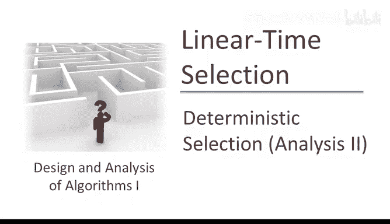
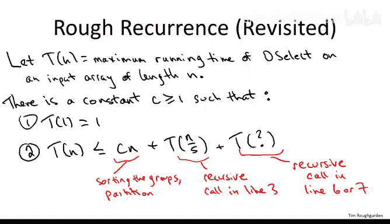
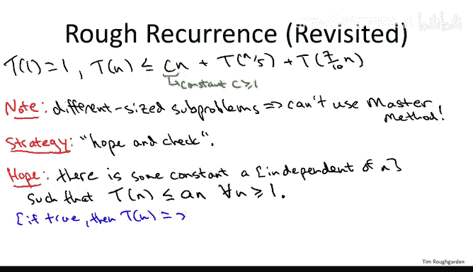
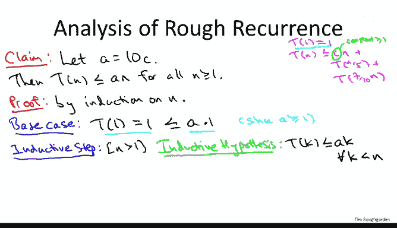

# 斯坦福大学《算法（分治／排序／搜索／随机算法、图搜索／最短路径／数据结构、贪心算法／最小生成树／动态规划、最短路径／NP）｜Algorithms》中英字幕 - P38：38_04_06_确定性选择算法分析 II（进阶可选）.zh_en - GPT中英字幕课程资源 - BV1Rx4y1U7sZ

So the time has arrived for us to finish the proof of the fact that this deterministic selection algorithm based on the median of median ideas does indeed run in linear time。

We've done really all of the concepts of difficult work。

 We discussed the algorithmic ingenuity required to choose a pivot deterministically that's guaranteed to be pretty good。

 So remember the idea was you take the input array， you logically break it into groups of five。

 you sort each group that's like the first round of two round knockout tournament。

 the winners of the first round of the middle elements of each group of fives that's the initial set of medians and then the second round we take a median of these and over5 first round winners and that's what we return as the pivot and we prove this keylemma。

 which is the 370 lema which says that if you choose the pivot by this two round knockout tournament。

 you're guaranteed to get a 3070 split or better so your recursive call in line 6 or7 of deselect is guaranteed to be on an array that has a most 70% of the elements that you started with In other words。

 you're guaranteed to prune at least 30% of the array before you recurse again but what remains to understand is whether or not we've done a sensible tradeoff Have we kept the work required to compute this 3070 split small enough that we get。

The desired linear running time， or have we is the cost of finding a pretty good pivot outweighing the benefit of having guaranteed good splits。

 That's what we got to prove。 That's the next subject。

Here's the story so far to recall that as usual we define T of n to be the worstcase running time of an algorithm in this case deselect on inputs of array length on input arrays of length n and we discussed okay there is the base case as usual but in the general case we discussed how outside of the two recursive calls the deselect algorithm does a linear number of operations What does it have to do it has to do the sorting。

 but each sorting is on a group of size constant of size5 So it takes constant time per group there's a linear number of groups so step1 takes linear time the copying takes linear time and the petitioning takes linear time So there's some constant C which is going to be bigger than one。

 but it's going to be constant so that outside the recursive calls deselect all this does it most c times n operations Now what's up with a recursive calls Well remember there's two of them first there's one on line3 that's is responsible for helping choose the pivot This one we understand it's always on 20% of the input array name the first round winners so we can very safely write T of n over5 for the work done in the worst case by that first recursive call。

What we didn't understand until we approved the keylemma was what's up with the second recursive call which happens on either line6 or line7。

 the size of the input array on which we recursse depends on the quality of the pivot and it was only when we proved the keylemma that we had a guarantee on the quality of our pivot 370 splitter better。

 what does that mean that means the largest subar we could possibly recursse on has seven tenths and elements。

So what remains is to find the solution for this recurrence and hopefully prove that it is indeed big O event。

So let me go ahead and rewrite the recurrent to the top of this slide。

We're not really going to worry about the base case t of1 equals 1。

 but interested in is the fact that the running time on an input of length n is at most C times n。

Where again， C is some constant， which is going to have to be at least one。

 given all the work that we do outside the recursive calls。

 plus the recursive call on line 3 on an array of size n over5， plus the second recursive call。

 which is on some array that has size in the worst case，7 tenth0 n。So that's cool。

 this is exactly how we handled the other deterministic divine and conquer algorithms that we studied in earlier videos。

 we just wrote down at recurrence and then we saw the recurrence。

 but now here's the trick and all of the other recurrences that came up， for example， merge sort。

 stress and matrix multiplication algorithm， carrot super multiplication， you name it。

 we just plugged the parameters into the masters method and because of the power of the master method boom。

 out popped up an answer， it just told us what the recurrence evaluated to。Now。

 the master method as powerful as it is， it did have an assumption， you might recall。

 The assumption was that every subpro solved had the same size。

And that assumption is violated by this linear time selection algorithm。

 There are two recursive calls， one of them's on 20% of the original array。

 the other one is probably on much more than 20% of the original array。

 it could be as much as 70% of the original array so because we have two recursive calls and some problems of different size this does not fit into the situations that the master method covers。

 it's a very rare algorithm in that regard。Now there are more general versions of the master method of the master theorem which can accommodate a wider class of recurrences including this one here。

 alternative we could push the recursion tree proof so that we could get a solution for this recurrence。

 some of you might want to try that at home， but I want to highlight a different way you can solve recurrences just for variety just to give you yet another tool。

Now the good news about this approach that I'm going to show you is that it's very flexible。

 it can be used to solve sort of arbitrarily crazy recurrences。

 It's certainly going to be powerful enough to evaluate this one。

 The bad news is that it's very ad hoc。 It's not very necessarily very easy to use It's kind of a dark art figuring out how to apply it So it's often just guess and check is what it's called you guess what the answer to a recurrence is and then you verify it by induction here because we have such a specific target in mind The whole point of this exercise is to prove a linear time bound I'm going to call it just hope and check。

So we're going to hope that it's linear time， and then we're going to try to produce a proof of that just that verifies the linear time bound using induction。

Specifically， what are we hoping for？We're crossing our fingers that there's a constant。

 I'm going to call it A， a could be big， but it's got to be constant。

 again remember constant means it does not depend on n in any way。

Such that our recurrence at the top of this slide， T of N is bounded above by a times n for all n at least one。

Why is this what we're hoping well suppose this were true by definition T of n is an upper bound on the running time of our algorithm。

 so if it's bounded above by a times n， then it's obviously O of n。

 it's obviously a linear time algorithm where a is the constant that gets suppressed in the big owner vision。

So that's the hope now let's check it and again， check means just verify by induction on N。

So the precise claim that I'm going to prove is the following。

I'm going to go ahead and choose the constant A。 Remember all we need is some constant A。

 no matter how big， as long as it's independent event， that'll give us the big O of N time。

 So I'm actually just going to tell you what A I'm going to use for convenience。

 I'm going to choose A to be 10 C。Now what is C， C is just the constant that we inherit from the recurrence that we're given Now remember what this recurrence means this is what the running time is of the deselect algorithm and the C times n represents the work that outside of the recursive calls so this is just the constant multiple on the amount of linear work that deselect does for sorting the groups for doing the partitioning and for doing the copying so there's going to be some small constant reasonable constant and for the proof I'm just going to multiply that by 10 and use that as my A。

And the claim is if I define a in that way， then indeed， it is true that for all n at least one。

 T of n is bounded above by a times n。Now I realized I just I pulled this constant A out of nowhere right Y 10 times C。

 Well， if you recall our discussion when we proved that things were big of something else there again。

 there was some constant so formally prove that something is big of something else。

 you have to say what the constant is and the proof you always wonder how do you know what constant to use So in practice when you actually if you have to actually do one of these proofs yourself you reverse engineer what kind of constant would work so you just go through the argument with a generic constant then you're like oh well if I set the constant to be this。

 I can complete the proof So we'll see that's exactly what's going to happen on the proof of this claim it'll be obvious the very last line。

 you'll see why it shows a equal 10 C so I just reverse engineered it for what I needed for the proof。

But to keep the proof easy to follow line by line， I decided to just full disclosure or tell you the constant right at the beginning。

Now， no prizes for guessing that the way this proof proceeds is by induction on end。

Induction' is the obvious thing to use， we're trying to prove an assertion for every single positive number n and moreover we're given this recurrence。

 which relates solutions of smaller subprobles to that a bigger problem so that sets things up for use of the inductive hypothesis。

If you want a longer review of what proofs by induction are I suggest that you go back and rewatch the optional video where we prove the correctness of Quick sort there is a fairly formal discussion of what the template is like for proof by induction。

 and that's the one we're going to apply here。So there's two ingredients hand proof by induction is a usually trivial one in the form of a base case that's also going to be trivial here so in the base case you just directly establish the assertion when n equals 1 so we're trying to prove that T of n is at most a times n for every n when n equals 1 if we just substitute then what we're trying to prove is that t of1 is at most a times 1 also known as。

And we're given that t of1 is one。That's the base case of the recurrence that we're given。

So that's what we're using here what we want to be true is that this is the most a times1。

 but it is so the constant C we're assuming is at least one。

 so certainly you can multiply C times 10 to get A， it's definitely at least one。

 so the right hand side here is unquestionably bigger than the left hand side。A， in fact。

 is even bigger than 10， little alone bigger than one。

 So the interesting ingredient is generally the inductive step。

 So remember what you do here is you assume you've already proven the assertion that in this case。

 the T of n is at most AN for all smaller integers。

 and now you just merely have to prove it again for the current integer。

So were now interested in the case where n is bigger than one。

 and the assumption that we've already proven it for everything smaller is called the inductive hypothesis。

 So does it mean that we already proved it for all smaller numbers。

 it means we can use in the proof of our inductive step the fact that T of K is at most a times k for all K strictly less than n All we got to do is enlarge the range of Ns to which this holds still one more to the current value n。

And all we have to do is follow our nose。 So pretty much we have to start on the left hand side with T of N。

 we have to wind up on the right hand side with a times n。

 And pretty much at every step of the proof， there's just going to be one conceivable thing we could do。

 So we just follow our nose。 We start with what we want a upper bound T of N。 Well。

 what do we got going for us。 The only thing we can do at this point is invoke the recurrence that we were given up here。

 So we have an upper bound on T of N in terms of the T value of smaller intotegers。

So we are given that T of n as the most c times n。Plus t of n over five。Plus T of 71 n。I'mOf course。

 ignoring fractions you would round up or round down if you wanted to be precise and the auxiliary lecture notes are more precise if you want to see what the go details look like。

But it's really just exactly the same argument。 One just has to be a little bit more anal about it。

 So now that we've invoked a recurrence， what can we possibly do。

 we can't really do any direct manipulation on any of these three terms， but fortunately。

 we have this inductive hypothesis。 That applies to any value， any integer， which is less than n。

 So we have here n over 5。 that's certainly less than n。 We have 70% of n。

 that's certainly less than n。 So we can applyly the inductive hypothesis twice。

 We already know that these t values are bounded above by a times their arguments。

 So T of n over5 is at most a times n over5。T of 71 n is a most A times 71 n。

Now we can group terms together， now we're comparing apples to apples。

 so we have n times quantities C plus A over 5 plus 7 tenth A。

 let me just go ahead and group the two a terms together and that's going to be nine tenth。

Now don't forget where we're going what the end goal is， we want a upper bound T of n by AN。

 so we want to write that this is bounded above by a times n。

 and now you see exactly how I reverse engineered our choice of A as a function of the given constant C since A is 10 times as big as C if I take 90% of A and add C。

 I just get A back so by our choice of A， this equals AN。And that pretty much wraps things up。

 So don't forget what all this stuff stands for。 So what do we just prove。

 what do we just prove by induction We prove T of n is the most a constant times n for every N。

 That is T of n is big O of n。 What was T of n。 That was the running time of our algorithm。

 That's what we cared about。 So because T of n is big O of n。 Indeed， deselect。Runs in O of N time。

