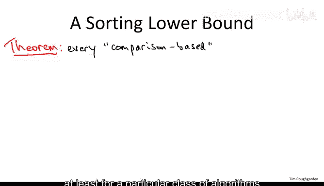
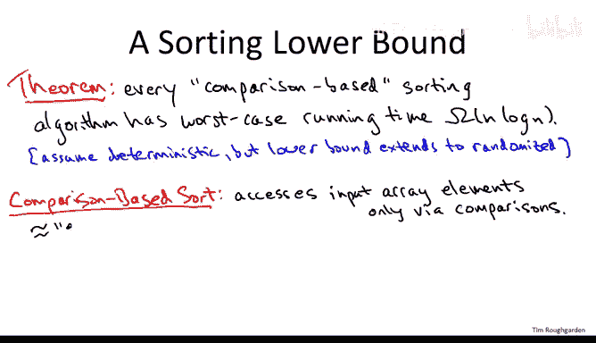
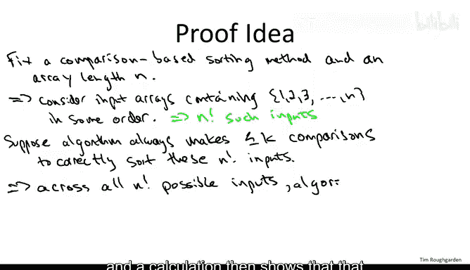
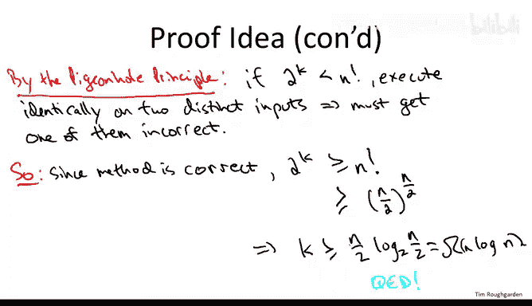

# 算法：39：基于比较排序的Ω(n log n)下界（进阶可选）🔬

在本节课程中，我们将探讨一个关于排序算法性能的根本性问题：我们能否设计出比 **O(n log n)** 更快的通用排序算法？我们将证明，对于一大类被称为“基于比较的排序算法”，其时间复杂度存在一个 **Ω(n log n)** 的下界。这意味着，像归并排序和快速排序这样的算法，在某种意义上已经达到了最优。

---

## 什么是基于比较的排序算法？🤔

上一节我们介绍了排序算法的基本目标，本节中我们来看看一类特定的算法。基于比较的排序算法是指那些**仅通过比较元素对**来访问输入数组中元素的算法。它不能直接查看或操作单个元素的具体值，只能询问“元素A是否大于元素B？”。

你可以将其视为一个通用排序函数，它接收一个**比较函数指针**作为参数，用于比较抽象数据类型。算法本身对数据的具体内容一无所知，只能通过这个“比较API”来工作。我们课程中讨论过的所有排序算法都属于此类。

以下是基于比较排序算法的例子：
*   **归并排序**：仅通过比较和复制元素来工作。
*   **快速排序**：仅通过比较和交换元素来工作。
*   **堆排序**（后续会学到）：通过建堆和提取最小元素来工作，也仅使用比较操作。

为了更清晰地理解这个概念，我们来看看哪些算法**不是**基于比较的排序。这些算法通常需要对数据做出额外假设，并直接查看元素的值。

以下是非基于比较排序算法的例子：
*   **桶排序**：假设数据服从特定分布（如均匀分布）。算法会查看每个元素的具体值，并根据值将其放入对应的“桶”中。
*   **计数排序**：假设数据是范围有限的小整数。算法会遍历数组，根据每个元素的具体整数值进行计数，然后输出。
*   **基数排序**：假设数据是整数。算法按位（例如从最低有效位到最高有效位）进行排序，通常以计数排序作为子程序。

这些非基于比较的算法通过直接“窥探”元素值并进行分桶操作，在特定假设下可以突破 **Ω(n log n)** 的下界，达到线性时间复杂度 **O(n)**。然而，它们牺牲了通用性。

---

## 下界证明的核心思想 🧠

现在，我们回到基于比较的排序。我们要证明：任何正确的、确定性的、基于比较的排序算法，在最坏情况下都需要至少 **Ω(n log n)** 次比较。

**证明思路如下：**
1.  考虑对一个长度为 `n` 的数组进行排序。由于算法只关心元素的相对次序，我们可以假设数组包含数字 `1` 到 `n` 的某种排列。总共有 **n!** 种不同的可能输入。
2.  设算法在最坏情况下需要进行 **K** 次比较。
3.  算法的执行过程可以看作一棵决策树。每次比较产生一个二元分支（是或否）。因此，算法最多只能有 **2^K** 条不同的执行路径。
4.  为了让算法能正确区分所有 **n!** 种不同的输入，我们必须有足够多的执行路径来对应每一种输入。也就是说，必须满足：**2^K ≥ n!**。
5.  如果 **2^K < n!**，根据**鸽巢原理**，至少有两种不同的输入会遵循完全相同的比较路径（得到完全相同的比较结果序列）。算法无法区分它们，因此不可能同时对两者都正确排序。这证明了不等式 **2^K ≥ n!** 是算法正确的必要条件。
6.  现在我们对 **n!** 进行估算，以求解 **K** 的下界。一个简单的下界是：`n! ≥ (n/2)^(n/2)`。（因为乘积中至少有 `n/2` 个因子大于等于 `n/2`）
7.  对不等式两边取以2为底的对数：
    *   `K ≥ log₂(n!)`
    *   `K ≥ log₂((n/2)^(n/2))`
    *   `K ≥ (n/2) * log₂(n/2)`
    *   因此，**K ∈ Ω(n log n)**。

---

## 总结与延伸 📚

本节课中，我们一起学习了基于比较排序算法的性能下界。

我们证明了，任何**正确的、确定性的、基于比较**的排序算法，在最坏情况下都需要 **Ω(n log n)** 次比较。这解释了为什么像归并排序（最坏情况 **O(n log n)**）和快速排序（平均情况 **O(n log n)**）这样的算法，在通用排序任务中已经达到了渐进最优。

**值得注意的几点：**
*   这个下界也适用于**随机化的**基于比较排序算法（如随机化快速排序）的**期望**运行时间。这意味着随机化快速排序在平均情况下也是最优的。
*   这个下界可以通过使用更精确的斯特林公式 `n! ≈ √(2πn)(n/e)^n` 来加强，从而得到更紧的常数因子，但渐进结论不变。
*   要突破这个下界，必须像桶排序或计数排序那样，放弃“仅通过比较访问数据”的限制，并对输入数据做出额外假设。

因此，当你需要一个通用的、不依赖于数据特性的排序例程时，**O(n log n)** 就是你所能期望的最好结果。