# 斯坦福大学《算法（分治／排序／搜索／随机算法、图搜索／最短路径／数据结构、贪心算法／最小生成树／动态规划、最短路径／NP）｜Algorithms》中英字幕 - P3：03_01_06_Karatsuba乘法.zh_en - GPT中英字幕课程资源 - BV1Rx4y1U7sZ

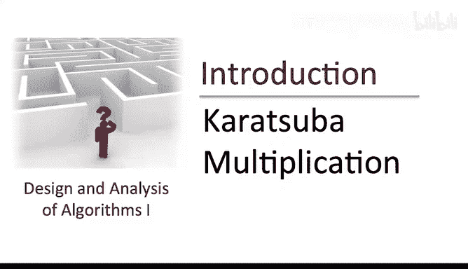

If you want to multiply two integers， is there a better method than the one we learned back in third grade to give you the final answer to this question。

 you'll have to wait until I provide you with a toolbox for analyzing divide and conquer algorithms a few lectures hence what I want to do in this lecture is convince you that the algorithm design space is surprisingly rich。

 There are certainly other interesting methods of multiplying two integers beyond what we learned in third grade and the highlight of this lecture will be something called Carrotubba multiplication。

Let me introduce you to Karotsubba multiplication through a concrete example。

 I'm going to take the same pair of integers we studied last lecture， 1，2，3，4，5，67，8。

 I'm going to execute a sequence of steps resulting in their product。

 but that sequence of steps is going to look very different than the one we undertook during the grade school algorithm yet will arrive at exactly the same answer。

The sequence of steps will strike you as very mysterious。

 It'll seem like I'm pulling a rabbit out of a hat。

 And the rest of this video will develop more systematically what exactly this carrotsubba multiplication method is。

 and why it works。 But what I want you to appreciate already on this slide is that the algorithm design space is far richer than you might expect。

 There's a dazzling array of options for how to actually solve problems like integer multiplication。

Let me begin by introducing some notation for the first and second halfs of the input numbers x and y。

 so the first half of x that is 56， we're going to regard as a number in its own right called A。

 similarly B will be 78， C will be 12 and D will be 34。

I'm going to do a sequence of operations involving only these double digit numbers， A， B， C and D。

 and then after a few such operations， I will collect all of the terms together in a magical way resulting in the product of X and Y。

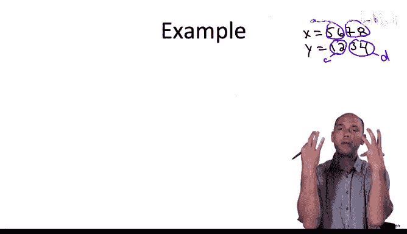

First， let me compute the product of A times C and also the product of B times D。

 I'm going to skip the elementary calculations and just tell you the answer。

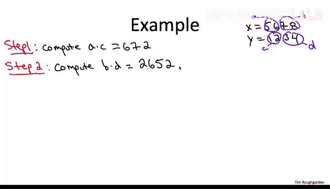

So you can verify that a times C is 672， whereas B times D is 2，652。

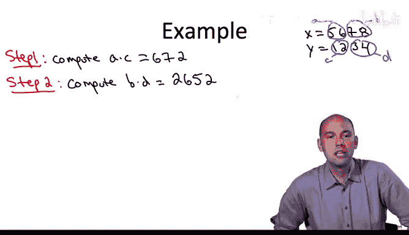

Next， I'm going to do something even still more inscrutable。 I'm going to take the sum of A And B。

 I'm going to take the sum of C and D， and then I'm going to compute the product of those two sums。

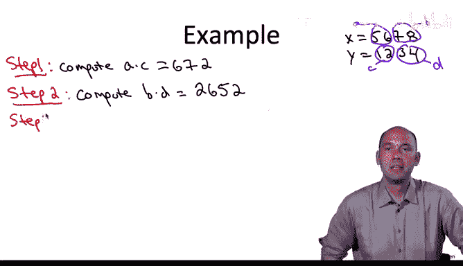

That boils down to computing the product of 134 and46， namely 6，164。

Now I'm going to subtract our first two products from the results of this computation that is going to take 6。

164， subtract 2652 and subtract 672。

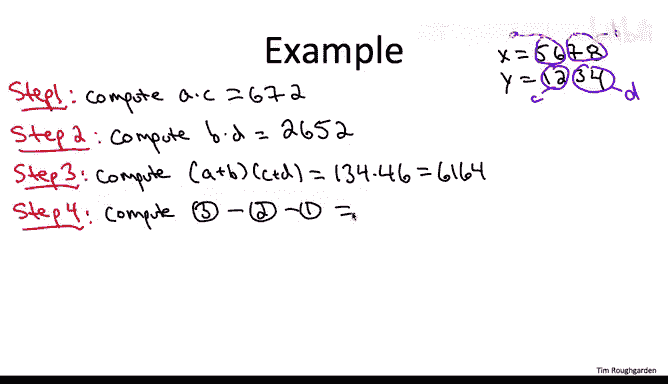

You should check that if you subtract the result of the first two steps from the result of the third step。

 you get 2840。Now I claim that I can take the results of steps 1，2。

 and4 and combine them in a super simple way to produce the product of X and y。

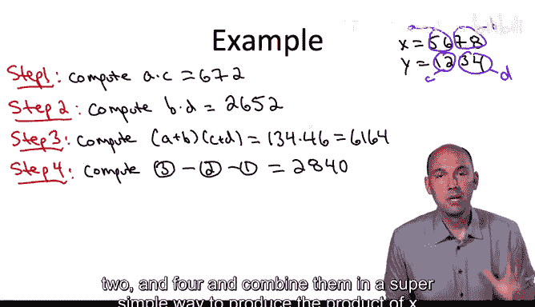

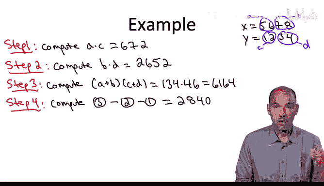

Here's how I do it。I start with the first product， A C， and I pad it with four zeros。

I take the result of the second step and I don't pat it with any zeros at all。

And I take the result of the fourth step and I pad it with two zeros。

If we add up3 three quantities from right to left， we get 2566007 if you go back to the previous lecture you'll note that this is exactly the same output as the grade school algorithm that is this is in fact the product of 1234 and 5678。

So let me reiterate that you should not have any intuition for the computations I just did。

 You should not understand what just went down on this slide。 Rather。

 I hope you feel some mixture of bafflement and intrigue。 But more to the point。

 I hope you appreciate that the third grade algorithm is not the only game in town。

 There' is fundamentally different algorithms from multiplying integers than what you learned as a kid。

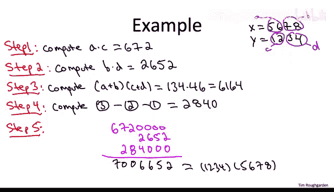

Once you realize that， once you realize how rich the space of algorithms is， you have to wonder。

 can we do better than that third grade algorithm， in fact does this algorithm already do better than the third grade algorithm？

Before I explain full blown carrotub multiplication， let me begin by explaining a simpler。

 more straightforward recursive approach to integer multiplication Now I am assuming you have a bit of programming background in particular that you know what recursive algorithms are that is algorithms which invoke themselves as a subroutine with a smaller input。

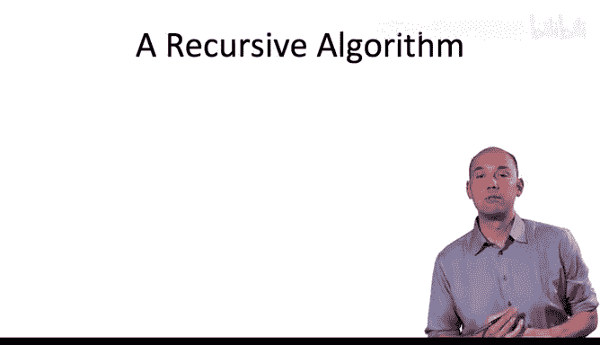

So how might you approach the integer multiplication problem recursively。

 Well the input are two digits， each two numbers， each has n digits。

 So to call the algorithm recursively， we need to form inputs that have smaller size， less digits。

 Well， we already were doing that in the computations on the previous slide。 For example。

 the number 5，6，7，8。 we treated the first half of the digits 56 as a number in its own right and similarly 78。

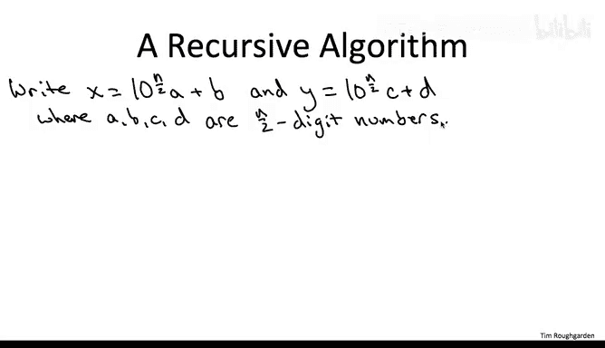

In general， given a number x with n digits， it can be expressed。

 decomposed in terms of two n over two digit numbers， namely as a。

 the first half of the digits shifted appropriately that is multiplied by 10 raised to the power n over 2 plus the second half of the digits B In our example。

 we had a equal to 56， 78 was B， n was 4， so 10 to the n over 2 was 100 and then C and D were 12 and 34。

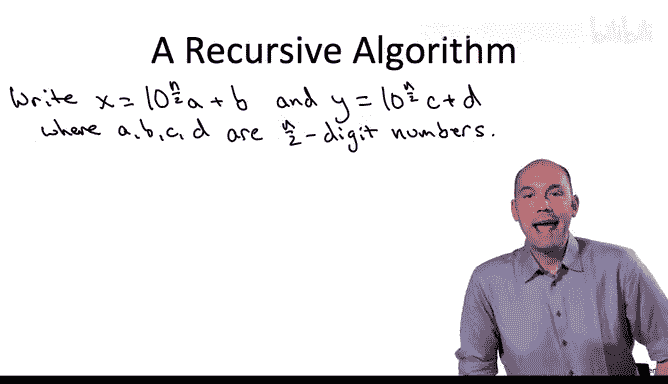

What I want to do next is illuminate the relevant recursive calls to do that。

 let's look at the product x times y， express it in terms of these smaller numbers， A， B， C， and D。

 and do an elementary computation。

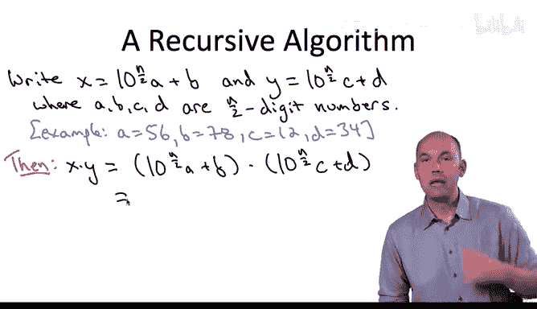

Multiplying the expanded versions of x and y， we get an expression with three terms。

 one shifted by10 raised to the power n and the coefficient there is a times C。

We have a term that's shifted by 10 to the n over 2 and that has a coefficient of AD and also plus BC。

And bringing up the rear， we have the term B times D。

We're going to be referring to this expression a number of times。

 so let me both circle it and just give it a shorthand， we're going to call this expression star。

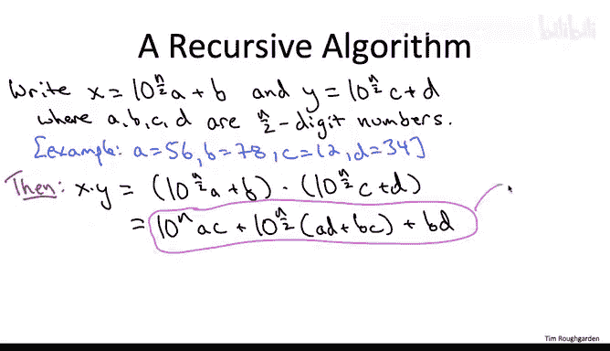

One detail I'm glossing over for simplicity is that I've assumed that n is an even integer。 Now。

 if n is an odd integer， you can apply this exact same recursive approach to integer multiplication in the straightforward way。

 So if n was9， then you would decompose one of these input numbers into say the first five digits and the latter four digits and you would proceed in exactly the same way。

Now， the point of expression star is if we look at it。

 despite being the product of just elementary algebra。

 it suggests a recursive approach to multiplying two numbers。

 If we care about the products of X and Y。 Why not instead compute this expression star。

 which involves only the products of smaller numbers， A， B， C， and D。

 you'll notice staring at the expression star， there are four relevant products。

 each involving a pair of these smaller numbers， namely A C， A D， BC and B D。

So why not compute each of those four products recursively after all the inputs will be smaller and then once our four recursive calls come back to us with the answer。

 we can formulate the rest of expression star in the obvious way。

 we just pad a times C with N zeros at the end， we add up AD D and BC using the grade school algorithm and pad the result with n over two zeros。

 and then we just sum up these three terms again using the grade school edition algorithm。

So the one detail missing that I've glossed over required to turn this idea into a bona fide recursive algorithm would be to specify a base case。

 as I hope you all know recursive algorithms need a base case。

 if the input is sufficiently small then you just immediately compute the answer rather than recursing further。

 of course recursive algorithms need a base case so they don't keep calling themselves till the rest of time so for integer multiplication。

 what's the base case， well if you're given two numbers that have just one digit each。

 then you just multiply them in one basic operation and return the result。

So what I hope is clear at the moment is that there is indeed a recursive approach to solving the integer multiplication algorithm resulting in an algorithm which looks quite different than the one you learned in third grade。

 but which nevertheless you could code up quite easily in your favorite programming language now what you shouldn't have any intuition about is whether or not this is a good idea or completely crackpot idea is this algorithm faster or slower than the grade school algorithm you'll just have to wait to find out the answer to that question let's now refine this recursive algorithm resulting in the full blown carrotubba multiplication algorithm。

To explain the optimization behind carrot Sub multiplication。

 let's recall the expression we were calling star on the previous slide。

 so this just expressed the product of X and Y in terms of the smaller numbers A， B， C， and D。

In the straightforward recursive algorithm， we made four recursive calls to compute the four products。

 which seemed necessary to compute the expression star。 But if you think about it。

 there's really only three quantities in star that we care about， the three relevant coefficients。

 We care about the numbers A D and B C， not per se。

 but only in as much as we care about their sum A D plus B， C。So this motivates the question。

 if there's only three quantities that we care about。

 can we get away with only three rather than four recursive calls？

It turns out that we can and here's how we do it。The first coefficient AC and the third coefficient BD we compute exactly as before。

 recursively。Next， rather than recursively computing AD or BC。

 we're going to recursively compute the product of A+ B and C+ D。

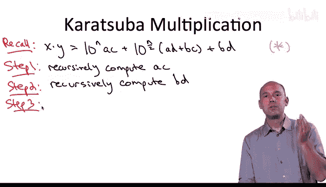

If we expand this out， this is the same thing as computing A C plus A D plus B C plus B D。 Now。

 here is the key observation in carrot Sub multiplication。

 and it's really a trick that goes back to the early 19th century mathematician Gauss。

 Let's look at the quantity we computed in step 3 and subtract from it。

 the two quantities that we already computed in steps 1 and 2。

Subtracting out the result of step one cancels the AC term。

 subtracting out the result of step two cancels out the BD term。

 leaving us with exactly what we wanted all along， the middle coefficient AD plus BC。

And now in the same way that on the previous slide we had a straightforward recursive algorithm making four recursive calls and then combining them in the obvious way here we have a straightforward recursive algorithm that makes only three recursive calls and on top of the recursive calls does just grade school addition and subtraction so you do this particular difference between the three recursively computed products and then you do the shifts the padding by zeros and the final sum as before。

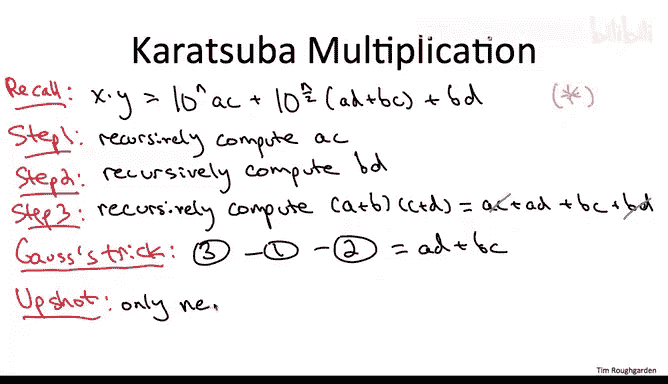

So that's pretty cool and this kind of showcases the ingenuity which bears fruit even in the simplest imaginable computational problems Now you should still be asking the question。

 you know is this crazy algorithm is it really faster than the grade school algorithm that we learned in third grade totally not obvious we will answer that question a few lectures hence and we'll answer it as a special case of an entire toolbox I'll provide you with to analyze the running time of so-called divideivide and conquer algorithms like carrot super multiplication。

 so stay tuned。