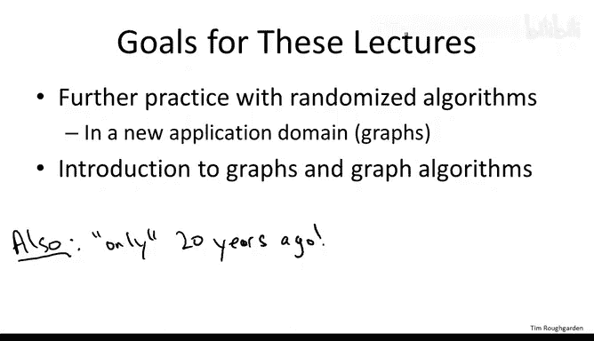
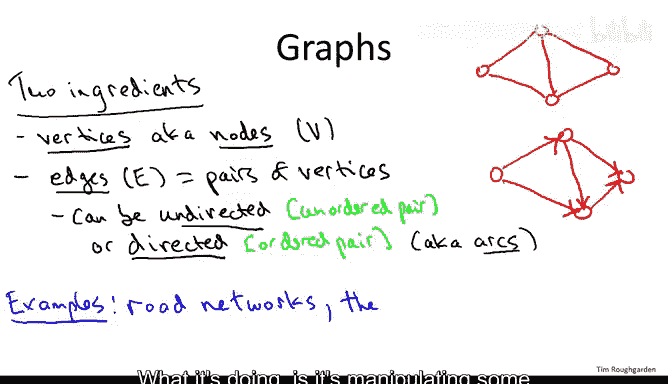
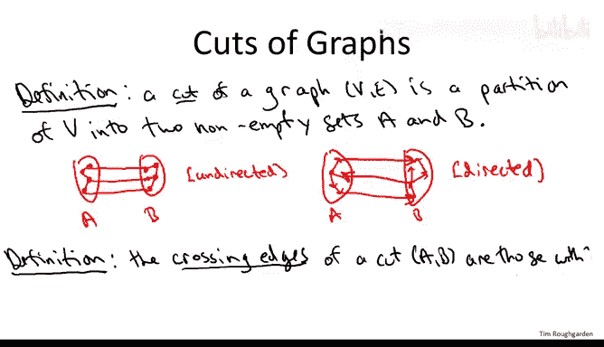
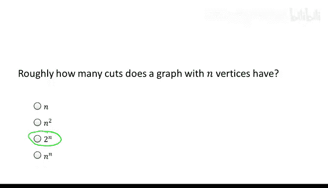
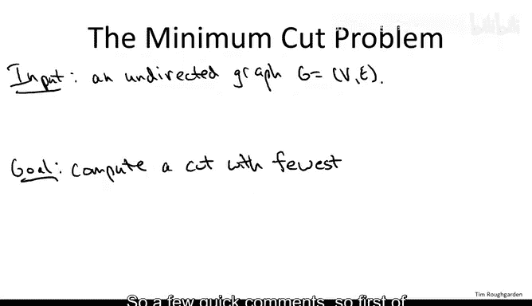
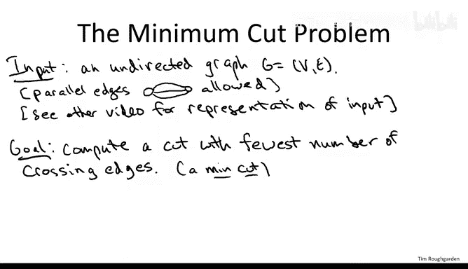
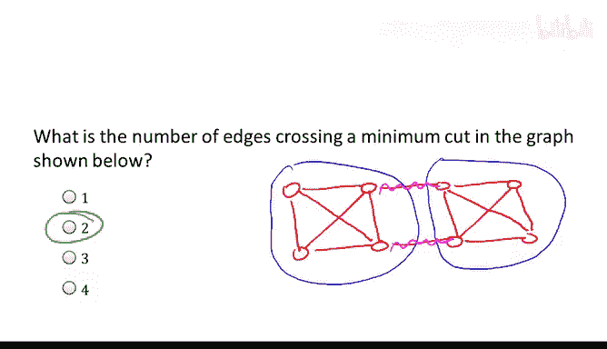
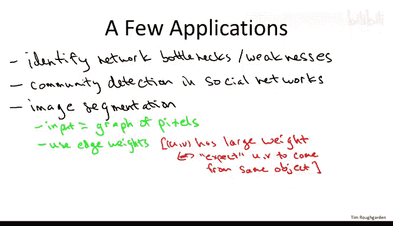

# 斯坦福大学《算法（分治／排序／搜索／随机算法、图搜索／最短路径／数据结构、贪心算法／最小生成树／动态规划、最短路径／NP）｜Algorithms》中英字幕 - P40：40_04_01_图与最小割.zh_en - GPT中英字幕课程资源 - BV1Rx4y1U7sZ

So in this set of lectures we'll be discussing the minimum cut problem in graphs and we'll be discussing the randomized contraction algorithm a randomized algorithm which is so simple and elegant。

 it's almost impossible to believe that it could possibly work but that's exactly what we'll be proving so one way you can think about this set of lectures as a segue of sorts between our discussion of randomization and our discussion of graphs so we just finished talking about randomization in the context of sorting and searching we'll pick it up again toward the end of the class when we discuss hashing but while we're in the middle of randomization and probability review I want to give you another application of randomization in a totally different domain in particular to the domain of graphs rather than to sorting and searching so that's one highleve goal of these lectures a second one is we'll get our feet wet talking about graphs and a lot of the next couple weeks that's what we're going to be talking about fundamental graph primitives so this will give us an excuse to start warming up with the vocabulary some of the basic concepts of the graph and what a graph algorithm looks like。

Another perk， although it's not one of the main goals， but I want to do。

 I do want to point out this fact， is that at least compared to most of the stuff that we're discussing in this class。

 this is a relatively recent algorithm， the contraction algorithm， but relatively recent， I mean。

 okay， it's 20 years old。But at least that means most of us， I know not all of us。

 but most of us at least were born at the time that this algorithm was invented and so just one quick digression。

 you know in the intro course like this， most of what we're going to cover oldies but goodies stuff from as much as 50 years ago and while it's kind of amazing given how much the world and how much technology has changed over the past 50 years that ideas in computer science from that long ago is still useful they are so it's just sort of an amazing thing about the stuff that the first generation of computer scientists figured out it's still relevant to this day that said algorithms is still a vibrant field with lots of open questions and when I have an opportunity I'll try and give you glimpses of that fact so I do want to point out that this is somewhat more recent algorithm that most of the other ones will see which dates back to the 90s。

So let's talk about graphs fundamentally what a graph does is represent pairwise relationships amongst a set of objects。

 so as such a graph is going to have two ingredients。So first of all。

 there's the objects that you're talking about， and these have two very common names。

 and you're just going to have to know both of the names， even though they're completely synonymous。

 The first name is vertices。So vertex is the singular， vertices is the plural。

 also known interchangeably as nodes。I'll be using the notation capital V for the set of vertices。

So those are the objects now we want to represent pairwise relationships。

 so these pairs are going to be called edges。And will be denoted by capital E。

And there's two flavors of graphs and both are really important。

 both come up all the time in applications so you should be aware of both kinds。

 so there's underdirected graphs and directed graphs。

 and that just depends on whether the edges themselves are undirected or directed。

So edges can be undirected by which I mean this pair is unordered。

 there are just two vertices of an edge， the two endpoints。

 say U and V and you don't distinguish one is the first and one is the second。

Or edges can be directed， in which case you have a directed graph。 And here a pair is order。

 So you do have a notion of a first vertex or a first endpoint and the second vertex or second endpoint of an edge。

 Those are often called the tail in the head， respectively。And once in a while。

 although I'll try to not use this terminology， you hear directed that is called Arcs。

Now I think all of this is much clearer if I just draw some pictures indeed one used to call graphs dots and lines。

 the dots would refer to the vertices， so here' is four dots or four vertices and the edges would be lines。

 so the way you denote one of these edges as you just draw a line between the two endpoints of that edge。

 the two vertices that it corresponds to so this is an undirected graph with four vertices and five edges。

We could equally well have a directed version of this graph。

 so let's still have four vertices and five edges。But to indicate that this is a directed graph and that each edge has a first vertex and a second vertex we're going to add arrows to the lines。

 so the arrow points to the second vertex or to the head of the edge。

 so the first vertex is often called the tail of the edge。

So graphs are completely fundamental they show up not just in computer science but in all kinds of different disciplines。

 social sciences and biology being two prominent ones。

 so let me just mention a couple of reasons you might use them just off the top of my head but literally there' hundreds or thousands of others so a very literal example would be road networks so imagine you type in asking for driving directions from point A to point B in some web application or software or whatever computes a route for you。

 what it's doing is it's manipulating some representation of a road network which inevitably is going to be stored as a graph where the vertices correspond to intersections and the edges correspond to individual roads。

The web is often fruitfully thought of as a graph， a directed graph。

 So here the vertices are the individual web pages and edges correspond to hyperlinks。

 So the first vertex in an edge， the tail is going to be the page that contains the hyperlink。

 the second vertex or the head of the edge is going to be what the hyperlink points to。

 So that's the web as a directed graph。Social networks are quite naturally represented as graphs。

So here the vertices correspond to the individuals in the social network and the edges correspond to relationships。

 say friendship links， I encourage you to think about amongst the popular social networks these days which ones are undered graphs and which ones are directed graphs we have some interesting examples of each of those。

And often graphs are useful even when there isn't such an obvious network structure。

 so just to mention one example， let me just write down precede's constraints。So to say what I mean。

 you might think about， you know， say you're a freshman in college and you're looking at your majors。

 say you the computer science major， and you want to know what courses to take and what order。

And you could think about the following graph where each of the courses in your major corresponds to a vertex and you draw a directed edge from course A to course B。

 if course A is a prerequisite for course B， that is it has to be completed before you begin course B so that's a way to represent dependencies sort of a temporal ordering between pairs of objects using a directed graph。

So that's the basic language of graphs。 Let me now talk about cuts in graphs because again。

 this set of lectures is going to be about the so called minimum cut problem。

So the definition of a cut of a graph is very simple。

 it's just a grouping a partition of the vertices of the graph into two groups， A and B。

 and both of those two groups should be non empty。So to describe this in pictures。

 let me give you a cartoon of a cut in both the undirected and directed cases。

 so for an undirected graph you could imagine drawing your two sets A and B。

And once you've defined the two sets A and B， the edges then fall into one of three categories。

 you've got edges with both of the endpoints in A。You've got edges with both of the endpoints in B。

And then you've got edges with one endpoint in A and one endpoint in B。

So that's generically what the picture of a graph looks like viewed through the lens of a particular cut AB。

The picture for directed graphs is similar， you would again have an A and you' would again have a B。

You have directed edges with both endpoints in A， directed edges with both endpoints in B。

And now you actually have two further categories， so you have edges who cross the cut from left to right。

 that is whose tail vertex is in A and whose head vertex is in B。

 and you can also have edges which cross the cut in the opposite direction。

 that is their tail is in B and their head is in A。Usually， when we talk about cuts。

 we're going to be concerned with how many edges cross a given cut。 And by that， I mean。

 the following。The crossing edges of a cut A B。Are those that satisfy the following property？

So in the under case， it's exactly what you think it would be， one of the endpoints is in A。

 the other endpoint is in B， that's what it means to cross the cut。Now in the directed case。

 there's a number of reasonable definitions you could propose about which edges cross the cut。

 typically and in this course， we're going to focus on the case where we only think about edges that cross the cut from the left to the right and we ignore edges which cross from the right to the left。

So that is the edges that cross the cut are those with tail in A and head in B。

So referring to our two pictures are two cartoons of cuts for the unreed one。

 all three of these blue edges would be the edges crossing the cut A B because they're the ones that have one end point on the left side and one end point on the right side。

 Now， for the directed one， we only have two crossing edges。

 So the two that cross from left to right with tail and A and head and B。

 the one that's crossing backward does not contribute。

 We don't count it as a crossing edge of the cut。So the next quiz is just a sanity check that you've absorbed the definition of a cut of a graph。

All right， so the answer to this quiz is the third option。Recall what is the definition of a cut。

 It's just a way to group the vertices into two sets A and B。 Both should also be nonempty。

 So we have n vertices， and essentially we have one binary degree of freedom for each for each vertex we can decide whether or not and goes at set A or it goes in set B So two choices for each of the n vertices that gives us a two to the n possible choices two to the n possible cuts overall Now that's slightly incorrect because recall that a cut can't have a non-empty set A or a non emptyty set B So those are two of the two to the n options which are disallow So strictly speaking。

 the number is2 to the n minus2， but2 to the n is certainly the closest answer of the four provided。

Now the minimum cut problem is exactly what you'd think it would be。

 I give you as input a graph and amongst these exponentially many cuts I want you to identify one for me with the fewest number of crossing edges。

So a few quick comments， so first of all， the name for this cut is a min cut。

A min cut is one with the fewest number of crossing edges。Secondly， to clarify。

 I might even going to allow in the input what's called parallel edges。

 so there'll be lots of applications where parallel edges are sort of pointless。

 but for minimum cut actually it's natural to allow parallel edges and that means you have two edges that correspond to exactly the same pair of vertices。

Finally， the more seasoned programmers among you are probably wondering what I mean by you're given a graph as input。

 you might be wondering about how exactly that's represented。

 so the next video is going to discuss exactly that。

 the popular ways of representing graphs and how we're going to usually do it in this course specifically via what's called an adjacency list。

Okay， so I want to make sure that everybody understands exactly what the minimum cut problem is asking。

 so let me draw for you a particular graph。

With8 vertices。And quite a few edges。And what I want you to answer is what is the min cut value in this graph that is how many edges cross the minimum cut with the fewest number of crossing edges？

All right， so the correct answer is the second choice， the min cut value is2。

 and the cut which shows that is just to break it basically in half。And do the two hals in this case。

 there are only two crossing edges。This one。 and this one。

And I'll leave it for you to check that there's no other edge that has as few as two edges Now in this case we got a very balanced split when we took the minimum cut in general that need not be true。

 sometimes even a single vertex can define the minimum cut of a graph and I encourage you to think about a concrete example that proves that。

So why should you care about computing the minimum cut Well this is one problem amongst a genre called graph partitioning where you're given a graph and you want to break it into two or more pieces and these kinds of graph partitioning problems come up all the time and a surprisingly diverse array of applications so let me just mention a couple at a high level so one very obvious one have when your graph is representing a physical network what identifying something like a Min cut allows you to do is identify weaknesses in your network perhaps it's your own network and you want to understand where you want to soup up the infrastructure because it's in some sense a hotspot of your network or a weak point or maybe there's someone else's network and you want to know where the weak spot is in their network In fact there are some declassified documents about 15 years ago or so which showed that the United States and Soviet Union militaries back during the Cold War were actually quite interested in computing minimum cuts because they were looking for things like for example what's the most efficient way to disrupt the other countries's transportation network。

Another application， which is a big deal in social network analysis these days。

 is the idea of community detection。So the question is amongst a huge graph like say the graph of everybody who's on Facebook or something like that。

 how can you identify small pockets of people that seem tightly knit that seem closely related from which you'd like to infer that there are community of some sort maybe they all go to the same school。

 maybe they all have the same interest， maybe they're part of the same biological family。

 whatever now it's to some degree still an open question how to best define communities and social networks。

 but as a quick and dirty sort of first order heuristic。

 you can imagine looking for small regions which on the one hand are highly interconnected amongst themselves but quite weakly connected to the rest of the graph so subroutines like the minimum cut problem can be used for identifying these small densely interconnected but then weak connected to everybody else pockets of a graph。

Finally， cut problems are also used a lot in vision。 so for example。

 one way you can use them is in what's called image segmentation。

So here what's going on is you're given as input 2D array where each entry is a pixel from some image。

And there's a graph which is very natural to define given a 2D array of pixels。

 namely you have an edge between two pixels if they're neighboring。

 so for two pixels that are immediately next to each other left and right or top to bottom。

 you put an edge there so that gives you what's called a grid graph。And now。

 unlike the basic minimum cut problem that we're talking about here。

 in image segmentation that's most natural to use edge weights where the weight of an edge is basically how likely you expect those two pixels to be coming from a common object。

Why might you expect two neighboring pixels to come from the same object well perhaps their color maps are almost exactly the same and you just expect that they're part of the same thing so once you've defined the grid graph with suitable edge weights now you run graph partitioning or min cut type subroutine and the hope is that the cut that it identifies rips off one of the contiguous objects in the picture and then you do that a few times and you get the major objects in the given picture。

So this list is by no means exhaustive of the applications of min cut and graph partitioning subouts。

 but I hope it serves as a sufficient motivation to watch the rest of the lectures in this sequence。

